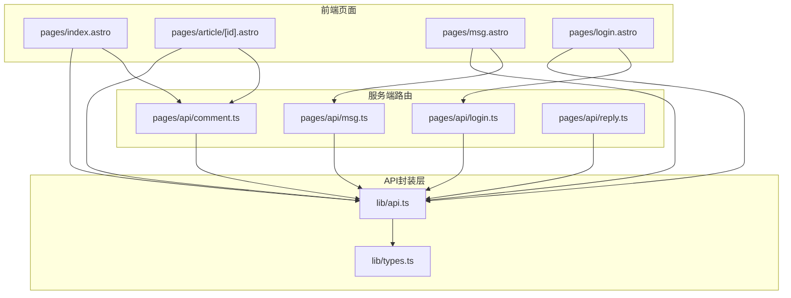
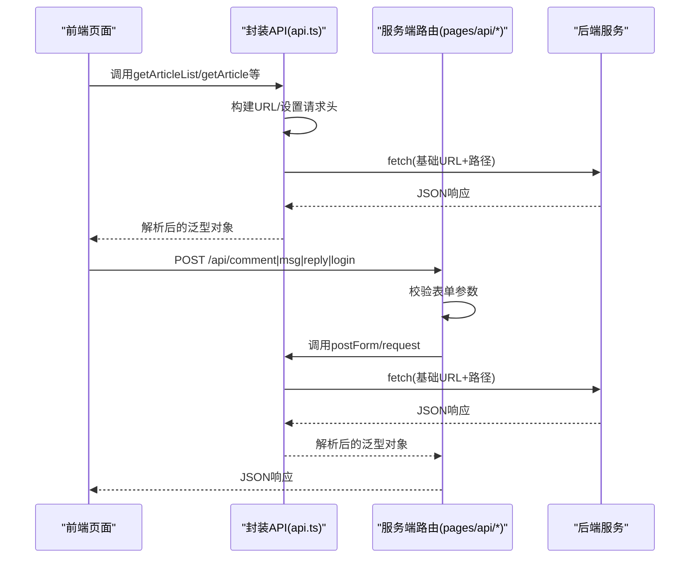
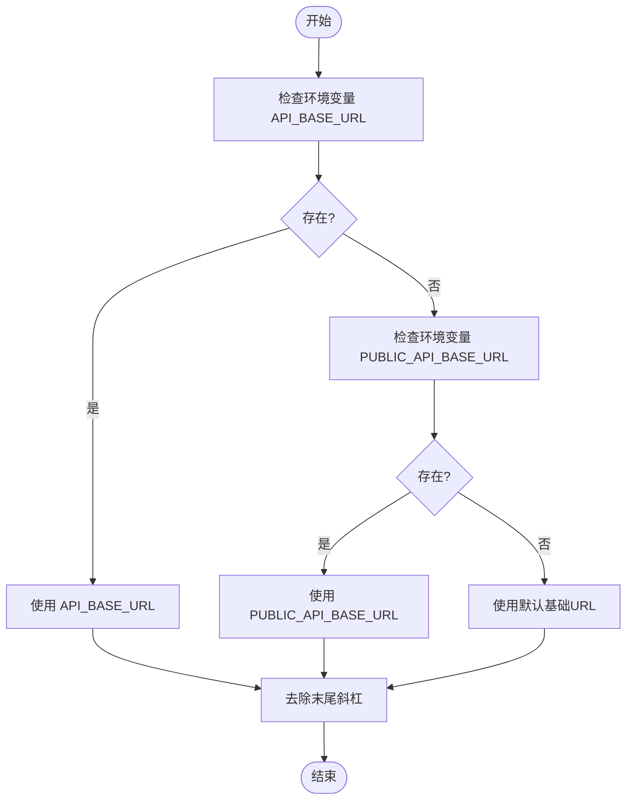
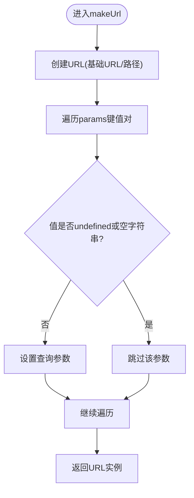
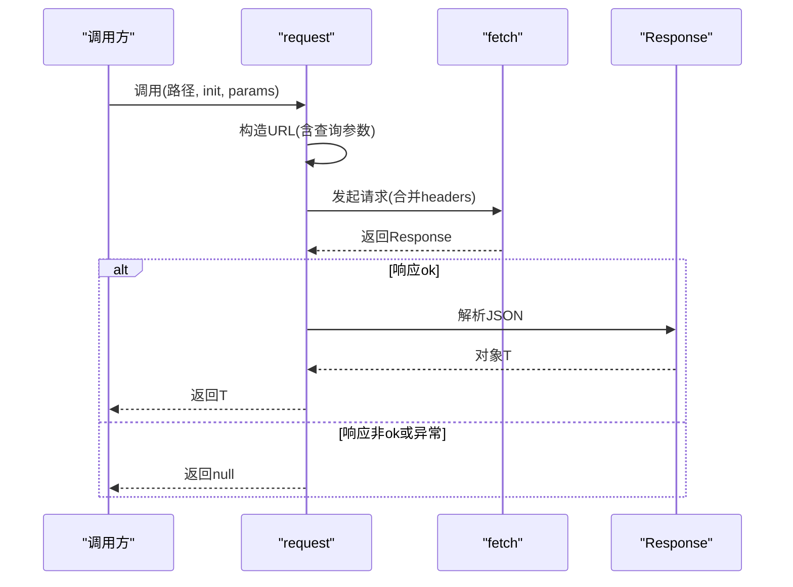
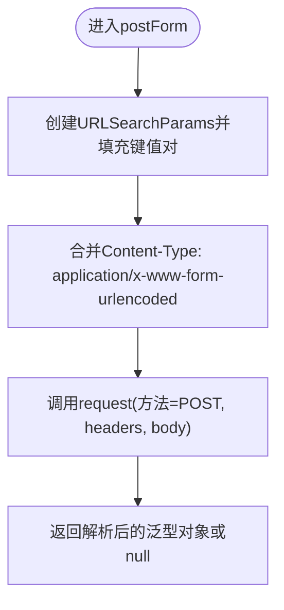
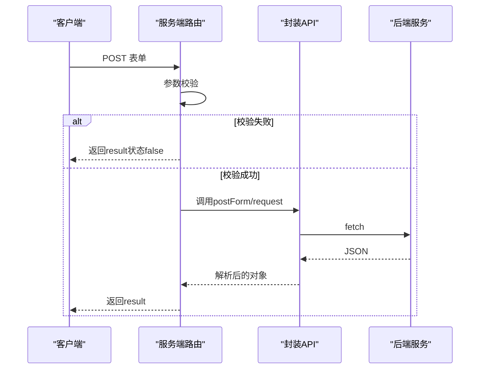
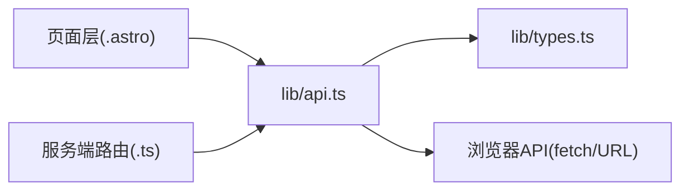

# API核心封装

<cite>
**本文引用的文件**
- [api.ts](file://src/lib/api.ts)
- [types.ts](file://src/lib/types.ts)
- [utils.ts](file://src/lib/utils.ts)
- [comment.ts](file://src/pages/api/comment.ts)
- [login.ts](file://src/pages/api/login.ts)
- [msg.ts](file://src/pages/api/msg.ts)
- [reply.ts](file://src/pages/api/reply.ts)
- [index.astro](file://src/pages/index.astro)
- [article/[id].astro](file://src/pages/article/[id].astro)
- [msg.astro](file://src/pages/msg.astro)
- [login.astro](file://src/pages/login.astro)
- [env.d.ts](file://src/env.d.ts)
- [package.json](file://package.json)
</cite>

## 目录
1. [简介](#简介)
2. [项目结构](#项目结构)
3. [核心组件](#核心组件)
4. [架构总览](#架构总览)
5. [详细组件分析](#详细组件分析)
6. [依赖关系分析](#依赖关系分析)
7. [性能考量](#性能考量)
8. [故障排查指南](#故障排查指南)
9. [结论](#结论)
10. [附录](#附录)

## 简介
本文件系统性阐述API核心封装模块的设计理念与实现机制，覆盖统一请求处理流程（URL构建、请求头设置、错误处理、响应解析）、API基础URL配置（环境变量优先级与默认值）、request函数的fetch封装与类型安全、postForm函数的表单序列化与Content-Type设置、动态环境配置（开发/测试/生产）以及完整使用示例与最佳实践。

## 项目结构
API核心封装位于src/lib目录下，配合页面路由层与类型定义共同构成前后端交互闭环。前端页面通过封装的API函数发起请求，服务端路由对表单进行二次校验后调用封装的API函数完成转发。

**图表来源**
- [api.ts:1-91](file://src/lib/api.ts#L1-L91)
- [types.ts:1-54](file://src/lib/types.ts#L1-L54)
- [comment.ts:1-19](file://src/pages/api/comment.ts#L1-L19)
- [login.ts:1-16](file://src/pages/api/login.ts#L1-L16)
- [msg.ts:1-16](file://src/pages/api/msg.ts#L1-L16)
- [reply.ts:1-17](file://src/pages/api/reply.ts#L1-L17)
- [index.astro:1-50](file://src/pages/index.astro#L1-L50)
- [article/[id].astro](file://src/pages/article/[id].astro#L1-L109)
- [msg.astro:1-135](file://src/pages/msg.astro#L1-L135)
- [login.astro:1-55](file://src/pages/login.astro#L1-L55)

**章节来源**
- [api.ts:1-91](file://src/lib/api.ts#L1-L91)
- [types.ts:1-54](file://src/lib/types.ts#L1-L54)
- [index.astro:1-50](file://src/pages/index.astro#L1-L50)
- [article/[id].astro](file://src/pages/article/[id].astro#L1-L109)
- [msg.astro:1-135](file://src/pages/msg.astro#L1-L135)
- [login.astro:1-55](file://src/pages/login.astro#L1-L55)
- [comment.ts:1-19](file://src/pages/api/comment.ts#L1-L19)
- [login.ts:1-16](file://src/pages/api/login.ts#L1-L16)
- [msg.ts:1-16](file://src/pages/api/msg.ts#L1-L16)
- [reply.ts:1-17](file://src/pages/api/reply.ts#L1-L17)

## 核心组件
- API基础URL与URL构建
  - 基础URL从环境变量读取，支持优先级与默认值，末尾斜杠自动去除。
  - URL构建函数负责拼接路径与查询参数，自动过滤undefined与空字符串。
- 统一请求处理request
  - 封装fetch，统一设置Accept头，处理非OK响应与异常捕获，返回null并打印错误日志。
  - 泛型T确保返回值类型安全，最终解析为JSON并断言为T。
- 表单提交postForm
  - 将键值对序列化为application/x-www-form-urlencoded格式，自动过滤undefined，设置Content-Type。
  - 复用request实现，保持一致的错误处理与类型安全。
- 领域API导出
  - 文章列表、文章详情、消息列表、评论/留言/回复提交、管理员登录等。
- 类型体系
  - ApiEnvelope包裹业务结果，PaginationResult描述分页结构，Article/Message/Comment模型定义清晰。

**章节来源**
- [api.ts:9-91](file://src/lib/api.ts#L9-L91)
- [types.ts:1-54](file://src/lib/types.ts#L1-L54)

## 架构总览
API封装采用“前端页面→封装API→服务端路由→后端服务”的分层设计。前端页面直接调用封装API；部分表单类操作由前端页面直接提交到服务端路由，路由再调用封装API完成转发。

**图表来源**
- [api.ts:25-56](file://src/lib/api.ts#L25-L56)
- [comment.ts:4-18](file://src/pages/api/comment.ts#L4-L18)
- [login.ts:4-15](file://src/pages/api/login.ts#L4-L15)
- [msg.ts:4-15](file://src/pages/api/msg.ts#L4-L15)
- [reply.ts:4-16](file://src/pages/api/reply.ts#L4-L16)

## 详细组件分析

### API基础URL配置机制
- 配置来源与优先级
  - 优先读取import.meta.env.API_BASE_URL
  - 其次读取import.meta.env.PUBLIC_API_BASE_URL
  - 若均未设置，则使用内置默认值
- 默认值与清理
  - 默认基础URL为固定域名
  - 去除末尾斜杠，避免重复或多余的斜杠导致路径拼接问题
- 动态环境支持
  - 开发环境可注入API_BASE_URL指向本地/测试服务
  - 生产环境可注入PUBLIC_API_BASE_URL指向线上服务
  - 未注入时回退至默认值，保证最小可用性

**图表来源**
- [api.ts:11-15](file://src/lib/api.ts#L11-L15)

**章节来源**
- [api.ts:9-15](file://src/lib/api.ts#L9-L15)

### URL构建与查询参数处理
- 构建逻辑
  - 使用URL构造器拼接基础URL与路径，保证协议/主机/路径的合法性
  - 遍历params对象，仅对非undefined且非空字符串的键值设置查询参数
- 作用
  - 统一路径拼接，避免手动字符串拼接带来的错误
  - 过滤无效参数，减少无效查询串

**图表来源**
- [api.ts:17-23](file://src/lib/api.ts#L17-L23)

**章节来源**
- [api.ts:17-23](file://src/lib/api.ts#L17-L23)

### 统一请求处理request
- 请求头设置
  - 固定设置Accept为application/json
  - 合并用户传入的headers，允许上层覆盖
- 错误处理
  - 捕获fetch异常并打印错误日志
  - 对非OK响应直接返回null，避免抛错中断UI渲染
- 响应解析
  - 成功时解析为JSON并断言为泛型T，确保类型安全
- 泛型约束
  - 通过泛型参数T约束返回值类型，便于上层直接消费

**图表来源**
- [api.ts:25-41](file://src/lib/api.ts#L25-L41)

**章节来源**
- [api.ts:25-41](file://src/lib/api.ts#L25-L41)

### 表单提交postForm
- 序列化策略
  - 使用URLSearchParams收集键值对，自动过滤undefined
  - 将所有值转换为字符串，确保服务端接收稳定格式
- Content-Type设置
  - 显式设置为application/x-www-form-urlencoded;charset=UTF-8
- 复用request
  - 通过POST方法与body参数复用统一的请求处理逻辑，保持一致的错误处理与类型安全

**图表来源**
- [api.ts:43-56](file://src/lib/api.ts#L43-L56)

**章节来源**
- [api.ts:43-56](file://src/lib/api.ts#L43-L56)

### 领域API导出与使用示例
- 文章列表/详情
  - getArticleList：带分页参数的列表请求
  - getArticle：根据ID获取详情，兼容不同返回形态
- 消息与评论
  - getMsgList：消息列表
  - addArticleComment：评论提交
  - addMsg：留言提交
  - addReplyMsg：回复提交
- 管理员登录
  - adminLogin：登录并返回token

使用示例（路径指引）
- 列表页加载文章列表：[index.astro:7-11](file://src/pages/index.astro#L7-L11)
- 文章详情页加载文章与评论：[article/[id].astro](file://src/pages/article/[id].astro#L7-L11)
- 留言与回复提交：[msg.astro:90-134](file://src/pages/msg.astro#L90-L134)
- 评论提交（前端直连路由）：[article/[id].astro](file://src/pages/article/[id].astro#L88-L107)
- 登录提交：[login.astro:34-53](file://src/pages/login.astro#L34-L53)

**章节来源**
- [api.ts:58-91](file://src/lib/api.ts#L58-L91)
- [index.astro:7-11](file://src/pages/index.astro#L7-L11)
- [article/[id].astro](file://src/pages/article/[id].astro#L7-L11)
- [article/[id].astro](file://src/pages/article/[id].astro#L88-L107)
- [msg.astro:90-134](file://src/pages/msg.astro#L90-L134)
- [login.astro:34-53](file://src/pages/login.astro#L34-L53)

### 服务端路由与封装API协作
- 评论/留言/回复/登录路由均先做参数校验，再调用封装API完成转发
- 路由返回统一的ApiEnvelope结构，便于前端统一处理

**图表来源**
- [comment.ts:4-18](file://src/pages/api/comment.ts#L4-L18)
- [login.ts:4-15](file://src/pages/api/login.ts#L4-L15)
- [msg.ts:4-15](file://src/pages/api/msg.ts#L4-L15)
- [reply.ts:4-16](file://src/pages/api/reply.ts#L4-L16)
- [api.ts:43-56](file://src/lib/api.ts#L43-L56)

**章节来源**
- [comment.ts:4-18](file://src/pages/api/comment.ts#L4-L18)
- [login.ts:4-15](file://src/pages/api/login.ts#L4-L15)
- [msg.ts:4-15](file://src/pages/api/msg.ts#L4-L15)
- [reply.ts:4-16](file://src/pages/api/reply.ts#L4-L16)

## 依赖关系分析
- 内部依赖
  - api.ts依赖types.ts中的类型定义，确保返回值的类型安全
  - 页面层依赖api.ts提供的领域API
  - 服务端路由依赖api.ts完成对外请求
- 外部依赖
  - 浏览器原生fetch与URL构造器
  - Astro运行时环境（import.meta.env）

**图表来源**
- [api.ts:1-91](file://src/lib/api.ts#L1-L91)
- [types.ts:1-54](file://src/lib/types.ts#L1-L54)
- [index.astro:1-50](file://src/pages/index.astro#L1-L50)
- [article/[id].astro](file://src/pages/article/[id].astro#L1-L109)
- [msg.astro:1-135](file://src/pages/msg.astro#L1-L135)
- [login.astro:1-55](file://src/pages/login.astro#L1-L55)
- [comment.ts:1-19](file://src/pages/api/comment.ts#L1-L19)
- [login.ts:1-16](file://src/pages/api/login.ts#L1-L16)
- [msg.ts:1-16](file://src/pages/api/msg.ts#L1-L16)
- [reply.ts:1-17](file://src/pages/api/reply.ts#L1-L17)

**章节来源**
- [api.ts:1-91](file://src/lib/api.ts#L1-L91)
- [types.ts:1-54](file://src/lib/types.ts#L1-L54)
- [index.astro:1-50](file://src/pages/index.astro#L1-L50)
- [article/[id].astro](file://src/pages/article/[id].astro#L1-L109)
- [msg.astro:1-135](file://src/pages/msg.astro#L1-L135)
- [login.astro:1-55](file://src/pages/login.astro#L1-L55)
- [comment.ts:1-19](file://src/pages/api/comment.ts#L1-L19)
- [login.ts:1-16](file://src/pages/api/login.ts#L1-L16)
- [msg.ts:1-16](file://src/pages/api/msg.ts#L1-L16)
- [reply.ts:1-17](file://src/pages/api/reply.ts#L1-L17)

## 性能考量
- 请求缓存与去重
  - 可在封装层引入请求去重（基于URL或参数哈希），避免重复请求
- 响应缓存
  - 对于静态列表/详情等可考虑内存缓存，结合失效策略
- 并发控制
  - 对高频请求（如滚动加载）限制并发数，防止资源争用
- 网络超时与重试
  - 在fetch中加入AbortSignal与超时控制，必要时实现指数退避重试
- 图片尺寸预取
  - 工具库已提供图片尺寸预取与懒加载能力，可在渲染前稳定布局，减少抖动

**章节来源**
- [utils.ts:132-168](file://src/lib/utils.ts#L132-L168)

## 故障排查指南
- 常见问题定位
  - 基础URL错误：确认环境变量是否正确注入，或是否被末尾斜杠影响
  - 查询参数为空：检查传入参数是否为undefined或空字符串
  - Content-Type不匹配：postForm会自动设置，若自定义init需注意覆盖
  - 非OK响应：request对非OK直接返回null，需在上层判断result状态
- 日志与调试
  - request内部捕获异常并打印错误日志，便于定位具体URL与错误信息
  - 前端路由层返回ApiEnvelope，可直接读取result.status与message辅助诊断
- 最佳实践
  - 所有API调用均应判空并给出降级提示
  - 表单提交前在前端做基本校验，减少无效请求
  - 对关键接口增加超时与重试策略

**章节来源**
- [api.ts:25-41](file://src/lib/api.ts#L25-L41)
- [comment.ts:12-14](file://src/pages/api/comment.ts#L12-L14)
- [msg.ts:9-11](file://src/pages/api/msg.ts#L9-L11)
- [reply.ts:10-12](file://src/pages/api/reply.ts#L10-L12)
- [login.ts:9-11](file://src/pages/api/login.ts#L9-L11)

## 结论
本API核心封装以简洁、类型安全与可维护为目标，通过统一的URL构建、请求头设置、错误处理与响应解析，屏蔽了fetch差异与环境差异。配合严格的类型定义与服务端路由的二次校验，形成从前端到后端的可靠数据通路。建议在实际项目中进一步完善缓存、超时与重试策略，以提升用户体验与系统稳定性。

## 附录
- 环境变量配置参考
  - 开发：设置API_BASE_URL为本地/测试服务地址
  - 生产：设置PUBLIC_API_BASE_URL为线上服务地址
  - 未设置：回退至默认基础URL
- 关键实现路径
  - 基础URL与URL构建：[api.ts:9-23](file://src/lib/api.ts#L9-L23)
  - 统一请求处理：[api.ts:25-41](file://src/lib/api.ts#L25-L41)
  - 表单提交：[api.ts:43-56](file://src/lib/api.ts#L43-L56)
  - 领域API导出：[api.ts:58-91](file://src/lib/api.ts#L58-L91)
  - 类型定义：[types.ts:1-54](file://src/lib/types.ts#L1-L54)
  - 页面使用示例：[index.astro:7-11](file://src/pages/index.astro#L7-L11)、[article/[id].astro](file://src/pages/article/[id].astro#L7-L11)、[msg.astro:90-134](file://src/pages/msg.astro#L90-L134)、[login.astro:34-53](file://src/pages/login.astro#L34-L53)
  - 服务端路由：[comment.ts:4-18](file://src/pages/api/comment.ts#L4-L18)、[login.ts:4-15](file://src/pages/api/login.ts#L4-L15)、[msg.ts:4-15](file://src/pages/api/msg.ts#L4-L15)、[reply.ts:4-16](file://src/pages/api/reply.ts#L4-L16)
  - 工具函数（图片尺寸预取）：[utils.ts:132-168](file://src/lib/utils.ts#L132-L168)