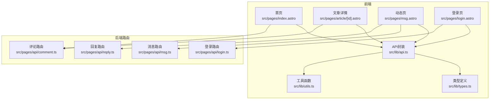
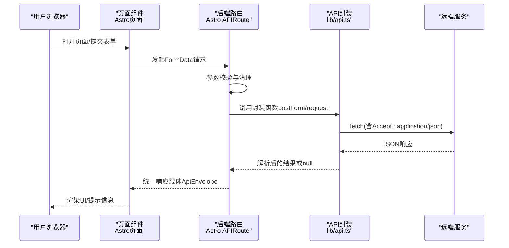
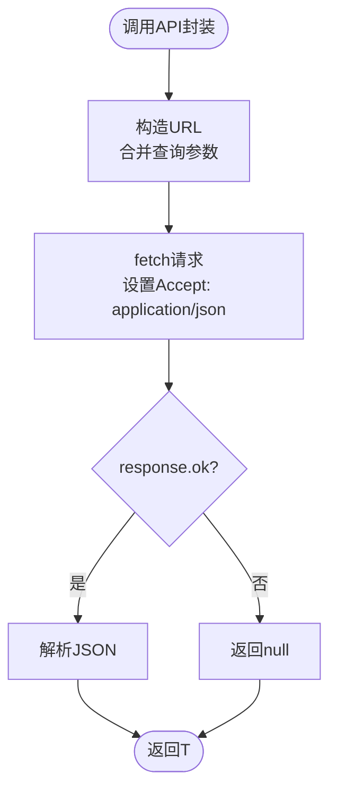
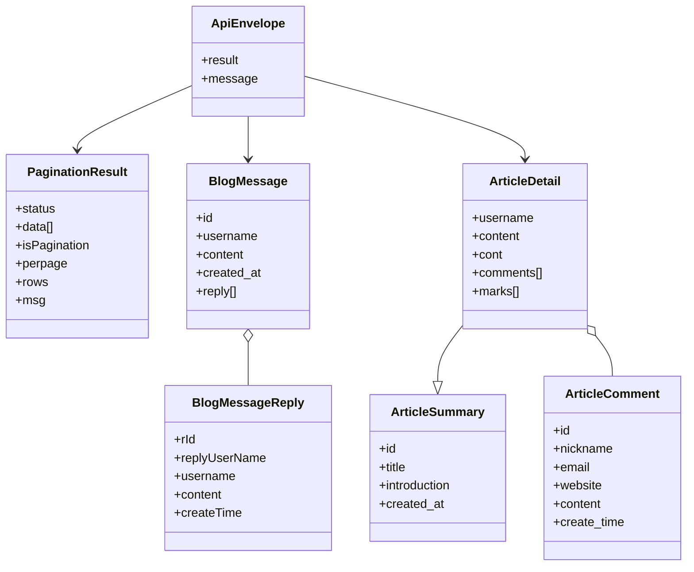
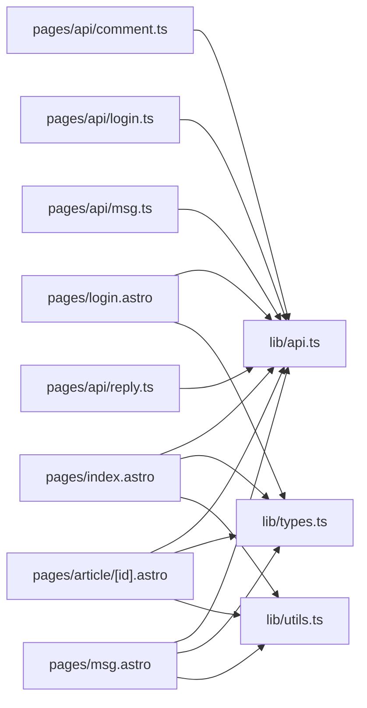

# API集成

<cite>
**本文引用的文件**
- [src/lib/api.ts](file://src/lib/api.ts)
- [src/lib/types.ts](file://src/lib/types.ts)
- [src/lib/utils.ts](file://src/lib/utils.ts)
- [src/pages/api/comment.ts](file://src/pages/api/comment.ts)
- [src/pages/api/login.ts](file://src/pages/api/login.ts)
- [src/pages/api/msg.ts](file://src/pages/api/msg.ts)
- [src/pages/api/reply.ts](file://src/pages/api/reply.ts)
- [src/pages/index.astro](file://src/pages/index.astro)
- [src/pages/article/[id].astro](file://src/pages/article/[id].astro)
- [src/pages/msg.astro](file://src/pages/msg.astro)
- [src/pages/login.astro](file://src/pages/login.astro)
- [astro.config.mjs](file://astro.config.mjs)
- [package.json](file://package.json)
</cite>

## 目录
1. [引言](#引言)
2. [项目结构](#项目结构)
3. [核心组件](#核心组件)
4. [架构总览](#架构总览)
5. [详细组件分析](#详细组件分析)
6. [依赖分析](#依赖分析)
7. [性能考虑](#性能考虑)
8. [故障排查指南](#故障排查指南)
9. [结论](#结论)
10. [附录](#附录)

## 引言
本文件面向需要集成博客项目的外部服务与前端交互的开发者，系统化梳理了API封装模块的设计理念、数据模型、接口实现与调用流程。文档覆盖文章管理、评论系统、消息交互以及管理员认证四大类API，提供统一的请求处理、错误管理与响应格式标准化方案，并给出最佳实践、性能优化建议与调试技巧。

## 项目结构
项目采用Astro静态站点生成（SSR输出）与Node适配器部署，前端通过自定义API模块与后端路由进行数据交互。核心API封装位于lib目录，页面路由位于pages目录，页面组件负责表单收集与调用后端路由。

图表来源
- [src/pages/index.astro:1-50](file://src/pages/index.astro#L1-L50)
- [src/pages/article/[id].astro](file://src/pages/article/[id].astro#L1-L109)
- [src/pages/msg.astro:1-135](file://src/pages/msg.astro#L1-L135)
- [src/pages/login.astro:1-55](file://src/pages/login.astro#L1-L55)
- [src/lib/api.ts:1-91](file://src/lib/api.ts#L1-L91)
- [src/lib/types.ts:1-54](file://src/lib/types.ts#L1-L54)
- [src/lib/utils.ts:1-219](file://src/lib/utils.ts#L1-L219)
- [src/pages/api/comment.ts:1-19](file://src/pages/api/comment.ts#L1-L19)
- [src/pages/api/login.ts:1-16](file://src/pages/api/login.ts#L1-L16)
- [src/pages/api/msg.ts:1-16](file://src/pages/api/msg.ts#L1-L16)
- [src/pages/api/reply.ts:1-17](file://src/pages/api/reply.ts#L1-L17)

章节来源
- [astro.config.mjs:1-14](file://astro.config.mjs#L1-L14)
- [package.json:1-19](file://package.json#L1-L19)

## 核心组件
- API封装模块：统一构建URL、发起fetch请求、序列化表单、解析JSON响应、错误捕获与降级返回。
- 类型系统：定义统一响应载体与业务实体模型，确保前后端契约一致。
- 页面路由：对用户输入进行基础校验，转发到后端API封装模块，再由封装模块调用远端服务。
- 工具函数：时间格式化、富文本图片尺寸稳定化等辅助能力。

章节来源
- [src/lib/api.ts:1-91](file://src/lib/api.ts#L1-L91)
- [src/lib/types.ts:1-54](file://src/lib/types.ts#L1-L54)
- [src/lib/utils.ts:1-219](file://src/lib/utils.ts#L1-L219)

## 架构总览
下图展示了从前端页面到后端路由再到远端服务的整体调用链路，以及统一的响应格式与错误处理策略。

图表来源
- [src/pages/api/comment.ts:1-19](file://src/pages/api/comment.ts#L1-L19)
- [src/pages/api/login.ts:1-16](file://src/pages/api/login.ts#L1-L16)
- [src/pages/api/msg.ts:1-16](file://src/pages/api/msg.ts#L1-L16)
- [src/pages/api/reply.ts:1-17](file://src/pages/api/reply.ts#L1-L17)
- [src/lib/api.ts:25-91](file://src/lib/api.ts#L25-L91)

## 详细组件分析

### API封装模块设计与实现
- 统一基地址与URL构造：支持环境变量覆盖，默认回退至固定域名；自动去除末尾斜杠；查询参数过滤空值。
- 请求封装：统一设置Accept头为application/json；对非ok状态返回null；异常捕获并记录日志。
- 表单提交：将对象序列化为application/x-www-form-urlencoded；保留undefined字段剔除逻辑。
- 典型API：
  - 文章列表：GET /blogapi/article?curpage=...
  - 文章详情：GET /blogapi/article/detail?id=...
  - 动态列表：GET /blogapi/msg?curpage=...
  - 评论提交：POST /blogapi/article/marks/add
  - 动态提交：POST /blogapi/msg/add
  - 回复提交：POST /blogapi/msg/replyadd
  - 管理员登录：POST /blogapi/admin/login

图表来源
- [src/lib/api.ts:17-41](file://src/lib/api.ts#L17-L41)

章节来源
- [src/lib/api.ts:1-91](file://src/lib/api.ts#L1-L91)

### 数据模型与关系映射
- 统一响应载体：result承载业务结果，message承载可选提示信息。
- 分页结果：包含状态、数据数组、分页元信息（是否分页、每页条数、总行数、消息）。
- 文章模型：
  - 摘要：id、title、introduction、created_at
  - 详情：在摘要基础上扩展username、content/cont、comments/mark等
- 评论模型：id、nickname、email、website、content、create_time
- 动态与回复：
  - 动态：id、username、content、created_at、reply[]
  - 回复：rId、replyUserName、username、content、createTime

图表来源
- [src/lib/types.ts:1-54](file://src/lib/types.ts#L1-L54)

章节来源
- [src/lib/types.ts:1-54](file://src/lib/types.ts#L1-L54)

### 文章管理API
- 列表接口
  - 方法与路径：GET /blogapi/article
  - 查询参数：curpage（当前页）
  - 响应：ApiEnvelope<PaginationResult<ArticleSummary>>
- 详情接口
  - 方法与路径：GET /blogapi/article/detail
  - 查询参数：id（文章ID）
  - 响应：ApiEnvelope<ArticleDetail | 含data的包装对象>

前端使用要点
- 首页与文章页均通过封装函数获取数据并渲染。
- 文章详情页对响应中的data字段做兼容处理，保证向前兼容。

章节来源
- [src/lib/api.ts:58-64](file://src/lib/api.ts#L58-L64)
- [src/pages/index.astro:1-50](file://src/pages/index.astro#L1-L50)
- [src/pages/article/[id].astro](file://src/pages/article/[id].astro#L1-L109)

### 评论系统API
- 提交评论
  - 方法与路径：POST /blogapi/article/marks/add
  - 表单字段：articleId、nickname、email、website、content
  - 响应：ApiEnvelope<{ status: boolean; msg?: string }>
- 页面路由校验
  - 必填校验：articleId、nickname、email、content
  - 错误时返回result.status=false及提示信息

前端使用要点
- 文章详情页内置表单，提交前进行二次校验（长度、必填），提交后根据result.status刷新或提示。

章节来源
- [src/lib/api.ts:70-78](file://src/lib/api.ts#L70-L78)
- [src/pages/api/comment.ts:1-19](file://src/pages/api/comment.ts#L1-L19)
- [src/pages/article/[id].astro](file://src/pages/article/[id].astro#L56-L109)

### 消息交互API
- 提交流程
  - 提交动态：POST /blogapi/msg/add
    - 表单字段：username、content
    - 校验：content长度限制、username长度限制
  - 回复动态：POST /blogapi/msg/replyadd
    - 表单字段：comment_id、username、content
    - 校验：comment_id存在性、content长度限制、username长度限制
  - 响应：ApiEnvelope<{ status: boolean; msg?: string }>

前端使用要点
- 动态页提供“回复”折叠面板，提交后刷新页面展示最新数据。

章节来源
- [src/lib/api.ts:80-86](file://src/lib/api.ts#L80-L86)
- [src/pages/api/msg.ts:1-16](file://src/pages/api/msg.ts#L1-L16)
- [src/pages/api/reply.ts:1-17](file://src/pages/api/reply.ts#L1-L17)
- [src/pages/msg.astro:1-135](file://src/pages/msg.astro#L1-L135)

### 管理员认证API
- 登录流程
  - 方法与路径：POST /blogapi/admin/login
  - 表单字段：username、password
  - 校验：必填校验
  - 成功响应：result包含token；前端存入localStorage并跳转管理页
- 安全策略
  - 令牌存储于localStorage，建议结合HTTPS与CSP策略提升安全性
  - 建议在管理端增加CSRF防护与会话超时策略（当前前端未实现）

前端使用要点
- 登录页提交后根据result.status决定提示或跳转。

章节来源
- [src/lib/api.ts:88-91](file://src/lib/api.ts#L88-L91)
- [src/pages/api/login.ts:1-16](file://src/pages/api/login.ts#L1-L16)
- [src/pages/login.astro:1-55](file://src/pages/login.astro#L1-L55)

### 响应格式与错误码说明
- 统一响应载体
  - result：业务结果对象或分页结果
  - message：可选提示信息
- 分页结果
  - status：布尔状态
  - data：数据数组
  - isPagination/perpage/rows/msg：分页元信息
- 业务结果
  - status：操作是否成功
  - msg：可选提示信息
- 错误处理
  - 封装层：非ok响应或异常时返回null并打印日志
  - 路由层：必填校验失败时返回result.status=false及提示信息
  - 常见HTTP状态：400用于参数非法，其他错误由后端路由返回统一载体

章节来源
- [src/lib/types.ts:1-13](file://src/lib/types.ts#L1-L13)
- [src/pages/api/comment.ts:12-14](file://src/pages/api/comment.ts#L12-L14)
- [src/pages/api/login.ts:9-11](file://src/pages/api/login.ts#L9-L11)
- [src/pages/api/msg.ts:9-11](file://src/pages/api/msg.ts#L9-L11)
- [src/pages/api/reply.ts:10-12](file://src/pages/api/reply.ts#L10-L12)
- [src/lib/api.ts:25-41](file://src/lib/api.ts#L25-L41)

## 依赖分析
- 前端页面依赖API封装模块与类型定义，间接依赖工具函数（时间格式化、图片尺寸稳定化）。
- 后端路由依赖API封装模块，负责参数校验与统一响应。
- SSR运行时配置为Node适配器，端口与主机在配置文件中设定。

图表来源
- [src/pages/index.astro:1-50](file://src/pages/index.astro#L1-L50)
- [src/pages/article/[id].astro](file://src/pages/article/[id].astro#L1-L109)
- [src/pages/msg.astro:1-135](file://src/pages/msg.astro#L1-L135)
- [src/pages/login.astro:1-55](file://src/pages/login.astro#L1-L55)
- [src/lib/api.ts:1-91](file://src/lib/api.ts#L1-L91)
- [src/lib/types.ts:1-54](file://src/lib/types.ts#L1-L54)
- [src/lib/utils.ts:1-219](file://src/lib/utils.ts#L1-L219)
- [src/pages/api/comment.ts:1-19](file://src/pages/api/comment.ts#L1-L19)
- [src/pages/api/login.ts:1-16](file://src/pages/api/login.ts#L1-L16)
- [src/pages/api/msg.ts:1-16](file://src/pages/api/msg.ts#L1-L16)
- [src/pages/api/reply.ts:1-17](file://src/pages/api/reply.ts#L1-L17)

章节来源
- [astro.config.mjs:1-14](file://astro.config.mjs#L1-L14)
- [package.json:1-19](file://package.json#L1-L19)

## 性能考虑
- 请求缓存与降级
  - 封装层对非ok响应与异常直接返回null，避免无效重试；建议在调用方增加幂等与重试策略（如指数退避）。
- 图片加载优化
  - 工具函数对富文本中的img标签自动补充width/height与loading/decoding属性，减少布局抖动与解码阻塞。
- 分页与懒加载
  - 列表接口支持分页参数，建议前端按需加载与虚拟滚动优化长列表性能。
- 网络与超时
  - 当前封装未设置超时与重试，建议在生产环境引入AbortController与重试逻辑，避免长时间挂起。

章节来源
- [src/lib/api.ts:25-41](file://src/lib/api.ts#L25-L41)
- [src/lib/utils.ts:188-218](file://src/lib/utils.ts#L188-L218)

## 故障排查指南
- 常见问题定位
  - 远端服务不可达：检查API基地址与网络连通性；确认环境变量是否正确注入。
  - 参数校验失败：核对必填字段与长度限制；查看路由层返回的result.msg。
  - 响应为空：封装层对非ok或异常返回null，确认服务端返回状态与JSON格式。
- 调试技巧
  - 在调用方打印请求URL与响应结构，便于快速定位问题。
  - 使用浏览器开发者工具Network面板观察请求头与响应体，确认Accept与Content-Type。
  - 对图片尺寸计算失败的情况，检查资源协议与可访问性。
- 安全加固建议
  - 登录成功后令牌存入localStorage，建议配合HTTPS、CSP与同源策略；管理端建议增加CSRF与会话超时。

章节来源
- [src/lib/api.ts:11-15](file://src/lib/api.ts#L11-L15)
- [src/pages/api/comment.ts:12-14](file://src/pages/api/comment.ts#L12-L14)
- [src/pages/api/login.ts:9-11](file://src/pages/api/login.ts#L9-L11)
- [src/pages/api/msg.ts:9-11](file://src/pages/api/msg.ts#L9-L11)
- [src/pages/api/reply.ts:10-12](file://src/pages/api/reply.ts#L10-L12)
- [src/lib/utils.ts:132-168](file://src/lib/utils.ts#L132-L168)

## 结论
该API集成体系以统一的封装模块为核心，结合严格的类型定义与路由层参数校验，实现了清晰的前后端契约与一致的响应格式。通过分页、图片优化与错误降级策略，兼顾了可用性与性能。建议在生产环境中进一步完善超时重试、CSRF防护与令牌安全策略，以满足更严苛的线上要求。

## 附录

### API清单与调用规范
- 文章列表
  - 方法：GET
  - 路径：/blogapi/article
  - 查询参数：curpage
  - 响应：ApiEnvelope<PaginationResult<ArticleSummary>>
- 文章详情
  - 方法：GET
  - 路径：/blogapi/article/detail
  - 查询参数：id
  - 响应：ApiEnvelope<ArticleDetail | 包含data的对象>
- 提交评论
  - 方法：POST
  - 路径：/blogapi/article/marks/add
  - 表单字段：articleId、nickname、email、website、content
  - 响应：ApiEnvelope<{ status: boolean; msg?: string }>
- 提交动态
  - 方法：POST
  - 路径：/blogapi/msg/add
  - 表单字段：username、content
  - 响应：ApiEnvelope<{ status: boolean; msg?: string }>
- 回复动态
  - 方法：POST
  - 路径：/blogapi/msg/replyadd
  - 表单字段：comment_id、username、content
  - 响应：ApiEnvelope<{ status: boolean; msg?: string }>
- 管理员登录
  - 方法：POST
  - 路径：/blogapi/admin/login
  - 表单字段：username、password
  - 响应：ApiEnvelope<{ status: boolean; token?: string; msg?: string }>

章节来源
- [src/lib/api.ts:58-91](file://src/lib/api.ts#L58-L91)
- [src/pages/api/comment.ts:1-19](file://src/pages/api/comment.ts#L1-L19)
- [src/pages/api/msg.ts:1-16](file://src/pages/api/msg.ts#L1-L16)
- [src/pages/api/reply.ts:1-17](file://src/pages/api/reply.ts#L1-L17)
- [src/pages/api/login.ts:1-16](file://src/pages/api/login.ts#L1-L16)

### 认证与权限控制
- 当前实现
  - 登录成功返回token，前端存入localStorage并跳转管理页。
- 建议增强
  - 管理端路由增加鉴权中间件与CSRF防护。
  - 令牌过期与刷新策略、多设备登录控制与审计日志。

章节来源
- [src/pages/login.astro:34-54](file://src/pages/login.astro#L34-L54)
- [src/pages/api/login.ts:1-16](file://src/pages/api/login.ts#L1-L16)

### 版本管理与兼容性
- 响应载体ApiEnvelope保持稳定，便于后续扩展。
- 文章详情返回可能包含data字段的包装对象，封装层已做兼容处理，利于向后兼容。
- 建议未来在URL或Header中引入版本号，逐步淘汰旧字段。

章节来源
- [src/lib/types.ts:1-4](file://src/lib/types.ts#L1-L4)
- [src/lib/api.ts:62-64](file://src/lib/api.ts#L62-L64)

### 最佳实践与示例路径
- 统一请求处理
  - 使用封装模块的request与postForm，避免重复的fetch逻辑。
  - 示例路径：[请求封装:25-56](file://src/lib/api.ts#L25-L56)
- 错误管理
  - 路由层返回result.status=false与message；调用方可统一提示。
  - 示例路径：[评论路由校验:12-14](file://src/pages/api/comment.ts#L12-L14)
- 响应格式标准化
  - 使用ApiEnvelope包裹所有响应，字段命名与类型保持一致。
  - 示例路径：[类型定义:1-13](file://src/lib/types.ts#L1-L13)
- 性能优化
  - 图片懒加载与尺寸稳定化，减少首屏阻塞。
  - 示例路径：[图片处理:188-218](file://src/lib/utils.ts#L188-L218)
- 调试技巧
  - 打印请求URL与响应体，确认Accept与Content-Type。
  - 示例路径：[封装层日志:38-39](file://src/lib/api.ts#L38-L39)