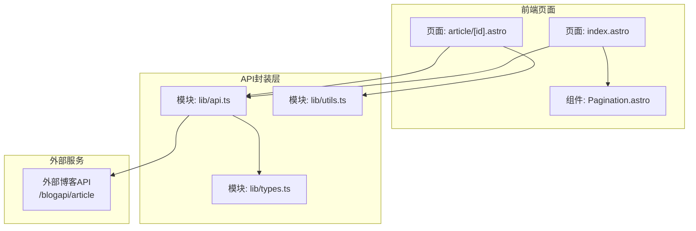
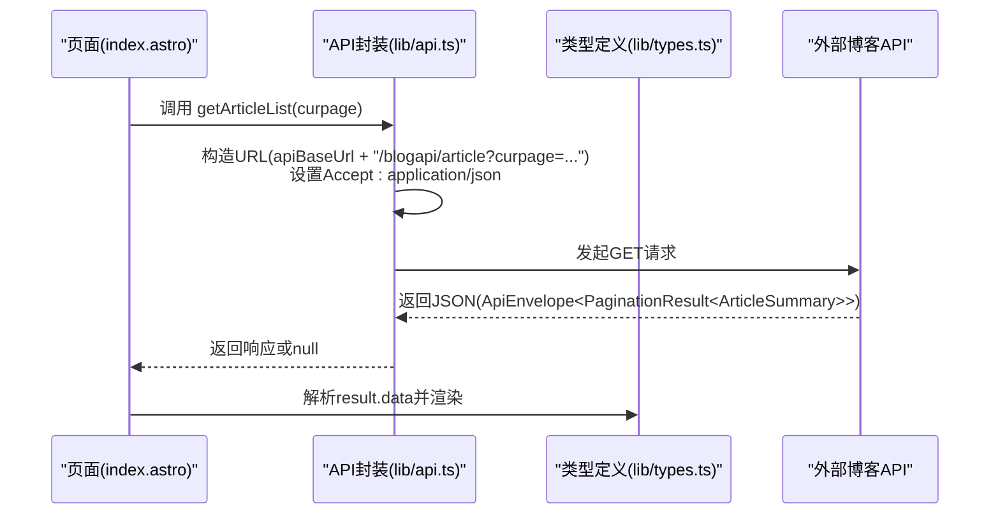
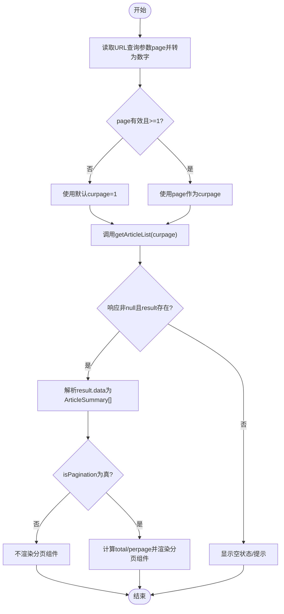
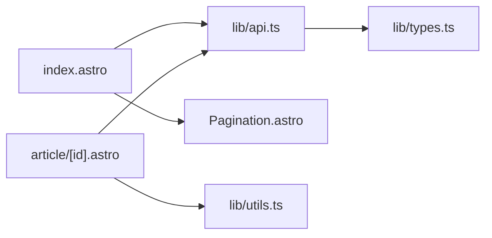

# 文章列表API

<cite>
**本文引用的文件**
- [src/lib/api.ts](file://src/lib/api.ts)
- [src/lib/types.ts](file://src/lib/types.ts)
- [src/pages/index.astro](file://src/pages/index.astro)
- [src/components/Pagination.astro](file://src/components/Pagination.astro)
- [src/pages/api/comment.ts](file://src/pages/api/comment.ts)
- [src/pages/article/[id].astro](file://src/pages/article/[id].astro)
- [src/lib/utils.ts](file://src/lib/utils.ts)
</cite>

## 目录
1. [简介](#简介)
2. [项目结构](#项目结构)
3. [核心组件](#核心组件)
4. [架构总览](#架构总览)
5. [详细组件分析](#详细组件分析)
6. [依赖关系分析](#依赖关系分析)
7. [性能考虑](#性能考虑)
8. [故障排查指南](#故障排查指南)
9. [结论](#结论)
10. [附录](#附录)

## 简介
本文件聚焦于“文章列表API”的实现与使用，围绕 getArticleList 函数展开，系统性说明：
- 分页参数 curpage 的作用机制（默认值、取值范围、分页逻辑）
- 返回数据结构 ApiEnvelope 与 PaginationResult<ArticleSummary> 的完整语义
- 完整的 API 调用示例（参数传递、错误处理、响应解析）
- 与外部博客 API 的交互流程（URL 构建、请求头、响应处理）
- 性能优化建议（缓存策略、请求去重、分页预加载）
- 常见错误与异常处理方案

## 项目结构
该站点采用 Astro 静态站点生成框架，前端通过 src/lib/api.ts 封装对后端博客 API 的调用；首页 src/pages/index.astro 使用 getArticleList 获取文章列表，并结合分页组件进行展示；类型定义集中在 src/lib/types.ts 中。

图表来源
- [src/pages/index.astro:1-50](file://src/pages/index.astro#L1-L50)
- [src/components/Pagination.astro:1-28](file://src/components/Pagination.astro#L1-L28)
- [src/lib/api.ts:1-91](file://src/lib/api.ts#L1-L91)
- [src/lib/types.ts:1-54](file://src/lib/types.ts#L1-L54)
- [src/lib/utils.ts:1-219](file://src/lib/utils.ts#L1-L219)

章节来源
- [src/pages/index.astro:1-50](file://src/pages/index.astro#L1-L50)
- [src/lib/api.ts:1-91](file://src/lib/api.ts#L1-L91)
- [src/lib/types.ts:1-54](file://src/lib/types.ts#L1-L54)

## 核心组件
- getArticleList(curpage = 1)
  - 功能：向外部博客 API 请求文章列表，支持分页参数 curpage，默认为第 1 页
  - 返回：Promise<ApiEnvelope<PaginationResult<ArticleSummary>> | null>
  - 错误处理：网络异常或非 OK 响应时返回 null
- 数据模型
  - ApiEnvelope<T>：统一响应包装，包含 result 和 message 字段
  - PaginationResult<T>：分页结果容器，包含状态、数据数组、是否分页、每页条数、总行数等
  - ArticleSummary：文章摘要字段（id、title、introduction、created_at）

章节来源
- [src/lib/api.ts:58-60](file://src/lib/api.ts#L58-L60)
- [src/lib/types.ts:1-13](file://src/lib/types.ts#L1-L13)
- [src/lib/types.ts:15-20](file://src/lib/types.ts#L15-L20)

## 架构总览
前端页面在渲染阶段调用 getArticleList 获取文章列表，随后根据返回的分页信息决定是否渲染分页组件。外部 API 的基础地址可由环境变量覆盖，最终通过 URLSearchParams 拼接查询参数。

图表来源
- [src/pages/index.astro:7-13](file://src/pages/index.astro#L7-L13)
- [src/lib/api.ts:17-41](file://src/lib/api.ts#L17-L41)
- [src/lib/types.ts:1-13](file://src/lib/types.ts#L1-L13)

## 详细组件分析

### getArticleList 函数
- 参数
  - curpage: number，当前页码，默认为 1
- 行为
  - 通过 makeUrl 构建 /blogapi/article 并附加 curpage 查询参数
  - 设置请求头 Accept: application/json
  - 若响应非 OK 或抛出异常，返回 null
- 返回
  - 成功：ApiEnvelope<PaginationResult<ArticleSummary>>
  - 失败：null

章节来源
- [src/lib/api.ts:58-60](file://src/lib/api.ts#L58-L60)
- [src/lib/api.ts:17-41](file://src/lib/api.ts#L17-L41)

### 分页参数 curpage 的机制
- 默认值：1
- 取值范围：未在前端显式限制，但受后端实现约束；前端通过 URL 查询参数 page 获取当前页，若缺失则回退到 1
- 分页逻辑
  - 首页渲染时读取 Astro.url.searchParams.get('page')，若为空或无效则使用 1
  - 将该值作为 curpage 传入 getArticleList
  - 结合返回的 isPagination、perpage、rows 计算总页数并渲染分页组件

章节来源
- [src/pages/index.astro:7-13](file://src/pages/index.astro#L7-L13)
- [src/components/Pagination.astro:10-14](file://src/components/Pagination.astro#L10-L14)

### 返回数据结构详解
- ApiEnvelope<T>
  - result: 实际业务结果
  - message: 附加消息
- PaginationResult<T>
  - status: 是否成功
  - data: 数据数组
  - isPagination?: 是否启用分页
  - perpage?: 每页条数
  - rows?: 总行数
  - msg?: 业务提示
- ArticleSummary
  - id: 文章标识
  - title: 标题
  - introduction: 摘要
  - created_at: 创建时间戳

章节来源
- [src/lib/types.ts:1-13](file://src/lib/types.ts#L1-L13)
- [src/lib/types.ts:15-20](file://src/lib/types.ts#L15-L20)

### 页面渲染与分页组件
- 页面渲染
  - 从 getArticleList 获取响应，提取 result.data 作为文章列表
  - 若 result.status 为真且启用分页，则显示分页组件
  - pageSize 来自 result.perpage 或 fallback 到当前页条数
  - total 来自 result.rows 或 fallback 到当前条数
- 分页组件
  - 接收 current、total、pageSize、basePath
  - 计算总页数并生成页码列表，支持省略中间页以减少链接数量
  - 首页路径 basePath，其余页 basePath?page=page

章节来源
- [src/pages/index.astro:7-13](file://src/pages/index.astro#L7-L13)
- [src/components/Pagination.astro:10-14](file://src/components/Pagination.astro#L10-L14)

### 与外部博客 API 的交互
- 基础地址
  - 优先使用 import.meta.env.API_BASE_URL 或 PUBLIC_API_BASE_URL
  - 若均未配置，则使用默认地址
- URL 构建
  - 路径固定为 /blogapi/article
  - 查询参数 curpage 通过 URLSearchParams 设置
- 请求头
  - Accept: application/json
- 响应处理
  - 非 OK 响应或异常时返回 null
  - 正常情况下解析 JSON 并返回给调用方

章节来源
- [src/lib/api.ts:9-15](file://src/lib/api.ts#L9-L15)
- [src/lib/api.ts:17-41](file://src/lib/api.ts#L17-L41)

### API 调用示例（步骤说明）
- 参数传递
  - 在页面渲染前读取 URL 查询参数 page，转换为数字并作为 curpage 传入 getArticleList
- 错误处理
  - 当返回 null 或 result.status 为假时，页面显示空状态或提示
- 响应解析
  - 从 result.data 提取 ArticleSummary 数组进行渲染
  - 根据 isPagination、perpage、rows 渲染分页组件

章节来源
- [src/pages/index.astro:7-13](file://src/pages/index.astro#L7-L13)
- [src/lib/api.ts:25-41](file://src/lib/api.ts#L25-L41)

### 复杂逻辑流程图（分页计算）

图表来源
- [src/pages/index.astro:7-13](file://src/pages/index.astro#L7-L13)
- [src/lib/api.ts:58-60](file://src/lib/api.ts#L58-L60)

## 依赖关系分析
- 模块耦合
  - 页面 index.astro 依赖 lib/api.ts 进行数据获取
  - 分页组件 Pagination.astro 仅消费 props，不直接依赖 API
  - 类型定义 lib/types.ts 被 api.ts 与页面共同引用
- 外部依赖
  - fetch 用于网络请求
  - URL/URLSearchParams 用于构建查询参数
- 潜在循环依赖
  - 未发现直接循环依赖

图表来源
- [src/pages/index.astro:1-50](file://src/pages/index.astro#L1-L50)
- [src/components/Pagination.astro:1-28](file://src/components/Pagination.astro#L1-L28)
- [src/lib/api.ts:1-91](file://src/lib/api.ts#L1-L91)
- [src/lib/types.ts:1-54](file://src/lib/types.ts#L1-L54)
- [src/pages/article/[id].astro:1-109](file://src/pages/article/[id].astro#L1-L109)
- [src/lib/utils.ts:1-219](file://src/lib/utils.ts#L1-L219)

章节来源
- [src/pages/index.astro:1-50](file://src/pages/index.astro#L1-L50)
- [src/lib/api.ts:1-91](file://src/lib/api.ts#L1-L91)
- [src/lib/types.ts:1-54](file://src/lib/types.ts#L1-L54)

## 性能考虑
- 缓存策略
  - 对于静态文章列表，可在客户端引入基于 URL 的简单内存缓存（例如以 curpage 为键），避免重复请求相同页
- 请求去重
  - 在同一渲染周期内，若多个组件需要同一页数据，可通过共享 Promise 或集中管理请求队列避免重复发起
- 分页预加载
  - 在用户接近末页时，提前请求下一页数据，提升滚动体验
- 其他优化
  - 合理设置 perpage，避免单页过大导致首屏渲染压力
  - 对图片懒加载与尺寸稳定化可参考 utils.ts 中的图像处理能力

[本节为通用性能建议，不直接分析具体文件，故无章节来源]

## 故障排查指南
- 常见错误场景
  - 外部 API 不可用或返回非 OK：getArticleList 返回 null，页面显示空状态
  - URL 查询参数 page 非法：fallback 到默认页
  - 返回数据结构不符合预期：result.status 为假或 data 为空
- 定位方法
  - 检查网络面板中的 /blogapi/article 请求与响应
  - 在浏览器控制台查看 getArticleList 的错误日志
- 处理建议
  - 对返回 null 的情况，提供占位或重试按钮
  - 对分页组件，确保 total 与 pageSize 正确计算
  - 对文章详情页，确认 id 参数有效且后端可返回对应数据

章节来源
- [src/lib/api.ts:25-41](file://src/lib/api.ts#L25-L41)
- [src/pages/index.astro:7-13](file://src/pages/index.astro#L7-L13)

## 结论
getArticleList 通过简洁的封装实现了与外部博客 API 的对接，配合分页组件与类型系统，提供了清晰的分页数据流。通过合理利用返回的分页信息与错误处理机制，可以在保证用户体验的同时，降低前端复杂度与网络开销。

[本节为总结性内容，不直接分析具体文件，故无章节来源]

## 附录

### API 调用示例（步骤说明）
- 在页面渲染前读取 URL 查询参数 page，转换为数字并作为 curpage 传入 getArticleList
- 解析返回的 ApiEnvelope，提取 PaginationResult
- 从 result.data 渲染文章摘要卡片
- 根据 isPagination、perpage、rows 渲染分页组件

章节来源
- [src/pages/index.astro:7-13](file://src/pages/index.astro#L7-L13)
- [src/lib/api.ts:58-60](file://src/lib/api.ts#L58-L60)

### 外部博客 API 交互要点
- 基础地址优先级：环境变量 > 默认地址
- URL 构建：路径固定，查询参数 curpage
- 请求头：Accept: application/json
- 响应处理：非 OK 或异常返回 null

章节来源
- [src/lib/api.ts:9-15](file://src/lib/api.ts#L9-L15)
- [src/lib/api.ts:17-41](file://src/lib/api.ts#L17-L41)