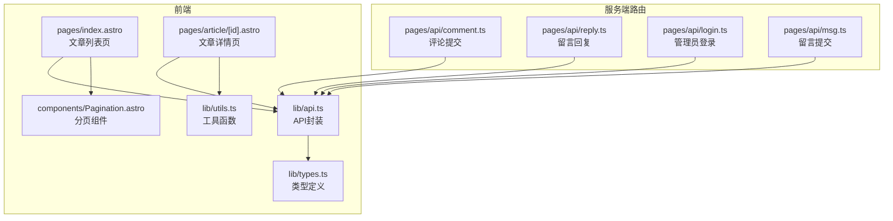
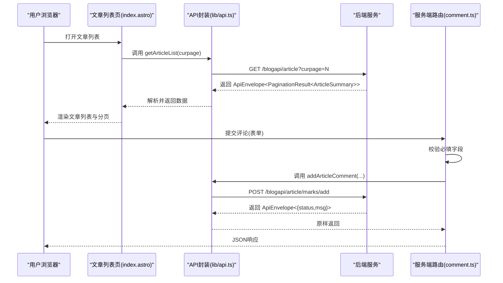
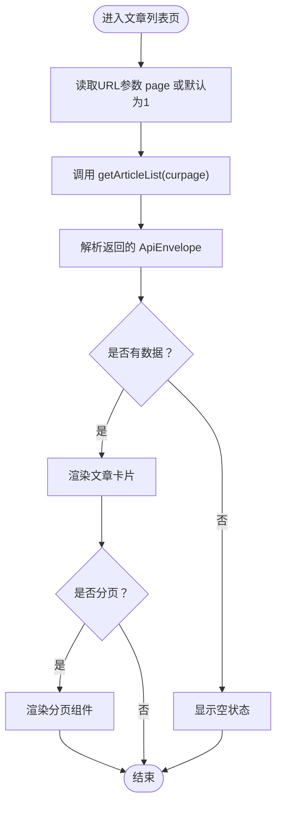
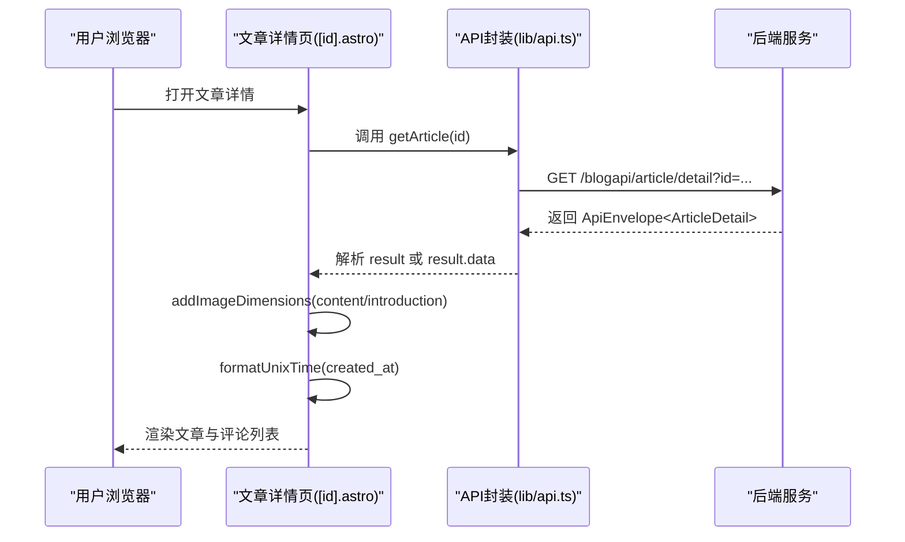
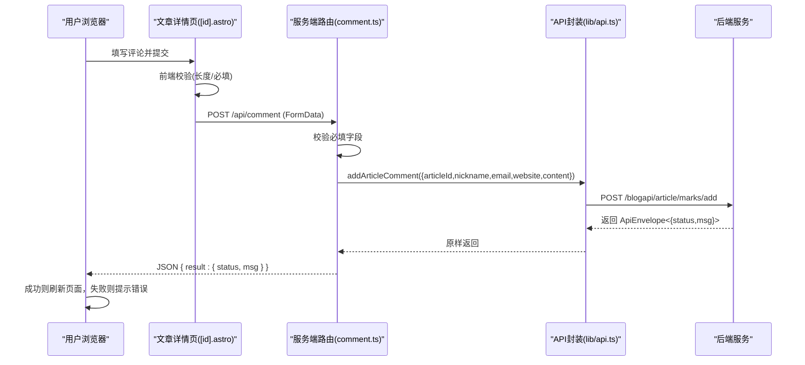
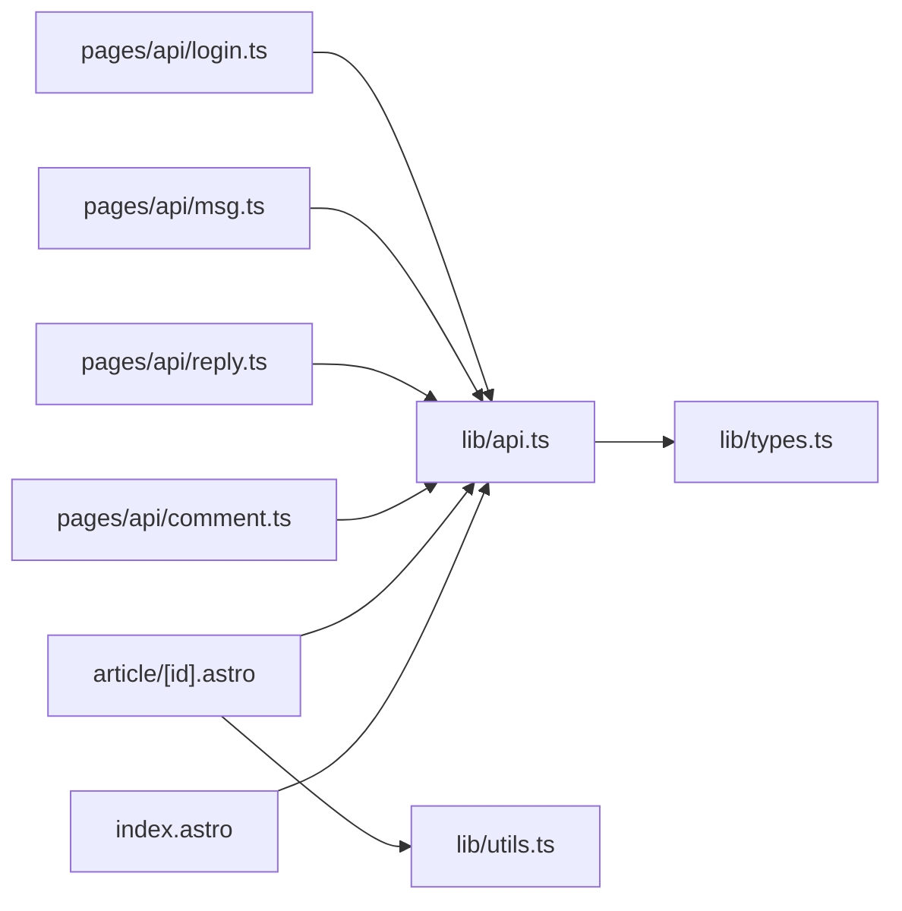

# 文章管理API

<cite>
**本文引用的文件**
- [src/lib/api.ts](file://src/lib/api.ts)
- [src/lib/types.ts](file://src/lib/types.ts)
- [src/lib/utils.ts](file://src/lib/utils.ts)
- [src/pages/index.astro](file://src/pages/index.astro)
- [src/pages/article/[id].astro](file://src/pages/article/[id].astro)
- [src/components/Pagination.astro](file://src/components/Pagination.astro)
- [src/pages/api/comment.ts](file://src/pages/api/comment.ts)
- [src/pages/api/reply.ts](file://src/pages/api/reply.ts)
- [src/pages/api/login.ts](file://src/pages/api/login.ts)
- [src/pages/api/msg.ts](file://src/pages/api/msg.ts)
- [package.json](file://package.json)
</cite>

## 目录
1. [简介](#简介)
2. [项目结构](#项目结构)
3. [核心组件](#核心组件)
4. [架构总览](#架构总览)
5. [详细组件分析](#详细组件分析)
6. [依赖关系分析](#依赖关系分析)
7. [性能考量](#性能考量)
8. [故障排查指南](#故障排查指南)
9. [结论](#结论)
10. [附录](#附录)

## 简介
本文件面向前端开发者与后端服务对接方，系统性梳理博客文章管理API的设计与实现，重点覆盖：
- 文章列表获取接口 getArticleList 的分页参数、排序规则与过滤条件
- 文章详情获取接口 getArticle 的数据结构、关联内容与元数据处理
- 评论提交接口 addArticleComment 的数据验证、防垃圾评论机制与响应格式
- 文章评论系统的完整流程（用户输入、服务端校验、数据存储、页面展示）
- 完整的API调用示例（参数传递、错误处理、状态码说明）
- 性能优化建议、缓存策略与安全考虑
- 评论嵌套结构、回复机制与实时更新功能说明

## 项目结构
该博客采用 Astro 静态站点生成框架，前端通过 src/lib/api.ts 封装统一的请求方法，页面组件通过 Astro 页面文件调用这些方法，并在 src/pages/api 下提供服务端路由以处理表单提交与鉴权。

图表来源
- [src/pages/index.astro:1-49](file://src/pages/index.astro#L1-L49)
- [src/pages/article/[id].astro](file://src/pages/article/[id].astro#L1-L109)
- [src/components/Pagination.astro:1-28](file://src/components/Pagination.astro#L1-L28)
- [src/lib/api.ts:1-91](file://src/lib/api.ts#L1-L91)
- [src/lib/types.ts:1-54](file://src/lib/types.ts#L1-L54)
- [src/lib/utils.ts:1-219](file://src/lib/utils.ts#L1-L219)
- [src/pages/api/comment.ts:1-19](file://src/pages/api/comment.ts#L1-L19)
- [src/pages/api/reply.ts:1-17](file://src/pages/api/reply.ts#L1-L17)
- [src/pages/api/login.ts:1-16](file://src/pages/api/login.ts#L1-L16)
- [src/pages/api/msg.ts:1-16](file://src/pages/api/msg.ts#L1-L16)

章节来源
- [src/pages/index.astro:1-49](file://src/pages/index.astro#L1-L49)
- [src/pages/article/[id].astro](file://src/pages/article/[id].astro#L1-L109)
- [src/components/Pagination.astro:1-28](file://src/components/Pagination.astro#L1-L28)
- [src/lib/api.ts:1-91](file://src/lib/api.ts#L1-L91)
- [src/lib/types.ts:1-54](file://src/lib/types.ts#L1-L54)
- [src/lib/utils.ts:1-219](file://src/lib/utils.ts#L1-L219)
- [src/pages/api/comment.ts:1-19](file://src/pages/api/comment.ts#L1-L19)
- [src/pages/api/reply.ts:1-17](file://src/pages/api/reply.ts#L1-L17)
- [src/pages/api/login.ts:1-16](file://src/pages/api/login.ts#L1-L16)
- [src/pages/api/msg.ts:1-16](file://src/pages/api/msg.ts#L1-L16)

## 核心组件
- API封装层：统一的请求构造、URL拼接、错误处理与表单提交方法
- 类型系统：定义返回包体、分页结果、文章摘要/详情、评论与留言等结构
- 工具函数：时间格式化、网站URL标准化、富文本图片尺寸稳定化
- 页面组件：文章列表与详情页，负责调用API并渲染
- 服务端路由：处理表单提交、参数校验与转发至后端API

章节来源
- [src/lib/api.ts:1-91](file://src/lib/api.ts#L1-L91)
- [src/lib/types.ts:1-54](file://src/lib/types.ts#L1-L54)
- [src/lib/utils.ts:1-219](file://src/lib/utils.ts#L1-L219)
- [src/pages/index.astro:1-49](file://src/pages/index.astro#L1-L49)
- [src/pages/article/[id].astro](file://src/pages/article/[id].astro#L1-L109)

## 架构总览
前端通过 Astro 页面发起API请求，API封装层统一处理HTTP请求与错误；服务端路由接收表单数据进行基础校验后，调用API封装层转发到后端服务；最终由后端返回标准的ApiEnvelope结构，前端解析并渲染。

图表来源
- [src/pages/index.astro:1-49](file://src/pages/index.astro#L1-L49)
- [src/lib/api.ts:58-64](file://src/lib/api.ts#L58-L64)
- [src/pages/api/comment.ts:1-19](file://src/pages/api/comment.ts#L1-L19)

## 详细组件分析

### 文章列表获取接口 getArticleList
- 接口路径：/blogapi/article
- 方法：GET
- 参数
  - curpage：当前页码，默认为1
- 返回结构：ApiEnvelope<PaginationResult<ArticleSummary>>
  - PaginationResult 内含 status、data[]、isPagination、perpage、rows 等字段
- 分页逻辑
  - 列表页根据后端返回的 isPagination、perpage、rows 计算总页数与分页链接
  - 分页组件基于 current、total、pageSize 生成页码序列
- 过滤与排序
  - 当前实现未显式传入排序字段；若需自定义排序，请参考后端接口文档
  - 可通过查询参数扩展过滤条件（如按日期范围、标签等），具体以后端支持为准

图表来源
- [src/pages/index.astro:1-49](file://src/pages/index.astro#L1-L49)
- [src/components/Pagination.astro:1-28](file://src/components/Pagination.astro#L1-L28)
- [src/lib/api.ts:58-60](file://src/lib/api.ts#L58-L60)

章节来源
- [src/pages/index.astro:1-49](file://src/pages/index.astro#L1-L49)
- [src/components/Pagination.astro:1-28](file://src/components/Pagination.astro#L1-L28)
- [src/lib/api.ts:58-60](file://src/lib/api.ts#L58-L60)

### 文章详情获取接口 getArticle
- 接口路径：/blogapi/article/detail
- 方法：GET
- 参数
  - id：文章唯一标识
- 返回结构：ApiEnvelope<ArticleDetail | ArticleDetail & { data?: ArticleDetail }>
  - ArticleDetail 继承 ArticleSummary，新增 username、content、cont、comments、marks 等字段
  - comments 与 marks 均为 ArticleComment 数组，用于承载评论数据
- 数据处理
  - 前端在渲染时优先使用 data 字段（当存在 data 键时）
  - 对 content/cont/introduction 使用 addImageDimensions 进行富文本图片尺寸稳定化
  - 时间字段支持 Unix 秒与可解析字符串两种格式，使用 formatUnixTime 或 formatTime 格式化

图表来源
- [src/pages/article/[id].astro](file://src/pages/article/[id].astro#L1-L109)
- [src/lib/api.ts:62-64](file://src/lib/api.ts#L62-L64)
- [src/lib/utils.ts:208-218](file://src/lib/utils.ts#L208-L218)

章节来源
- [src/pages/article/[id].astro](file://src/pages/article/[id].astro#L1-L109)
- [src/lib/api.ts:62-64](file://src/lib/api.ts#L62-L64)
- [src/lib/types.ts:15-37](file://src/lib/types.ts#L15-L37)
- [src/lib/utils.ts:1-219](file://src/lib/utils.ts#L1-L219)

### 评论提交接口 addArticleComment
- 接口路径：/blogapi/article/marks/add
- 方法：POST（表单）
- 请求体字段
  - articleId：目标文章ID
  - nickname：昵称（必填）
  - email：邮箱（必填）
  - website：个人网站（可选）
  - content：评论内容（必填）
- 前端表单校验
  - 必填字段校验：articleId、nickname、email、content 均非空
  - content 长度限制：前端限制最大长度（详情见页面脚本）
- 服务端路由校验
  - 必填字段校验：同前端
  - 返回 ApiEnvelope<{ status: boolean; msg?: string }>
- 响应格式
  - 成功：result.status 为 true
  - 失败：result.status 为 false 并携带错误信息
  - 状态码：400 表示参数非法；200 表示业务失败但请求格式正确

图表来源
- [src/pages/article/[id].astro](file://src/pages/article/[id].astro#L85-L109)
- [src/pages/api/comment.ts:1-19](file://src/pages/api/comment.ts#L1-L19)
- [src/lib/api.ts:70-78](file://src/lib/api.ts#L70-L78)

章节来源
- [src/pages/article/[id].astro](file://src/pages/article/[id].astro#L85-L109)
- [src/pages/api/comment.ts:1-19](file://src/pages/api/comment.ts#L1-L19)
- [src/lib/api.ts:70-78](file://src/lib/api.ts#L70-L78)
- [src/lib/types.ts:30-37](file://src/lib/types.ts#L30-L37)

### 留言与回复机制
- 留言提交
  - 接口路径：/blogapi/msg/add
  - 方法：POST（表单）
  - 字段：username、content
  - 校验：content 长度限制、username 长度限制
- 留言回复
  - 接口路径：/blogapi/msg/replyadd
  - 方法：POST（表单）
  - 字段：comment_id、username、content
  - 校验：comment_id、content 长度限制、username 长度限制
- 管理员登录
  - 接口路径：/blogapi/admin/login
  - 方法：POST（表单）
  - 字段：username、password
  - 校验：必填字段

章节来源
- [src/pages/api/msg.ts:1-16](file://src/pages/api/msg.ts#L1-L16)
- [src/pages/api/reply.ts:1-17](file://src/pages/api/reply.ts#L1-L17)
- [src/pages/api/login.ts:1-16](file://src/pages/api/login.ts#L1-L16)
- [src/lib/api.ts:80-90](file://src/lib/api.ts#L80-L90)

## 依赖关系分析
- 前端页面依赖 API封装层与类型系统
- 服务端路由依赖 API封装层进行后端转发
- 工具函数被页面组件调用以增强用户体验（富文本图片尺寸稳定化）

图表来源
- [src/pages/index.astro:1-49](file://src/pages/index.astro#L1-L49)
- [src/pages/article/[id].astro](file://src/pages/article/[id].astro#L1-L109)
- [src/lib/api.ts:1-91](file://src/lib/api.ts#L1-L91)
- [src/lib/types.ts:1-54](file://src/lib/types.ts#L1-L54)
- [src/lib/utils.ts:1-219](file://src/lib/utils.ts#L1-L219)
- [src/pages/api/comment.ts:1-19](file://src/pages/api/comment.ts#L1-L19)
- [src/pages/api/reply.ts:1-17](file://src/pages/api/reply.ts#L1-L17)
- [src/pages/api/msg.ts:1-16](file://src/pages/api/msg.ts#L1-L16)
- [src/pages/api/login.ts:1-16](file://src/pages/api/login.ts#L1-L16)

章节来源
- [src/lib/api.ts:1-91](file://src/lib/api.ts#L1-L91)
- [src/lib/types.ts:1-54](file://src/lib/types.ts#L1-L54)
- [src/lib/utils.ts:1-219](file://src/lib/utils.ts#L1-L219)
- [src/pages/api/comment.ts:1-19](file://src/pages/api/comment.ts#L1-L19)
- [src/pages/api/reply.ts:1-17](file://src/pages/api/reply.ts#L1-L17)
- [src/pages/api/msg.ts:1-16](file://src/pages/api/msg.ts#L1-L16)
- [src/pages/api/login.ts:1-16](file://src/pages/api/login.ts#L1-L16)

## 性能考量
- 图片加载优化
  - 使用 addImageDimensions 自动为 img 标签添加 width/height 与 loading="lazy"、decoding="async"，减少布局抖动与提升首屏性能
- 缓存策略
  - 建议后端对文章列表与详情接口增加缓存（如Redis），针对高频访问的静态内容设置合理TTL
  - 前端可对分页组件与列表渲染结果做轻量缓存，避免重复计算页码
- 网络请求
  - 合理设置超时与重试策略，避免阻塞UI线程
  - 对于富文本图片尺寸检测，建议在服务端完成或在客户端异步处理，避免阻塞主线程
- 安全考虑
  - 评论内容需进行XSS过滤与长度限制
  - 对IP与频率进行限流，防止刷屏
  - 管理员登录需HTTPS传输与强口令策略

## 故障排查指南
- 常见错误与状态码
  - 400：参数不合法（如必填字段缺失、长度超限）
  - 200：请求格式正确但业务失败（result.status=false）
  - 其他：网络异常或后端不可达
- 前端调试
  - 检查控制台网络请求与响应
  - 确认 API_BASE_URL 配置正确
  - 验证表单字段与长度限制
- 服务端调试
  - 校验必填字段与长度限制逻辑
  - 确认后端接口返回标准 ApiEnvelope 结构
  - 检查跨域与CORS配置

章节来源
- [src/pages/api/comment.ts:12-14](file://src/pages/api/comment.ts#L12-L14)
- [src/pages/api/reply.ts:10-12](file://src/pages/api/reply.ts#L10-L12)
- [src/pages/api/msg.ts:9-11](file://src/pages/api/msg.ts#L9-L11)
- [src/pages/api/login.ts:9-11](file://src/pages/api/login.ts#L9-L11)
- [src/pages/article/[id].astro](file://src/pages/article/[id].astro#L94-L97)

## 结论
本文档系统梳理了文章管理API的设计与实现，明确了文章列表、详情、评论提交与回复机制的调用方式与数据结构。通过统一的API封装与类型定义，前端能够稳定地消费后端接口；通过服务端路由的参数校验与转发，确保请求的合法性与安全性。建议在生产环境中结合缓存与安全策略进一步优化性能与稳定性。

## 附录

### API调用示例与最佳实践
- 获取文章列表
  - 请求：GET /blogapi/article?curpage=1
  - 响应：ApiEnvelope<PaginationResult<ArticleSummary>>
  - 前端：解析 result.status 与 data[]，渲染列表与分页
- 获取文章详情
  - 请求：GET /blogapi/article/detail?id=文章ID
  - 响应：ApiEnvelope<ArticleDetail>
  - 前端：解析 result 或 result.data，渲染内容与评论
- 提交评论
  - 请求：POST /blogapi/article/marks/add（表单）
  - 字段：articleId、nickname、email、website、content
  - 前端：先本地校验，再提交至 /api/comment
  - 响应：ApiEnvelope<{status,msg}>，成功后刷新页面
- 留言与回复
  - 留言：POST /blogapi/msg/add（username、content）
  - 回复：POST /blogapi/msg/replyadd（comment_id、username、content）
- 管理员登录
  - POST /blogapi/admin/login（username、password）

章节来源
- [src/lib/api.ts:58-78](file://src/lib/api.ts#L58-L78)
- [src/pages/api/comment.ts:1-19](file://src/pages/api/comment.ts#L1-L19)
- [src/pages/api/reply.ts:1-17](file://src/pages/api/reply.ts#L1-L17)
- [src/pages/api/msg.ts:1-16](file://src/pages/api/msg.ts#L1-L16)
- [src/pages/api/login.ts:1-16](file://src/pages/api/login.ts#L1-L16)