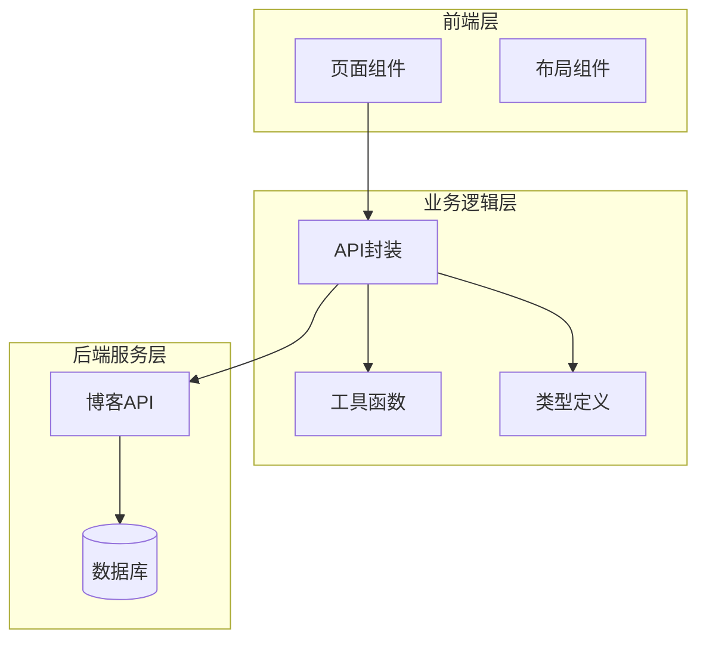
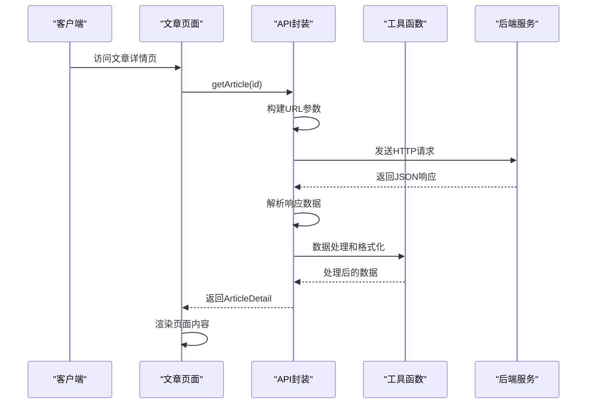
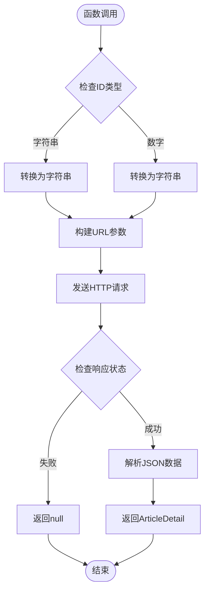
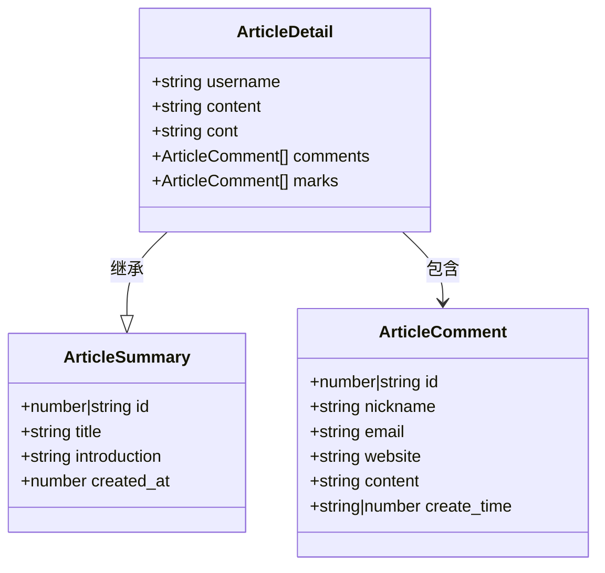
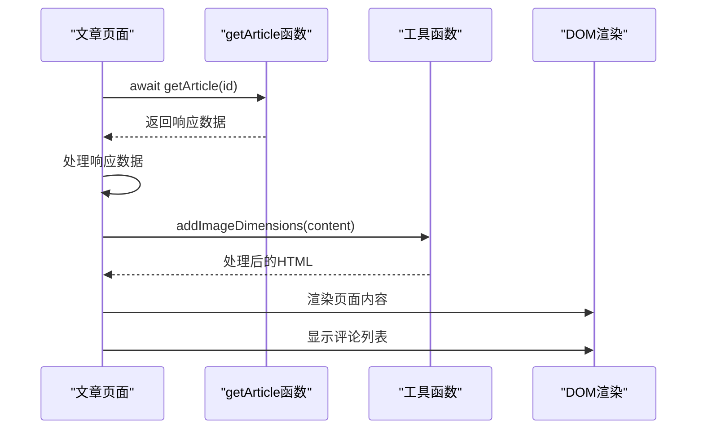
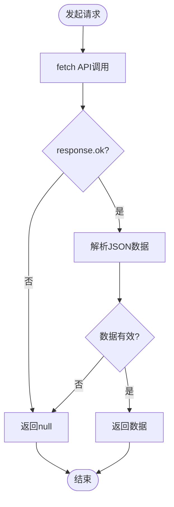

# 文章详情API

<cite>
**本文档引用的文件**
- [api.ts](file://src/lib/api.ts)
- [types.ts](file://src/lib/types.ts)
- [article/[id].astro](file://src/pages/article/[id].astro)
- [utils.ts](file://src/lib/utils.ts)
- [comment.ts](file://src/pages/api/comment.ts)
- [login.ts](file://src/pages/api/login.ts)
- [msg.ts](file://src/pages/api/msg.ts)
</cite>

## 目录
1. [简介](#简介)
2. [项目结构](#项目结构)
3. [核心组件](#核心组件)
4. [架构概览](#架构概览)
5. [详细组件分析](#详细组件分析)
6. [依赖关系分析](#依赖关系分析)
7. [性能考虑](#性能考虑)
8. [故障排除指南](#故障排除指南)
9. [结论](#结论)

## 简介

本文档详细介绍了博客系统中的文章详情API，重点分析了`getArticle`函数的设计和实现。该API负责从后端服务获取单篇文章的详细信息，支持多种ID传入方式，并提供了完整的数据结构定义和错误处理机制。

## 项目结构

该项目采用Astro框架构建，主要分为以下层次：



**图表来源**
- [api.ts:1-91](file://src/lib/api.ts#L1-L91)
- [types.ts:1-54](file://src/lib/types.ts#L1-L54)
- [article/[id].astro:1-109](file://src/pages/article/[id].astro#L1-L109)

**章节来源**
- [api.ts:1-91](file://src/lib/api.ts#L1-L91)
- [types.ts:1-54](file://src/lib/types.ts#L1-L54)
- [article/[id].astro:1-109](file://src/pages/article/[id].astro#L1-L109)

## 核心组件

### getArticle函数

`getArticle`是文章详情API的核心函数，负责获取单篇文章的详细信息。其设计特点如下：

**函数签名与参数**
- 接受参数：`id: string | number`
- 支持两种ID格式：字符串和数字
- 自动进行类型转换和验证

**返回值结构**
- 类型：`Promise<ApiEnvelope<ArticleDetail | (ArticleDetail & { data?: ArticleDetail })> | null>`
- 支持联合类型，处理不同的响应格式
- 包含完整的错误处理机制

**章节来源**
- [api.ts:62-64](file://src/lib/api.ts#L62-L64)
- [types.ts:1-54](file://src/lib/types.ts#L1-L54)

## 架构概览

文章详情API的整体架构采用分层设计，确保了良好的可维护性和扩展性：



**图表来源**
- [article/[id].astro:7-16](file://src/pages/article/[id].astro#L7-L16)
- [api.ts:25-41](file://src/lib/api.ts#L25-L41)
- [utils.ts:208-218](file://src/lib/utils.ts#L208-L218)

## 详细组件分析

### getArticle函数实现

#### 参数处理机制

`getArticle`函数支持灵活的ID传入方式：



**图表来源**
- [api.ts:62-64](file://src/lib/api.ts#L62-L64)
- [api.ts:17-23](file://src/lib/api.ts#L17-L23)

#### ID验证机制

函数内部实现了智能的ID验证和转换：

1. **类型自动转换**：无论传入字符串还是数字，都会自动转换为字符串
2. **空值处理**：确保ID不为空或undefined
3. **URL安全**：通过`makeUrl`函数确保参数正确编码

**章节来源**
- [api.ts:62-64](file://src/lib/api.ts#L62-L64)
- [api.ts:17-23](file://src/lib/api.ts#L17-L23)

### 数据结构设计

#### ArticleDetail接口

`ArticleDetail`继承自`ArticleSummary`，提供了完整的文章信息：



**图表来源**
- [types.ts:15-37](file://src/lib/types.ts#L15-L37)

#### 联合类型设计

API响应使用联合类型处理不同的数据结构：

```mermaid
flowchart LR
subgraph "API响应类型"
A[ApiEnvelope<T>]
B[ArticleDetail]
C[ArticleDetail & { data?: ArticleDetail }]
end
A --> B
A --> C
B --> D[标准响应]
C --> E[嵌套数据响应]
```

**图表来源**
- [api.ts:62-64](file://src/lib/api.ts#L62-L64)
- [types.ts:1-54](file://src/lib/types.ts#L1-L54)

**章节来源**
- [types.ts:15-37](file://src/lib/types.ts#L15-L37)
- [api.ts:62-64](file://src/lib/api.ts#L62-L64)

### 页面集成实现

#### 文章详情页面

文章详情页面`[id].astro`完美集成了API调用：



**图表来源**
- [article/[id].astro:7-16](file://src/pages/article/[id].astro#L7-L16)
- [utils.ts:208-218](file://src/lib/utils.ts#L208-L218)

**章节来源**
- [article/[id].astro:7-16](file://src/pages/article/[id].astro#L7-L16)
- [utils.ts:208-218](file://src/lib/utils.ts#L208-L218)

### 错误处理机制

#### 请求错误处理

API封装实现了完善的错误处理：



**图表来源**
- [api.ts:25-41](file://src/lib/api.ts#L25-L41)

**章节来源**
- [api.ts:25-41](file://src/lib/api.ts#L25-L41)

## 依赖关系分析

### 组件间依赖

```mermaid
graph TB
subgraph "核心依赖关系"
API[api.ts]
TYPES[types.ts]
PAGE[article/[id].astro]
UTILS[utils.ts]
end
PAGE --> API
PAGE --> TYPES
PAGE --> UTILS
API --> TYPES
API --> UTILS
```

**图表来源**
- [api.ts:1-7](file://src/lib/api.ts#L1-L7)
- [article/[id].astro:2-5](file://src/pages/article/[id].astro#L2-L5)

### 外部依赖

项目使用的主要外部依赖：
- **Astro框架**：用于静态站点生成和SSR
- **TypeScript**：提供类型安全保障
- **Node.js运行时**：支持服务器端渲染

**章节来源**
- [package.json:12-18](file://package.json#L12-L18)

## 性能考虑

### 缓存策略

当前实现中，API请求没有内置缓存机制。可以考虑以下优化方案：

1. **内存缓存**：为最近访问的文章ID建立缓存
2. **浏览器缓存**：利用HTTP缓存头控制缓存行为
3. **CDN缓存**：对于静态内容使用CDN加速

### 性能优化建议

1. **懒加载图片**：已实现图片尺寸预加载和懒加载
2. **请求去重**：避免重复请求相同ID的文章
3. **分页优化**：对于大量文章列表使用分页加载

**章节来源**
- [utils.ts:44](file://src/lib/utils.ts#L44)
- [utils.ts:132-168](file://src/lib/utils.ts#L132-L168)

## 故障排除指南

### 常见问题及解决方案

#### API请求失败

**问题症状**：页面显示"没有内容"或空白

**可能原因**：
1. 后端服务不可用
2. 网络连接问题
3. ID参数无效

**解决方案**：
1. 检查网络连接状态
2. 验证文章ID的有效性
3. 查看浏览器开发者工具的网络面板

#### 数据格式错误

**问题症状**：页面渲染异常或显示错误信息

**可能原因**：
1. API响应格式不符合预期
2. 数据字段缺失

**解决方案**：
1. 检查API响应结构
2. 实现更严格的类型检查
3. 添加默认值处理

#### 图片加载问题

**问题症状**：图片无法正常显示

**可能原因**：
1. 图片URL无效
2. 图片尺寸获取失败

**解决方案**：
1. 检查图片URL格式
2. 实现备用图片显示
3. 添加超时处理机制

**章节来源**
- [article/[id].astro:109](file://src/pages/article/[id].astro#L109)
- [utils.ts:132-168](file://src/lib/utils.ts#L132-L168)

## 结论

文章详情API展现了现代Web应用的良好设计实践：

1. **类型安全**：完整的TypeScript类型定义确保了编译时的安全性
2. **灵活的参数处理**：支持多种ID传入方式，提升了用户体验
3. **健壮的错误处理**：完善的错误处理机制保证了系统的稳定性
4. **模块化设计**：清晰的职责分离便于维护和扩展

未来可以考虑的改进方向：
- 添加请求缓存机制
- 实现更精细的错误分类和处理
- 增加API版本管理和向后兼容性
- 优化图片加载性能和用户体验