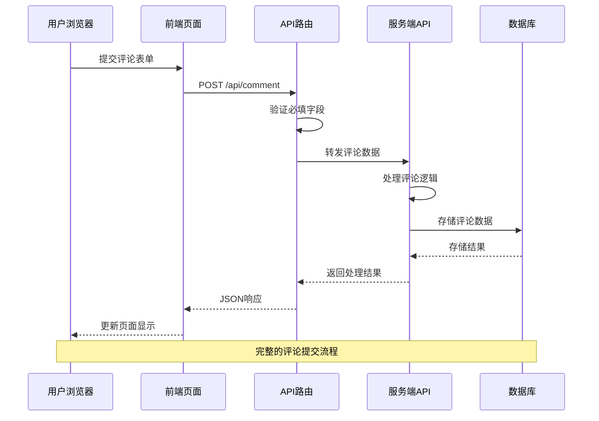
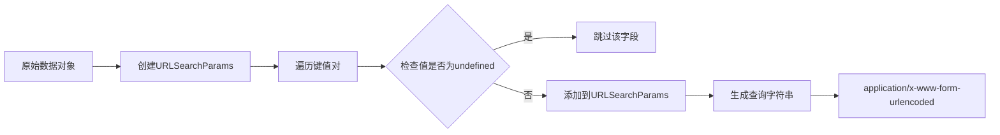
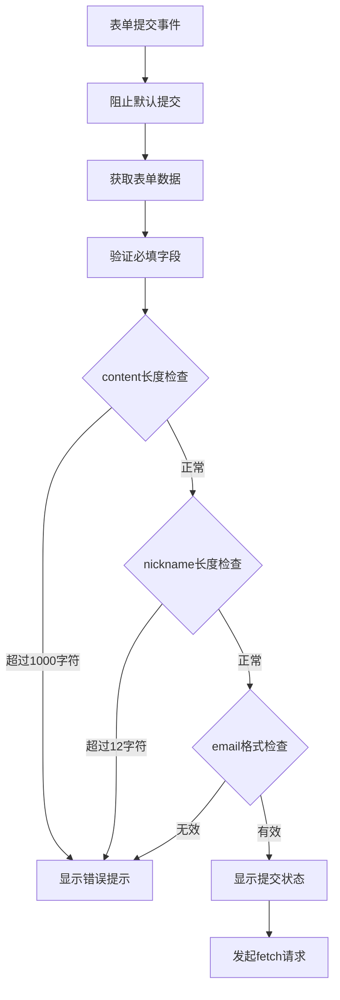
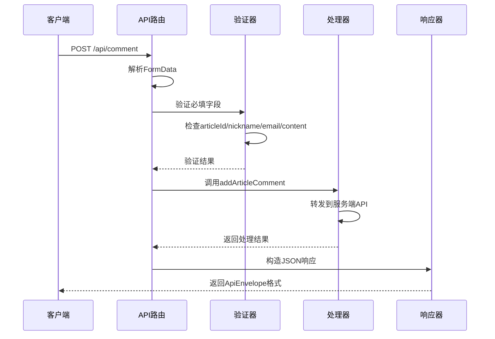
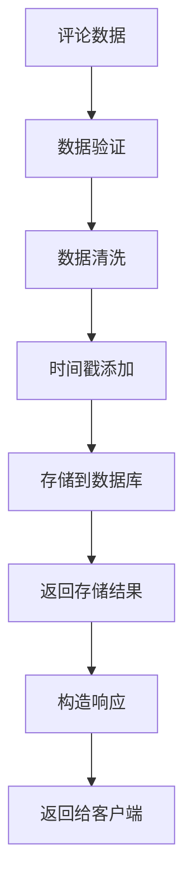

# 评论提交API

<cite>
**本文档引用的文件**
- [api.ts](file://src/lib/api.ts)
- [types.ts](file://src/lib/types.ts)
- [comment.ts](file://src/pages/api/comment.ts)
- [utils.ts](file://src/lib/utils.ts)
- [comment-form.astro](file://src/pages/article/[id].astro)
- [msg.ts](file://src/pages/api/msg.ts)
- [reply.ts](file://src/pages/api/reply.ts)
- [msg-page.astro](file://src/pages/msg.astro)
</cite>

## 目录
1. [简介](#简介)
2. [项目结构](#项目结构)
3. [核心组件](#核心组件)
4. [架构概览](#架构概览)
5. [详细组件分析](#详细组件分析)
6. [依赖关系分析](#依赖关系分析)
7. [性能考虑](#性能考虑)
8. [故障排除指南](#故障排除指南)
9. [结论](#结论)

## 简介

本文档详细介绍博客系统的评论提交API，重点分析`addArticleComment`函数的完整实现。该API提供了用户向文章发表评论的功能，包含完整的前端表单验证、后端数据处理和数据库存储流程。

系统采用Astro框架构建，前端使用TypeScript和Astro组件，后端通过API路由处理请求。评论数据结构设计合理，支持必填字段验证和可选字段处理，同时具备基本的防垃圾评论机制。

## 项目结构

博客评论系统采用分层架构设计，主要由以下层次组成：

```mermaid
graph TB
subgraph "前端层"
A[文章页面<br/>article/[id].astro]
B[API路由<br/>pages/api/comment.ts]
C[工具函数<br/>lib/utils.ts]
end
subgraph "数据层"
D[API封装<br/>lib/api.ts]
E[类型定义<br/>lib/types.ts]
end
subgraph "后端服务"
F[评论处理服务<br/>后端API]
G[数据库<br/>评论存储]
end
A --> B
A --> D
B --> D
D --> F
F --> G
C --> A
```

**图表来源**
- [comment-form.astro:1-109](file://src/pages/article/[id].astro#L1-L109)
- [comment.ts:1-19](file://src/pages/api/comment.ts#L1-L19)
- [api.ts:1-91](file://src/lib/api.ts#L1-L91)

**章节来源**
- [comment-form.astro:1-109](file://src/pages/article/[id].astro#L1-L109)
- [comment.ts:1-19](file://src/pages/api/comment.ts#L1-L19)
- [api.ts:1-91](file://src/lib/api.ts#L1-L91)

## 核心组件

### 评论数据结构

评论系统的核心数据结构定义如下：

| 字段名 | 类型 | 必填 | 描述 | 长度限制 |
|--------|------|------|------|----------|
| articleId | string \| number | 是 | 文章唯一标识符 | - |
| nickname | string | 是 | 用户昵称 | 最大12字符 |
| email | string | 是 | 用户邮箱地址 | 最大30字符 |
| website | string | 否 | 个人网站URL | 可为空 |
| content | string | 是 | 评论内容 | 最大1000字符 |

### API响应格式

系统使用统一的响应包装器`ApiEnvelope<T>`：

```typescript
interface ApiEnvelope<T = unknown> {
  result?: T;
  message?: string;
}
```

评论提交的响应结构：
```typescript
ApiEnvelope<{
  status: boolean;
  msg?: string;
}>
```

**章节来源**
- [types.ts:30-37](file://src/lib/types.ts#L30-L37)
- [types.ts:1-4](file://src/lib/types.ts#L1-L4)
- [api.ts:70-78](file://src/lib/api.ts#L70-L78)

## 架构概览

评论提交API采用前后端分离的设计模式，整体架构如下：



**图表来源**
- [comment-form.astro:85-108](file://src/pages/article/[id].astro#L85-L108)
- [comment.ts:4-18](file://src/pages/api/comment.ts#L4-L18)
- [api.ts:70-78](file://src/lib/api.ts#L70-L78)

## 详细组件分析

### addArticleComment函数实现

`addArticleComment`是评论提交的核心函数，负责将用户评论数据发送到后端API。

#### 函数签名与参数

```mermaid
flowchart TD
A[addArticleComment函数] --> B[输入参数验证]
B --> C[articleId: string|number]
B --> D[nickname: string]
B --> E[email: string]
B --> F[website?: string]
B --> G[content: string]
C --> H[调用postForm函数]
D --> H
E --> H
F --> H
G --> H
H --> I[返回Promise<ApiEnvelope>>
```

**图表来源**
- [api.ts:70-78](file://src/lib/api.ts#L70-L78)

#### 实现细节

函数内部通过`postForm`函数进行HTTP POST请求，使用`application/x-www-form-urlencoded`格式传输数据。

**章节来源**
- [api.ts:70-78](file://src/lib/api.ts#L70-L78)

### postForm函数表单提交机制

`postForm`函数实现了通用的表单数据提交功能：

#### URL编码机制



**图表来源**
- [api.ts:43-56](file://src/lib/api.ts#L43-L56)

#### 请求头设置

- Content-Type: `application/x-www-form-urlencoded;charset=UTF-8`
- Accept: `application/json`
- 自动继承传入的自定义头部

#### 数据序列化

使用`URLSearchParams`自动处理特殊字符编码，确保数据在HTTP传输中的安全性。

**章节来源**
- [api.ts:43-56](file://src/lib/api.ts#L43-L56)

### 前端表单验证

前端使用HTML5原生验证和JavaScript增强验证：

#### HTML5验证规则



**图表来源**
- [comment-form.astro:85-108](file://src/pages/article/[id].astro#L85-L108)

#### JavaScript验证逻辑

- 必填字段完整性检查
- 内容长度限制（1000字符）
- 昵称长度限制（12字符）
- 邮箱格式验证
- 实时错误提示反馈

**章节来源**
- [comment-form.astro:85-108](file://src/pages/article/[id].astro#L85-L108)

### 后端API路由处理

后端API路由负责接收和处理评论请求：

#### 请求处理流程



**图表来源**
- [comment.ts:4-18](file://src/pages/api/comment.ts#L4-L18)

#### 错误处理机制

- 400状态码：必填字段不完整
- 500状态码：服务器内部错误
- 统一的错误消息格式

**章节来源**
- [comment.ts:4-18](file://src/pages/api/comment.ts#L4-L18)

### 数据库存储流程

虽然具体的数据库操作在后端服务中实现，但系统设计支持完整的存储流程：



**图表来源**
- [types.ts:30-37](file://src/lib/types.ts#L30-L37)

## 依赖关系分析

### 组件依赖图

```mermaid
graph TB
subgraph "前端组件"
A[article/[id].astro]
B[comment-form.astro]
C[msg-page.astro]
end
subgraph "API层"
D[lib/api.ts]
E[pages/api/comment.ts]
F[pages/api/msg.ts]
G[pages/api/reply.ts]
end
subgraph "工具层"
H[lib/utils.ts]
I[lib/types.ts]
end
A --> D
B --> E
C --> F
C --> G
D --> E
E --> D
F --> D
G --> D
H --> A
I --> D
I --> E
```

**图表来源**
- [api.ts:1-91](file://src/lib/api.ts#L1-91)
- [comment.ts:1-19](file://src/pages/api/comment.ts#L1-19)
- [msg.ts:1-16](file://src/pages/api/msg.ts#L1-16)
- [reply.ts:1-17](file://src/pages/api/reply.ts#L1-17)
- [utils.ts:1-219](file://src/lib/utils.ts#L1-219)
- [types.ts:1-54](file://src/lib/types.ts#L1-54)

### 关键依赖关系

1. **前端到后端**：文章页面通过API路由提交评论
2. **API封装**：统一的HTTP请求处理机制
3. **类型安全**：TypeScript类型定义确保数据一致性
4. **工具函数**：提供通用的文本处理和格式化功能

**章节来源**
- [api.ts:1-91](file://src/lib/api.ts#L1-L91)
- [comment.ts:1-19](file://src/pages/api/comment.ts#L1-L19)

## 性能考虑

### 前端性能优化

1. **懒加载图片**：使用`loading="lazy"`属性延迟加载图片资源
2. **异步解码**：启用`decoding="async"`提升图片渲染性能
3. **缓存策略**：图片尺寸信息使用Map缓存避免重复请求
4. **防抖处理**：表单提交前的验证和错误提示

### 后端性能优化

1. **连接池管理**：合理配置数据库连接池
2. **查询优化**：针对评论查询建立合适的索引
3. **缓存机制**：热门文章的评论列表缓存
4. **限流控制**：防止恶意刷评论攻击

### 网络性能

1. **压缩传输**：启用Gzip压缩减少传输体积
2. **CDN加速**：静态资源通过CDN分发
3. **HTTP/2**：利用多路复用提升并发性能

## 故障排除指南

### 常见问题及解决方案

#### 1. 表单验证失败

**症状**：提交后立即显示错误提示
**可能原因**：
- 必填字段为空
- 内容长度超过限制
- 邮箱格式不正确
- 昵称长度超限

**解决方法**：
- 检查表单字段是否完整填写
- 确认内容长度符合要求
- 验证邮箱格式正确性
- 简化昵称长度

#### 2. API请求失败

**症状**：网络请求返回null或错误状态
**可能原因**：
- 网络连接异常
- API服务不可用
- CORS跨域问题
- 服务器内部错误

**解决方法**：
- 检查网络连接状态
- 验证API基础URL配置
- 查看浏览器开发者工具Network面板
- 检查服务器日志

#### 3. 评论未显示

**症状**：提交成功但页面不更新
**可能原因**：
- 页面刷新逻辑异常
- 缓存问题
- JavaScript执行错误

**解决方法**：
- 手动刷新页面查看
- 清除浏览器缓存
- 检查JavaScript控制台错误
- 验证响应数据格式

### 调试技巧

1. **网络监控**：使用浏览器开发者工具监控API请求
2. **日志记录**：在关键节点添加console.log输出
3. **错误边界**：使用try-catch捕获异步错误
4. **状态检查**：验证响应数据结构完整性

**章节来源**
- [comment-form.astro:85-108](file://src/pages/article/[id].astro#L85-L108)
- [comment.ts:4-18](file://src/pages/api/comment.ts#L4-L18)

## 结论

评论提交API展现了现代Web应用的良好实践，具有以下特点：

1. **清晰的架构设计**：前后端分离，职责明确
2. **完善的验证机制**：前后端双重验证确保数据质量
3. **统一的响应格式**：便于客户端处理和维护
4. **良好的扩展性**：模块化设计支持功能扩展
5. **用户体验优化**：实时反馈和错误提示提升交互体验

系统在保证功能完整性的同时，也考虑了性能和可维护性，为后续的功能扩展奠定了良好基础。建议在未来版本中进一步完善防垃圾评论机制，如添加验证码、IP限制等高级防护措施。