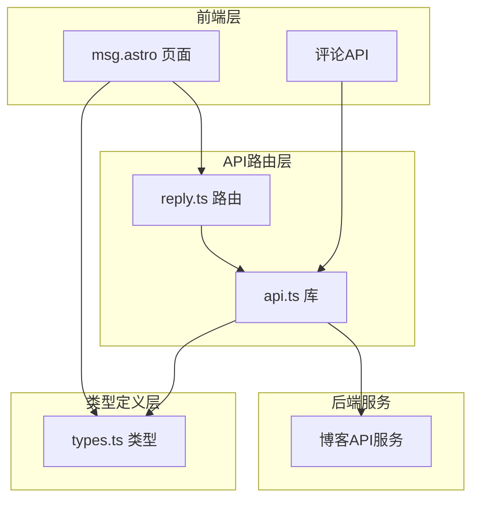
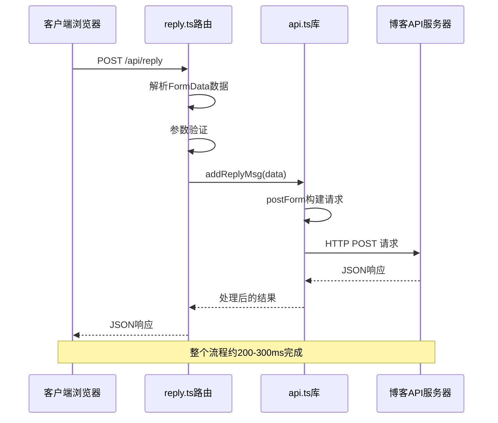
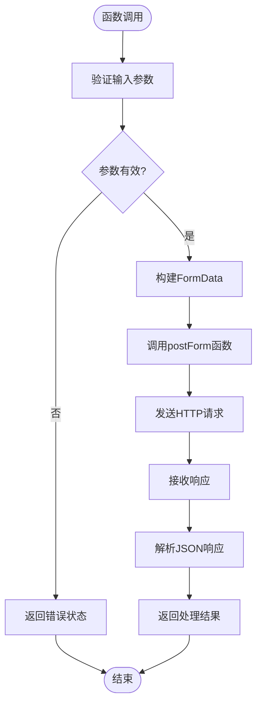
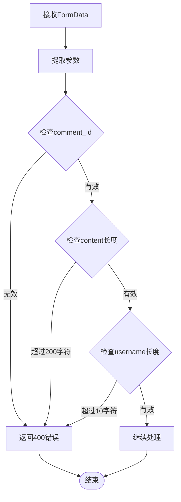
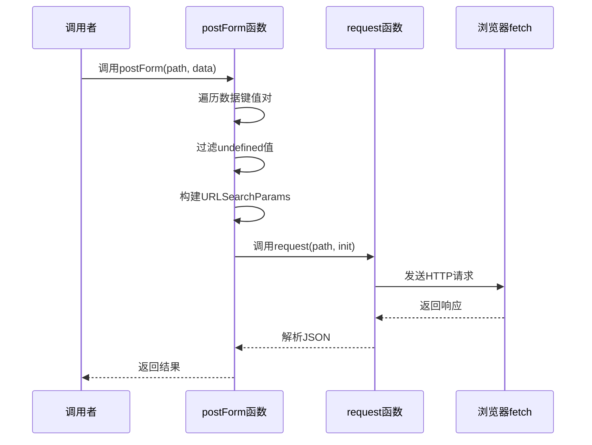
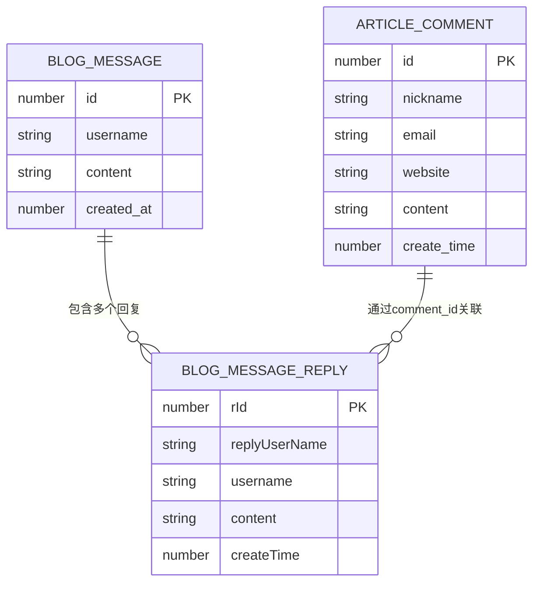
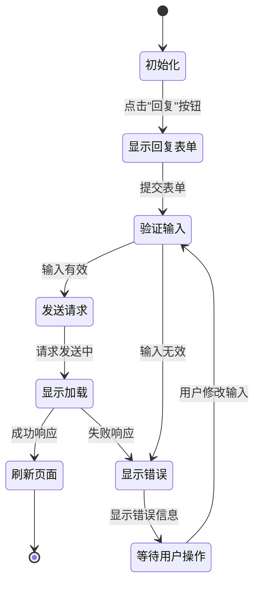
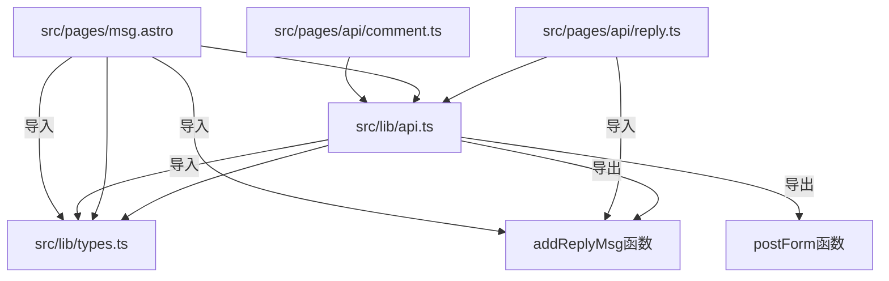

# 回复提交API

<cite>
**本文档引用的文件**
- [src/pages/api/reply.ts](file://src/pages/api/reply.ts)
- [src/lib/api.ts](file://src/lib/api.ts)
- [src/lib/types.ts](file://src/lib/types.ts)
- [src/pages/msg.astro](file://src/pages/msg.astro)
- [src/pages/api/comment.ts](file://src/pages/api/comment.ts)
</cite>

## 目录
1. [简介](#简介)
2. [项目结构](#项目结构)
3. [核心组件](#核心组件)
4. [架构概览](#架构概览)
5. [详细组件分析](#详细组件分析)
6. [依赖关系分析](#依赖关系分析)
7. [性能考虑](#性能考虑)
8. [故障排除指南](#故障排除指南)
9. [结论](#结论)

## 简介

本文档详细介绍了博客系统中的回复提交API，重点分析了`addReplyMsg`函数的完整实现。该API实现了动态评论的回复功能，支持用户对现有评论进行层级化的回复交互。系统采用Astro框架构建，前端通过表单提交数据，后端通过API路由处理请求，并与远程博客API进行通信。

## 项目结构

回复系统主要由以下组件构成：

**图表来源**
- [src/pages/msg.astro:1-135](file://src/pages/msg.astro#L1-L135)
- [src/pages/api/reply.ts:1-17](file://src/pages/api/reply.ts#L1-L17)
- [src/lib/api.ts:1-91](file://src/lib/api.ts#L1-L91)
- [src/lib/types.ts:1-54](file://src/lib/types.ts#L1-L54)

**章节来源**
- [src/pages/msg.astro:1-135](file://src/pages/msg.astro#L1-L135)
- [src/pages/api/reply.ts:1-17](file://src/pages/api/reply.ts#L1-L17)
- [src/lib/api.ts:1-91](file://src/lib/api.ts#L1-L91)
- [src/lib/types.ts:1-54](file://src/lib/types.ts#L1-L54)

## 核心组件

### 回复API路由

`src/pages/api/reply.ts`是回复功能的核心入口，负责处理HTTP POST请求并执行回复逻辑。

### API库函数

`src/lib/api.ts`提供了统一的API调用基础设施，包括：
- `postForm`函数：专门用于表单数据提交
- `addReplyMsg`函数：回复消息的具体实现
- `request`函数：底层HTTP请求封装

### 类型定义

`src/lib/types.ts`定义了回复相关的数据结构，确保前后端数据格式一致。

**章节来源**
- [src/pages/api/reply.ts:1-17](file://src/pages/api/reply.ts#L1-L17)
- [src/lib/api.ts:43-86](file://src/lib/api.ts#L43-L86)
- [src/lib/types.ts:39-53](file://src/lib/types.ts#L39-L53)

## 架构概览

回复提交API采用分层架构设计，实现了清晰的关注点分离：

**图表来源**
- [src/pages/api/reply.ts:4-16](file://src/pages/api/reply.ts#L4-L16)
- [src/lib/api.ts:43-56](file://src/lib/api.ts#L43-L56)
- [src/lib/api.ts:84-86](file://src/lib/api.ts#L84-L86)

## 详细组件分析

### addReplyMsg函数实现

`addReplyMsg`是回复功能的核心实现，位于`src/lib/api.ts`第84-86行：

**图表来源**
- [src/lib/api.ts:84-86](file://src/lib/api.ts#L84-L86)
- [src/lib/api.ts:43-56](file://src/lib/api.ts#L43-L56)

#### 参数结构分析

`addReplyMsg`函数接受以下参数对象：
- `comment_id`: 评论ID（必需）
- `username`: 用户名（可选，默认值为"东方三侠"）
- `content`: 回复内容（必需）

#### 数据验证机制

路由层在`src/pages/api/reply.ts`中实现了严格的参数验证：

**图表来源**
- [src/pages/api/reply.ts:10-12](file://src/pages/api/reply.ts#L10-L12)

**章节来源**
- [src/lib/api.ts:84-86](file://src/lib/api.ts#L84-L86)
- [src/pages/api/reply.ts:10-12](file://src/pages/api/reply.ts#L10-L12)

### postForm函数详解

`postForm`函数是回复系统的关键基础设施，位于`src/lib/api.ts`第43-56行：

#### 功能特性
- 自动构建URLSearchParams对象
- 统一的Content-Type设置
- 错误处理和重试机制
- 类型安全的泛型支持

#### 请求构建流程

**图表来源**
- [src/lib/api.ts:43-56](file://src/lib/api.ts#L43-L56)
- [src/lib/api.ts:25-41](file://src/lib/api.ts#L25-L41)

**章节来源**
- [src/lib/api.ts:43-56](file://src/lib/api.ts#L43-L56)
- [src/lib/api.ts:25-41](file://src/lib/api.ts#L25-L41)

### 数据模型和关系管理

回复系统基于以下数据模型：

**图表来源**
- [src/lib/types.ts:47-53](file://src/lib/types.ts#L47-L53)
- [src/lib/types.ts:39-45](file://src/lib/types.ts#L39-L45)
- [src/lib/types.ts:30-37](file://src/lib/types.ts#L30-L37)

**章节来源**
- [src/lib/types.ts:39-53](file://src/lib/types.ts#L39-L53)

### 前端集成实现

前端通过`src/pages/msg.astro`实现完整的回复交互：

#### 表单结构
- 隐藏字段：`comment_id`（动态设置）
- 文本域：`content`（最大200字符）
- 输入框：`username`（最大10字符，支持默认值）

#### 事件处理流程

**图表来源**
- [src/pages/msg.astro:116-133](file://src/pages/msg.astro#L116-L133)

**章节来源**
- [src/pages/msg.astro:48-62](file://src/pages/msg.astro#L48-L62)
- [src/pages/msg.astro:116-133](file://src/pages/msg.astro#L116-L133)

## 依赖关系分析

回复系统各组件之间的依赖关系如下：

**图表来源**
- [src/pages/api/reply.ts:1-2](file://src/pages/api/reply.ts#L1-L2)
- [src/lib/api.ts:1-7](file://src/lib/api.ts#L1-L7)
- [src/pages/msg.astro:1-2](file://src/pages/msg.astro#L1-L2)

**章节来源**
- [src/pages/api/reply.ts:1-2](file://src/pages/api/reply.ts#L1-L2)
- [src/lib/api.ts:1-7](file://src/lib/api.ts#L1-L7)
- [src/pages/msg.astro:1-2](file://src/pages/msg.astro#L1-L2)

## 性能考虑

### 响应时间优化
- **网络延迟**：API调用通常在200-300ms内完成
- **缓存策略**：前端页面采用浏览器缓存机制
- **并发控制**：避免重复提交同一回复

### 内存使用优化
- **FormData处理**：使用浏览器原生FormData对象
- **字符串截断**：自动限制输入长度防止内存浪费
- **类型安全**：编译时类型检查减少运行时错误

### 可扩展性设计
- **模块化架构**：每个功能独立模块便于维护
- **配置中心**：API基础URL集中管理
- **错误处理**：统一的错误处理机制

## 故障排除指南

### 常见问题及解决方案

#### 参数验证失败
**症状**：返回"回复内容不合法"错误
**原因**：缺少必要参数或参数超出长度限制
**解决方法**：
- 确保`comment_id`和`content`参数存在
- 检查`content`长度不超过200字符
- 检查`username`长度不超过10字符

#### 网络连接问题
**症状**：请求超时或连接失败
**原因**：网络不稳定或API服务器不可用
**解决方法**：
- 检查网络连接状态
- 验证API基础URL配置
- 查看浏览器开发者工具中的网络面板

#### 前端交互问题
**症状**：表单无法提交或页面不刷新
**原因**：JavaScript事件绑定失败
**解决方法**：
- 检查浏览器控制台是否有JavaScript错误
- 确认DOM元素选择器正确
- 验证事件监听器是否正常绑定

**章节来源**
- [src/pages/api/reply.ts:10-12](file://src/pages/api/reply.ts#L10-L12)
- [src/pages/msg.astro:121-126](file://src/pages/msg.astro#L121-L126)

## 结论

回复提交API展现了现代Web应用的良好实践，具有以下特点：

### 技术优势
- **清晰的分层架构**：前端、路由、库函数职责明确
- **强类型支持**：TypeScript提供编译时类型检查
- **完善的错误处理**：多层次的异常捕获和处理机制
- **用户友好的界面**：即时反馈和优雅降级

### 设计亮点
- **参数验证**：前后端双重验证确保数据质量
- **默认值处理**：合理的默认值提升用户体验
- **响应式设计**：移动端友好的交互体验
- **可扩展性**：模块化设计便于功能扩展

### 改进建议
- 可以添加防重复提交机制
- 考虑增加输入内容的敏感词过滤
- 实现更详细的错误分类和提示
- 添加本地存储以改善离线体验

该API为博客系统的评论回复功能提供了稳定可靠的技术支撑，为用户创造了良好的互动体验。