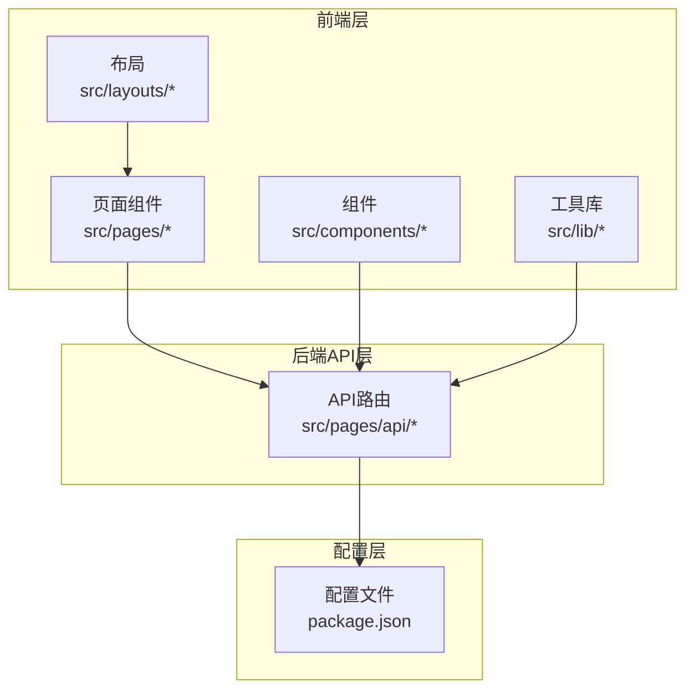
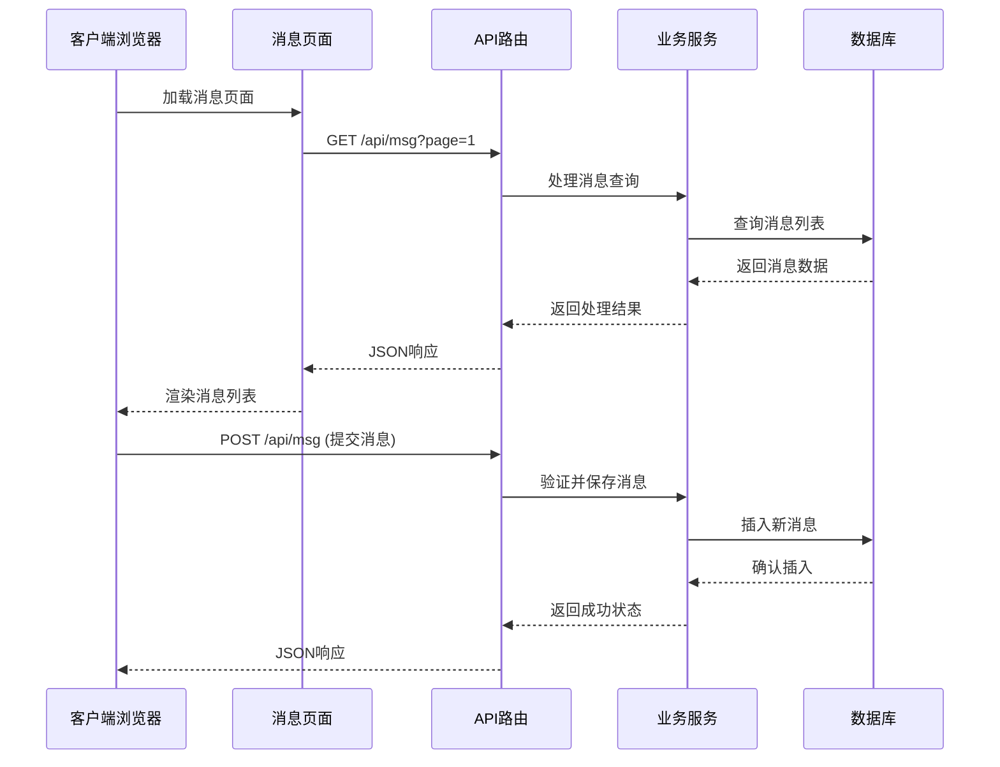
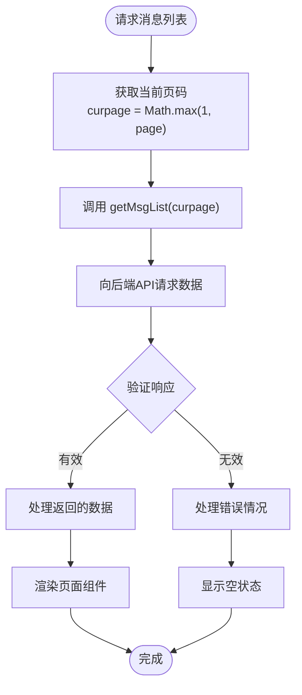
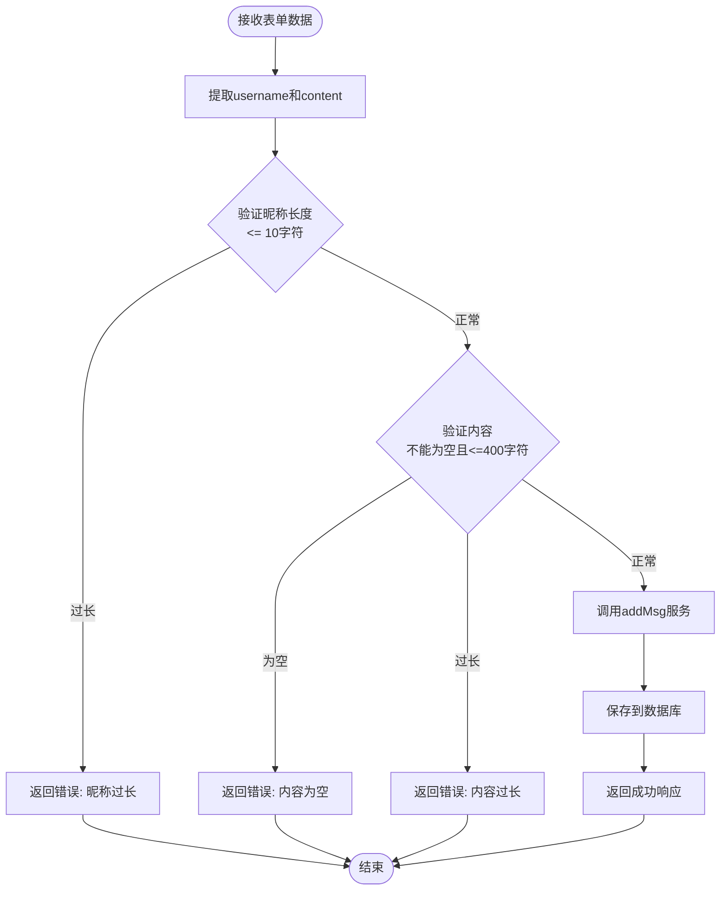
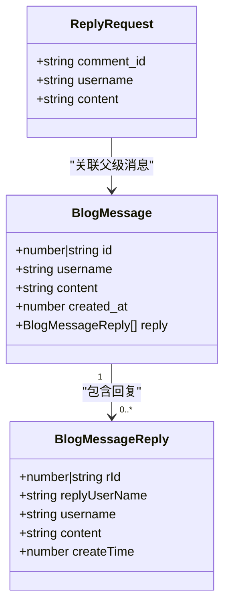
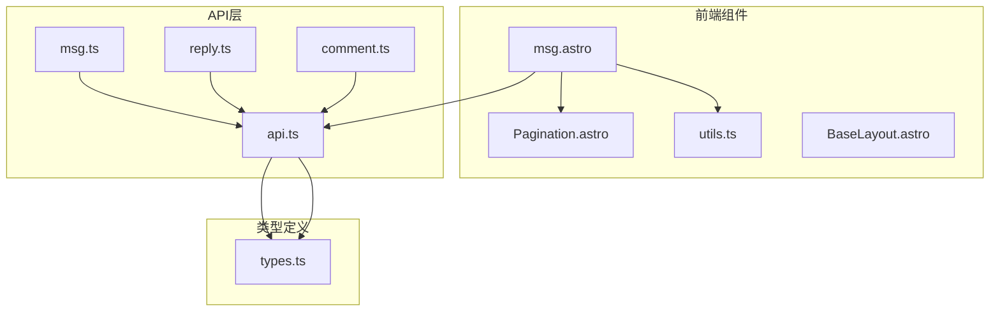

# 消息交互API

<cite>
**本文档引用的文件**
- [src/pages/api/msg.ts](file://src/pages/api/msg.ts)
- [src/pages/api/reply.ts](file://src/pages/api/reply.ts)
- [src/pages/api/comment.ts](file://src/pages/api/comment.ts)
- [src/lib/api.ts](file://src/lib/api.ts)
- [src/lib/types.ts](file://src/lib/types.ts)
- [src/pages/msg.astro](file://src/pages/msg.astro)
- [src/components/Pagination.astro](file://src/components/Pagination.astro)
- [src/lib/utils.ts](file://src/lib/utils.ts)
- [src/layouts/BaseLayout.astro](file://src/layouts/BaseLayout.astro)
- [package.json](file://package.json)
</cite>

## 目录
1. [简介](#简介)
2. [项目结构](#项目结构)
3. [核心组件](#核心组件)
4. [架构概览](#架构概览)
5. [详细组件分析](#详细组件分析)
6. [依赖分析](#依赖分析)
7. [性能考虑](#性能考虑)
8. [故障排除指南](#故障排除指南)
9. [结论](#结论)
10. [附录](#附录)

## 简介

本项目实现了完整的站内消息和留言系统，基于 Astro 框架构建。系统提供了三个核心API：消息列表获取、留言提交和回复提交，支持分页机制、数据验证和基本的内容审核功能。

消息系统采用前后端分离的设计模式，前端通过 Astro 组件渲染页面，后端通过 API 路由处理请求。系统支持用户昵称、内容长度限制等基础验证，并提供简单的防刷策略。

## 项目结构

项目采用模块化的文件组织方式，主要分为以下几个部分：



**图表来源**
- [src/pages/msg.astro:1-135](file://src/pages/msg.astro#L1-L135)
- [src/pages/api/msg.ts:1-16](file://src/pages/api/msg.ts#L1-L16)
- [src/lib/api.ts:1-91](file://src/lib/api.ts#L1-L91)

**章节来源**
- [package.json:1-19](file://package.json#L1-L19)
- [src/pages/msg.astro:1-135](file://src/pages/msg.astro#L1-L135)

## 核心组件

### API 路由层

系统包含三个核心API路由，分别处理不同类型的消息交互：

1. **消息列表获取** (`/api/msg`) - 获取站内消息列表
2. **留言提交** (`/api/comment`) - 提交文章评论
3. **回复提交** (`/api/reply`) - 提交消息回复

每个API路由都遵循统一的模式：
- 接收表单数据
- 进行基础验证
- 调用业务逻辑函数
- 返回标准化的JSON响应

### 前端组件层

前端使用 Astro 组件构建用户界面，主要包含：

- **消息页面** (`msg.astro`) - 主要的消息展示和交互页面
- **分页组件** (`Pagination.astro`) - 支持分页导航的通用组件
- **工具函数** (`utils.ts`) - 包含时间格式化等辅助功能

**章节来源**
- [src/pages/api/msg.ts:1-16](file://src/pages/api/msg.ts#L1-L16)
- [src/pages/api/reply.ts:1-17](file://src/pages/api/reply.ts#L1-L17)
- [src/pages/api/comment.ts:1-19](file://src/pages/api/comment.ts#L1-L19)

## 架构概览

系统采用客户端-服务器架构，通过API进行数据交互：



**图表来源**
- [src/pages/msg.astro:8-135](file://src/pages/msg.astro#L8-L135)
- [src/lib/api.ts:66-86](file://src/lib/api.ts#L66-L86)

## 详细组件分析

### 消息列表获取接口 (getMsgList)

#### API定义
- **路径**: `/api/msg`
- **方法**: GET
- **参数**: `curpage` (当前页码，默认为1)

#### 分页机制
系统实现了标准的分页功能：



**图表来源**
- [src/pages/msg.astro:7-14](file://src/pages/msg.astro#L7-L14)
- [src/lib/api.ts:66-68](file://src/lib/api.ts#L66-L68)

#### 数据结构
消息列表返回的数据结构包含以下关键字段：

| 字段名 | 类型 | 描述 |
|--------|------|------|
| status | boolean | 请求状态 |
| data | BlogMessage[] | 消息数组 |
| isPagination | boolean | 是否启用分页 |
| perpage | number | 每页条数 |
| rows | number | 总记录数 |
| msg | string | 状态描述 |

**章节来源**
- [src/lib/types.ts:6-13](file://src/lib/types.ts#L6-L13)
- [src/lib/api.ts:66-68](file://src/lib/api.ts#L66-L68)

### 留言提交接口 (addMsg)

#### API定义
- **路径**: `/api/msg`
- **方法**: POST
- **表单字段**:
  - `username`: 用户昵称 (最大10字符)
  - `content`: 留言内容 (最大400字符)

#### 数据验证流程



**图表来源**
- [src/pages/api/msg.ts:9-11](file://src/pages/api/msg.ts#L9-L11)
- [src/pages/api/msg.ts:13-14](file://src/pages/api/msg.ts#L13-L14)

#### 错误处理
系统提供统一的错误处理机制：

| 错误类型 | 触发条件 | 返回消息 |
|----------|----------|----------|
| 动态内容不合法 | 内容为空或超过400字符 | "动态内容不合法" |
| 提交失败 | 服务器内部错误 | "提交失败" |

**章节来源**
- [src/pages/api/msg.ts:4-15](file://src/pages/api/msg.ts#L4-L15)

### 回复提交接口 (addReplyMsg)

#### API定义
- **路径**: `/api/reply`
- **方法**: POST
- **表单字段**:
  - `comment_id`: 父级消息ID
  - `username`: 回复者昵称 (最大10字符)
  - `content`: 回复内容 (最大200字符)

#### 回复关系建立



**图表来源**
- [src/lib/types.ts:39-53](file://src/lib/types.ts#L39-L53)

#### 验证规则
回复提交接口实施了严格的验证：

| 字段 | 验证规则 | 错误消息 |
|------|----------|----------|
| comment_id | 必填且非空 | "回复内容不合法" |
| content | 必填且<=200字符 | "回复内容不合法" |
| username | 最大10字符 | "回复内容不合法" |

**章节来源**
- [src/pages/api/reply.ts:4-16](file://src/pages/api/reply.ts#L4-L16)

### 文章评论接口 (addArticleComment)

虽然不是消息系统的核心功能，但文章评论接口与消息系统共享相似的验证模式：

- **路径**: `/api/comment`
- **必需字段**: `articleId`, `nickname`, `email`, `content`
- **可选字段**: `website`
- **验证**: 所有必需字段必须存在且非空

**章节来源**
- [src/pages/api/comment.ts:4-18](file://src/pages/api/comment.ts#L4-L18)

## 依赖分析

### 组件间依赖关系



**图表来源**
- [src/pages/msg.astro:1-135](file://src/pages/msg.astro#L1-L135)
- [src/lib/api.ts:1-91](file://src/lib/api.ts#L1-L91)
- [src/lib/types.ts:1-54](file://src/lib/types.ts#L1-L54)

### 外部依赖

项目的主要依赖包括：

- **Astro**: Web框架，提供SSR和静态生成能力
- **TypeScript**: 类型安全的JavaScript扩展
- **Node.js**: 运行时环境

**章节来源**
- [package.json:12-18](file://package.json#L12-L18)

## 性能考虑

### 缓存策略

系统目前采用以下缓存策略：

1. **图片尺寸缓存**: 使用内存缓存存储已解析的图片尺寸信息
2. **API响应缓存**: 可在后端实现适当的缓存机制
3. **组件渲染缓存**: Astro的静态生成减少重复计算

### 性能优化建议

1. **分页优化**: 后端应实现数据库层面的分页查询
2. **内容过滤**: 实现更严格的内容审核机制
3. **并发控制**: 添加防刷策略和速率限制
4. **CDN加速**: 对静态资源使用CDN分发

## 故障排除指南

### 常见问题及解决方案

#### API请求失败
- **症状**: 页面加载时出现"暂无动态或接口暂时不可用"
- **原因**: API服务器不可达或响应异常
- **解决**: 检查网络连接和API服务器状态

#### 表单验证错误
- **症状**: 提交时显示"动态内容不合法"或"回复内容不合法"
- **原因**: 输入内容超出长度限制或为空
- **解决**: 检查输入内容长度和必填字段

#### 分页显示异常
- **症状**: 分页组件不显示或无法跳转
- **原因**: API返回的分页数据格式不正确
- **解决**: 验证API响应中的分页字段

**章节来源**
- [src/pages/msg.astro:79-84](file://src/pages/msg.astro#L79-L84)
- [src/pages/api/msg.ts:9-11](file://src/pages/api/msg.ts#L9-L11)

## 结论

本消息交互API系统实现了基本的站内消息和留言功能，具有以下特点：

**优势**:
- 结构清晰，职责分明
- 前后端分离，易于维护
- 支持分页和基本验证
- 响应式设计，用户体验良好

**改进空间**:
- 需要增强内容审核机制
- 应添加更完善的防刷策略
- 可考虑实现实时消息推送
- 需要优化数据库查询性能

系统为博客平台提供了基础的消息交互能力，为进一步的功能扩展奠定了良好的基础。

## 附录

### API使用示例

#### 获取消息列表
```javascript
// 基本用法
const response = await fetch('/api/msg?page=1');
const data = await response.json();

// 使用封装函数
import { getMsgList } from '../lib/api';
const result = await getMsgList(1);
```

#### 提交消息
```javascript
// 表单数据格式
const formData = new FormData();
formData.append('username', '用户昵称');
formData.append('content', '消息内容');

// 发送请求
const response = await fetch('/api/msg', {
  method: 'POST',
  body: formData
});
```

#### 提交回复
```javascript
// 表单数据格式
const formData = new FormData();
formData.append('comment_id', '消息ID');
formData.append('username', '回复者昵称');
formData.append('content', '回复内容');
```

### 错误处理最佳实践

1. **客户端验证**: 在提交前进行基本的输入验证
2. **服务器端验证**: 服务器端再次验证所有输入
3. **统一错误响应**: 使用一致的错误格式
4. **用户友好提示**: 提供清晰的错误信息