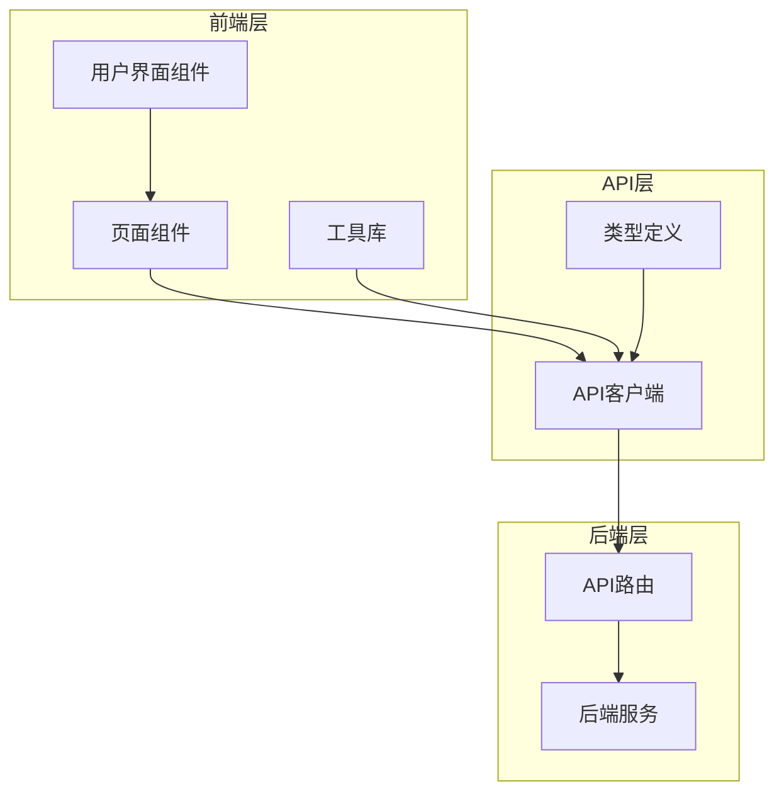
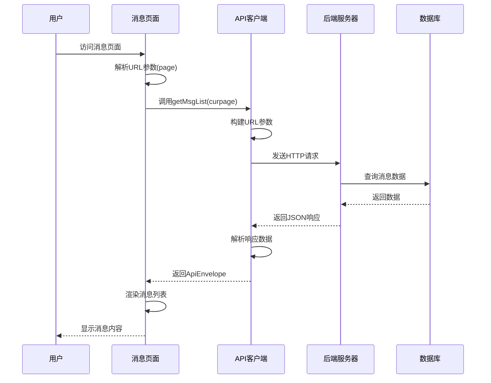
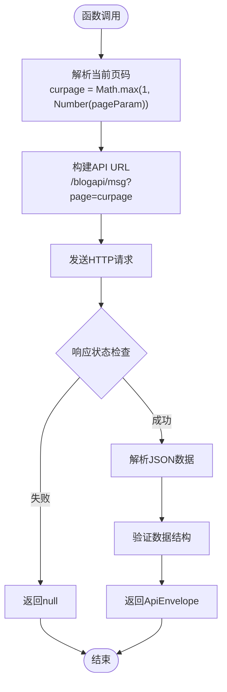
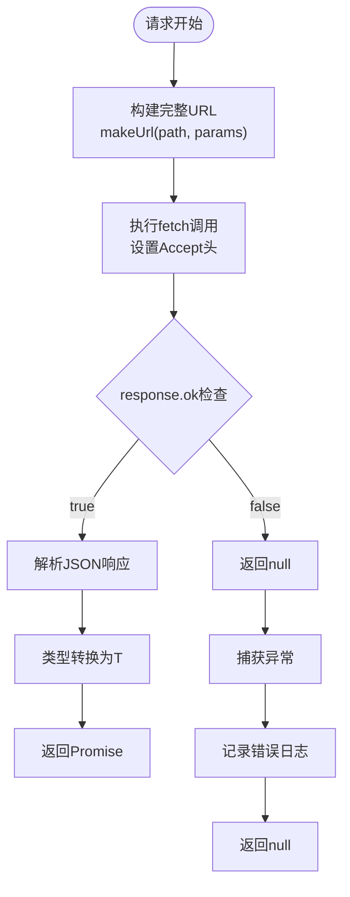
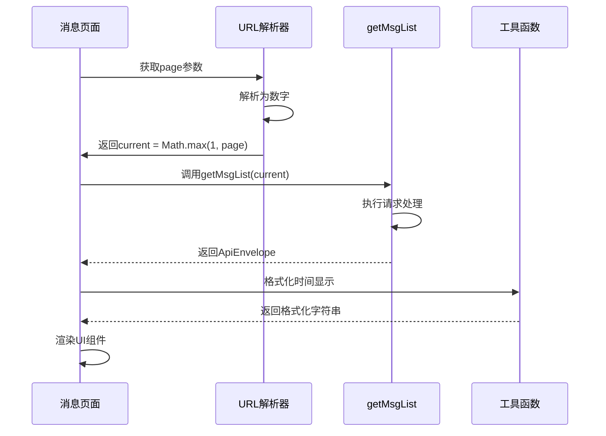
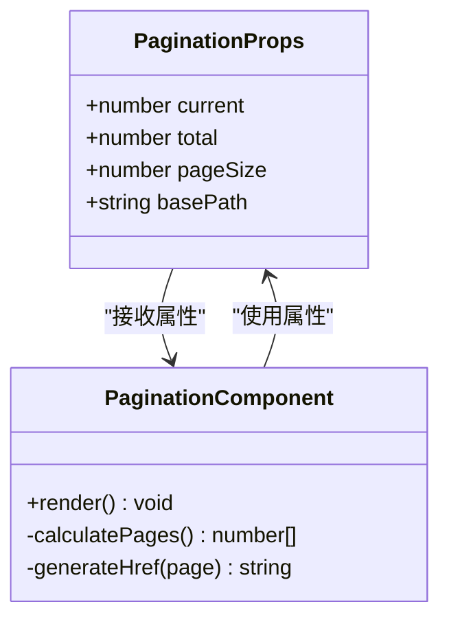
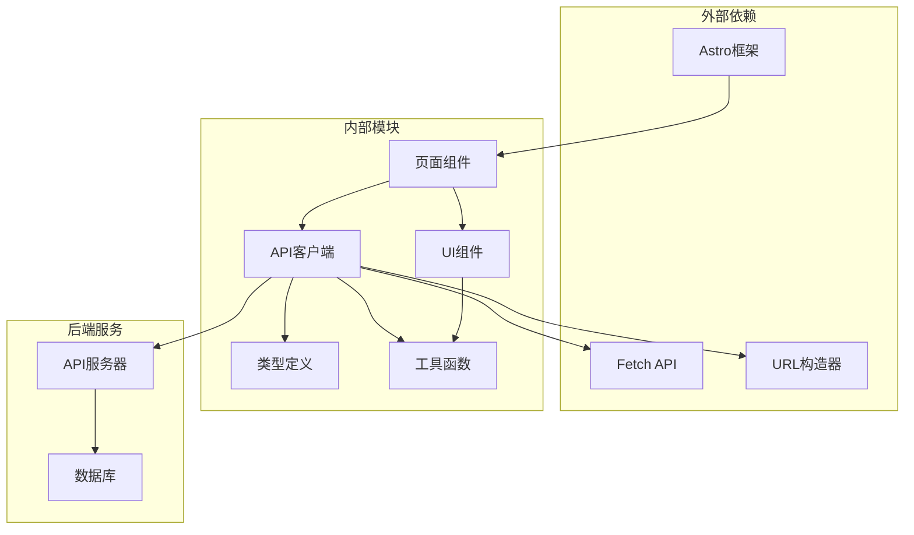

# 消息列表API

<cite>
**本文档引用的文件**
- [api.ts](file://src/lib/api.ts)
- [types.ts](file://src/lib/types.ts)
- [msg.astro](file://src/pages/msg.astro)
- [Pagination.astro](file://src/components/Pagination.astro)
- [msg.ts](file://src/pages/api/msg.ts)
- [utils.ts](file://src/lib/utils.ts)
</cite>

## 目录
1. [简介](#简介)
2. [项目结构](#项目结构)
3. [核心组件](#核心组件)
4. [架构概览](#架构概览)
5. [详细组件分析](#详细组件分析)
6. [依赖关系分析](#依赖关系分析)
7. [性能考虑](#性能考虑)
8. [故障排除指南](#故障排除指南)
9. [结论](#结论)

## 简介

本文档详细介绍了博客系统中的消息列表API，重点分析了`getMsgList`函数的完整实现。该API负责获取博客动态消息列表，支持分页功能，通过统一的请求处理机制实现数据获取、错误处理和响应包装。

消息列表API采用现代化的前端架构设计，结合Astro框架的静态生成能力和客户端交互特性，为用户提供流畅的消息浏览体验。系统通过`ApiEnvelope`响应包装器确保数据结构的一致性和类型安全性。

## 项目结构

该项目采用模块化架构，主要分为以下几个层次：



**图表来源**
- [api.ts:1-91](file://src/lib/api.ts#L1-L91)
- [types.ts:1-54](file://src/lib/types.ts#L1-L54)

**章节来源**
- [api.ts:1-91](file://src/lib/api.ts#L1-L91)
- [types.ts:1-54](file://src/lib/types.ts#L1-L54)

## 核心组件

### API客户端模块

API客户端模块提供了统一的HTTP请求处理机制，包含以下关键功能：

- **基础URL配置**：支持环境变量配置和默认回退机制
- **URL参数构建**：智能处理查询参数，自动过滤undefined和空值
- **请求处理**：封装fetch调用，统一处理响应状态和错误
- **类型安全**：通过泛型确保返回数据的类型正确性

### 类型系统

系统定义了完整的类型体系，确保数据结构的一致性和开发时的类型安全：

- **ApiEnvelope<T>**：统一的响应包装器
- **PaginationResult<T>**：分页结果的标准格式
- **BlogMessage**：消息实体的数据结构

**章节来源**
- [api.ts:1-91](file://src/lib/api.ts#L1-L91)
- [types.ts:1-54](file://src/lib/types.ts#L1-L54)

## 架构概览

消息列表API的整体架构采用分层设计，从用户界面到后端服务形成清晰的数据流：



**图表来源**
- [msg.astro:7-14](file://src/pages/msg.astro#L7-L14)
- [api.ts:25-41](file://src/lib/api.ts#L25-L41)

## 详细组件分析

### getMsgList函数实现

`getMsgList`是消息列表API的核心函数，负责获取博客动态消息的完整实现：

#### 函数签名和参数

```typescript
export function getMsgList(curpage = 1) {
  return request<ApiEnvelope<PaginationResult<BlogMessage>>>('/blogapi/msg', undefined, { curpage });
}
```

该函数具有以下特点：
- **默认参数**：`curpage`参数默认值为1，确保首次访问时的正确行为
- **泛型约束**：使用`ApiEnvelope<PaginationResult<BlogMessage>>`确保返回数据的类型安全
- **参数传递**：通过第三个参数传递分页参数

#### 分页机制实现

分页机制通过URL查询参数实现，具体流程如下：



**图表来源**
- [msg.astro:7-14](file://src/pages/msg.astro#L7-L14)
- [api.ts:66-68](file://src/lib/api.ts#L66-L68)

#### 请求处理逻辑

底层的`request`函数实现了统一的HTTP请求处理机制：



**图表来源**
- [api.ts:25-41](file://src/lib/api.ts#L25-L41)

**章节来源**
- [api.ts:66-68](file://src/lib/api.ts#L66-L68)
- [msg.astro:7-14](file://src/pages/msg.astro#L7-L14)

### ApiEnvelope响应包装器

`ApiEnvelope`是系统的核心响应包装器，提供统一的数据结构和错误处理机制：

#### 数据结构定义

```typescript
export interface ApiEnvelope<T = unknown> {
  result?: T;
  message?: string;
}
```

该结构包含两个关键字段：
- **result**：实际业务数据，可选类型参数T
- **message**：辅助信息或错误描述

#### 类型安全保证

通过泛型约束，确保：
- 编译时类型检查
- 运行时数据验证
- 开发者友好的IDE提示

**章节来源**
- [types.ts:1-54](file://src/lib/types.ts#L1-L54)

### PaginationResult分页模型

分页结果采用标准的数据结构，支持灵活的分页配置：

```typescript
export interface PaginationResult<T> {
  status: boolean;
  data: T[];
  isPagination?: boolean;
  perpage?: number | string;
  rows?: number;
  msg?: string;
}
```

关键字段说明：
- **status**：操作状态标识
- **data**：分页数据数组
- **isPagination**：是否启用分页
- **perpage**：每页数据量
- **rows**：总记录数
- **msg**：状态消息

**章节来源**
- [types.ts:6-13](file://src/lib/types.ts#L6-L13)

### 前端集成实现

消息页面组件展示了完整的API集成模式：

#### 页面初始化流程



**图表来源**
- [msg.astro:7-14](file://src/pages/msg.astro#L7-L14)
- [utils.ts:28-31](file://src/lib/utils.ts#L28-L31)

#### 分页组件集成

分页组件通过`Pagination.astro`实现，支持智能的页码显示策略：



**图表来源**
- [Pagination.astro:1-28](file://src/components/Pagination.astro#L1-L28)

**章节来源**
- [msg.astro:1-135](file://src/pages/msg.astro#L1-L135)
- [Pagination.astro:1-28](file://src/components/Pagination.astro#L1-L28)

## 依赖关系分析

系统各组件之间的依赖关系形成了清晰的层次结构：



**图表来源**
- [api.ts:1-91](file://src/lib/api.ts#L1-L91)
- [types.ts:1-54](file://src/lib/types.ts#L1-L54)

**章节来源**
- [api.ts:1-91](file://src/lib/api.ts#L1-L91)
- [types.ts:1-54](file://src/lib/types.ts#L1-L54)

## 性能考虑

### 缓存策略

系统采用了多层缓存机制来优化性能：

1. **URL参数缓存**：避免重复的URL构建计算
2. **响应数据缓存**：在客户端层面缓存已获取的数据
3. **图片尺寸缓存**：对图片尺寸解析结果进行缓存

### 错误处理优化

- **快速失败**：在网络异常时立即返回null，避免长时间等待
- **降级策略**：当API不可用时，页面仍能显示基本内容
- **重试机制**：可通过重新加载实现简单的重试效果

### 内存管理

- **及时清理**：组件卸载时自动清理事件监听器
- **弱引用**：使用WeakMap等数据结构避免内存泄漏

## 故障排除指南

### 常见问题及解决方案

#### API请求失败

**症状**：消息列表为空，控制台出现错误日志

**原因分析**：
- 网络连接异常
- API服务器不可达
- CORS跨域问题

**解决步骤**：
1. 检查网络连接状态
2. 验证API基础URL配置
3. 查看浏览器开发者工具的网络面板

#### 分页参数无效

**症状**：分页链接点击后页面无变化

**原因分析**：
- URL参数解析错误
- 分页组件配置问题

**解决步骤**：
1. 检查URL参数格式
2. 验证分页组件的basePath属性
3. 确认后端API支持分页参数

#### 数据类型不匹配

**症状**：TypeScript编译错误或运行时类型错误

**原因分析**：
- API响应结构发生变化
- 类型定义未更新

**解决步骤**：
1. 对照后端API文档更新类型定义
2. 检查ApiEnvelope的泛型参数
3. 验证数据验证逻辑

### 调试技巧

#### 开发者工具使用

1. **Network面板**：监控API请求和响应
2. **Console面板**：查看错误日志和警告信息
3. **Sources面板**：设置断点调试JavaScript代码

#### 日志记录

系统在请求失败时会记录详细的错误信息：
- 完整的请求URL
- 错误类型和堆栈跟踪
- 时间戳和上下文信息

**章节来源**
- [api.ts:37-40](file://src/lib/api.ts#L37-L40)

## 结论

消息列表API展现了现代前端开发的最佳实践，通过以下关键特性实现了高质量的用户体验：

### 技术优势

1. **类型安全**：完整的TypeScript类型系统确保代码质量
2. **模块化设计**：清晰的职责分离便于维护和扩展
3. **错误处理**：完善的异常处理机制提升系统稳定性
4. **性能优化**：多层缓存和优化策略确保响应速度

### 架构特色

- **响应式设计**：支持移动端和桌面端的自适应布局
- **渐进增强**：基础功能在无JavaScript环境下仍可正常工作
- **SEO友好**：静态生成确保搜索引擎优化效果

### 扩展建议

1. **增加缓存策略**：实现更精细的客户端缓存机制
2. **优化分页性能**：支持懒加载和虚拟滚动
3. **增强错误恢复**：实现自动重试和错误恢复机制
4. **监控和分析**：集成性能监控和用户行为分析

该API设计为博客系统的消息功能提供了坚实的技术基础，通过持续的优化和改进，能够满足不断增长的用户需求和业务场景。