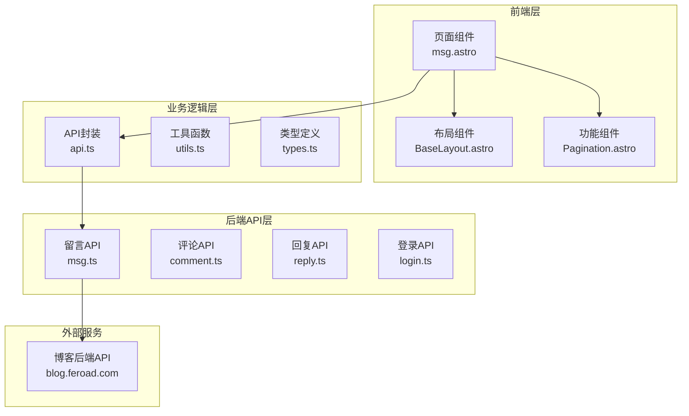
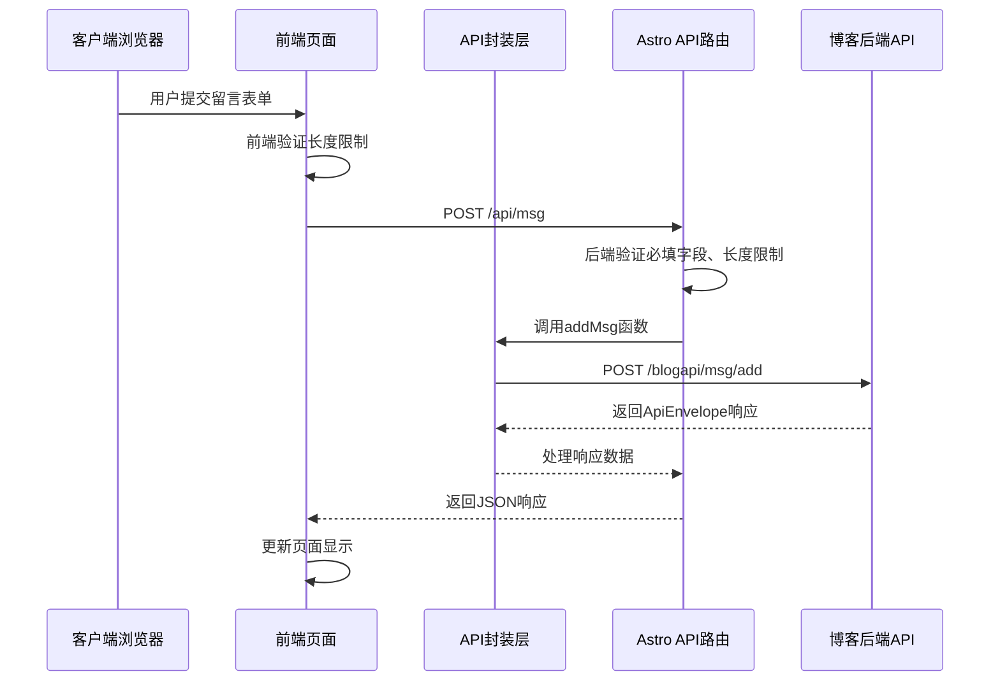
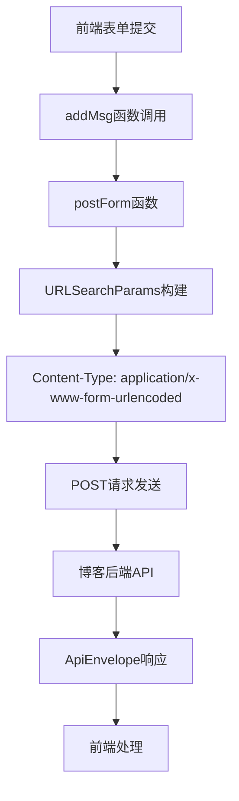
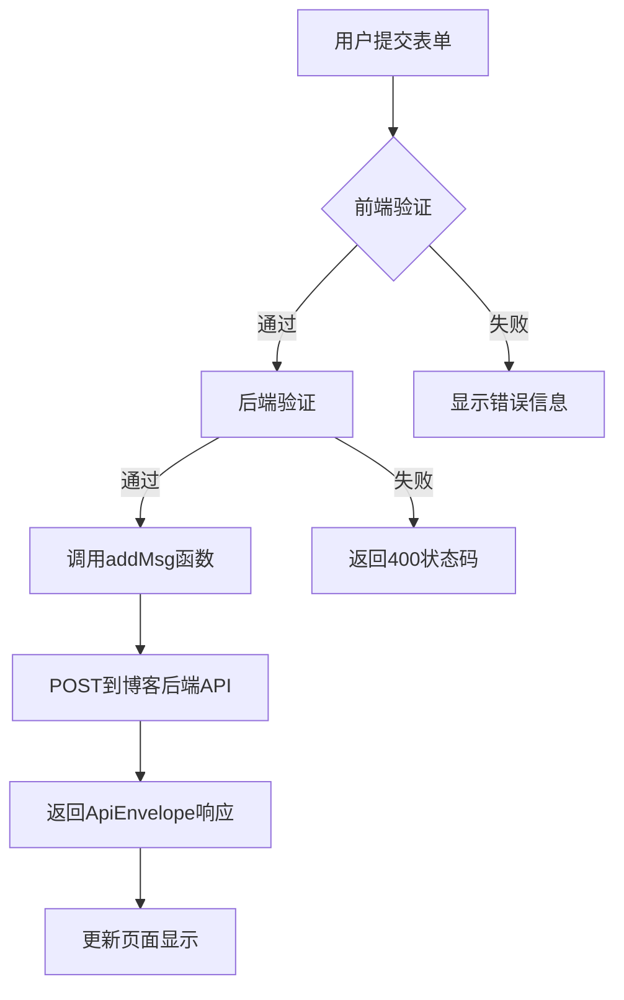
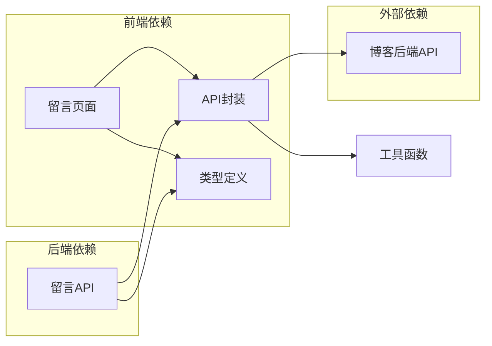

# 留言提交API

<cite>
**本文档引用的文件**
- [api.ts](file://src/lib/api.ts)
- [msg.ts](file://src/pages/api/msg.ts)
- [types.ts](file://src/lib/types.ts)
- [utils.ts](file://src/lib/utils.ts)
- [msg.astro](file://src/pages/msg.astro)
- [comment.ts](file://src/pages/api/comment.ts)
- [reply.ts](file://src/pages/api/reply.ts)
- [login.ts](file://src/pages/api/login.ts)
- [package.json](file://package.json)
- [tsconfig.json](file://tsconfig.json)
</cite>

## 目录
1. [简介](#简介)
2. [项目结构](#项目结构)
3. [核心组件](#核心组件)
4. [架构概览](#架构概览)
5. [详细组件分析](#详细组件分析)
6. [依赖关系分析](#依赖关系分析)
7. [性能考虑](#性能考虑)
8. [故障排除指南](#故障排除指南)
9. [结论](#结论)

## 简介

本文档详细介绍了博客系统的留言提交API，重点分析了`addMsg`函数的完整实现。该API采用前后端分离架构，前端使用Astro框架构建静态页面，后端通过Astro的API路由处理HTTP请求。系统提供了完整的留言功能，包括用户昵称、内容验证、表单数据处理和响应封装。

## 项目结构

该项目采用模块化架构设计，主要分为以下几个层次：



**图表来源**
- [api.ts:1-91](file://src/lib/api.ts#L1-L91)
- [msg.ts:1-16](file://src/pages/api/msg.ts#L1-L16)

**章节来源**
- [package.json:1-19](file://package.json#L1-L19)
- [tsconfig.json:1-11](file://tsconfig.json#L1-L11)

## 核心组件

### API封装层

API封装层提供了统一的HTTP请求处理机制，包括URL构建、请求发送和响应处理。核心功能包括：

- **基础URL配置**：支持环境变量配置，提供默认回退地址
- **URL参数处理**：动态构建查询参数，自动处理空值过滤
- **通用请求处理**：统一的fetch封装，包含错误处理和JSON解析
- **表单POST处理**：专门的postForm函数，处理URL编码和Content-Type设置

### 类型系统

系统定义了完整的类型体系，确保前后端数据传输的一致性：

- **ApiEnvelope<T>**：统一的响应包装器，包含结果数据和消息
- **BlogMessage**：留言实体模型，包含用户信息、内容和时间戳
- **PaginationResult<T>**：分页结果模型，支持数据列表和分页信息

**章节来源**
- [api.ts:1-91](file://src/lib/api.ts#L1-L91)
- [types.ts:1-54](file://src/lib/types.ts#L1-L54)

## 架构概览

留言提交API采用典型的三层架构模式：



**图表来源**
- [msg.astro:90-107](file://src/pages/msg.astro#L90-L107)
- [msg.ts:4-15](file://src/pages/api/msg.ts#L4-L15)
- [api.ts:80-82](file://src/lib/api.ts#L80-L82)

## 详细组件分析

### addMsg函数实现

`addMsg`函数是留言提交的核心实现，位于API封装层中：

#### 函数签名和参数
```typescript
export function addMsg(data: { username: string; content: string })
```

该函数接收一个包含用户名和内容的对象作为参数，返回Promise类型的ApiEnvelope响应。

#### 实现细节

1. **参数传递**：直接将传入的数据对象传递给`postForm`函数
2. **URL构建**：目标路径为`/blogapi/msg/add`
3. **响应类型**：期望返回`ApiEnvelope<{ status: boolean; msg?: string }>`类型

#### 调用链路



**图表来源**
- [api.ts:80-82](file://src/lib/api.ts#L80-L82)
- [api.ts:43-56](file://src/lib/api.ts#L43-L56)

**章节来源**
- [api.ts:80-82](file://src/lib/api.ts#L80-L82)

### postForm函数通用POST请求处理

`postForm`函数实现了通用的表单数据POST请求处理机制：

#### URL编码机制
- 使用`URLSearchParams`自动处理键值对编码
- 自动过滤undefined和空值，避免无效参数
- 支持字符串和数字类型的自动转换

#### Content-Type设置
- 设置为`application/x-www-form-urlencoded;charset=UTF-8`
- 确保后端能够正确解析表单数据
- 指定UTF-8字符集以支持中文等多字节字符

#### 请求体构造
- 将对象属性转换为键值对格式
- 自动处理特殊字符的URL编码
- 支持嵌套对象的扁平化处理

**章节来源**
- [api.ts:43-56](file://src/lib/api.ts#L43-L56)

### 留言数据验证规则

系统在多个层面实施了数据验证，确保数据的完整性和安全性：

#### 前端验证（msg.astro）
- **内容长度验证**：最大400字符，防止过长内容
- **用户名长度验证**：最大10字符，限制昵称长度
- **必填字段检查**：内容字段为必填项
- **默认值处理**：用户名为空时自动设置为"东方三侠"

#### 后端验证（msg.ts）
- **内容长度验证**：最大400字符，与前端保持一致
- **用户名长度验证**：最大10字符，防止恶意超长输入
- **必填字段检查**：内容必须存在且非空
- **默认值处理**：用户名为空时设置默认值

#### 验证流程图



**图表来源**
- [msg.astro:96-100](file://src/pages/msg.astro#L96-L100)
- [msg.ts:9-11](file://src/pages/api/msg.ts#L9-L11)

**章节来源**
- [msg.astro:96-100](file://src/pages/msg.astro#L96-L100)
- [msg.ts:9-11](file://src/pages/api/msg.ts#L9-L11)

### 响应处理逻辑

系统采用统一的响应处理机制，确保前后端交互的一致性：

#### ApiEnvelope包装
- **result字段**：包含实际业务数据
- **message字段**：可选的描述性信息
- **标准化格式**：所有API响应都遵循相同结构

#### 状态码检查
- **成功响应**：HTTP 200状态码，包含ApiEnvelope包装
- **验证失败**：HTTP 400状态码，返回错误信息
- **服务器错误**：HTTP 500状态码，返回通用错误

#### 错误信息提取
- **前端处理**：从result.msg字段提取用户友好的错误信息
- **后端处理**：统一的错误响应格式，便于调试和监控

**章节来源**
- [types.ts:1-4](file://src/lib/types.ts#L1-L4)
- [msg.ts:10-14](file://src/pages/api/msg.ts#L10-L14)

### 使用示例

#### 基本调用方式

```javascript
// 前端JavaScript示例
const formData = new FormData();
formData.append('username', '张三');
formData.append('content', '这是一条测试留言');

try {
    const response = await fetch('/api/msg', {
        method: 'POST',
        body: formData
    });
    
    const result = await response.json();
    if (result.result.status) {
        // 成功处理
        window.location.reload();
    } else {
        // 错误处理
        console.error('提交失败:', result.result.msg);
    }
} catch (error) {
    console.error('网络错误:', error);
}
```

#### 参数格式要求
- **username**：字符串类型，最大10字符，可选但建议提供
- **content**：字符串类型，最大400字符，必填项
- **Content-Type**：application/x-www-form-urlencoded

#### 错误处理策略
- **网络错误**：捕获fetch异常，显示友好提示
- **验证错误**：根据result.msg字段显示具体错误原因
- **重试机制**：建议实现简单的重试逻辑

**章节来源**
- [msg.astro:90-107](file://src/pages/msg.astro#L90-L107)

## 依赖关系分析

### 组件耦合度分析



**图表来源**
- [api.ts:1-91](file://src/lib/api.ts#L1-L91)
- [msg.ts:1-16](file://src/pages/api/msg.ts#L1-L16)

### 关键依赖关系

1. **API封装依赖**：所有API路由都依赖于统一的API封装层
2. **类型系统依赖**：前后端共享类型定义，确保数据一致性
3. **工具函数依赖**：API封装层依赖工具函数进行数据处理
4. **环境配置依赖**：API基础URL依赖环境变量配置

**章节来源**
- [api.ts:11-15](file://src/lib/api.ts#L11-L15)
- [types.ts:1-54](file://src/lib/types.ts#L1-L54)

## 性能考虑

### 请求优化策略

1. **缓存机制**：API封装层未实现请求缓存，建议在高频访问场景下添加适当的缓存策略
2. **连接复用**：使用浏览器内置的HTTP连接池，避免频繁建立连接
3. **数据压缩**：后端API支持Gzip压缩，前端无需额外处理

### 内存管理

1. **FormData处理**：前端使用FormData对象，自动管理内存分配和释放
2. **响应处理**：统一的JSON解析机制，避免内存泄漏
3. **错误处理**：完善的异常捕获，防止内存泄漏

### 网络优化

1. **请求合并**：当前API设计支持单次请求完成，无需请求合并
2. **超时控制**：建议在fetch请求中添加超时机制
3. **重试策略**：实现指数退避的重试机制

## 故障排除指南

### 常见问题诊断

#### 验证失败问题
- **症状**：返回400状态码，错误信息为"动态内容不合法"
- **原因**：内容为空、超过长度限制或用户名超长
- **解决方案**：检查前端验证逻辑，确保数据符合要求

#### 网络连接问题
- **症状**：fetch异常，控制台显示网络错误
- **原因**：API基础URL配置错误或网络连接问题
- **解决方案**：检查环境变量配置，验证网络连接

#### 数据格式问题
- **症状**：后端无法解析表单数据
- **原因**：Content-Type设置错误或数据格式不正确
- **解决方案**：确认使用FormData对象和正确的Content-Type

### 调试技巧

1. **浏览器开发者工具**：使用Network标签监控请求和响应
2. **控制台日志**：添加详细的错误日志输出
3. **后端日志**：检查API路由的错误处理日志
4. **环境变量**：验证API基础URL配置是否正确

**章节来源**
- [msg.ts:10-14](file://src/pages/api/msg.ts#L10-L14)
- [api.ts:37-40](file://src/lib/api.ts#L37-L40)

## 结论

留言提交API展现了现代Web应用的良好实践，具有以下特点：

### 设计优势
- **模块化架构**：清晰的分层设计，职责分离明确
- **类型安全**：完整的TypeScript类型定义，编译时类型检查
- **统一接口**：标准化的响应格式，便于前端处理
- **前后端验证**：双重验证机制，提高数据质量

### 安全考虑
- **输入验证**：严格的长度和格式验证
- **默认值处理**：防止空值导致的安全问题
- **错误处理**：优雅的错误处理机制，避免信息泄露

### 改进建议
1. **增加CSRF保护**：为表单提交添加CSRF令牌验证
2. **实现速率限制**：防止恶意刷屏行为
3. **内容过滤**：添加HTML标签过滤，防止XSS攻击
4. **缓存策略**：为频繁访问的API添加缓存机制

该API为博客系统的留言功能提供了稳定可靠的技术基础，通过合理的架构设计和严格的质量控制，确保了良好的用户体验和系统稳定性。