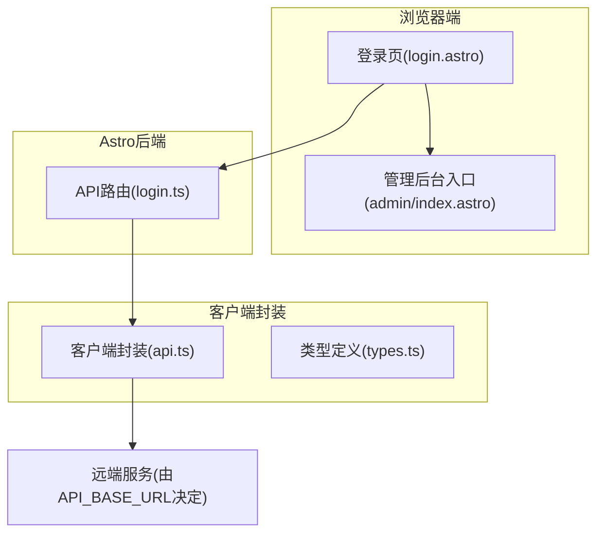
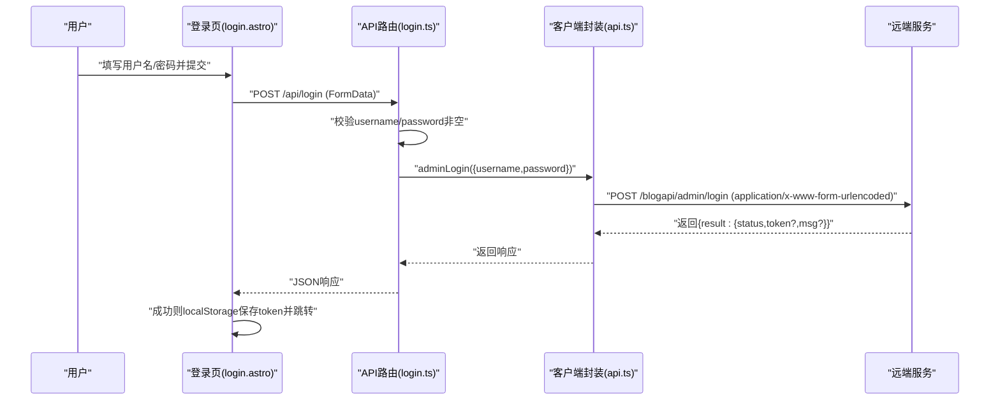
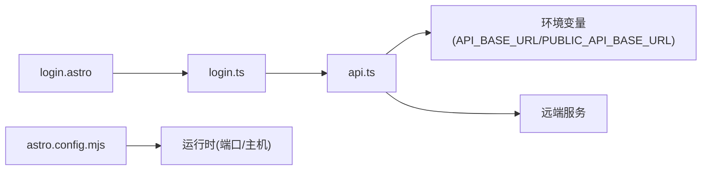

# 管理员认证API

<cite>
**本文引用的文件**
- [src/pages/api/login.ts](file://src/pages/api/login.ts)
- [src/pages/login.astro](file://src/pages/login.astro)
- [src/lib/api.ts](file://src/lib/api.ts)
- [src/lib/types.ts](file://src/lib/types.ts)
- [src/pages/admin/index.astro](file://src/pages/admin/index.astro)
- [package.json](file://package.json)
- [astro.config.mjs](file://astro.config.mjs)
- [src/env.d.ts](file://src/env.d.ts)
</cite>

## 目录
1. [简介](#简介)
2. [项目结构](#项目结构)
3. [核心组件](#核心组件)
4. [架构总览](#架构总览)
5. [详细组件分析](#详细组件分析)
6. [依赖关系分析](#依赖关系分析)
7. [性能考量](#性能考量)
8. [故障排查指南](#故障排查指南)
9. [结论](#结论)
10. [附录](#附录)

## 简介
本文件面向管理员认证API，聚焦于管理员登录与权限验证机制。当前仓库实现了从前端表单提交到后端API路由处理、再到远程服务调用的完整链路：用户在登录页输入凭据，前端通过表单数据提交至后端路由，后端路由调用统一的客户端封装函数完成对远端“管理员登录”接口的请求，并将返回的令牌持久化到本地存储，随后跳转至管理后台。

需要特别说明的是：该实现采用“前端直连远端服务”的模式，而非在后端内部进行密码校验或签发令牌。因此，本文件将重点阐述前端到远端服务的交互流程、令牌存储与使用方式、以及在现有架构下如何补充完善安全机制（例如HTTPS、CSRF、暴力破解防护等）。

## 项目结构
围绕认证的关键文件与职责如下：
- 登录页面与交互逻辑：负责收集用户名与密码，提交表单并处理响应，成功后写入本地存储并跳转。
- 后端API路由：接收表单数据，进行基础参数校验，转发给统一的客户端封装函数。
- 客户端封装：提供统一的URL构建、请求封装与表单提交方法，集中暴露各业务API函数（含管理员登录）。
- 类型定义：定义通用响应包装器与分页结果等类型，确保前后端契约一致。
- 管理后台入口：展示管理功能卡片，作为登录成功后的目标页面。

图表来源
- [src/pages/login.astro:1-55](file://src/pages/login.astro#L1-L55)
- [src/pages/api/login.ts:1-16](file://src/pages/api/login.ts#L1-L16)
- [src/lib/api.ts:1-91](file://src/lib/api.ts#L1-L91)
- [src/lib/types.ts:1-54](file://src/lib/types.ts#L1-L54)
- [src/pages/admin/index.astro:1-30](file://src/pages/admin/index.astro#L1-L30)

章节来源
- [src/pages/login.astro:1-55](file://src/pages/login.astro#L1-L55)
- [src/pages/api/login.ts:1-16](file://src/pages/api/login.ts#L1-L16)
- [src/lib/api.ts:1-91](file://src/lib/api.ts#L1-L91)
- [src/lib/types.ts:1-54](file://src/lib/types.ts#L1-L54)
- [src/pages/admin/index.astro:1-30](file://src/pages/admin/index.astro#L1-L30)

## 核心组件
- 登录页面与表单处理
  - 负责渲染登录表单，绑定提交事件，阻止默认跳转，构造FormData并调用后端API路由。
  - 成功时将远端返回的令牌存入localStorage，并重定向到管理后台；失败时显示错误提示。
- 后端API路由
  - 接收请求，解析表单数据，执行非空校验，调用客户端封装函数发起登录请求，并返回统一格式的JSON响应。
- 客户端封装
  - 提供统一的URL拼装、请求封装与表单提交方法；集中导出各业务API函数，其中包含管理员登录。
  - 通过环境变量决定远端服务基地址，支持运行时覆盖。
- 类型定义
  - 统一响应包装器与分页结果等类型，保证前后端契约一致。
- 管理后台入口
  - 展示管理功能入口卡片，作为登录成功后的访问目标。

章节来源
- [src/pages/login.astro:34-54](file://src/pages/login.astro#L34-L54)
- [src/pages/api/login.ts:4-15](file://src/pages/api/login.ts#L4-L15)
- [src/lib/api.ts:11-15](file://src/lib/api.ts#L11-L15)
- [src/lib/api.ts:43-56](file://src/lib/api.ts#L43-L56)
- [src/lib/api.ts:88-90](file://src/lib/api.ts#L88-L90)
- [src/lib/types.ts:1-13](file://src/lib/types.ts#L1-L13)
- [src/pages/admin/index.astro:4-11](file://src/pages/admin/index.astro#L4-L11)

## 架构总览
下图展示了从用户提交到远端服务、再到前端处理与存储的完整流程：

图表来源
- [src/pages/login.astro:34-54](file://src/pages/login.astro#L34-L54)
- [src/pages/api/login.ts:4-15](file://src/pages/api/login.ts#L4-L15)
- [src/lib/api.ts:43-56](file://src/lib/api.ts#L43-L56)
- [src/lib/api.ts:88-90](file://src/lib/api.ts#L88-L90)

## 详细组件分析

### 登录页面(login.astro)
- 表单字段
  - 用户名与密码为必填项，分别对应表单字段name为username与password。
- 事件处理
  - 阻止默认提交行为，构造FormData，调用后端路由。
  - 解析响应，若状态为成功则将token写入localStorage并跳转到管理后台；否则更新提示信息显示错误原因。
- 安全注意
  - 当前未启用CSRF防护；建议在生产环境增加CSRF令牌与同源策略限制。
  - 密码传输为明文表单提交，建议配合HTTPS使用。

章节来源
- [src/pages/login.astro:14-27](file://src/pages/login.astro#L14-L27)
- [src/pages/login.astro:34-54](file://src/pages/login.astro#L34-L54)

### 后端API路由(login.ts)
- 参数校验
  - 对username与password进行非空校验，任一为空直接返回400与错误消息。
- 请求转发
  - 调用客户端封装函数adminLogin，传入用户名与密码。
- 响应格式
  - 返回统一的JSON结构，包含result.status与可选的result.msg或result.token。

章节来源
- [src/pages/api/login.ts:4-15](file://src/pages/api/login.ts#L4-L15)

### 客户端封装(api.ts)
- 基础配置
  - 通过环境变量API_BASE_URL或PUBLIC_API_BASE_URL确定远端服务基地址，默认值指向示例域名。
- URL构建
  - 支持查询参数拼接，去除末尾斜杠，保证路径正确。
- 请求封装
  - 统一封装fetch调用，自动设置Accept头，处理非OK响应与异常捕获。
- 表单提交
  - 将键值对转换为URLSearchParams，设置Content-Type为application/x-www-form-urlencoded，便于后端解析。
- 管理员登录
  - 暴露adminLogin函数，向/blogapi/admin/login发送POST请求，返回统一响应包装器。

章节来源
- [src/lib/api.ts:11-15](file://src/lib/api.ts#L11-L15)
- [src/lib/api.ts:17-23](file://src/lib/api.ts#L17-L23)
- [src/lib/api.ts:25-41](file://src/lib/api.ts#L25-L41)
- [src/lib/api.ts:43-56](file://src/lib/api.ts#L43-L56)
- [src/lib/api.ts:88-90](file://src/lib/api.ts#L88-L90)

### 类型定义(types.ts)
- ApiEnvelope
  - 通用响应包装器，包含result与message字段，用于承载业务响应体与可选消息。
- 分页结果
  - 包含状态、数据数组、分页信息等字段，用于列表类接口的统一结构。

章节来源
- [src/lib/types.ts:1-4](file://src/lib/types.ts#L1-L4)
- [src/lib/types.ts:6-13](file://src/lib/types.ts#L6-L13)

### 管理后台入口(admin/index.astro)
- 功能入口
  - 展示多个管理功能卡片，作为登录成功后的访问目标。
- 与认证的关系
  - 该页面本身不参与认证逻辑，但作为受保护资源，通常需要在前端或后端侧进行访问控制。

章节来源
- [src/pages/admin/index.astro:4-11](file://src/pages/admin/index.astro#L4-L11)
- [src/pages/admin/index.astro:13-28](file://src/pages/admin/index.astro#L13-L28)

## 依赖关系分析
- 前端到后端
  - 登录页通过fetch调用后端路由，路由再调用客户端封装。
- 客户端到远端
  - 客户端封装根据基地址与路径组合最终URL，向远端服务发起请求。
- 配置与运行
  - Astro以SSR输出模式运行，使用Node适配器，端口与主机在配置文件中设定。

图表来源
- [src/pages/login.astro:44-44](file://src/pages/login.astro#L44-L44)
- [src/pages/api/login.ts:2-2](file://src/pages/api/login.ts#L2-L2)
- [src/lib/api.ts:11-15](file://src/lib/api.ts#L11-L15)
- [astro.config.mjs:4-13](file://astro.config.mjs#L4-L13)

章节来源
- [src/pages/login.astro:44-44](file://src/pages/login.astro#L44-L44)
- [src/pages/api/login.ts:2-2](file://src/pages/api/login.ts#L2-L2)
- [src/lib/api.ts:11-15](file://src/lib/api.ts#L11-L15)
- [astro.config.mjs:4-13](file://astro.config.mjs#L4-L13)

## 性能考量
- 请求开销
  - 登录流程涉及一次表单提交与一次远程请求，网络延迟为主要瓶颈。
- 缓存策略
  - 当前未实现请求缓存；可在客户端封装层引入轻量缓存或条件请求以减少重复调用。
- 错误处理
  - 客户端封装对非OK响应与异常进行了捕获与降级处理，避免前端崩溃。

章节来源
- [src/lib/api.ts:25-41](file://src/lib/api.ts#L25-L41)

## 故障排查指南
- 常见问题与定位
  - 空参数导致400：确认前端表单是否正确提交username与password字段。
  - 远端服务不可达：检查环境变量API_BASE_URL/PUBLIC_API_BASE_URL是否正确，确认网络连通性。
  - 登录失败但无明确错误：检查远端服务返回的result.msg字段，或查看浏览器网络面板。
  - 令牌未生效：确认localStorage中是否存在token，以及后续请求是否携带了必要的认证头（当前实现未在其他API中体现令牌传递）。
- 建议的日志与监控
  - 在客户端封装中记录请求URL与状态码，在路由层记录入参与响应摘要，便于快速定位问题。

章节来源
- [src/pages/api/login.ts:9-11](file://src/pages/api/login.ts#L9-L11)
- [src/lib/api.ts:37-40](file://src/lib/api.ts#L37-L40)

## 结论
本认证实现采用“前端直连远端服务”的模式，简化了后端逻辑，但同时也要求远端服务承担密码校验与令牌签发职责。前端侧通过表单提交、响应解析与本地存储完成登录闭环。为提升安全性与稳定性，建议在远端服务侧完善密码加密、Token签发与校验、会话超时与刷新机制，并在前端侧补齐HTTPS、CSRF防护与暴力破解防护等措施。

## 附录

### 登录流程示例（步骤说明）
- 前端表单处理
  - 用户在登录页填写用户名与密码，提交后阻止默认跳转，构造FormData并调用后端路由。
- 后端验证
  - 路由对参数进行非空校验，调用客户端封装发起登录请求。
- Token存储
  - 登录成功后，前端将远端返回的token写入localStorage，并跳转到管理后台。

章节来源
- [src/pages/login.astro:34-54](file://src/pages/login.astro#L34-L54)
- [src/pages/api/login.ts:4-15](file://src/pages/api/login.ts#L4-L15)
- [src/lib/api.ts:88-90](file://src/lib/api.ts#L88-L90)

### 安全最佳实践（建议）
- 强制HTTPS
  - 所有认证与敏感操作必须通过HTTPS传输，防止凭据被窃听。
- CSRF防护
  - 在表单中加入CSRF令牌，并在后端校验来源与令牌有效性。
- 暴力破解防护
  - 实施登录频率限制、账户锁定策略与验证码机制。
- Token生命周期管理
  - 明确Token有效期、刷新策略与失效处理；在前端定期轮换或主动续期。
- 会话超时处理
  - 在前端检测Token过期并引导重新登录；在后端对过期Token拒绝请求。

[本节为通用安全建议，不直接分析具体文件，故不附加章节来源]