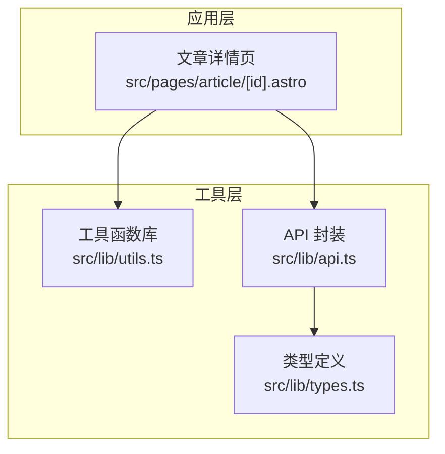
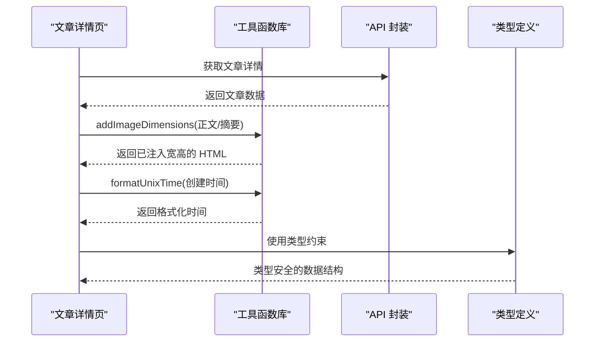
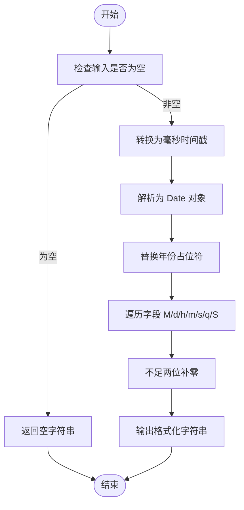
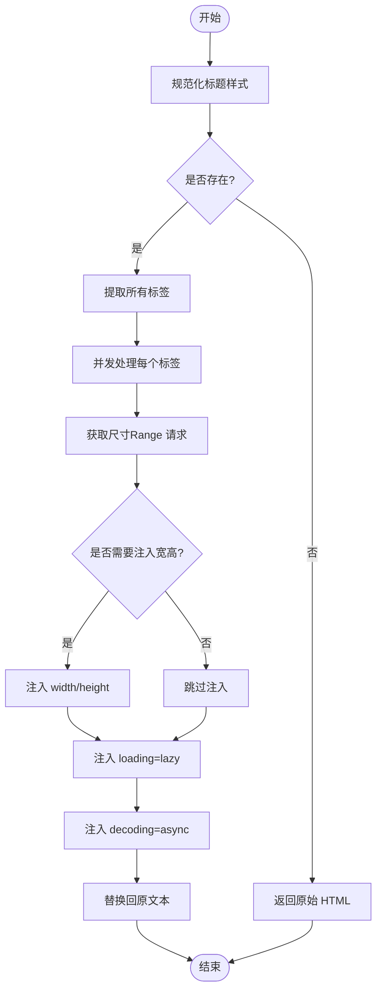
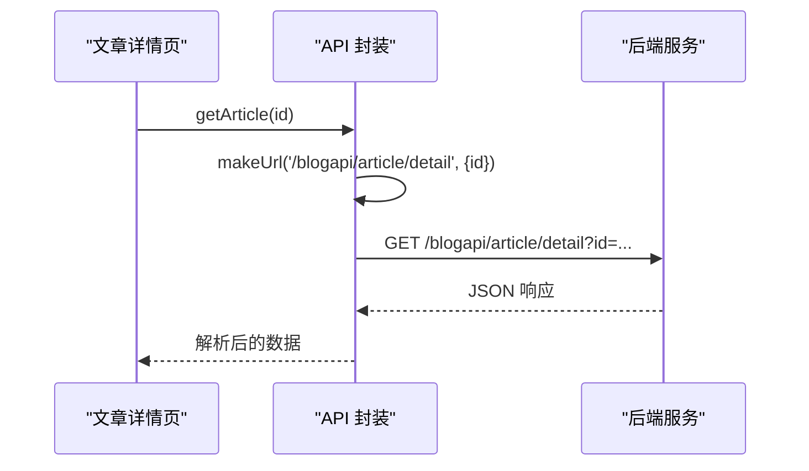
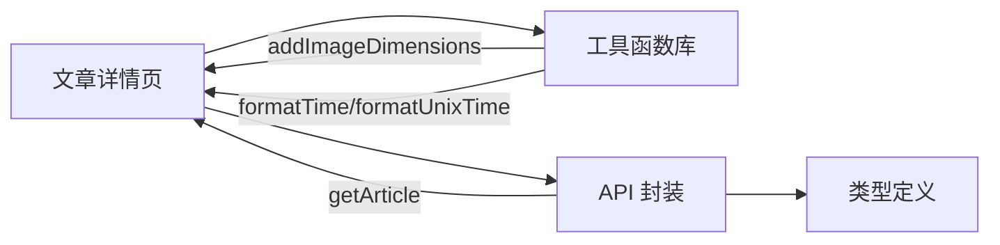

# 工具函数库

<cite>
**本文引用的文件**
- [utils.ts](file://src/lib/utils.ts)
- [api.ts](file://src/lib/api.ts)
- [types.ts](file://src/lib/types.ts)
- [article/[id].astro](file://src/pages/article/[id].astro)
- [package.json](file://package.json)
</cite>

## 目录
1. [简介](#简介)
2. [项目结构](#项目结构)
3. [核心组件](#核心组件)
4. [架构总览](#架构总览)
5. [详细组件分析](#详细组件分析)
6. [依赖关系分析](#依赖关系分析)
7. [性能考量](#性能考量)
8. [故障排查指南](#故障排查指南)
9. [结论](#结论)
10. [附录](#附录)

## 简介
本文件系统性梳理项目中的工具函数库，重点覆盖以下能力：
- 时间处理：时间戳格式化、Unix 秒级时间转换与本地化支持
- 图片处理：动态图片尺寸获取、懒加载与解码优化、CDN 集成建议
- HTML 内容处理：富文本标签规范化、XSS 防护与内容安全策略
- API 辅助：统一请求封装、参数拼装与错误兜底
- 质量保障：使用现状、可扩展性与最佳实践

## 项目结构
工具函数主要位于 src/lib/utils.ts，配合 API 封装 src/lib/api.ts 与类型定义 src/lib/types.ts；在页面层 src/pages/article/[id].astro 中实际调用工具函数进行内容渲染与时间显示。

图表来源
- [article/[id].astro](file://src/pages/article/[id].astro#L1-L17)
- [utils.ts:1-218](file://src/lib/utils.ts#L1-L218)
- [api.ts:1-91](file://src/lib/api.ts#L1-L91)
- [types.ts:1-54](file://src/lib/types.ts#L1-L54)

章节来源
- [article/[id].astro](file://src/pages/article/[id].astro#L1-L17)
- [utils.ts:1-218](file://src/lib/utils.ts#L1-L218)
- [api.ts:1-91](file://src/lib/api.ts#L1-L91)
- [types.ts:1-54](file://src/lib/types.ts#L1-L54)

## 核心组件
- 时间处理工具
  - formatTime：将毫秒级时间戳按指定模板格式化为本地化字符串
  - formatUnixTime：将秒级 Unix 时间转换为毫秒后格式化
  - 支持多字段占位符（年、月、日、时、分、秒、季度、毫秒）
- 图片处理工具
  - addImageDimensions：对 HTML 中的 img 标签进行稳定化处理（自动注入宽高、懒加载、异步解码），并规范化标题样式
  - fetchImageSize：通过 Range 请求前 65KB 字节，解析 PNG/GIF/JPEG/WebP 的尺寸信息，并带缓存与超时控制
- HTML 内容处理工具
  - normalizeRichTextHeadings：移除 h1-h6 标签的内联样式属性，保持语义化与一致性
  - stabilizeImageTag：组合上述能力，对单个 img 标签进行属性增强
- API 辅助
  - apiBaseUrl：基于环境变量或默认地址生成 API 基础路径
  - request/postForm：统一请求封装，含参数拼装、JSON 解析与错误日志输出
  - 文章、留言、评论等接口方法

章节来源
- [utils.ts:1-218](file://src/lib/utils.ts#L1-L218)
- [api.ts:1-91](file://src/lib/api.ts#L1-L91)
- [types.ts:1-54](file://src/lib/types.ts#L1-L54)

## 架构总览
工具函数在页面渲染阶段被调用，先对富文本进行图片维度稳定化与标题样式规范化，再对时间戳进行格式化展示；API 层负责统一请求与数据结构约束。

图表来源
- [article/[id].astro](file://src/pages/article/[id].astro#L1-L17)
- [utils.ts:208-218](file://src/lib/utils.ts#L208-L218)
- [api.ts:58-64](file://src/lib/api.ts#L58-L64)
- [types.ts:15-28](file://src/lib/types.ts#L15-L28)

## 详细组件分析

### 时间处理工具
- 函数：formatTime(timestamp, format)
  - 参数
    - timestamp：数字或字符串形式的时间戳（毫秒）
    - format：日期格式模板，默认“yyyy年MM月dd日”
  - 行为
    - 将输入转换为 Date 对象
    - 按模板替换 y、M、d、h、m、s、q、S 等占位符
    - 年份按模板长度截取，其他字段不足两位补零
  - 返回值：格式化后的字符串
  - 典型用途：文章创建时间、评论时间等本地化展示
- 函数：formatUnixTime(unixTime?, format)
  - 参数
    - unixTime：秒级 Unix 时间（可选）
    - format：日期格式模板
  - 行为
    - 若未提供 unixTime，返回空字符串
    - 否则乘以 1000 转换为毫秒后调用 formatTime
  - 返回值：格式化后的字符串
  - 典型用途：服务端返回秒级时间戳的统一展示

图表来源
- [utils.ts:1-26](file://src/lib/utils.ts#L1-L26)

章节来源
- [utils.ts:1-31](file://src/lib/utils.ts#L1-L31)
- [article/[id].astro](file://src/pages/article/[id].astro#L16-L47)

### 图片处理工具
- 函数：addImageDimensions(html)
  - 参数
    - html：富文本字符串
  - 行为
    - 先规范化标题样式（移除 h1-h6 的 style 属性）
    - 若不存在 img 标签，直接返回原 HTML
    - 提取所有 img 标签，异步并发处理每个标签
    - 对每个标签执行 stabilizeImageTag：若缺少 width/height，则尝试获取尺寸并注入；同时添加 loading=lazy、decoding=async
  - 返回值：处理后的 HTML 字符串
- 函数：fetchImageSize(src)
  - 参数
    - src：图片 URL
  - 行为
    - 校验 URL 协议（http/https），非法则返回 null
    - 使用 Map 缓存：避免重复请求；若已有进行中的请求，直接返回该 Promise
    - 发送 Range: bytes=0-65535 请求，限制首包大小
    - 超时控制（3 秒）与异常捕获
    - 解析字节流为 ImageSize（PNG/GIF/JPEG/WebP）
  - 返回值：尺寸对象或 null
- 函数：stabilizeImageTag(tag)
  - 参数
    - tag：单个 img 标签字符串
  - 行为
    - 读取 src 属性，若缺少 width/height 则调用 fetchImageSize 获取
    - 成功获取尺寸后注入 width/height
    - 注入 loading=lazy、decoding=async
  - 返回值：增强后的 img 标签字符串
- 函数：normalizeRichTextHeadings(html)
  - 行为：移除 h1-h6 标签的 style 属性，保持语义化一致

图表来源
- [utils.ts:204-218](file://src/lib/utils.ts#L204-L218)
- [utils.ts:132-168](file://src/lib/utils.ts#L132-L168)
- [utils.ts:188-202](file://src/lib/utils.ts#L188-L202)

章节来源
- [utils.ts:208-218](file://src/lib/utils.ts#L208-L218)
- [utils.ts:132-168](file://src/lib/utils.ts#L132-L168)
- [utils.ts:188-202](file://src/lib/utils.ts#L188-L202)
- [utils.ts:204-206](file://src/lib/utils.ts#L204-L206)
- [article/[id].astro](file://src/pages/article/[id].astro#L11-L12)

### HTML 内容处理工具
- normalizeRichTextHeadings(html)
  - 作用：移除 h1-h6 标签的 style 属性，确保标题语义化且样式由主题统一管理
- stabilizeImageTag(tag)
  - 作用：对单个 img 标签进行属性增强，提升渲染性能与用户体验
- addImageDimensions(html)
  - 作用：对整段富文本进行批量处理，实现“无侵入”的性能优化与一致性

章节来源
- [utils.ts:204-206](file://src/lib/utils.ts#L204-L206)
- [utils.ts:188-202](file://src/lib/utils.ts#L188-L202)
- [utils.ts:208-218](file://src/lib/utils.ts#L208-L218)

### API 辅助
- 基础配置
  - apiBaseUrl：优先读取环境变量 API_BASE_URL 或 PUBLIC_API_BASE_URL，否则使用默认地址，末尾去除斜杠
- 统一请求
  - request(path, init?, params?): 自动拼接查询参数、设置 Accept: application/json、解析 JSON、捕获错误并记录日志
  - postForm(path, data): 将键值对序列化为 URLSearchParams，设置 Content-Type 为 application/x-www-form-urlencoded;charset=UTF-8
- 接口方法
  - getArticleList(curpage): 获取文章列表
  - getArticle(id): 获取文章详情
  - getMsgList(curpage): 获取留言列表
  - addArticleComment(data): 添加文章评论
  - addMsg(data): 添加留言
  - addReplyMsg(data): 回复留言
  - adminLogin(data): 管理员登录

图表来源
- [api.ts:58-64](file://src/lib/api.ts#L58-L64)
- [article/[id].astro](file://src/pages/article/[id].astro#L8-L11)

章节来源
- [api.ts:11-15](file://src/lib/api.ts#L11-L15)
- [api.ts:17-23](file://src/lib/api.ts#L17-L23)
- [api.ts:25-41](file://src/lib/api.ts#L25-L41)
- [api.ts:43-56](file://src/lib/api.ts#L43-L56)
- [api.ts:58-64](file://src/lib/api.ts#L58-L64)
- [api.ts:66-68](file://src/lib/api.ts#L66-L68)
- [api.ts:70-82](file://src/lib/api.ts#L70-L82)
- [api.ts:84-90](file://src/lib/api.ts#L84-L90)

## 依赖关系分析
- 页面层依赖工具函数库与 API 封装
- 工具函数库内部模块化良好，图片处理与 HTML 处理相互协作
- API 封装依赖类型定义，确保返回数据结构的类型安全

图表来源
- [article/[id].astro](file://src/pages/article/[id].astro#L1-L17)
- [utils.ts:1-218](file://src/lib/utils.ts#L1-L218)
- [api.ts:1-91](file://src/lib/api.ts#L1-L91)
- [types.ts:1-54](file://src/lib/types.ts#L1-L54)

章节来源
- [article/[id].astro](file://src/pages/article/[id].astro#L1-L17)
- [utils.ts:1-218](file://src/lib/utils.ts#L1-L218)
- [api.ts:1-91](file://src/lib/api.ts#L1-L91)
- [types.ts:1-54](file://src/lib/types.ts#L1-L54)

## 性能考量
- 图片处理
  - Range 请求限制首包大小，降低网络开销
  - 并发处理多个 img 标签，提升整体吞吐
  - 缓存机制避免重复请求同一 URL
  - 懒加载与异步解码减少主线程阻塞
- 时间处理
  - 模板化格式化，避免重复计算
  - 秒级时间转毫秒仅在必要时进行
- API 请求
  - 统一 Accept 与 Content-Type，减少不必要的头部协商
  - 错误捕获与日志记录，便于定位问题

章节来源
- [utils.ts:132-168](file://src/lib/utils.ts#L132-L168)
- [utils.ts:188-202](file://src/lib/utils.ts#L188-L202)
- [utils.ts:208-218](file://src/lib/utils.ts#L208-L218)
- [api.ts:25-41](file://src/lib/api.ts#L25-L41)

## 故障排查指南
- 图片无法注入尺寸
  - 检查图片 URL 是否为 http/https 协议
  - 确认网络可达且服务器支持 Range 请求
  - 查看控制台是否有超时或异常日志
- 懒加载未生效
  - 确认 img 标签未被外部样式覆盖
  - 检查浏览器对 loading/lazy 的兼容性
- 时间显示异常
  - 确认传入的是毫秒级时间戳或提供秒级时间并使用 formatUnixTime
  - 检查模板占位符是否正确（y/M/d/h/m/s/q/S）

章节来源
- [utils.ts:132-168](file://src/lib/utils.ts#L132-L168)
- [utils.ts:188-202](file://src/lib/utils.ts#L188-L202)
- [utils.ts:208-218](file://src/lib/utils.ts#L208-L218)
- [article/[id].astro](file://src/pages/article/[id].astro#L16-L47)

## 结论
工具函数库围绕“高性能、低耦合、易扩展”设计，时间处理与图片处理两大模块分别解决前端常见的性能与体验痛点；HTML 内容处理确保富文本的一致性与安全性；API 封装提供统一的请求入口与类型约束。整体架构清晰，易于在项目中推广使用与持续演进。

## 附录

### API 文档（函数级）
- formatTime(timestamp, format='yyyy年MM月dd日')
  - 功能：将毫秒级时间戳按模板格式化
  - 参数
    - timestamp：数字或字符串形式的时间戳（毫秒）
    - format：日期格式模板
  - 返回值：格式化后的字符串
  - 使用示例：参见文章详情页对评论时间的格式化
  - 章节来源
    - [utils.ts:1-26](file://src/lib/utils.ts#L1-L26)
    - [article/[id].astro](file://src/pages/article/[id].astro#L46-L47)
- formatUnixTime(unixTime?, format='yyyy年MM月dd日')
  - 功能：将秒级 Unix 时间转换为毫秒后格式化
  - 参数
    - unixTime：秒级时间戳（可选）
    - format：日期格式模板
  - 返回值：格式化后的字符串
  - 使用示例：参见文章详情页对文章创建时间的格式化
  - 章节来源
    - [utils.ts:28-31](file://src/lib/utils.ts#L28-L31)
    - [article/[id].astro](file://src/pages/article/[id].astro#L16)
- addImageDimensions(html)
  - 功能：对 HTML 中的 img 标签进行稳定化处理（注入宽高、懒加载、异步解码），并规范化标题样式
  - 参数
    - html：富文本字符串
  - 返回值：处理后的 HTML 字符串
  - 使用示例：参见文章详情页对正文与摘要的处理
  - 章节来源
    - [utils.ts:208-218](file://src/lib/utils.ts#L208-L218)
    - [article/[id].astro](file://src/pages/article/[id].astro#L11-L12)
- fetchImageSize(src)
  - 功能：通过 Range 请求获取图片尺寸，支持 PNG/GIF/JPEG/WebP
  - 参数
    - src：图片 URL
  - 返回值：尺寸对象或 null
  - 性能特性：缓存、超时控制、并发去重
  - 章节来源
    - [utils.ts:132-168](file://src/lib/utils.ts#L132-L168)
- stabilizeImageTag(tag)
  - 功能：对单个 img 标签进行属性增强
  - 参数
    - tag：单个 img 标签字符串
  - 返回值：增强后的标签字符串
  - 章节来源
    - [utils.ts:188-202](file://src/lib/utils.ts#L188-L202)
- normalizeRichTextHeadings(html)
  - 功能：移除 h1-h6 标签的 style 属性
  - 参数
    - html：富文本字符串
  - 返回值：处理后的 HTML 字符串
  - 章节来源
    - [utils.ts:204-206](file://src/lib/utils.ts#L204-L206)

### 设计原则与最佳实践
- 设计原则
  - 单一职责：时间处理、图片处理、HTML 处理各自独立
  - 可扩展：新增图片格式解析、时间格式模板只需在对应模块扩展
  - 可观测：API 请求统一错误日志，图片尺寸解析异常安全降级
- 最佳实践
  - 在富文本渲染前调用 addImageDimensions，确保首屏布局稳定
  - 使用 formatUnixTime 统一处理服务端秒级时间戳
  - 为图片提供备用占位图，结合懒加载提升感知性能
  - 对用户输入内容进行 XSS 防护（建议在服务端或引入专用库）

### 质量保证与测试建议
- 当前状态
  - 工具函数在页面层被使用，未发现独立的单元测试文件
- 建议
  - 为 formatTime/formatUnixTime 增加边界用例（空值、非法时间戳、不同模板）
  - 为 addImageDimensions 增加多种 HTML 场景（无 img、多 img、嵌套标签）
  - 为 fetchImageSize 增加网络异常、超时、不支持格式等场景
  - 为 API 封装增加 mock 测试，覆盖 4xx/5xx 场景与错误日志

### 扩展指南与自定义开发建议
- 新增图片格式支持
  - 在 parseImageSize 中新增解析器，遵循现有结构返回 ImageSize 或 null
  - 在 fetchImageSize 中确保 URL 校验与缓存逻辑适用
- 新增时间格式模板
  - 在 formatTime 中扩展占位符映射，注意与 replace 逻辑的兼容
- HTML 安全增强
  - 引入专门的 HTML 清洗库（如 DOMPurify）在服务端或构建期进行清洗
  - 对用户输入的评论内容进行白名单过滤与 CSP 配置
- CDN 集成
  - 在图片 URL 上游接入 CDN，工具函数仍可正常工作
  - 可在 fetchImageSize 前对 URL 进行预处理（如添加 CDN 域名、签名参数）

章节来源
- [utils.ts:128-130](file://src/lib/utils.ts#L128-L130)
- [utils.ts:1-26](file://src/lib/utils.ts#L1-L26)
- [api.ts:1-91](file://src/lib/api.ts#L1-L91)