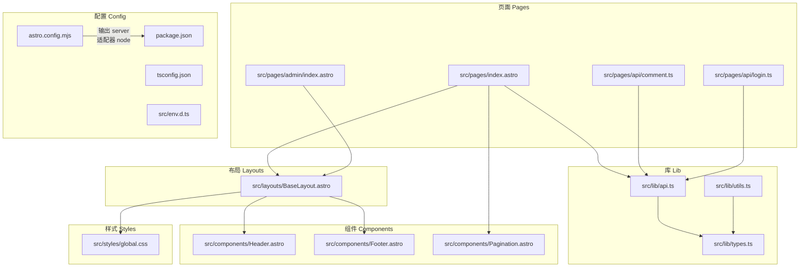
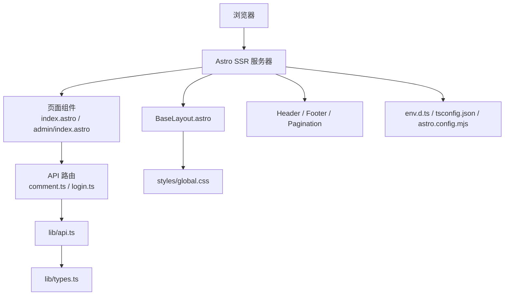
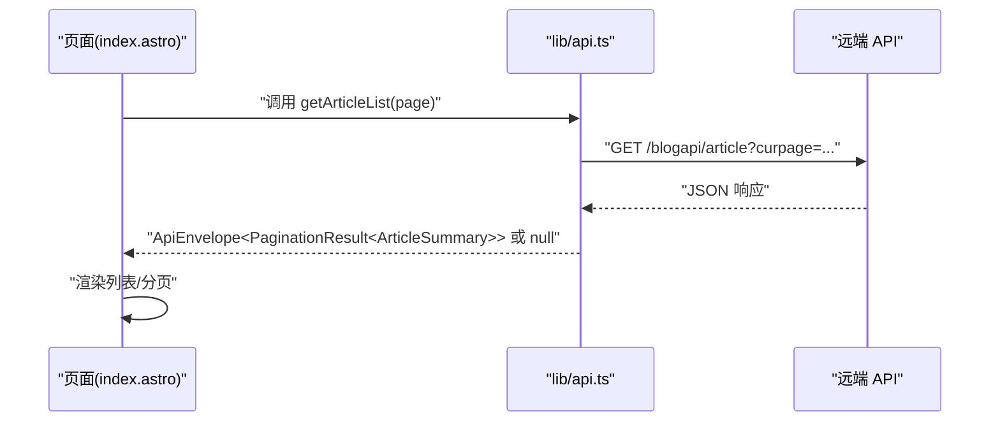
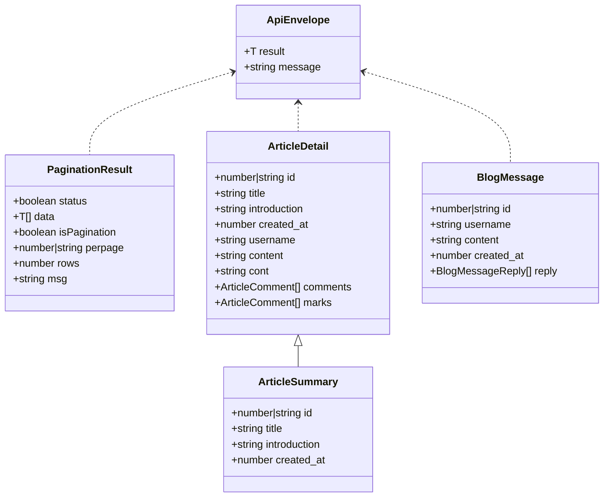
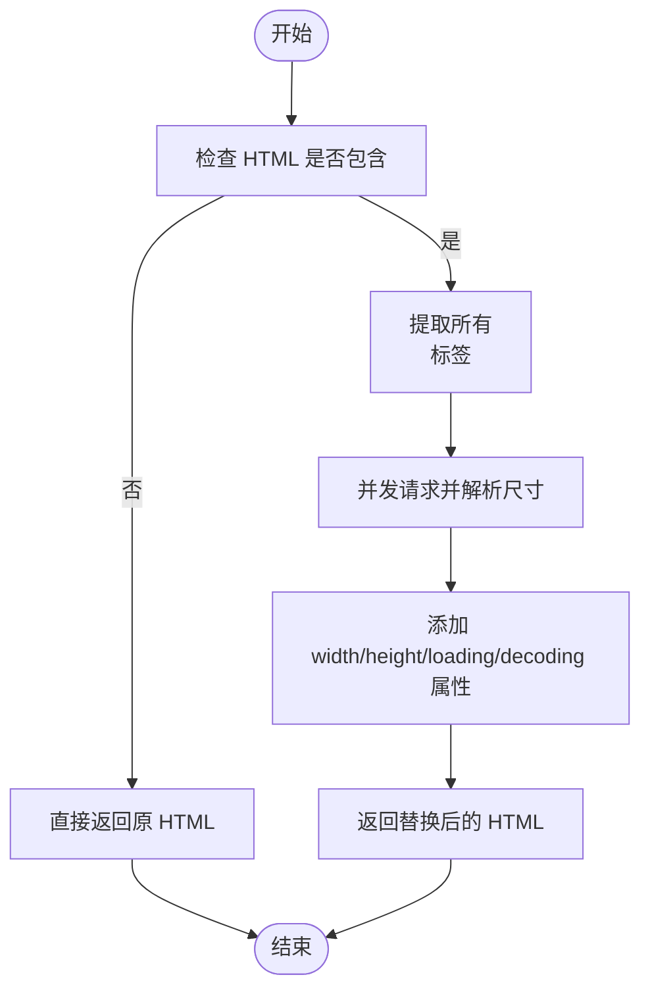
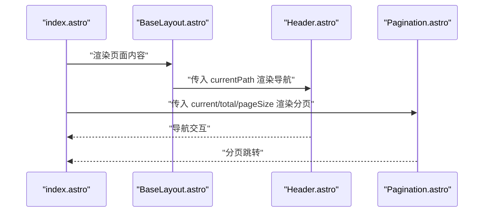
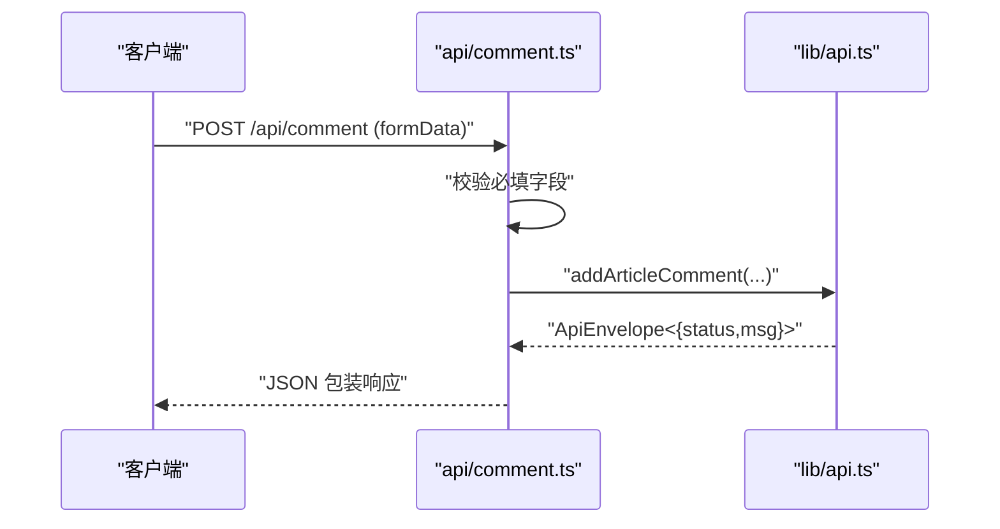
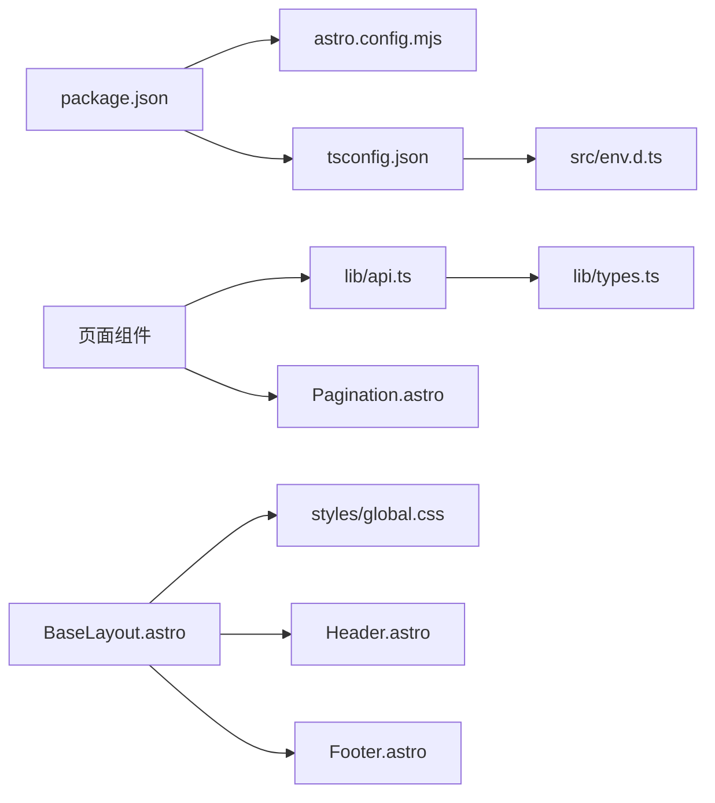

# 开发指南

<cite>
**本文引用的文件**
- [package.json](file://package.json)
- [tsconfig.json](file://tsconfig.json)
- [astro.config.mjs](file://astro.config.mjs)
- [src/lib/api.ts](file://src/lib/api.ts)
- [src/lib/types.ts](file://src/lib/types.ts)
- [src/lib/utils.ts](file://src/lib/utils.ts)
- [src/pages/index.astro](file://src/pages/index.astro)
- [src/layouts/BaseLayout.astro](file://src/layouts/BaseLayout.astro)
- [src/components/Header.astro](file://src/components/Header.astro)
- [src/components/Footer.astro](file://src/components/Footer.astro)
- [src/components/Pagination.astro](file://src/components/Pagination.astro)
- [src/pages/api/comment.ts](file://src/pages/api/comment.ts)
- [src/pages/api/login.ts](file://src/pages/api/login.ts)
- [src/pages/admin/index.astro](file://src/pages/admin/index.astro)
- [src/styles/global.css](file://src/styles/global.css)
- [src/env.d.ts](file://src/env.d.ts)
</cite>

## 目录
1. [简介](#简介)
2. [项目结构](#项目结构)
3. [核心组件](#核心组件)
4. [架构总览](#架构总览)
5. [详细组件分析](#详细组件分析)
6. [依赖关系分析](#依赖关系分析)
7. [性能考量](#性能考量)
8. [调试与开发工具](#调试与开发工具)
9. [代码质量保障](#代码质量保障)
10. [构建与部署](#构建与部署)
11. [常见问题与故障排除](#常见问题与故障排除)
12. [扩展与定制开发建议](#扩展与定制开发建议)
13. [结论](#结论)

## 简介
本开发指南面向使用 Astro 的前端与全栈开发者，围绕本项目的组件开发规范、API 调用最佳实践、TypeScript 集成、调试与性能优化、代码质量保障、构建与部署以及扩展与定制开发等方面，提供系统化、可操作的实践建议。文档以仓库现有实现为依据，结合架构与模块关系，帮助团队在保持一致性的同时提升开发效率与质量。

## 项目结构
项目采用 Astro 的典型目录组织方式，按功能域划分：页面、布局、组件、样式、库（API、类型、工具）与环境声明文件。页面与布局负责展示与结构，组件负责可复用 UI 片段，库模块封装业务逻辑与数据交互，样式集中管理全局主题与响应式规则。

图表来源
- [src/pages/index.astro:1-50](file://src/pages/index.astro#L1-L50)
- [src/pages/admin/index.astro:1-30](file://src/pages/admin/index.astro#L1-L30)
- [src/layouts/BaseLayout.astro:1-42](file://src/layouts/BaseLayout.astro#L1-L42)
- [src/components/Header.astro:1-48](file://src/components/Header.astro#L1-L48)
- [src/components/Footer.astro:1-8](file://src/components/Footer.astro#L1-L8)
- [src/components/Pagination.astro:1-28](file://src/components/Pagination.astro#L1-L28)
- [src/lib/api.ts:1-91](file://src/lib/api.ts#L1-L91)
- [src/lib/types.ts:1-54](file://src/lib/types.ts#L1-L54)
- [src/lib/utils.ts:1-219](file://src/lib/utils.ts#L1-L219)
- [src/styles/global.css:1-233](file://src/styles/global.css#L1-L233)
- [package.json:1-19](file://package.json#L1-L19)
- [tsconfig.json:1-11](file://tsconfig.json#L1-L11)
- [astro.config.mjs:1-14](file://astro.config.mjs#L1-L14)
- [src/env.d.ts:1-3](file://src/env.d.ts#L1-L3)

章节来源
- [package.json:1-19](file://package.json#L1-L19)
- [tsconfig.json:1-11](file://tsconfig.json#L1-L11)
- [astro.config.mjs:1-14](file://astro.config.mjs#L1-L14)

## 核心组件
- 页面层：首页、管理后台、API 路由等，负责数据拉取与渲染。
- 布局层：统一注入头部、底部、全局样式与公共变量。
- 组件层：通用导航、分页、页脚等可复用 UI。
- 库层：API 封装、类型定义、通用工具函数。
- 样式层：CSS 变量、主题与响应式断点。

章节来源
- [src/pages/index.astro:1-50](file://src/pages/index.astro#L1-L50)
- [src/layouts/BaseLayout.astro:1-42](file://src/layouts/BaseLayout.astro#L1-L42)
- [src/components/Header.astro:1-48](file://src/components/Header.astro#L1-L48)
- [src/components/Pagination.astro:1-28](file://src/components/Pagination.astro#L1-L28)
- [src/lib/api.ts:1-91](file://src/lib/api.ts#L1-L91)
- [src/lib/types.ts:1-54](file://src/lib/types.ts#L1-L54)
- [src/lib/utils.ts:1-219](file://src/lib/utils.ts#L1-L219)
- [src/styles/global.css:1-233](file://src/styles/global.css#L1-L233)

## 架构总览
系统采用 Astro SSR（服务端渲染）模式，输出目标为 Node 适配器，支持独立运行时。页面通过 Astro 组件与 API 路由进行数据交互，布局统一注入全局样式与基础信息；库模块提供类型、API 与工具能力，确保跨页面的一致性与可维护性。

图表来源
- [astro.config.mjs:1-14](file://astro.config.mjs#L1-L14)
- [src/pages/index.astro:1-50](file://src/pages/index.astro#L1-L50)
- [src/pages/admin/index.astro:1-30](file://src/pages/admin/index.astro#L1-L30)
- [src/layouts/BaseLayout.astro:1-42](file://src/layouts/BaseLayout.astro#L1-L42)
- [src/components/Header.astro:1-48](file://src/components/Header.astro#L1-L48)
- [src/components/Footer.astro:1-8](file://src/components/Footer.astro#L1-L8)
- [src/components/Pagination.astro:1-28](file://src/components/Pagination.astro#L1-L28)
- [src/pages/api/comment.ts:1-19](file://src/pages/api/comment.ts#L1-L19)
- [src/pages/api/login.ts:1-16](file://src/pages/api/login.ts#L1-L16)
- [src/lib/api.ts:1-91](file://src/lib/api.ts#L1-L91)
- [src/lib/types.ts:1-54](file://src/lib/types.ts#L1-L54)
- [src/styles/global.css:1-233](file://src/styles/global.css#L1-L233)
- [src/env.d.ts:1-3](file://src/env.d.ts#L1-L3)
- [tsconfig.json:1-11](file://tsconfig.json#L1-L11)

## 详细组件分析

### API 层设计与最佳实践
- 统一基地址与环境变量优先级，避免硬编码。
- 请求封装统一处理状态码与异常，返回空值或错误信息，便于上层容错。
- 表单提交使用 URL 编码，统一 Content-Type。
- 明确导出方法职责，如文章列表、详情、消息列表、评论与登录等。

图表来源
- [src/pages/index.astro:1-50](file://src/pages/index.astro#L1-L50)
- [src/lib/api.ts:58-60](file://src/lib/api.ts#L58-L60)

章节来源
- [src/lib/api.ts:1-91](file://src/lib/api.ts#L1-L91)

### 类型系统与接口设计
- 使用统一的包装响应体 ApiEnvelope，承载 result 与 message 字段，便于前后端一致处理。
- 分页结果 PaginationResult 提供状态、数据数组与分页元信息。
- 文章与消息相关接口字段清晰，便于页面消费与校验。

图表来源
- [src/lib/types.ts:1-54](file://src/lib/types.ts#L1-L54)

章节来源
- [src/lib/types.ts:1-54](file://src/lib/types.ts#L1-L54)

### 工具函数与图像尺寸稳定化
- 时间格式化与 Unix 时间转换，支持多种格式模板。
- 网站 URL 规范化，自动补全协议。
- 图片尺寸解析与懒加载、异步解码增强，减少布局抖动与首屏阻塞。
- 富文本标题样式清理与 img 标签属性稳定化，提升渲染一致性。

图表来源
- [src/lib/utils.ts:208-219](file://src/lib/utils.ts#L208-L219)
- [src/lib/utils.ts:132-168](file://src/lib/utils.ts#L132-L168)

章节来源
- [src/lib/utils.ts:1-219](file://src/lib/utils.ts#L1-L219)

### 页面与布局协作
- BaseLayout 注入全局样式与公共变量，控制是否显示头部与底部。
- Header 根据当前路径高亮导航链接，并提供移动端菜单切换。
- Pagination 计算页码集合与分页链接，支持基础路径与页码参数。

图表来源
- [src/pages/index.astro:1-50](file://src/pages/index.astro#L1-L50)
- [src/layouts/BaseLayout.astro:1-42](file://src/layouts/BaseLayout.astro#L1-L42)
- [src/components/Header.astro:1-48](file://src/components/Header.astro#L1-L48)
- [src/components/Pagination.astro:1-28](file://src/components/Pagination.astro#L1-L28)

章节来源
- [src/pages/index.astro:1-50](file://src/pages/index.astro#L1-L50)
- [src/layouts/BaseLayout.astro:1-42](file://src/layouts/BaseLayout.astro#L1-L42)
- [src/components/Header.astro:1-48](file://src/components/Header.astro#L1-L48)
- [src/components/Pagination.astro:1-28](file://src/components/Pagination.astro#L1-L28)

### API 路由与表单处理
- 评论提交与登录路由均从请求中读取表单数据，进行必填校验后调用库层 API 并返回统一包装响应。
- 错误场景返回明确的状态与提示信息，便于前端展示。

图表来源
- [src/pages/api/comment.ts:1-19](file://src/pages/api/comment.ts#L1-L19)
- [src/lib/api.ts:70-78](file://src/lib/api.ts#L70-L78)

章节来源
- [src/pages/api/comment.ts:1-19](file://src/pages/api/comment.ts#L1-L19)
- [src/pages/api/login.ts:1-16](file://src/pages/api/login.ts#L1-L16)
- [src/lib/api.ts:88-91](file://src/lib/api.ts#L88-L91)

## 依赖关系分析
- 构建与运行：package.json 定义 dev/build/preview 脚本；astro.config.mjs 指定输出为 server 并使用 Node 适配器；tsconfig.json 继承 Astro 严格配置并启用路径别名。
- 页面到库：页面通过导入 lib/api.ts 获取数据，布局引入全局样式与组件。
- 组件到布局：组件在布局中复用，形成统一风格与行为。
- 环境与类型：env.d.ts 引入 Astro 客户端类型，确保 IDE 与 TS 推断正确。

图表来源
- [package.json:1-19](file://package.json#L1-L19)
- [astro.config.mjs:1-14](file://astro.config.mjs#L1-L14)
- [tsconfig.json:1-11](file://tsconfig.json#L1-L11)
- [src/env.d.ts:1-3](file://src/env.d.ts#L1-L3)
- [src/pages/index.astro:1-50](file://src/pages/index.astro#L1-L50)
- [src/lib/api.ts:1-91](file://src/lib/api.ts#L1-L91)
- [src/lib/types.ts:1-54](file://src/lib/types.ts#L1-L54)
- [src/layouts/BaseLayout.astro:1-42](file://src/layouts/BaseLayout.astro#L1-L42)
- [src/styles/global.css:1-233](file://src/styles/global.css#L1-L233)
- [src/components/Header.astro:1-48](file://src/components/Header.astro#L1-L48)
- [src/components/Footer.astro:1-8](file://src/components/Footer.astro#L1-L8)
- [src/components/Pagination.astro:1-28](file://src/components/Pagination.astro#L1-L28)

章节来源
- [package.json:1-19](file://package.json#L1-L19)
- [astro.config.mjs:1-14](file://astro.config.mjs#L1-L14)
- [tsconfig.json:1-11](file://tsconfig.json#L1-L11)
- [src/env.d.ts:1-3](file://src/env.d.ts#L1-L3)

## 性能考量
- 图像优化：利用工具函数对 img 标签添加宽高与懒加载属性，减少布局抖动与重绘开销。
- 请求与缓存：API 层对响应进行统一处理，避免重复请求；可结合浏览器缓存策略与 CDN 加速。
- 渲染优化：分页组件仅渲染必要页码区间，降低 DOM 负担；CSS 使用变量与媒体查询，减少重复样式。
- SSR 优势：服务端渲染减少首屏白屏时间，利于 SEO 与可访问性。

章节来源
- [src/lib/utils.ts:132-168](file://src/lib/utils.ts#L132-L168)
- [src/lib/utils.ts:208-219](file://src/lib/utils.ts#L208-L219)
- [src/components/Pagination.astro:1-28](file://src/components/Pagination.astro#L1-L28)
- [src/styles/global.css:1-233](file://src/styles/global.css#L1-L233)
- [astro.config.mjs:1-14](file://astro.config.mjs#L1-L14)

## 调试与开发工具
- 浏览器调试：利用浏览器开发者工具检查网络请求、样式与元素结构；关注 API 返回与页面渲染链路。
- 日志记录：API 层在请求失败时打印错误日志，便于定位问题；可在开发阶段增加更详细的上下文信息。
- 性能分析：使用浏览器性能面板观察首屏渲染、长任务与内存占用；结合 SSR 输出评估服务端耗时。
- TypeScript 支持：启用严格模式与路径别名，确保类型推断准确；在 env.d.ts 中声明环境变量类型，避免运行期错误。

章节来源
- [src/lib/api.ts:25-41](file://src/lib/api.ts#L25-L41)
- [src/env.d.ts:1-3](file://src/env.d.ts#L1-L3)
- [tsconfig.json:1-11](file://tsconfig.json#L1-L11)

## 代码质量保障
- 代码审查：统一命名与结构规范，组件 props 明确、API 方法职责单一；PR 中重点检查类型一致性与错误处理。
- 单元测试：针对工具函数（如时间格式化、URL 规范化、图像尺寸解析）编写小而精的测试用例，覆盖边界条件。
- 持续集成：在 CI 中执行类型检查、构建与预览命令，确保变更不会破坏现有功能。

章节来源
- [src/lib/utils.ts:1-219](file://src/lib/utils.ts#L1-L219)
- [src/lib/api.ts:1-91](file://src/lib/api.ts#L1-L91)
- [package.json:1-19](file://package.json#L1-L19)

## 构建与部署
- 构建配置：使用 Astro 默认构建流程，输出 server 模式配合 Node 适配器，支持独立运行。
- 环境变量：通过 import.meta.env 注入 API 基地址，支持 PUBLIC 与私有变量区分。
- 预览与上线：本地预览验证 SSR 与静态资源加载；生产环境建议配合 CDN 与缓存策略。

章节来源
- [astro.config.mjs:1-14](file://astro.config.mjs#L1-L14)
- [package.json:1-19](file://package.json#L1-L19)
- [src/layouts/BaseLayout.astro:17](file://src/layouts/BaseLayout.astro#L17)

## 常见问题与故障排除
- API 请求失败：检查环境变量是否正确设置；确认返回状态与错误日志；在网络面板查看具体响应。
- 图片未显示或布局抖动：确认 HTML 中是否包含 img 标签；检查工具函数是否成功解析尺寸并注入属性。
- 分页不生效：核对分页组件传入的 current/total/pageSize 参数；确认后端返回的分页元信息。
- 登录或评论提交失败：检查必填字段校验与后端返回的状态字段；查看路由返回的 JSON 包装响应。

章节来源
- [src/lib/api.ts:25-41](file://src/lib/api.ts#L25-L41)
- [src/lib/utils.ts:208-219](file://src/lib/utils.ts#L208-L219)
- [src/components/Pagination.astro:1-28](file://src/components/Pagination.astro#L1-L28)
- [src/pages/api/comment.ts:1-19](file://src/pages/api/comment.ts#L1-L19)
- [src/pages/api/login.ts:1-16](file://src/pages/api/login.ts#L1-L16)

## 扩展与定制开发建议
- 新增页面：遵循现有页面结构，使用 BaseLayout 注入统一头部与样式；通过 lib/api.ts 拉取数据并渲染。
- 新增组件：保持 props 明确、可复用性强；在 styles/global.css 中补充必要的样式变量与断点。
- 新增 API：在 lib/api.ts 中新增方法并配套类型定义；在 src/pages/api 下新增路由处理表单提交。
- 主题与样式：通过 CSS 变量统一管理颜色与间距；在 global.css 中按需扩展媒体查询与组件样式。
- 可访问性：为交互元素提供合适的 aria 属性与键盘可达性；确保分页与导航具备语义化标签。

章节来源
- [src/layouts/BaseLayout.astro:1-42](file://src/layouts/BaseLayout.astro#L1-L42)
- [src/lib/api.ts:1-91](file://src/lib/api.ts#L1-L91)
- [src/styles/global.css:1-233](file://src/styles/global.css#L1-L233)

## 结论
本指南基于仓库现有实现，总结了组件开发规范、API 调用最佳实践、TypeScript 集成、调试与性能优化、质量保障与构建部署等方面的要点。建议在后续迭代中持续完善测试与文档，保持类型与接口的稳定性，逐步引入缓存与性能监控，以进一步提升系统的可靠性与可维护性。