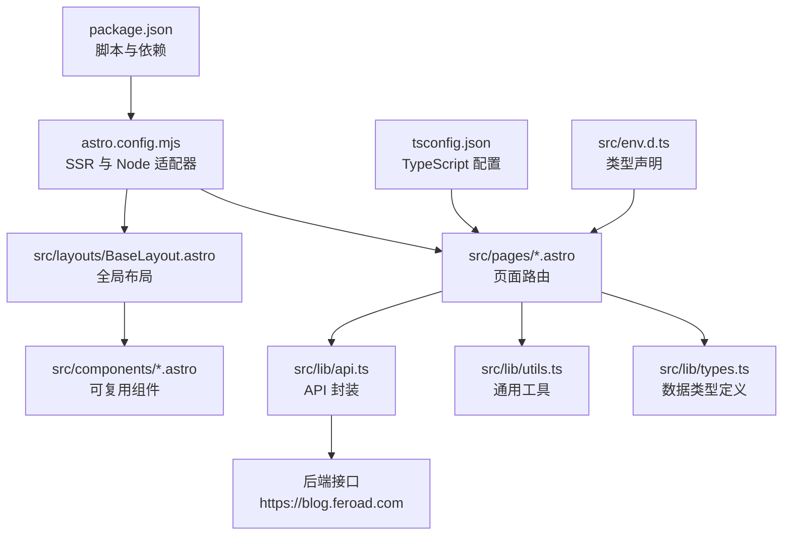
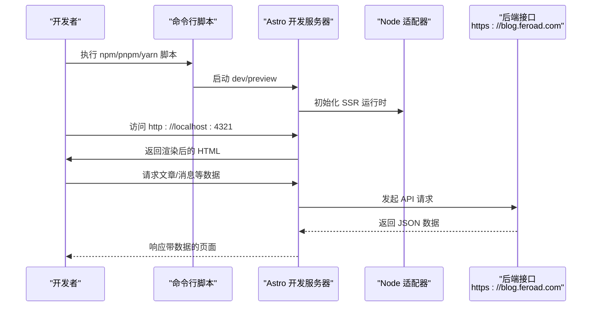
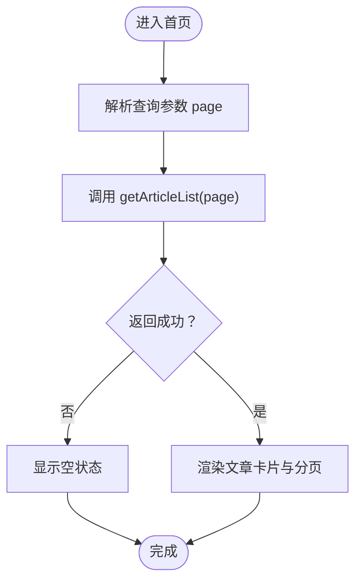
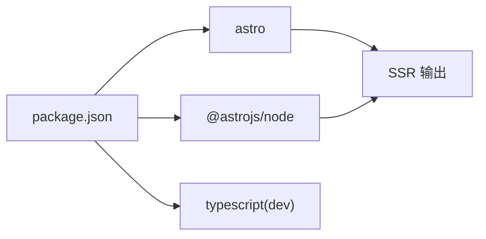

# 快速开始

<cite>
**本文引用的文件**
- [package.json](file://package.json)
- [astro.config.mjs](file://astro.config.mjs)
- [tsconfig.json](file://tsconfig.json)
- [src/env.d.ts](file://src/env.d.ts)
- [src/pages/index.astro](file://src/pages/index.astro)
- [src/layouts/BaseLayout.astro](file://src/layouts/BaseLayout.astro)
- [src/lib/api.ts](file://src/lib/api.ts)
- [src/lib/types.ts](file://src/lib/types.ts)
- [src/lib/utils.ts](file://src/lib/utils.ts)
- [src/components/Header.astro](file://src/components/Header.astro)
- [src/pages/admin/index.astro](file://src/pages/admin/index.astro)
- [.gitignore](file://.gitignore)
</cite>

## 目录
1. [简介](#简介)
2. [项目结构](#项目结构)
3. [核心组件](#核心组件)
4. [架构总览](#架构总览)
5. [详细组件分析](#详细组件分析)
6. [依赖关系分析](#依赖关系分析)
7. [性能注意事项](#性能注意事项)
8. [故障排除指南](#故障排除指南)
9. [结论](#结论)
10. [附录](#附录)

## 简介
本指南面向希望快速搭建并运行该博客项目的开发者，覆盖环境准备、安装步骤、开发服务器启动、Astro 开发模式特性、首次访问验证以及常见问题排查。项目基于 Astro SSR（服务端渲染）与 Node 适配器构建，前端使用 TypeScript，采用 pnpm 作为包管理器。

## 项目结构
该项目采用 Astro 的典型目录组织方式：
- 源码位于 src/，包含页面、布局、组件、样式与工具函数
- 配置文件位于根目录：package.json、astro.config.mjs、tsconfig.json、src/env.d.ts
- 页面示例：首页、文章详情、关于、登录、消息等
- 布局与组件：基础布局、头部导航、分页等
- 类型定义与 API 工具：统一的数据契约与后端交互封装
- 构建产物输出：dist/.output（由 Astro 生成）

图表来源
- [package.json:1-19](file://package.json#L1-L19)
- [astro.config.mjs:1-14](file://astro.config.mjs#L1-L14)
- [tsconfig.json:1-11](file://tsconfig.json#L1-L11)
- [src/env.d.ts:1-3](file://src/env.d.ts#L1-L3)

章节来源
- [package.json:1-19](file://package.json#L1-L19)
- [astro.config.mjs:1-14](file://astro.config.mjs#L1-L14)
- [tsconfig.json:1-11](file://tsconfig.json#L1-L11)
- [src/env.d.ts:1-3](file://src/env.d.ts#L1-L3)

## 核心组件
- 开发脚本与网络配置
  - 开发服务器：通过脚本 dev 启动，监听 0.0.0.0:4321
  - 预览服务器：通过脚本 preview 启动，监听 0.0.0.0:4321
  - 构建：脚本 build 生成静态/SSR 输出
- SSR 与 Node 适配器
  - 输出模式为 server，适配器为 Node，运行时为 standalone
  - 服务器端口与 host 在配置中统一设定
- TypeScript 支持
  - 继承 Astro 的严格配置，启用路径映射 @/*
- 类型与工具
  - 统一的 API 返回体与数据模型
  - 通用时间格式化、富文本处理、图片尺寸稳定化等工具函数
- 页面与布局
  - 首页聚合文章列表，支持分页
  - 基础布局注入全局样式与公共变量
  - 头部导航与移动端菜单
  - 管理后台入口页面（占位）

章节来源
- [package.json:7-11](file://package.json#L7-L11)
- [astro.config.mjs:4-13](file://astro.config.mjs#L4-L13)
- [tsconfig.json:2-10](file://tsconfig.json#L2-L10)
- [src/lib/types.ts:1-54](file://src/lib/types.ts#L1-L54)
- [src/lib/utils.ts:1-219](file://src/lib/utils.ts#L1-L219)
- [src/pages/index.astro:1-50](file://src/pages/index.astro#L1-L50)
- [src/layouts/BaseLayout.astro:1-42](file://src/layouts/BaseLayout.astro#L1-L42)
- [src/components/Header.astro:1-48](file://src/components/Header.astro#L1-L48)
- [src/pages/admin/index.astro:1-30](file://src/pages/admin/index.astro#L1-L30)

## 架构总览
下图展示了从浏览器请求到页面渲染与 API 调用的整体流程，以及开发服务器的启动与网络暴露方式。

图表来源
- [package.json:8-10](file://package.json#L8-L10)
- [astro.config.mjs:6-12](file://astro.config.mjs#L6-L12)
- [src/lib/api.ts:9-15](file://src/lib/api.ts#L9-L15)

## 详细组件分析

### 开发服务器与网络配置
- 启动命令
  - 开发：执行 dev 脚本，启动 Astro 开发服务器
  - 预览：执行 preview 脚本，启动生产预览服务器
- 网络配置
  - 主机地址：0.0.0.0（允许外部访问）
  - 端口：4321
  - 服务器在配置中统一设定 host 与 port
- 环境变量
  - 可通过 PUBLIC_API_BASE_URL 或 API_BASE_URL 覆盖默认 API 基础地址
  - 默认基础地址为 https://blog.feroad.com

章节来源
- [package.json:8-10](file://package.json#L8-L10)
- [astro.config.mjs:9-12](file://astro.config.mjs#L9-L12)
- [src/lib/api.ts:11-15](file://src/lib/api.ts#L11-L15)
- [src/layouts/BaseLayout.astro:17](file://src/layouts/BaseLayout.astro#L17)

### 首页与分页逻辑
- 页面职责
  - 解析当前页码参数，调用 API 获取文章列表
  - 渲染文章卡片、摘要、日期与分页组件
  - 无数据时显示空状态提示
- 关键数据流
  - 输入：URL 查询参数 page
  - 处理：API 返回分页结果，计算 total、pageSize、items
  - 输出：渲染文章列表与分页控件

图表来源
- [src/pages/index.astro:7-13](file://src/pages/index.astro#L7-L13)
- [src/lib/api.ts:58-60](file://src/lib/api.ts#L58-L60)

章节来源
- [src/pages/index.astro:1-50](file://src/pages/index.astro#L1-L50)
- [src/lib/api.ts:58-60](file://src/lib/api.ts#L58-L60)

### 布局与头部导航
- 布局
  - 注入全局样式与公共变量（如 API 基础地址）
  - 可选择隐藏头部/底部（hideChrome）
- 头部导航
  - 包含品牌区、主导航链接与移动端菜单
  - 根据当前路径高亮活动项
  - 提供移动端菜单开关交互

章节来源
- [src/layouts/BaseLayout.astro:1-42](file://src/layouts/BaseLayout.astro#L1-L42)
- [src/components/Header.astro:1-48](file://src/components/Header.astro#L1-L48)

### API 封装与类型系统
- API 基础地址优先级
  - import.meta.env.API_BASE_URL > import.meta.env.PUBLIC_API_BASE_URL > 默认值
- 统一请求封装
  - request 函数负责构造 URL、发起请求、解析 JSON、错误处理
  - postForm 用于表单提交场景
- 数据模型
  - ApiEnvelope、PaginationResult、ArticleSummary/Detail、BlogMessage、ArticleComment 等
- 工具函数
  - 时间格式化、富文本处理、图片尺寸稳定化等

章节来源
- [src/lib/api.ts:1-91](file://src/lib/api.ts#L1-L91)
- [src/lib/types.ts:1-54](file://src/lib/types.ts#L1-L54)
- [src/lib/utils.ts:1-219](file://src/lib/utils.ts#L1-L219)

### 管理后台入口
- 占位页面展示后台功能卡片，后续迁移发布文章、评论管理、消息管理等功能
- 页面标题与描述便于识别后台入口

章节来源
- [src/pages/admin/index.astro:1-30](file://src/pages/admin/index.astro#L1-L30)

## 依赖关系分析
- 包管理器
  - 推荐使用 pnpm，版本在 package.json 中声明
- 依赖
  - astro 与 @astrojs/node（SSR 适配器）
  - TypeScript（开发依赖）
- 构建产物
  - dist/.output 由 Astro 生成，用于生产预览与部署

图表来源
- [package.json:6-18](file://package.json#L6-L18)

章节来源
- [package.json:1-19](file://package.json#L1-L19)
- [.gitignore:1-7](file://.gitignore#L1-L7)

## 性能注意事项
- 图片加载优化
  - 工具函数会为缺少宽高的图片标签补充尺寸属性，并添加懒加载与异步解码属性，减少主线程阻塞
- 请求超时与缓存
  - 图片尺寸探测设置超时，避免长时间等待；内部维护简单缓存，提升重复请求性能
- SSR 与静态资源
  - 使用 Astro 的 SSR 输出模式，结合 Node 适配器，可在本地与生产环境中获得一致的首屏体验

章节来源
- [src/lib/utils.ts:132-168](file://src/lib/utils.ts#L132-L168)
- [src/lib/utils.ts:208-218](file://src/lib/utils.ts#L208-L218)

## 故障排除指南
- 无法访问开发服务器
  - 确认端口 4321 未被占用
  - 确认主机地址 0.0.0.0 已正确暴露（允许外部访问）
  - 若仅本地访问，请在脚本或配置中调整 host 为 localhost
- API 请求失败
  - 检查 API 基础地址是否正确（可通过环境变量覆盖）
  - 确认网络可达性与跨域策略
- TypeScript 类型错误
  - 确保 tsconfig.json 正确继承 Astro 严格配置
  - 检查路径映射 @/* 是否指向 src
- 构建或预览异常
  - 清理构建缓存（dist/.output/.astro），重新安装依赖后重试
- pnpm 版本不匹配
  - 使用 package.json 中声明的 pnpm 版本，避免不同版本导致的安装差异

章节来源
- [package.json:6](file://package.json#L6)
- [package.json:8-10](file://package.json#L8-L10)
- [astro.config.mjs:9-12](file://astro.config.mjs#L9-L12)
- [src/lib/api.ts:11-15](file://src/lib/api.ts#L11-L15)
- [tsconfig.json:2-10](file://tsconfig.json#L2-L10)
- [.gitignore:1-7](file://.gitignore#L1-L7)

## 结论
通过本指南，您可以快速完成环境准备、安装依赖、启动开发服务器并验证博客功能。Astro 的 SSR 与 Node 适配器为您提供了良好的开发体验，配合 pnpm 与 TypeScript，有助于在大型项目中保持一致性与可维护性。遇到问题时，可依据“故障排除指南”逐项排查。

## 附录

### 环境要求
- Node.js：建议使用与项目兼容的 LTS 版本（具体版本请根据实际运行环境确定）
- 包管理器：推荐使用 pnpm（版本在 package.json 中声明）
- 系统兼容性：支持 macOS、Linux、Windows（需满足 Node.js 兼容性）

章节来源
- [package.json:6](file://package.json#L6)

### 安装步骤
- 克隆仓库后，进入项目根目录
- 使用 pnpm 安装依赖（推荐）
- 完成后即可启动开发服务器

章节来源
- [package.json:6](file://package.json#L6)

### 启动开发服务器
- 开发模式
  - 执行 dev 脚本，服务器监听 0.0.0.0:4321
- 生产预览
  - 执行 preview 脚本，服务器监听 0.0.0.0:4321
- 构建
  - 执行 build 脚本生成 SSR 输出

章节来源
- [package.json:8-10](file://package.json#L8-L10)
- [astro.config.mjs:9-12](file://astro.config.mjs#L9-L12)

### Astro 开发模式特性
- 热重载与自动刷新
  - 修改页面、布局或组件后，浏览器自动刷新
- 调试支持
  - SSR 与客户端代码均可在浏览器开发者工具中调试
- 网络配置
  - 通过脚本与配置统一管理 host 与 port

章节来源
- [package.json:8-10](file://package.json#L8-L10)
- [astro.config.mjs:9-12](file://astro.config.mjs#L9-L12)

### 首次访问与功能验证
- 默认访问地址
  - http://localhost:4321
- 功能验证
  - 首页应显示文章列表与分页控件
  - 点击导航进入关于、消息等页面
  - 访问管理后台入口页面（占位）

章节来源
- [src/pages/index.astro:1-50](file://src/pages/index.astro#L1-L50)
- [src/components/Header.astro:7-12](file://src/components/Header.astro#L7-L12)
- [src/pages/admin/index.astro:1-30](file://src/pages/admin/index.astro#L1-L30)