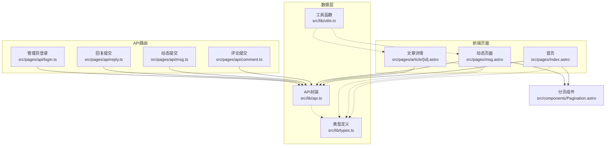
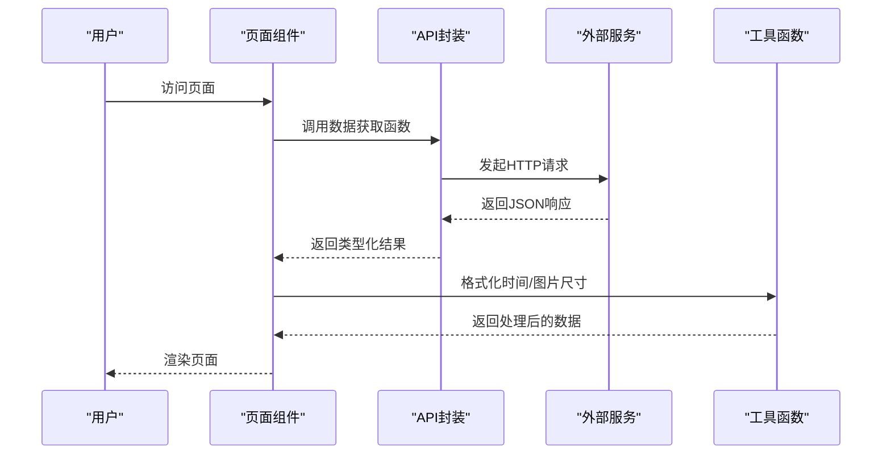
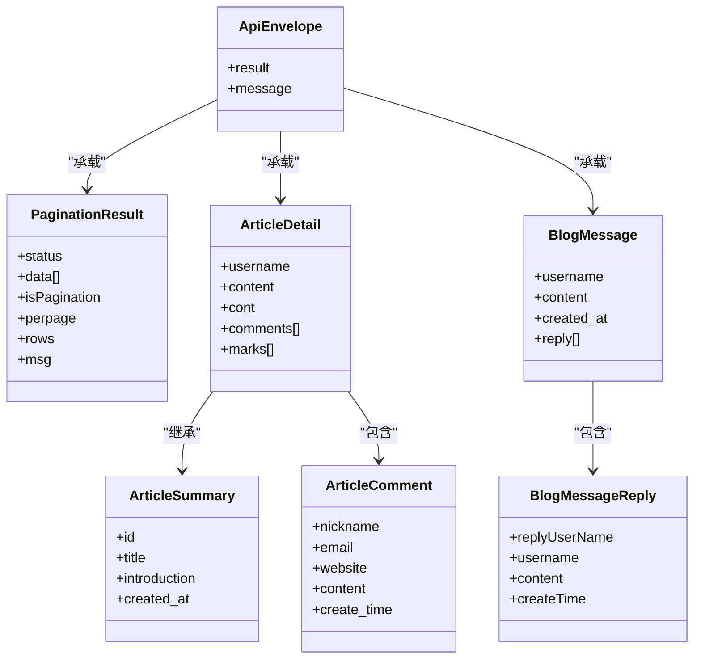
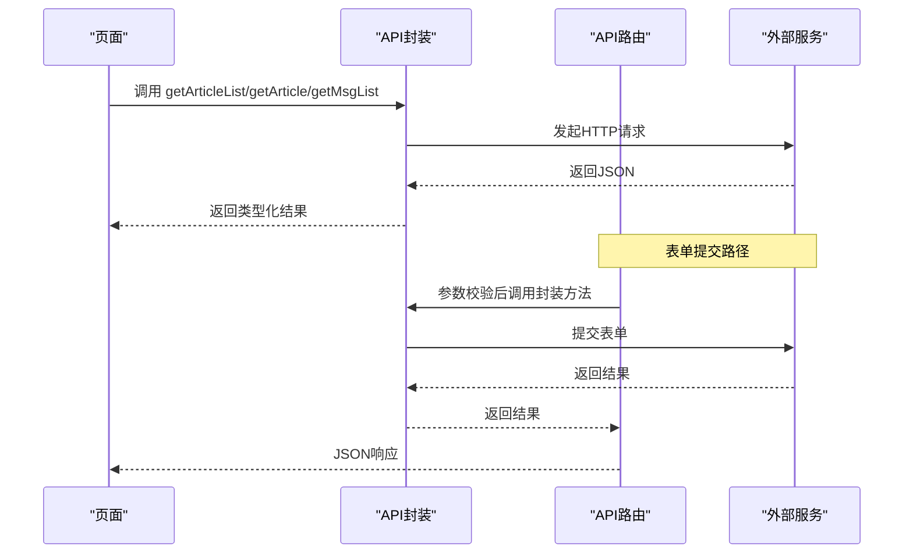
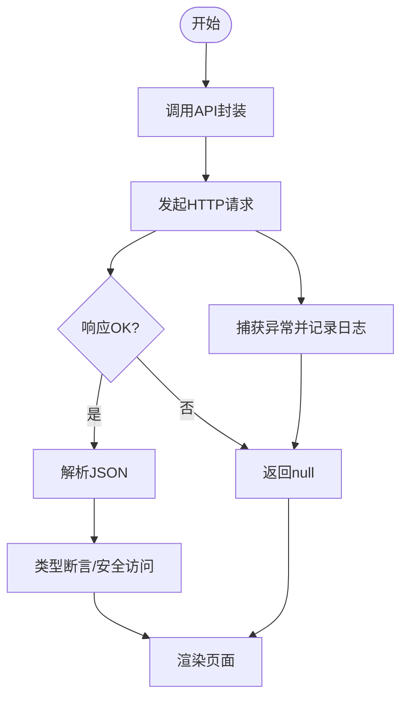
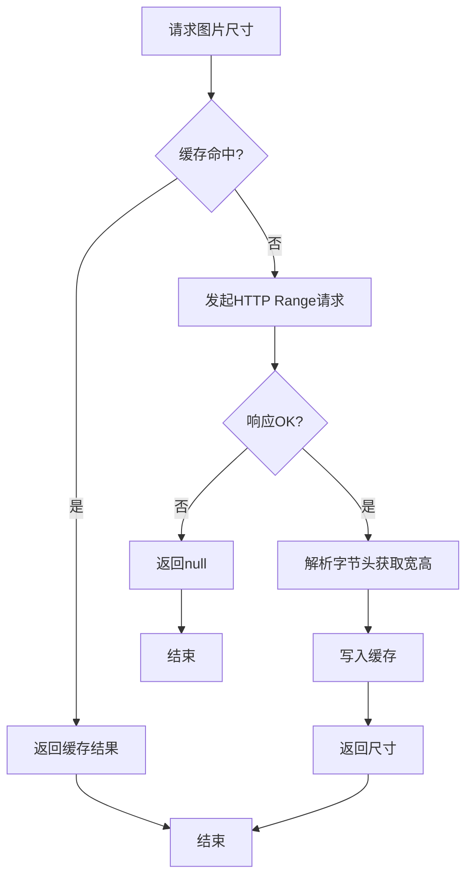
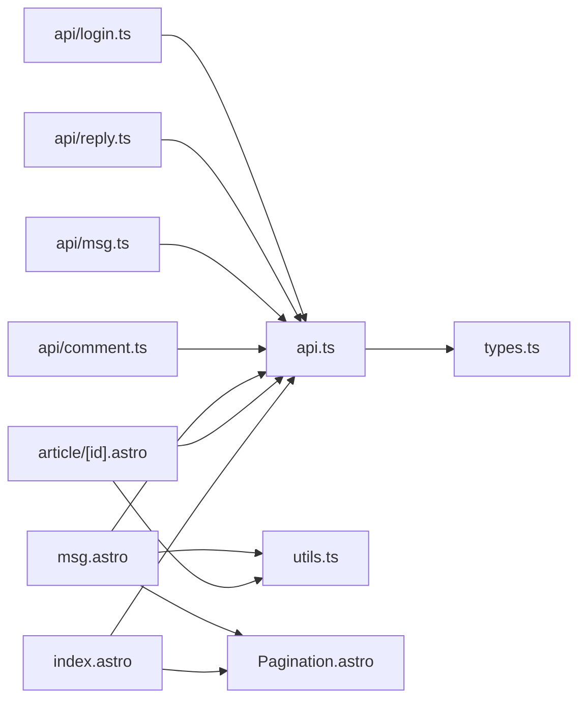

# 数据架构

<cite>
**本文引用的文件**
- [src/lib/types.ts](file://src/lib/types.ts)
- [src/lib/api.ts](file://src/lib/api.ts)
- [src/lib/utils.ts](file://src/lib/utils.ts)
- [src/pages/api/comment.ts](file://src/pages/api/comment.ts)
- [src/pages/api/msg.ts](file://src/pages/api/msg.ts)
- [src/pages/api/login.ts](file://src/pages/api/login.ts)
- [src/pages/api/reply.ts](file://src/pages/api/reply.ts)
- [src/pages/index.astro](file://src/pages/index.astro)
- [src/pages/article/[id].astro](file://src/pages/article/[id].astro)
- [src/pages/msg.astro](file://src/pages/msg.astro)
- [src/components/Pagination.astro](file://src/components/Pagination.astro)
- [package.json](file://package.json)
</cite>

## 目录
1. [简介](#简介)
2. [项目结构](#项目结构)
3. [核心组件](#核心组件)
4. [架构总览](#架构总览)
5. [详细组件分析](#详细组件分析)
6. [依赖分析](#依赖分析)
7. [性能考虑](#性能考虑)
8. [故障排查指南](#故障排查指南)
9. [结论](#结论)
10. [附录](#附录)

## 简介
本数据架构文档围绕博客系统的API驱动数据架构展开，重点阐述：
- 外部API集成方式与数据获取流程
- 数据模型设计（Article、Comment、Message等）及关系映射
- 从API调用到组件渲染的完整数据流
- 数据验证与错误处理机制（类型安全、空值处理、异常捕获）
- 缓存策略与性能优化（请求去重、本地缓存、增量更新）
- 工具函数在数据处理中的作用（数据转换、格式化、验证）

## 项目结构
该博客系统采用Astro静态站点生成框架，前端页面通过服务端API路由与后端服务交互，数据模型统一由类型定义模块提供，工具模块负责数据格式化与图片尺寸解析等。

图表来源
- [src/pages/index.astro:1-50](file://src/pages/index.astro#L1-L50)
- [src/pages/article/[id].astro](file://src/pages/article/[id].astro#L1-L109)
- [src/pages/msg.astro:1-135](file://src/pages/msg.astro#L1-L135)
- [src/pages/api/comment.ts:1-19](file://src/pages/api/comment.ts#L1-L19)
- [src/pages/api/msg.ts:1-16](file://src/pages/api/msg.ts#L1-L16)
- [src/pages/api/reply.ts:1-17](file://src/pages/api/reply.ts#L1-L17)
- [src/pages/api/login.ts:1-16](file://src/pages/api/login.ts#L1-L16)
- [src/lib/types.ts:1-54](file://src/lib/types.ts#L1-L54)
- [src/lib/api.ts:1-91](file://src/lib/api.ts#L1-L91)
- [src/lib/utils.ts:1-219](file://src/lib/utils.ts#L1-L219)
- [src/components/Pagination.astro:1-28](file://src/components/Pagination.astro#L1-L28)

章节来源
- [src/pages/index.astro:1-50](file://src/pages/index.astro#L1-L50)
- [src/pages/article/[id].astro](file://src/pages/article/[id].astro#L1-L109)
- [src/pages/msg.astro:1-135](file://src/pages/msg.astro#L1-L135)
- [src/lib/types.ts:1-54](file://src/lib/types.ts#L1-L54)
- [src/lib/api.ts:1-91](file://src/lib/api.ts#L1-L91)
- [src/lib/utils.ts:1-219](file://src/lib/utils.ts#L1-L219)
- [src/components/Pagination.astro:1-28](file://src/components/Pagination.astro#L1-L28)

## 核心组件
- 类型定义模块：统一声明API响应包装器、分页结果、文章摘要/详情、评论、消息及其回复等数据结构，确保前后端契约一致。
- API封装模块：集中管理基础URL、通用请求方法、表单提交、各业务API调用，提供类型安全的返回值。
- 工具函数模块：时间格式化、网站URL规范化、富文本图片尺寸稳定化、HTML标签属性增强等。
- 页面与API路由：页面负责数据拉取与渲染；API路由负责参数校验与转发至API封装模块。

章节来源
- [src/lib/types.ts:1-54](file://src/lib/types.ts#L1-L54)
- [src/lib/api.ts:1-91](file://src/lib/api.ts#L1-L91)
- [src/lib/utils.ts:1-219](file://src/lib/utils.ts#L1-L219)

## 架构总览
系统采用“页面直连API封装”的模式，API封装再对接外部服务。页面通过Astro的SSR/SSG能力在构建时或运行时发起请求，获取数据后进行渲染。API路由作为中间层，负责参数校验与转发。

图表来源
- [src/pages/index.astro:1-50](file://src/pages/index.astro#L1-L50)
- [src/pages/article/[id].astro](file://src/pages/article/[id].astro#L1-L109)
- [src/pages/msg.astro:1-135](file://src/pages/msg.astro#L1-L135)
- [src/lib/api.ts:1-91](file://src/lib/api.ts#L1-L91)
- [src/lib/utils.ts:1-219](file://src/lib/utils.ts#L1-L219)

## 详细组件分析

### 数据模型设计与关系映射
- ApiEnvelope：统一响应包装器，包含可选结果与消息字段，便于前端统一处理成功/失败状态。
- PaginationResult：分页结果容器，包含状态、数据数组、是否分页、每页条数、总行数等。
- ArticleSummary：文章摘要，包含标识、标题、简介、创建时间戳。
- ArticleDetail：文章详情，在摘要基础上扩展用户名、正文、评论集合等字段，并兼容不同后端返回结构。
- ArticleComment：文章评论，包含昵称、邮箱、网站、内容、创建时间等。
- BlogMessageReply：消息回复，包含回复者信息、内容、时间等。
- BlogMessage：消息主体，包含用户名、内容、创建时间以及可选回复列表。

图表来源
- [src/lib/types.ts:1-54](file://src/lib/types.ts#L1-L54)

章节来源
- [src/lib/types.ts:1-54](file://src/lib/types.ts#L1-L54)

### API驱动的数据架构与数据流
- 基础URL与请求封装：API封装模块集中管理基础URL、通用请求方法与表单提交方法，所有业务API调用均通过此模块完成，保证一致性与可维护性。
- 页面数据获取：首页、文章详情、动态页面分别调用对应API函数，获取分页文章列表、文章详情、消息列表等数据。
- 数据渲染：页面根据返回结果进行渲染，首页展示摘要卡片，文章详情展示正文与评论，动态页面支持评论与回复。
- API路由：评论、动态、回复、登录等表单提交通过API路由进行参数校验后转发至API封装模块。

图表来源
- [src/lib/api.ts:1-91](file://src/lib/api.ts#L1-L91)
- [src/pages/api/comment.ts:1-19](file://src/pages/api/comment.ts#L1-L19)
- [src/pages/api/msg.ts:1-16](file://src/pages/api/msg.ts#L1-L16)
- [src/pages/api/reply.ts:1-17](file://src/pages/api/reply.ts#L1-L17)
- [src/pages/api/login.ts:1-16](file://src/pages/api/login.ts#L1-L16)
- [src/pages/index.astro:1-50](file://src/pages/index.astro#L1-L50)
- [src/pages/article/[id].astro](file://src/pages/article/[id].astro#L1-L109)
- [src/pages/msg.astro:1-135](file://src/pages/msg.astro#L1-L135)

章节来源
- [src/lib/api.ts:1-91](file://src/lib/api.ts#L1-L91)
- [src/pages/api/comment.ts:1-19](file://src/pages/api/comment.ts#L1-L19)
- [src/pages/api/msg.ts:1-16](file://src/pages/api/msg.ts#L1-L16)
- [src/pages/api/reply.ts:1-17](file://src/pages/api/reply.ts#L1-L17)
- [src/pages/api/login.ts:1-16](file://src/pages/api/login.ts#L1-L16)
- [src/pages/index.astro:1-50](file://src/pages/index.astro#L1-L50)
- [src/pages/article/[id].astro](file://src/pages/article/[id].astro#L1-L109)
- [src/pages/msg.astro:1-135](file://src/pages/msg.astro#L1-L135)

### 数据验证与错误处理机制
- 类型安全：通过类型定义模块约束API响应结构，确保调用方在编译期获得类型提示与约束。
- 空值处理：API封装在请求失败或响应非OK时返回null，页面在渲染前进行空值判断与兜底显示。
- 异常捕获：API封装使用try/catch包裹fetch请求，捕获网络异常并输出错误日志，避免应用崩溃。
- 参数校验：API路由对表单参数进行必填与长度限制校验，不符合条件时直接返回错误响应。
- 客户端二次校验：文章详情页对评论表单进行二次校验，防止无效数据提交。

图表来源
- [src/lib/api.ts:25-41](file://src/lib/api.ts#L25-L41)
- [src/pages/api/comment.ts:12-14](file://src/pages/api/comment.ts#L12-L14)
- [src/pages/api/msg.ts:9-11](file://src/pages/api/msg.ts#L9-L11)
- [src/pages/article/[id].astro](file://src/pages/article/[id].astro#L94-L97)

章节来源
- [src/lib/api.ts:25-41](file://src/lib/api.ts#L25-L41)
- [src/pages/api/comment.ts:12-14](file://src/pages/api/comment.ts#L12-L14)
- [src/pages/api/msg.ts:9-11](file://src/pages/api/msg.ts#L9-L11)
- [src/pages/article/[id].astro](file://src/pages/article/[id].astro#L94-L97)

### 缓存策略与性能优化
- 请求去重与并发控制：工具函数模块对图片尺寸解析实现基于Map的缓存，避免重复请求同一资源；同时对正在进行的请求以Promise占位，实现并发去重。
- 本地缓存：图片尺寸解析结果在内存中缓存，提升后续渲染性能。
- 增量更新：页面在提交评论/动态/回复后，通过刷新当前页面实现数据的增量更新，避免复杂的状态同步逻辑。
- 图片懒加载与解码优化：工具函数为图片标签自动添加懒加载与异步解码属性，减少主线程阻塞。
- 分页与节流：分页组件仅渲染关键页码，避免大量DOM节点带来的性能问题。

图表来源
- [src/lib/utils.ts:132-168](file://src/lib/utils.ts#L132-L168)

章节来源
- [src/lib/utils.ts:44-168](file://src/lib/utils.ts#L44-L168)
- [src/components/Pagination.astro:1-28](file://src/components/Pagination.astro#L1-L28)

### 工具函数在数据处理中的作用
- 时间格式化：支持Unix时间戳与普通时间戳格式化，满足不同后端返回格式。
- 网站URL规范化：自动补全协议前缀，提升链接可用性。
- 富文本图片尺寸稳定化：解析图片头部字节获取宽高，为img标签注入width/height，避免布局抖动。
- HTML标签属性增强：为图片添加懒加载与异步解码属性，优化渲染性能。
- 标题样式清理：移除h标签内style属性，保持样式一致性。

章节来源
- [src/lib/utils.ts:1-219](file://src/lib/utils.ts#L1-L219)

## 依赖分析
- 页面依赖API封装模块进行数据获取，API封装依赖类型定义模块进行类型约束。
- API路由依赖API封装模块进行业务调用。
- 工具函数被页面与API封装模块共同使用，承担数据格式化与图片处理职责。
- 分页组件独立于数据层，仅消费页面传入的分页参数。

图表来源
- [src/pages/index.astro:1-50](file://src/pages/index.astro#L1-L50)
- [src/pages/article/[id].astro](file://src/pages/article/[id].astro#L1-L109)
- [src/pages/msg.astro:1-135](file://src/pages/msg.astro#L1-L135)
- [src/pages/api/comment.ts:1-19](file://src/pages/api/comment.ts#L1-L19)
- [src/pages/api/msg.ts:1-16](file://src/pages/api/msg.ts#L1-L16)
- [src/pages/api/reply.ts:1-17](file://src/pages/api/reply.ts#L1-L17)
- [src/pages/api/login.ts:1-16](file://src/pages/api/login.ts#L1-L16)
- [src/lib/api.ts:1-91](file://src/lib/api.ts#L1-L91)
- [src/lib/types.ts:1-54](file://src/lib/types.ts#L1-L54)
- [src/lib/utils.ts:1-219](file://src/lib/utils.ts#L1-L219)
- [src/components/Pagination.astro:1-28](file://src/components/Pagination.astro#L1-L28)

章节来源
- [src/lib/api.ts:1-91](file://src/lib/api.ts#L1-L91)
- [src/lib/types.ts:1-54](file://src/lib/types.ts#L1-L54)
- [src/lib/utils.ts:1-219](file://src/lib/utils.ts#L1-L219)
- [src/components/Pagination.astro:1-28](file://src/components/Pagination.astro#L1-L28)

## 性能考虑
- 减少网络往返：API封装统一管理基础URL与请求头，避免重复配置。
- 避免布局抖动：通过图片尺寸解析与懒加载，提前确定图片尺寸，减少重排。
- 并发去重：图片尺寸解析使用Map缓存与Promise占位，避免重复请求。
- 分页渲染：分页组件仅渲染必要页码，降低DOM复杂度。
- 错误降级：API封装在异常情况下返回null，页面进行空值兜底，避免白屏。

## 故障排查指南
- API请求失败：检查基础URL配置与网络连通性；查看控制台错误日志；确认响应是否符合ApiEnvelope结构。
- 数据为空：确认分页参数与后端返回；检查页面空值判断与兜底显示逻辑。
- 图片尺寸解析失败：确认图片URL协议与可访问性；检查字节头解析逻辑；查看缓存命中情况。
- 表单提交失败：检查API路由参数校验规则；确认前端二次校验是否通过；查看返回的错误消息。

章节来源
- [src/lib/api.ts:9-15](file://src/lib/api.ts#L9-L15)
- [src/lib/api.ts:25-41](file://src/lib/api.ts#L25-L41)
- [src/pages/api/comment.ts:12-14](file://src/pages/api/comment.ts#L12-L14)
- [src/pages/api/msg.ts:9-11](file://src/pages/api/msg.ts#L9-L11)
- [src/lib/utils.ts:132-168](file://src/lib/utils.ts#L132-L168)

## 结论
该博客系统采用清晰的API驱动数据架构：类型定义模块提供强类型契约，API封装模块统一处理请求与错误，工具函数模块负责数据格式化与性能优化，页面通过Astro进行高效渲染。通过合理的缓存策略与错误处理机制，系统在保证类型安全的同时实现了良好的用户体验与性能表现。

## 附录
- 运行与构建脚本：开发、构建、预览命令由包管理器提供，便于本地调试与部署。

章节来源
- [package.json:7-11](file://package.json#L7-L11)