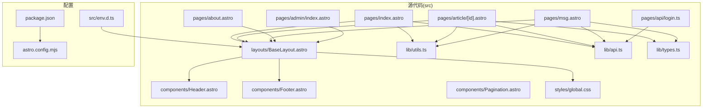
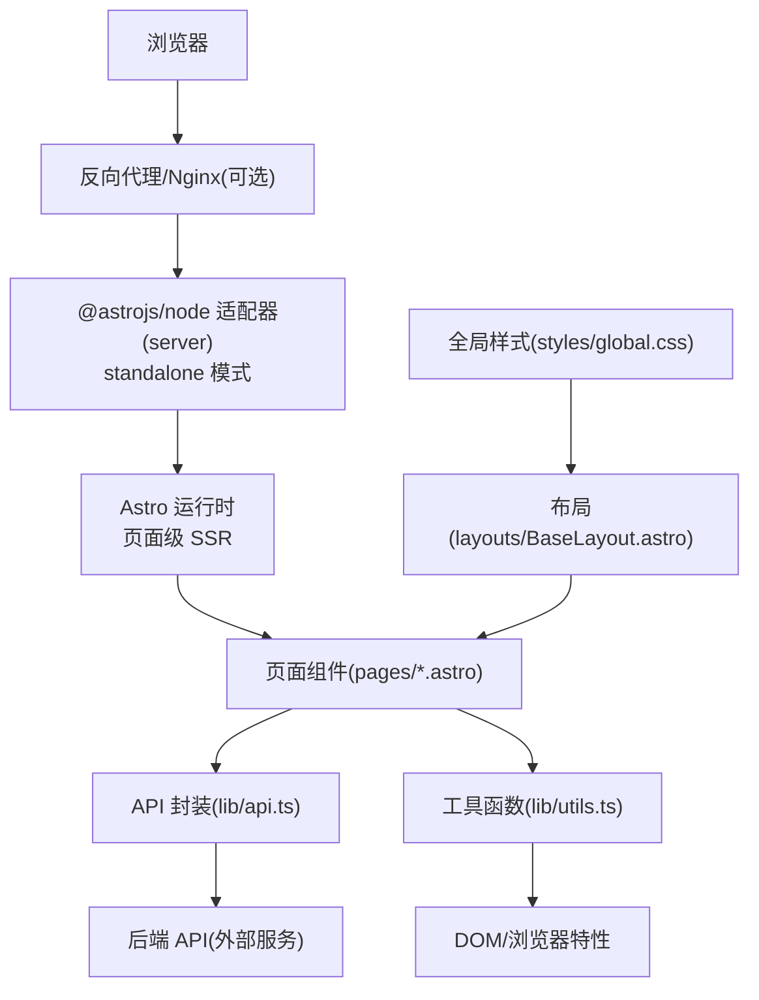
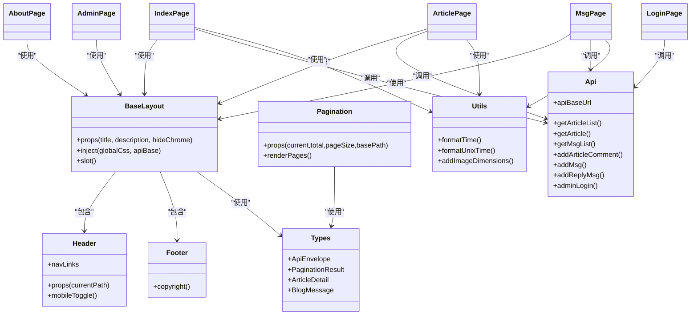
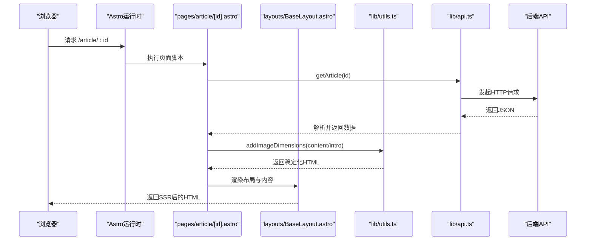
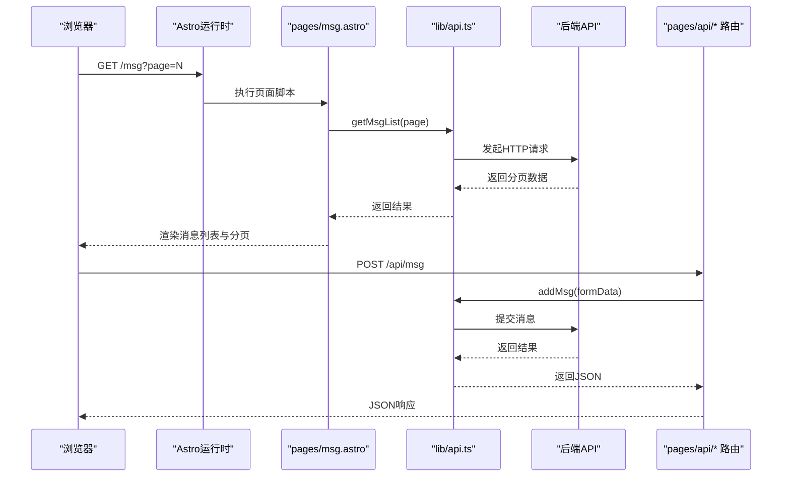
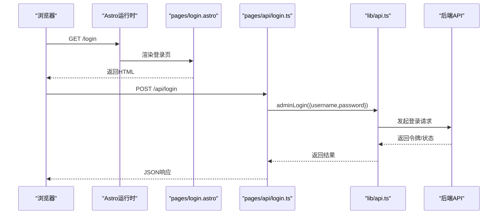
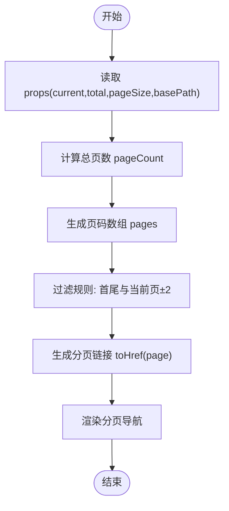
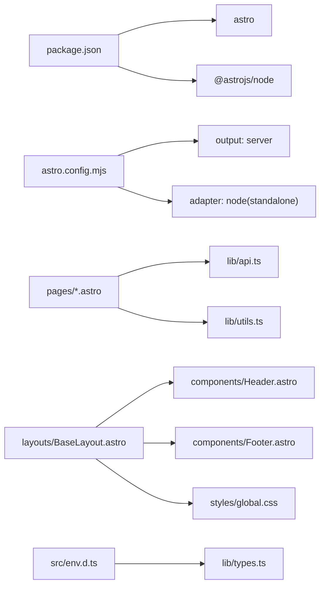

# 整体架构

<cite>
**本文引用的文件**   
- [package.json](file://package.json)
- [astro.config.mjs](file://astro.config.mjs)
- [src/env.d.ts](file://src/env.d.ts)
- [src/layouts/BaseLayout.astro](file://src/layouts/BaseLayout.astro)
- [src/lib/types.ts](file://src/lib/types.ts)
- [src/lib/api.ts](file://src/lib/api.ts)
- [src/lib/utils.ts](file://src/lib/utils.ts)
- [src/components/Header.astro](file://src/components/Header.astro)
- [src/components/Footer.astro](file://src/components/Footer.astro)
- [src/components/Pagination.astro](file://src/components/Pagination.astro)
- [src/pages/index.astro](file://src/pages/index.astro)
- [src/pages/article/[id].astro](file://src/pages/article/[id].astro)
- [src/pages/msg.astro](file://src/pages/msg.astro)
- [src/pages/about.astro](file://src/pages/about.astro)
- [src/pages/admin/index.astro](file://src/pages/admin/index.astro)
- [src/pages/api/login.ts](file://src/pages/api/login.ts)
- [src/styles/global.css](file://src/styles/global.css)
</cite>

## 目录
1. [引言](#引言)
2. [项目结构](#项目结构)
3. [核心组件](#核心组件)
4. [架构总览](#架构总览)
5. [详细组件分析](#详细组件分析)
6. [依赖关系分析](#依赖关系分析)
7. [性能考量](#性能考量)
8. [故障排查指南](#故障排查指南)
9. [结论](#结论)
10. [附录](#附录)

## 引言
本博客系统采用 Astro 作为全栈框架，结合 SSR（服务端渲染）与静态生成能力，通过 Node.js 适配器实现服务端部署。系统以 MVVM 架构思想在 Astro 中落地：页面组件承担视图层（View），逻辑与数据请求由 Astro 页面脚本（Server-side logic）驱动，外部 API 与工具函数构成模型层（Model）。通过分层设计，从表现层（Astro 页面组件）到基础设施层（Node 适配器），职责清晰、边界明确，既保证了首屏性能与 SEO 友好性，又兼顾了交互体验与可维护性。

## 项目结构
项目采用按功能域组织的模块化布局，核心目录与职责如下：
- src/components：可复用的 UI 组件（头部、底部、分页）
- src/layouts：页面外壳与通用布局（全局样式注入、公共结构）
- src/lib：共享的类型定义、API 封装与通用工具函数
- src/pages：页面级组件与 API 路由（包含文章详情、动态、关于、管理后台及 API 处理）
- src/styles：全局样式与主题变量
- 配置文件：package.json（依赖与脚本）、astro.config.mjs（输出为 server 并使用 Node 适配器）、env.d.ts（类型声明）

图表来源
- [src/pages/index.astro:1-50](file://src/pages/index.astro#L1-L50)
- [src/pages/article/[id].astro](file://src/pages/article/[id].astro#L1-L109)
- [src/pages/msg.astro:1-135](file://src/pages/msg.astro#L1-L135)
- [src/pages/about.astro:1-80](file://src/pages/about.astro#L1-L80)
- [src/pages/admin/index.astro:1-30](file://src/pages/admin/index.astro#L1-L30)
- [src/layouts/BaseLayout.astro:1-42](file://src/layouts/BaseLayout.astro#L1-L42)
- [src/lib/api.ts:1-91](file://src/lib/api.ts#L1-L91)
- [src/lib/utils.ts:1-219](file://src/lib/utils.ts#L1-L219)
- [src/lib/types.ts:1-54](file://src/lib/types.ts#L1-L54)
- [src/components/Header.astro:1-48](file://src/components/Header.astro#L1-L48)
- [src/components/Footer.astro:1-8](file://src/components/Footer.astro#L1-L8)
- [src/components/Pagination.astro:1-28](file://src/components/Pagination.astro#L1-L28)
- [src/styles/global.css:1-233](file://src/styles/global.css#L1-L233)
- [package.json:1-19](file://package.json#L1-L19)
- [astro.config.mjs:1-14](file://astro.config.mjs#L1-L14)
- [src/env.d.ts:1-3](file://src/env.d.ts#L1-L3)

章节来源
- [package.json:1-19](file://package.json#L1-L19)
- [astro.config.mjs:1-14](file://astro.config.mjs#L1-L14)
- [src/env.d.ts:1-3](file://src/env.d.ts#L1-L3)

## 核心组件
- 布局与外壳：BaseLayout 提供统一的 HTML 结构、元信息、全局样式注入以及应用壳容器，并通过插槽承载页面内容；同时注入公共脚本变量用于 API 基础地址。
- 导航与页脚：Header 负责主导航与移动端菜单切换；Footer 展示版权信息。
- 分页组件：Pagination 计算页码集合与链接，支持上一页/下一页与省略号。
- 类型与工具：types 定义 API 返回与业务实体结构；utils 提供时间格式化、富文本图片尺寸稳定化、URL 规范化等能力。
- API 封装：api 模块集中封装对外请求、URL 构造与错误处理，统一返回结构。
- 页面组件：index、article、msg、about、admin 等页面组件负责数据拉取、参数解析与视图渲染。
- 样式体系：global.css 定义主题变量、响应式断点与组件样式，确保一致的视觉与交互体验。

章节来源
- [src/layouts/BaseLayout.astro:1-42](file://src/layouts/BaseLayout.astro#L1-L42)
- [src/components/Header.astro:1-48](file://src/components/Header.astro#L1-L48)
- [src/components/Footer.astro:1-8](file://src/components/Footer.astro#L1-L8)
- [src/components/Pagination.astro:1-28](file://src/components/Pagination.astro#L1-L28)
- [src/lib/types.ts:1-54](file://src/lib/types.ts#L1-L54)
- [src/lib/utils.ts:1-219](file://src/lib/utils.ts#L1-L219)
- [src/lib/api.ts:1-91](file://src/lib/api.ts#L1-L91)
- [src/pages/index.astro:1-50](file://src/pages/index.astro#L1-L50)
- [src/pages/article/[id].astro:1-109](file://src/pages/article/[id].astro#L1-L109)
- [src/pages/msg.astro:1-135](file://src/pages/msg.astro#L1-L135)
- [src/pages/about.astro:1-80](file://src/pages/about.astro#L1-L80)
- [src/pages/admin/index.astro:1-30](file://src/pages/admin/index.astro#L1-L30)
- [src/styles/global.css:1-233](file://src/styles/global.css#L1-L233)

## 架构总览
系统采用“页面级 SSR + Node 适配器”的混合渲染模式：
- 输出模式：server（服务端渲染）
- 适配器：Node（standalone 模式）
- 端口与主机：配置为可被外部访问的主机与端口
- 类型安全：通过 env.d.ts 与 Astro 内置类型集成

图表来源
- [astro.config.mjs:4-13](file://astro.config.mjs#L4-L13)
- [src/lib/api.ts:11-15](file://src/lib/api.ts#L11-L15)
- [src/lib/utils.ts:132-168](file://src/lib/utils.ts#L132-L168)
- [src/layouts/BaseLayout.astro:17](file://src/layouts/BaseLayout.astro#L17)

章节来源
- [astro.config.mjs:1-14](file://astro.config.mjs#L1-L14)
- [src/env.d.ts:1-3](file://src/env.d.ts#L1-L3)

## 详细组件分析

### MVVM 在 Astro 中的实现
- Model（模型）：lib/api.ts 封装请求与返回结构；lib/types.ts 定义数据契约；lib/utils.ts 提供数据处理与格式化。
- View（视图）：各页面组件（pages/*.astro）与布局（layouts/BaseLayout.astro）负责模板渲染与样式。
- ViewModel（视图模型）：Astro 页面脚本在构建时执行，完成数据拉取、参数解析与状态计算，然后将结果传递给模板引擎进行渲染。

图表来源
- [src/layouts/BaseLayout.astro:1-42](file://src/layouts/BaseLayout.astro#L1-L42)
- [src/components/Header.astro:1-48](file://src/components/Header.astro#L1-L48)
- [src/components/Footer.astro:1-8](file://src/components/Footer.astro#L1-L8)
- [src/components/Pagination.astro:1-28](file://src/components/Pagination.astro#L1-L28)
- [src/lib/types.ts:1-54](file://src/lib/types.ts#L1-L54)
- [src/lib/utils.ts:1-219](file://src/lib/utils.ts#L1-L219)
- [src/lib/api.ts:1-91](file://src/lib/api.ts#L1-L91)
- [src/pages/index.astro:1-50](file://src/pages/index.astro#L1-L50)
- [src/pages/article/[id].astro:1-L109](file://src/pages/article/[id].astro#L1-L109)
- [src/pages/msg.astro:1-135](file://src/pages/msg.astro#L1-L135)
- [src/pages/about.astro:1-80](file://src/pages/about.astro#L1-L80)
- [src/pages/admin/index.astro:1-30](file://src/pages/admin/index.astro#L1-L30)
- [src/pages/api/login.ts:1-16](file://src/pages/api/login.ts#L1-L16)

章节来源
- [src/lib/types.ts:1-54](file://src/lib/types.ts#L1-L54)
- [src/lib/utils.ts:1-219](file://src/lib/utils.ts#L1-L219)
- [src/lib/api.ts:1-91](file://src/lib/api.ts#L1-L91)
- [src/layouts/BaseLayout.astro:1-42](file://src/layouts/BaseLayout.astro#L1-L42)

### 数据流与交互序列

#### 文章详情页加载流程

图表来源
- [src/pages/article/[id].astro:1-L109](file://src/pages/article/[id].astro#L1-L109)
- [src/lib/api.ts:62-64](file://src/lib/api.ts#L62-L64)
- [src/lib/utils.ts:208-218](file://src/lib/utils.ts#L208-L218)
- [src/layouts/BaseLayout.astro:1-42](file://src/layouts/BaseLayout.astro#L1-L42)

#### 动态页面与评论提交流程

图表来源
- [src/pages/msg.astro:1-135](file://src/pages/msg.astro#L1-L135)
- [src/lib/api.ts:66-82](file://src/lib/api.ts#L66-L82)
- [src/pages/api/login.ts:1-16](file://src/pages/api/login.ts#L1-L16)

#### 登录表单提交流程

图表来源
- [src/pages/api/login.ts:1-16](file://src/pages/api/login.ts#L1-L16)
- [src/lib/api.ts:88-90](file://src/lib/api.ts#L88-L90)

### 复杂逻辑组件：分页算法

图表来源
- [src/components/Pagination.astro:9-14](file://src/components/Pagination.astro#L9-L14)

## 依赖关系分析
- 运行时与适配器：package.json 指定 astro 与 @astrojs/node；astro.config.mjs 设置 output 为 server 并启用 Node 适配器。
- 类型与环境：env.d.ts 引入 Astro 客户端类型，确保页面脚本与内建对象的类型安全。
- 页面与布局：各页面组件依赖 BaseLayout，BaseLayout 再依赖 Header、Footer 与全局样式。
- 业务层：页面组件通过 lib/api.ts 调用外部服务，lib/utils.ts 提供数据处理与优化。

图表来源
- [package.json:12-14](file://package.json#L12-L14)
- [astro.config.mjs:4-13](file://astro.config.mjs#L4-L13)
- [src/env.d.ts:1-3](file://src/env.d.ts#L1-L3)

章节来源
- [package.json:1-19](file://package.json#L1-L19)
- [astro.config.mjs:1-14](file://astro.config.mjs#L1-L14)
- [src/env.d.ts:1-3](file://src/env.d.ts#L1-L3)

## 性能考量
- 首屏性能：Astro SSR 在构建时或请求时生成 HTML，减少客户端 JavaScript 执行与白屏时间，提升首屏内容直出与 SEO 表现。
- 图片优化：lib/utils.ts 对富文本中的图片进行尺寸稳定化与懒加载标记，降低布局抖动与带宽浪费。
- 分页策略：Pagination 组件仅渲染关键页码，避免长列表带来的 DOM 体积与渲染压力。
- 样式与资源：全局样式集中管理，CSS 变量与响应式断点减少重复样式，提升维护效率与加载一致性。

## 故障排查指南
- API 请求失败：检查 api.ts 中的 URL 构造与环境变量（API 基础地址），确认后端服务可达且返回结构符合预期。
- 时间格式异常：确认传入的时间戳单位与格式化函数参数，避免跨平台时间差异导致的显示问题。
- 图片尺寸获取失败：utils.ts 的图片尺寸解析依赖网络请求与缓存，若失败可能因网络超时或非标准图片格式。
- 分页链接错误：检查 Pagination 组件的 basePath 与 toHref 逻辑，确保与实际路由一致。
- 登录失败：确认 /api/login 路由接收的表单字段与 api.ts 中的 adminLogin 参数一致。

章节来源
- [src/lib/api.ts:11-15](file://src/lib/api.ts#L11-L15)
- [src/lib/utils.ts:132-168](file://src/lib/utils.ts#L132-L168)
- [src/components/Pagination.astro:14](file://src/components/Pagination.astro#L14)
- [src/pages/api/login.ts:4-15](file://src/pages/api/login.ts#L4-L15)

## 结论
该博客系统以 Astro 为核心，结合 SSR 与 Node 适配器，实现了高性能、可维护的全栈架构。通过清晰的分层设计与 MVVM 思想在 Astro 中的落地，系统在保证首屏性能与 SEO 的同时，提供了良好的用户体验与扩展性。未来可在保持现有架构稳定性的基础上，逐步引入静态生成与增量更新策略，进一步优化构建与部署效率。

## 附录
- 技术选型说明
  - 选择 Astro 的原因：页面级 SSR 与静态生成混合模式，兼顾首屏性能与 SEO；组件化开发与类型安全；生态与 Node 适配器成熟。
  - SSR 相比 CSR 的优势：首屏直出 HTML、更好的 SEO、较低的客户端计算负担。
- 关键配置要点
  - 输出模式与适配器：server + node standalone
  - 端口与主机：便于本地开发与容器部署
  - 类型声明：确保页面脚本与内建对象的类型安全

章节来源
- [astro.config.mjs:4-13](file://astro.config.mjs#L4-L13)
- [src/env.d.ts:1-3](file://src/env.d.ts#L1-L3)