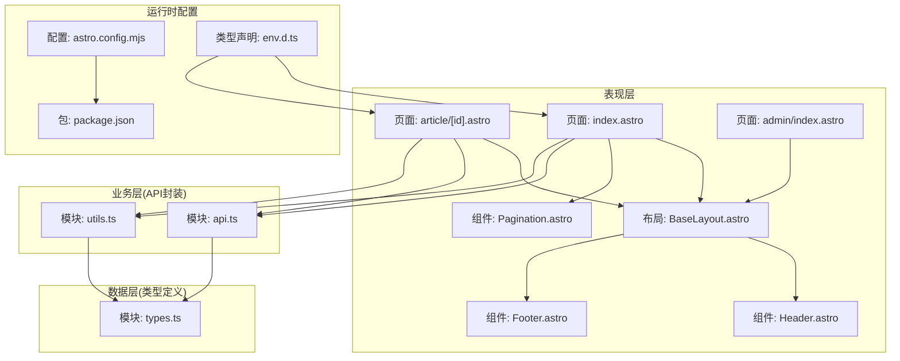
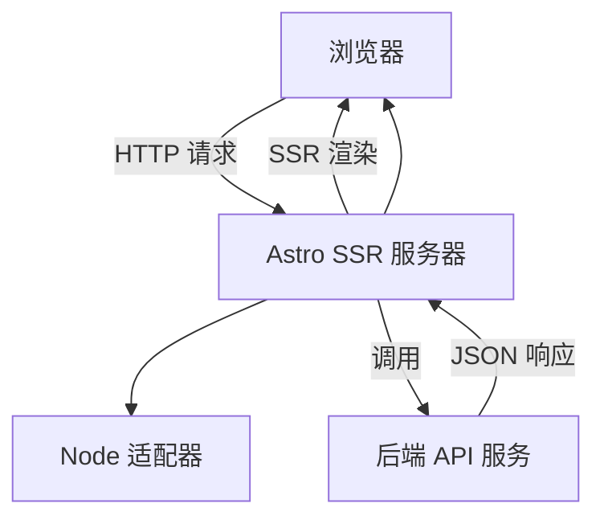
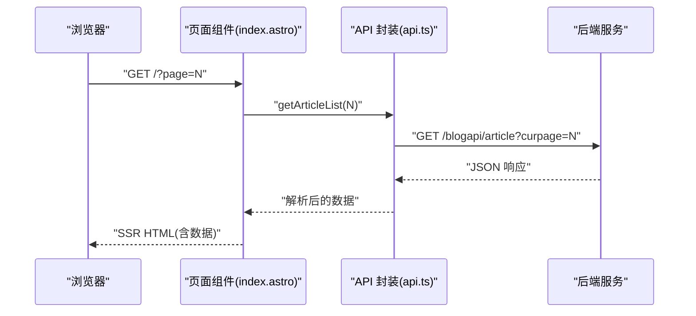
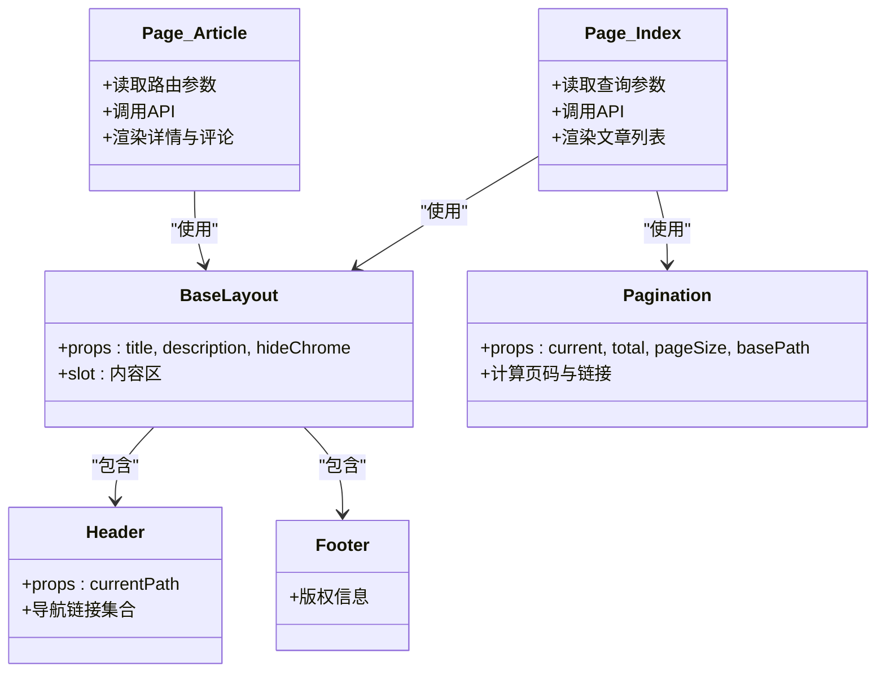
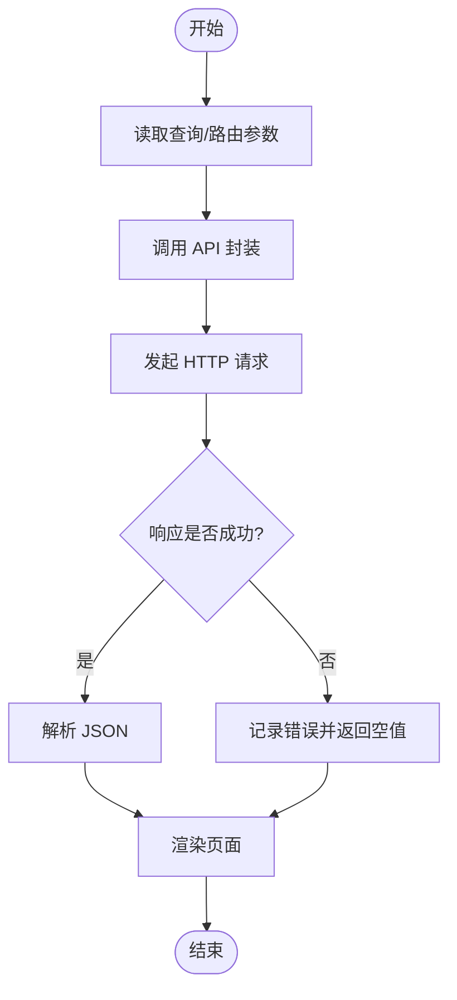
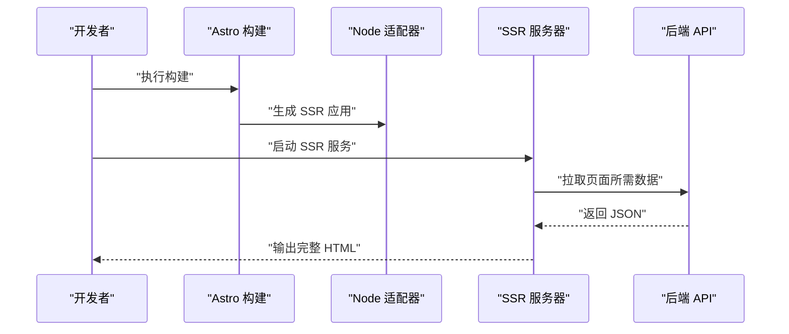
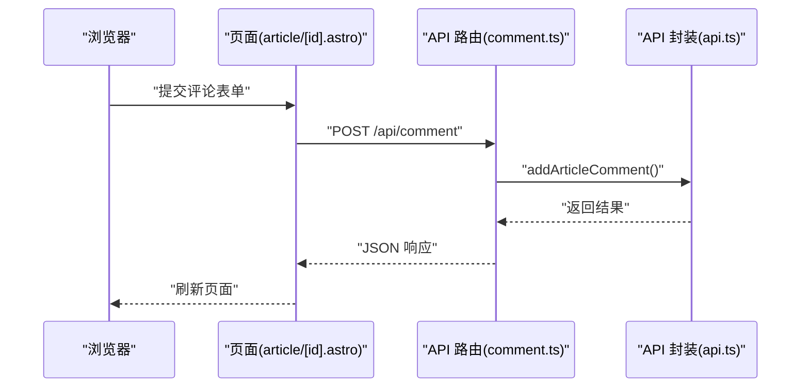
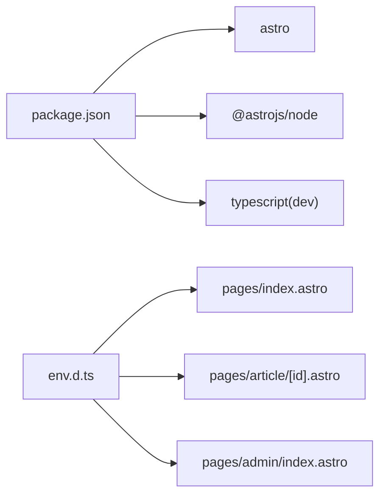

# 架构设计

<cite>
**本文引用的文件**
- [astro.config.mjs](file://astro.config.mjs)
- [package.json](file://package.json)
- [env.d.ts](file://env.d.ts)
- [src/lib/types.ts](file://src/lib/types.ts)
- [src/lib/api.ts](file://src/lib/api.ts)
- [src/lib/utils.ts](file://src/lib/utils.ts)
- [src/layouts/BaseLayout.astro](file://src/layouts/BaseLayout.astro)
- [src/components/Header.astro](file://src/components/Header.astro)
- [src/components/Footer.astro](file://src/components/Footer.astro)
- [src/components/Pagination.astro](file://src/components/Pagination.astro)
- [src/pages/index.astro](file://src/pages/index.astro)
- [src/pages/article/[id].astro](file://src/pages/article/[id].astro)
- [src/pages/api/comment.ts](file://src/pages/api/comment.ts)
- [src/pages/api/login.ts](file://src/pages/api/login.ts)
- [src/pages/admin/index.astro](file://src/pages/admin/index.astro)
</cite>

## 目录
1. [引言](#引言)
2. [项目结构](#项目结构)
3. [核心组件](#核心组件)
4. [架构总览](#架构总览)
5. [详细组件分析](#详细组件分析)
6. [依赖分析](#依赖分析)
7. [性能考虑](#性能考虑)
8. [故障排查指南](#故障排查指南)
9. [结论](#结论)
10. [附录](#附录)

## 引言
本项目是一个基于 Astro 的静态站点生成与服务端渲染（SSR）结合的博客系统。系统采用前后端分离的 API 驱动架构，通过 TypeScript 类型定义确保数据契约一致性，使用 Astro 的页面组件与 API 路由实现内容渲染与交互逻辑，配合 Node 适配器实现 SSR 输出。本文档从架构视角解析系统的分层设计、组件化理念、数据流与缓存策略，并给出关键流程的时序与类图，帮助开发者快速理解并扩展系统。

## 项目结构
项目采用按功能域分层的组织方式：
- 表现层（页面与布局）
  - 页面组件：src/pages 下的 Astro 页面，负责路由级渲染与用户交互
  - 布局与通用组件：src/layouts 与 src/components 提供可复用的页面骨架与基础 UI
- 业务层（API 封装）
  - src/lib/api.ts 将后端接口抽象为函数，统一请求构造与错误处理
- 数据层（类型定义）
  - src/lib/types.ts 定义 API 返回与业务实体的 TypeScript 接口
- 工具层（通用工具）
  - src/lib/utils.ts 提供时间格式化、富文本与图片尺寸稳定等工具方法
- 运行时配置
  - astro.config.mjs 指定 SSR 输出与 Node 适配器
  - package.json 定义构建脚本与依赖
  - env.d.ts 提供 Astro 与类型声明

**图表来源**
- [astro.config.mjs:1-14](file://astro.config.mjs#L1-L14)
- [package.json:1-19](file://package.json#L1-L19)
- [env.d.ts:1-3](file://env.d.ts#L1-L3)
- [src/pages/index.astro:1-50](file://src/pages/index.astro#L1-L50)
- [src/pages/article/[id].astro:1-109](file://src/pages/article/[id].astro#L1-L109)
- [src/pages/admin/index.astro:1-30](file://src/pages/admin/index.astro#L1-L30)
- [src/layouts/BaseLayout.astro:1-42](file://src/layouts/BaseLayout.astro#L1-L42)
- [src/components/Header.astro:1-48](file://src/components/Header.astro#L1-L48)
- [src/components/Footer.astro:1-8](file://src/components/Footer.astro#L1-L8)
- [src/components/Pagination.astro:1-28](file://src/components/Pagination.astro#L1-L28)
- [src/lib/api.ts:1-91](file://src/lib/api.ts#L1-L91)
- [src/lib/utils.ts:1-219](file://src/lib/utils.ts#L1-L219)
- [src/lib/types.ts:1-54](file://src/lib/types.ts#L1-L54)

**章节来源**
- [astro.config.mjs:1-14](file://astro.config.mjs#L1-L14)
- [package.json:1-19](file://package.json#L1-L19)
- [env.d.ts:1-3](file://env.d.ts#L1-L3)

## 核心组件
- 类型系统（数据契约）
  - 统一的响应包裹体与分页结果接口，保证前端对后端返回结构的一致性预期
  - 文章摘要/详情、评论、留言与回复等实体接口，明确字段约束与可选性
- API 封装
  - 统一的请求构造与错误处理，支持查询参数拼接与表单提交
  - 面向功能的 API 方法：文章列表/详情、留言列表/添加、评论添加、管理员登录等
- 工具集
  - 时间格式化、网站地址规范化、富文本图片尺寸稳定化与懒加载属性增强
- 布局与通用组件
  - 基础布局注入全局样式与公共变量，头部导航与底部版权信息，分页组件

**章节来源**
- [src/lib/types.ts:1-54](file://src/lib/types.ts#L1-L54)
- [src/lib/api.ts:1-91](file://src/lib/api.ts#L1-L91)
- [src/lib/utils.ts:1-219](file://src/lib/utils.ts#L1-L219)
- [src/layouts/BaseLayout.astro:1-42](file://src/layouts/BaseLayout.astro#L1-L42)
- [src/components/Header.astro:1-48](file://src/components/Header.astro#L1-L48)
- [src/components/Footer.astro:1-8](file://src/components/Footer.astro#L1-L8)
- [src/components/Pagination.astro:1-28](file://src/components/Pagination.astro#L1-L28)

## 架构总览
系统采用“页面组件 + 布局 + API 封装 + 类型定义”的分层架构，结合 Astro 的 SSR 输出与 Node 适配器，实现首屏渲染与 SEO 友好。页面组件通过 API 封装访问后端服务，工具模块提供通用能力，类型模块保障数据契约一致。

**图表来源**
- [astro.config.mjs:4-13](file://astro.config.mjs#L4-L13)
- [src/lib/api.ts:9-41](file://src/lib/api.ts#L9-L41)

**章节来源**
- [astro.config.mjs:1-14](file://astro.config.mjs#L1-L14)
- [src/lib/api.ts:1-91](file://src/lib/api.ts#L1-L91)

## 详细组件分析

### MVVM 架构在 Astro 中的体现
- 视图（View）
  - Astro 页面组件负责模板渲染与事件绑定，例如文章详情页的评论表单提交逻辑
- 模型（Model）
  - 类型定义与 API 封装构成模型层，提供数据结构与数据访问能力
- 视图模型（ViewModel）
  - 页面组件在 Astro 服务端渲染阶段读取查询参数、调用 API 并将数据注入模板；客户端脚本负责轻量交互

**图表来源**
- [src/pages/index.astro:7-14](file://src/pages/index.astro#L7-L14)
- [src/lib/api.ts:58-60](file://src/lib/api.ts#L58-L60)

**章节来源**
- [src/pages/index.astro:1-50](file://src/pages/index.astro#L1-L50)
- [src/lib/api.ts:1-91](file://src/lib/api.ts#L1-L91)

### 组件化设计与通信机制
- 可复用组件
  - Header/Footer 提供站点级导航与版权信息
  - Pagination 提供分页导航逻辑，支持页码计算与链接生成
- 组件间通信
  - 通过 Astro props 传递数据（如分页组件的 current/total/pageSize）
  - 页面组件通过客户端脚本与后端 API 路由进行交互（如评论提交）

**图表来源**
- [src/layouts/BaseLayout.astro:6-16](file://src/layouts/BaseLayout.astro#L6-L16)
- [src/components/Header.astro:2-6](file://src/components/Header.astro#L2-L6)
- [src/components/Footer.astro:1-8](file://src/components/Footer.astro#L1-L8)
- [src/components/Pagination.astro:2-7](file://src/components/Pagination.astro#L2-L7)
- [src/pages/index.astro:1-50](file://src/pages/index.astro#L1-L50)
- [src/pages/article/[id].astro:1-109](file://src/pages/article/[id].astro#L1-L109)

**章节来源**
- [src/components/Header.astro:1-48](file://src/components/Header.astro#L1-L48)
- [src/components/Footer.astro:1-8](file://src/components/Footer.astro#L1-L8)
- [src/components/Pagination.astro:1-28](file://src/components/Pagination.astro#L1-L28)
- [src/layouts/BaseLayout.astro:1-42](file://src/layouts/BaseLayout.astro#L1-L42)

### API 驱动的数据架构
- 数据流向
  - 页面组件在服务端读取查询参数/路由参数，调用 API 封装获取数据，渲染为 HTML
  - 客户端脚本负责轻量交互（如评论表单），通过 API 路由提交数据
- 缓存策略
  - 图片尺寸解析采用内存缓存（Map），避免重复请求同一资源
- 错误处理
  - API 封装统一处理网络异常与非 OK 状态，返回空值并记录错误日志
  - 页面组件对空数据进行降级展示（如“暂无文章”）

**图表来源**
- [src/lib/api.ts:25-41](file://src/lib/api.ts#L25-L41)
- [src/lib/utils.ts:132-168](file://src/lib/utils.ts#L132-L168)

**章节来源**
- [src/lib/api.ts:1-91](file://src/lib/api.ts#L1-L91)
- [src/lib/utils.ts:1-219](file://src/lib/utils.ts#L1-L219)
- [src/pages/index.astro:7-14](file://src/pages/index.astro#L7-L14)
- [src/pages/article/[id].astro:7-16](file://src/pages/article/[id].astro#L7-L16)

### SSR 架构优势与实现原理
- 优势
  - 首屏性能：服务端直接输出 HTML，减少客户端 JavaScript 执行与渲染时间
  - SEO 友好：搜索引擎可直接抓取完整的 HTML 结构
- 实现原理
  - 配置输出为 server 并使用 Node 适配器，Astro 在构建时生成可执行的 Node 应用
  - 页面组件在构建/运行时通过 API 获取数据并渲染，客户端脚本仅用于增强交互

**图表来源**
- [astro.config.mjs:4-13](file://astro.config.mjs#L4-L13)
- [src/lib/api.ts:9-41](file://src/lib/api.ts#L9-L41)

**章节来源**
- [astro.config.mjs:1-14](file://astro.config.mjs#L1-L14)
- [package.json:7-11](file://package.json#L7-L11)

### 关键交互流程示例

#### 文章详情页评论提交
- 浏览器提交表单至 API 路由，路由调用 API 封装执行评论添加，返回结果并刷新页面

**图表来源**
- [src/pages/article/[id].astro:85-109](file://src/pages/article/[id].astro#L85-L109)
- [src/pages/api/comment.ts:4-18](file://src/pages/api/comment.ts#L4-L18)
- [src/lib/api.ts:70-78](file://src/lib/api.ts#L70-L78)

**章节来源**
- [src/pages/article/[id].astro:1-109](file://src/pages/article/[id].astro#L1-L109)
- [src/pages/api/comment.ts:1-19](file://src/pages/api/comment.ts#L1-L19)
- [src/lib/api.ts:1-91](file://src/lib/api.ts#L1-L91)

## 依赖分析
- 运行时依赖
  - astro 与 @astrojs/node：提供 Astro 框架与 Node 适配器
- 构建与运行脚本
  - dev/build/preview：分别对应开发、构建与预览命令
- 类型声明
  - env.d.ts 引入 Astro 与客户端类型，确保页面组件与 API 路由的类型安全

**图表来源**
- [package.json:12-18](file://package.json#L12-L18)
- [env.d.ts:1-3](file://env.d.ts#L1-L3)

**章节来源**
- [package.json:1-19](file://package.json#L1-L19)
- [env.d.ts:1-3](file://env.d.ts#L1-L3)

## 性能考虑
- 首屏渲染
  - 使用 SSR 输出完整 HTML，减少白屏时间
- 资源加载
  - 图片懒加载与异步解码，提升滚动性能
  - 图片尺寸预稳定，避免布局抖动
- 网络请求
  - API 请求统一错误处理与降级展示，避免阻塞页面渲染
- 分页与列表
  - 合理的分页策略与边界页码显示，降低一次性渲染压力

[本节为通用性能建议，无需特定文件引用]

## 故障排查指南
- API 请求失败
  - 检查 API 基础地址配置与环境变量
  - 查看控制台错误日志，确认网络与跨域问题
- 页面空白或数据为空
  - 确认后端接口可用性与返回结构
  - 检查页面对空数据的降级展示逻辑
- 图片尺寸解析失败
  - 确认图片 URL 协议与可访问性
  - 检查缓存命中与超时设置

**章节来源**
- [src/lib/api.ts:9-41](file://src/lib/api.ts#L9-L41)
- [src/lib/utils.ts:132-168](file://src/lib/utils.ts#L132-L168)
- [src/pages/index.astro:40-45](file://src/pages/index.astro#L40-L45)

## 结论
该博客系统以 Astro 为核心，采用清晰的分层架构与组件化设计，结合 SSR 输出与 API 驱动的数据流，实现了良好的首屏性能与 SEO 友好性。类型定义确保了前后端契约一致，API 封装提供了统一的请求与错误处理机制，工具模块增强了用户体验与渲染稳定性。未来可在现有基础上扩展缓存策略、引入更完善的鉴权与权限控制，并逐步完善管理后台的功能迁移。

## 附录
- 关键文件清单
  - 配置与运行：astro.config.mjs, package.json, env.d.ts
  - 类型定义：src/lib/types.ts
  - API 封装：src/lib/api.ts
  - 工具模块：src/lib/utils.ts
  - 布局与组件：src/layouts/BaseLayout.astro, src/components/Header.astro, src/components/Footer.astro, src/components/Pagination.astro
  - 页面与 API 路由：src/pages/index.astro, src/pages/article/[id].astro, src/pages/admin/index.astro, src/pages/api/comment.ts, src/pages/api/login.ts

[本节为概览性附录，无需特定文件引用]