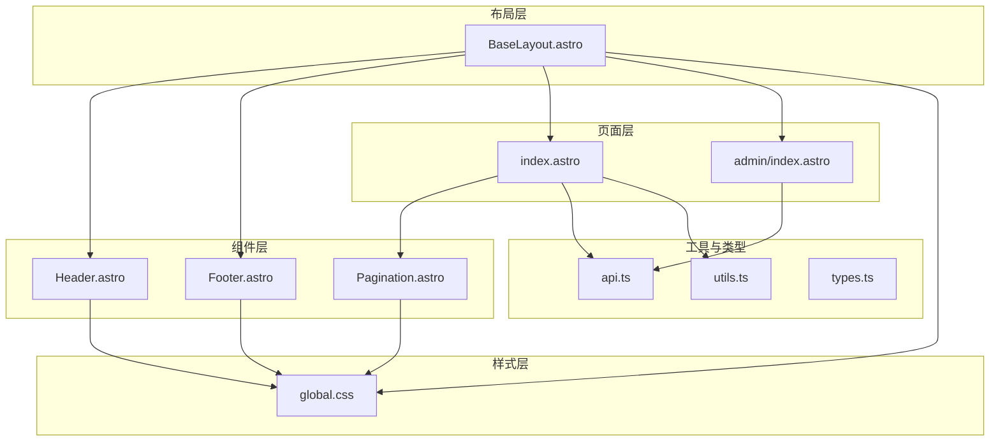
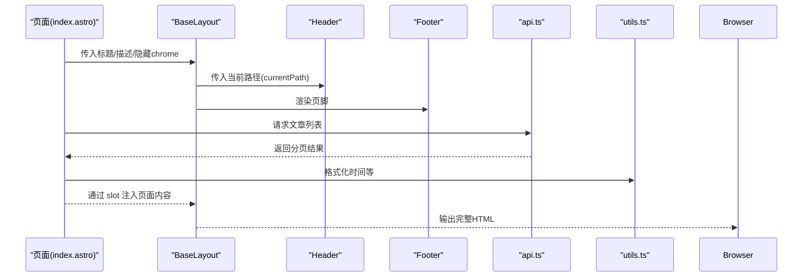
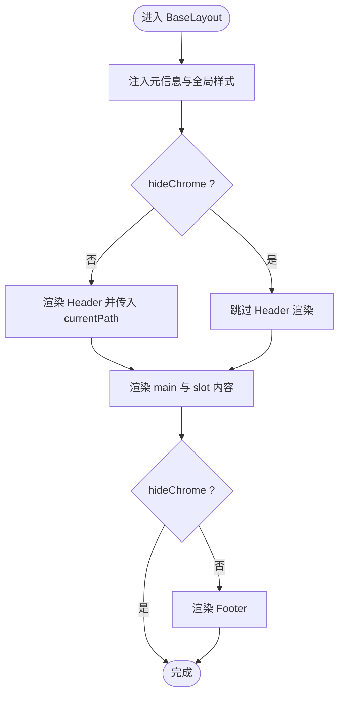
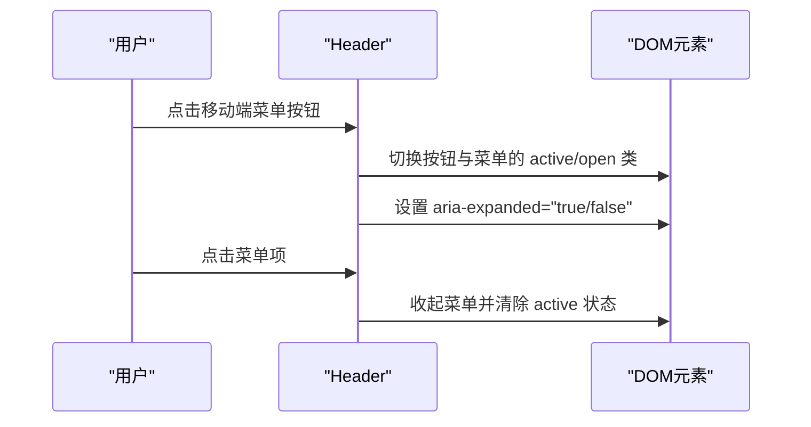
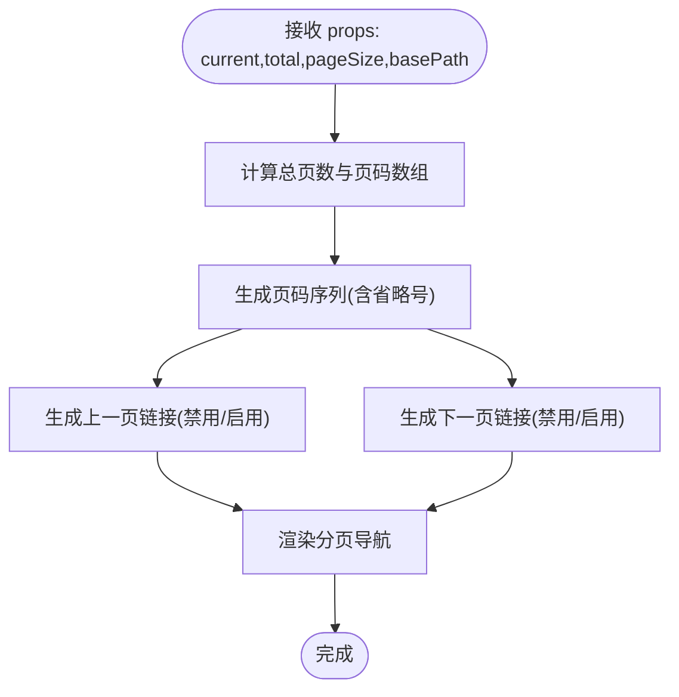
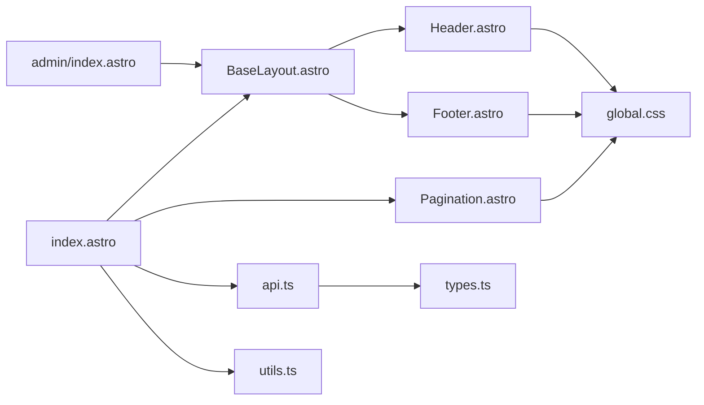

# 组件架构

<cite>
**本文引用的文件**
- [BaseLayout.astro](file://src/layouts/BaseLayout.astro)
- [Header.astro](file://src/components/Header.astro)
- [Footer.astro](file://src/components/Footer.astro)
- [Pagination.astro](file://src/components/Pagination.astro)
- [global.css](file://src/styles/global.css)
- [index.astro](file://src/pages/index.astro)
- [admin/index.astro](file://src/pages/admin/index.astro)
- [api.ts](file://src/lib/api.ts)
- [utils.ts](file://src/lib/utils.ts)
- [types.ts](file://src/lib/types.ts)
</cite>

## 目录
1. [简介](#简介)
2. [项目结构](#项目结构)
3. [核心组件](#核心组件)
4. [架构总览](#架构总览)
5. [组件详解](#组件详解)
6. [依赖关系分析](#依赖关系分析)
7. [性能考量](#性能考量)
8. [故障排查指南](#故障排查指南)
9. [结论](#结论)
10. [附录：使用示例与最佳实践](#附录使用示例与最佳实践)

## 简介
本项目采用 Astro 的组件化架构，围绕统一的 BaseLayout 布局骨架，结合 Header 导航、Footer 页脚与 Pagination 分页组件，构建了可复用、可扩展且具备良好可访问性的前端界面体系。通过 props 传递、slot 插槽与 CSS 类名覆盖，实现了页面级内容与通用骨架的解耦；同时利用全局样式与响应式断点，确保在桌面端与移动端的一致体验。

## 项目结构
- 布局层：BaseLayout 提供统一骨架，包含头部导航与页脚，并通过 slot 注入页面内容。
- 组件层：Header、Footer、Pagination 作为可复用 UI 组件，分别负责导航、页脚信息与分页逻辑。
- 页面层：各页面通过 BaseLayout 包裹自身内容，并按需引入 Pagination 等组件。
- 样式层：global.css 定义主题变量、通用样式与响应式断点，支撑组件视觉一致性。
- 工具与类型：lib 下的 api.ts、utils.ts、types.ts 提供数据请求、格式化与类型定义，贯穿组件与页面的数据流。

图表来源
- [BaseLayout.astro:1-42](file://src/layouts/BaseLayout.astro#L1-L42)
- [Header.astro:1-48](file://src/components/Header.astro#L1-L48)
- [Footer.astro:1-8](file://src/components/Footer.astro#L1-L8)
- [Pagination.astro:1-28](file://src/components/Pagination.astro#L1-L28)
- [global.css:1-233](file://src/styles/global.css#L1-L233)
- [index.astro:1-50](file://src/pages/index.astro#L1-L50)
- [admin/index.astro:1-30](file://src/pages/admin/index.astro#L1-L30)
- [api.ts:1-91](file://src/lib/api.ts#L1-L91)
- [utils.ts:1-219](file://src/lib/utils.ts#L1-L219)
- [types.ts:1-54](file://src/lib/types.ts#L1-L54)

章节来源
- [BaseLayout.astro:1-42](file://src/layouts/BaseLayout.astro#L1-L42)
- [global.css:1-233](file://src/styles/global.css#L1-L233)

## 核心组件
- BaseLayout：提供统一 HTML 结构、元信息注入、全局样式内联、API 基础地址注入以及头部/底部的条件渲染，通过 slot 接收页面内容。
- Header：提供主导航链接、移动端菜单切换、当前路由高亮判断与可访问性属性。
- Footer：提供版权与备案信息展示。
- Pagination：根据总数、每页条数与当前页生成页码序列，支持省略中间页码与“上一页/下一页”跳转。

章节来源
- [BaseLayout.astro:1-42](file://src/layouts/BaseLayout.astro#L1-L42)
- [Header.astro:1-48](file://src/components/Header.astro#L1-L48)
- [Footer.astro:1-8](file://src/components/Footer.astro#L1-L8)
- [Pagination.astro:1-28](file://src/components/Pagination.astro#L1-L28)

## 架构总览
整体采用“布局 + 组件 + 页面”的分层设计：
- 布局层负责骨架与全局资源注入；
- 组件层负责可复用 UI 与交互；
- 页面层负责业务数据加载与内容渲染；
- 样式层统一视觉规范与响应式行为；
- 工具与类型层提供数据与类型保障。

图表来源
- [index.astro:1-50](file://src/pages/index.astro#L1-L50)
- [BaseLayout.astro:1-42](file://src/layouts/BaseLayout.astro#L1-L42)
- [Header.astro:1-48](file://src/components/Header.astro#L1-L48)
- [Footer.astro:1-8](file://src/components/Footer.astro#L1-L8)
- [api.ts:1-91](file://src/lib/api.ts#L1-L91)
- [utils.ts:1-219](file://src/lib/utils.ts#L1-L219)

## 组件详解

### BaseLayout 布局组件
- 设计理念
  - 以最小必要结构承载页面骨架，集中注入全局样式与运行时变量，减少重复代码。
  - 通过 hideChrome 控制是否渲染头部与页脚，便于特定页面（如登录页）直接使用纯内容壳。
  - 使用 slot 接收页面内容，实现布局与页面内容的解耦。
- 关键实现
  - 元信息与全局样式：在 head 中注入 title/description、全局 CSS 内联与 API 基础地址。
  - 条件渲染：根据 hideChrome 控制 Header/Footer 的显示。
  - 当前路径传递：将 Astro.url.pathname 传给 Header，用于导航高亮。
- 可扩展性
  - 可通过 props 扩展更多元信息字段（如关键词、OpenGraph 等）。
  - 可增加更多 slot（如侧边栏、顶部横幅）以适配更复杂的页面结构。

图表来源
- [BaseLayout.astro:1-42](file://src/layouts/BaseLayout.astro#L1-L42)

章节来源
- [BaseLayout.astro:1-42](file://src/layouts/BaseLayout.astro#L1-L42)

### Header 导航组件
- 功能实现
  - 静态导航项与动态激活判断：基于 currentPath 判断当前页签是否激活。
  - 移动端菜单：通过按钮切换菜单展开/收起，并同步 aria 属性。
- 可访问性
  - 导航与菜单均提供 aria-label 与 aria-expanded 状态，提升屏幕阅读器可用性。
- 可定制化
  - 可通过 CSS 类名覆盖导航链接、品牌区与菜单项的样式。
  - 可在父级页面通过 props 传入更多导航项或特殊标识（如管理员入口）。

图表来源
- [Header.astro:1-48](file://src/components/Header.astro#L1-L48)

章节来源
- [Header.astro:1-48](file://src/components/Header.astro#L1-L48)

### Footer 页脚组件
- 功能实现
  - 展示备案信息链接，保持简洁一致的品牌信息呈现。
- 可定制化
  - 可通过 CSS 覆盖 footer 内部容器与链接样式，适配不同页面风格。

章节来源
- [Footer.astro:1-8](file://src/components/Footer.astro#L1-L8)

### Pagination 分页组件
- 功能实现
  - 计算总页数与页码序列：仅展示首尾与当前页附近的页码，并插入省略号分隔。
  - 跳转逻辑：根据 basePath 与当前页生成“上一页/下一页”链接。
- 可访问性
  - 使用 nav 与 aria-label 标注分页导航区域。
- 可定制化
  - 可通过 CSS 类名覆盖页码链接与省略号样式。
  - 可在父级页面传入 basePath 以适配不同路由结构。

图表来源
- [Pagination.astro:1-28](file://src/components/Pagination.astro#L1-L28)

章节来源
- [Pagination.astro:1-28](file://src/components/Pagination.astro#L1-L28)

### 页面与组件的协作
- index 页面
  - 从 API 获取文章列表，计算分页参数，按需渲染 Pagination。
  - 将页面标题与描述传递给 BaseLayout，实现 SEO 友好。
- admin 页面
  - 使用 BaseLayout 包裹后台入口卡片网格，不渲染头部与页脚（可通过 hideChrome 实现）。

章节来源
- [index.astro:1-50](file://src/pages/index.astro#L1-L50)
- [admin/index.astro:1-30](file://src/pages/admin/index.astro#L1-L30)

## 依赖关系分析
- 组件依赖
  - BaseLayout 依赖 Header、Footer，并通过 slot 接收页面内容。
  - Header 依赖全局样式以实现导航与菜单的视觉与交互。
  - Pagination 依赖全局样式中的分页链接样式。
- 数据依赖
  - 页面通过 api.ts 发起请求，utils.ts 提供格式化与富文本处理，types.ts 提供类型约束。
- 样式依赖
  - global.css 定义主题变量、组件样式与响应式断点，被 Header、Footer、Pagination 与页面共同使用。

图表来源
- [index.astro:1-50](file://src/pages/index.astro#L1-L50)
- [admin/index.astro:1-30](file://src/pages/admin/index.astro#L1-L30)
- [BaseLayout.astro:1-42](file://src/layouts/BaseLayout.astro#L1-L42)
- [Header.astro:1-48](file://src/components/Header.astro#L1-L48)
- [Footer.astro:1-8](file://src/components/Footer.astro#L1-L8)
- [Pagination.astro:1-28](file://src/components/Pagination.astro#L1-L28)
- [global.css:1-233](file://src/styles/global.css#L1-L233)
- [api.ts:1-91](file://src/lib/api.ts#L1-L91)
- [utils.ts:1-219](file://src/lib/utils.ts#L1-L219)
- [types.ts:1-54](file://src/lib/types.ts#L1-L54)

章节来源
- [api.ts:1-91](file://src/lib/api.ts#L1-L91)
- [utils.ts:1-219](file://src/lib/utils.ts#L1-L219)
- [types.ts:1-54](file://src/lib/types.ts#L1-L54)

## 性能考量
- 渲染优化
  - BaseLayout 通过内联全局样式减少额外请求；使用 class:list 动态类名，避免不必要的重排。
  - Pagination 仅渲染必要的页码与省略号，降低 DOM 节点数量。
- 交互优化
  - Header 的移动端菜单切换使用原生 DOM 事件，避免复杂状态管理开销。
- 资源优化
  - 全局样式集中管理，减少重复样式注入；响应式断点集中在一处维护，便于统一优化。
- 数据请求
  - api.ts 对请求失败进行兜底返回 null，避免页面崩溃；utils.ts 提供富文本与图片尺寸稳定化，减少布局抖动。

[本节为通用性能建议，无需具体文件分析]

## 故障排查指南
- 分页不显示
  - 检查页面是否传入 showPages 与 total/pageSize 参数，确认 Pagination 的 current/total/pageSize 是否有效。
- 导航高亮异常
  - 确认 BaseLayout 传入的 currentPath 与 Header 的 isActive 判断逻辑一致。
- 移动端菜单无法展开
  - 检查按钮与菜单的类名切换逻辑与 aria-expanded 属性是否正确更新。
- 样式未生效
  - 确认 global.css 已被 BaseLayout 正确内联，且组件类名与 CSS 选择器匹配。
- API 请求失败
  - 查看 api.ts 的错误日志输出，确认环境变量 PUBLIC_API_BASE_URL 是否正确配置。

章节来源
- [Pagination.astro:1-28](file://src/components/Pagination.astro#L1-L28)
- [Header.astro:1-48](file://src/components/Header.astro#L1-L48)
- [BaseLayout.astro:1-42](file://src/layouts/BaseLayout.astro#L1-L42)
- [global.css:1-233](file://src/styles/global.css#L1-L233)
- [api.ts:1-91](file://src/lib/api.ts#L1-L91)

## 结论
该组件架构以 BaseLayout 为核心骨架，配合 Header、Footer、Pagination 等可复用组件，实现了统一的页面结构与良好的可扩展性。通过 props 传递、slot 插槽与 CSS 类名覆盖，既保证了组件的独立性，又提供了灵活的定制空间。结合全局样式与响应式断点，确保了跨设备的一致体验。建议在后续迭代中进一步完善 SEO 元信息注入与无障碍标签，以提升整体质量。

[本节为总结性内容，无需具体文件分析]

## 附录：使用示例与最佳实践
- 在页面中使用 BaseLayout
  - 通过 props 传入标题与描述，必要时设置 hideChrome 以隐藏头部与页脚。
  - 使用 slot 注入页面内容，确保内容结构清晰、语义明确。
- 使用 Header
  - 传入 currentPath，以便自动高亮当前页签；可扩展导航项数组以支持更多入口。
- 使用 Pagination
  - 传入 current、total、pageSize 与 basePath，确保分页链接正确跳转。
- 样式定制
  - 通过覆盖组件类名（如 .page-link、.nav-link）实现风格定制；遵循 global.css 的命名约定。
- 数据与类型
  - 使用 api.ts 的封装方法发起请求，结合 types.ts 的类型定义确保数据结构安全。
- 最佳实践
  - 将通用逻辑（如导航高亮、分页计算）下沉到组件内部，页面仅负责数据与结构。
  - 保持组件无副作用，通过 props 与事件进行通信，避免直接操作 DOM。
  - 在关键交互处补充 aria-label 与 aria-expanded 等可访问性属性。

章节来源
- [index.astro:1-50](file://src/pages/index.astro#L1-L50)
- [admin/index.astro:1-30](file://src/pages/admin/index.astro#L1-L30)
- [BaseLayout.astro:1-42](file://src/layouts/BaseLayout.astro#L1-L42)
- [Header.astro:1-48](file://src/components/Header.astro#L1-L48)
- [Pagination.astro:1-28](file://src/components/Pagination.astro#L1-L28)
- [global.css:1-233](file://src/styles/global.css#L1-L233)
- [api.ts:1-91](file://src/lib/api.ts#L1-L91)
- [types.ts:1-54](file://src/lib/types.ts#L1-L54)