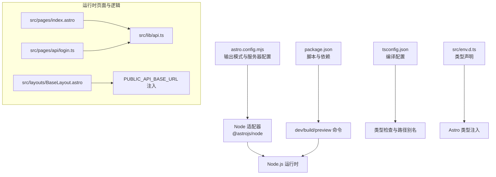
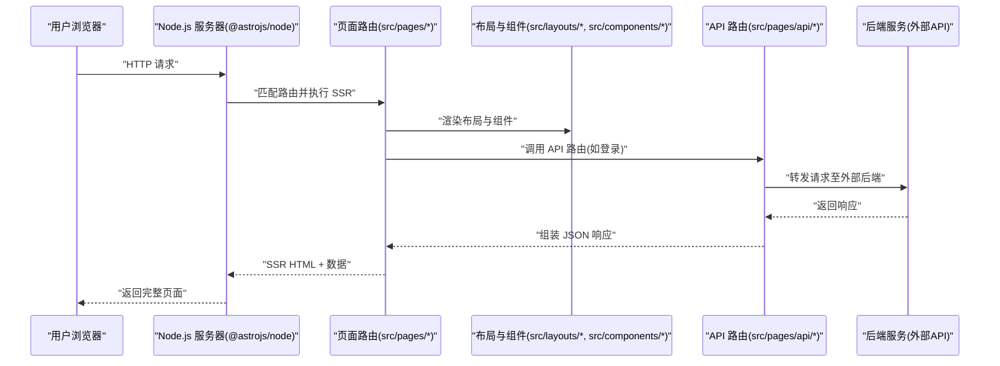
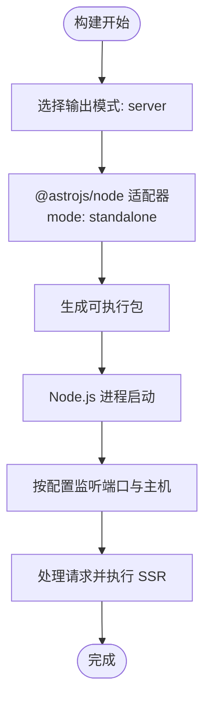
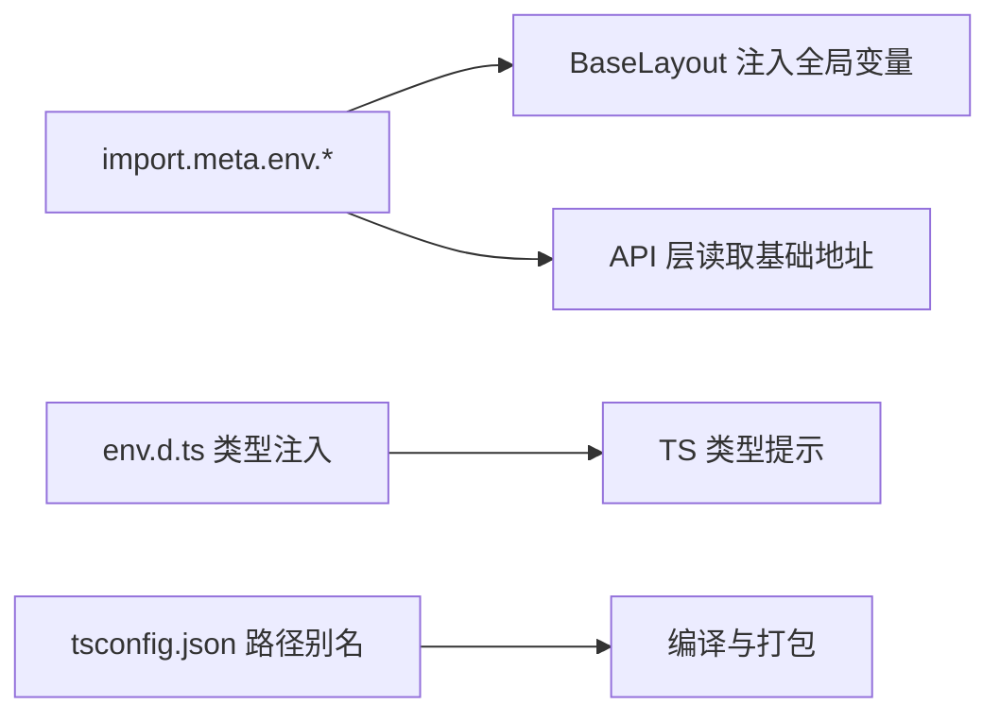
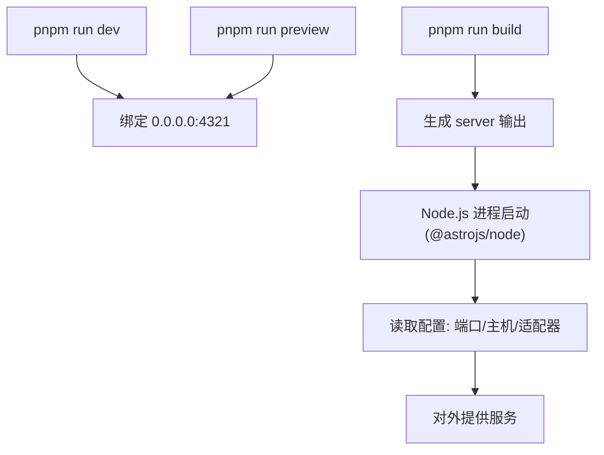
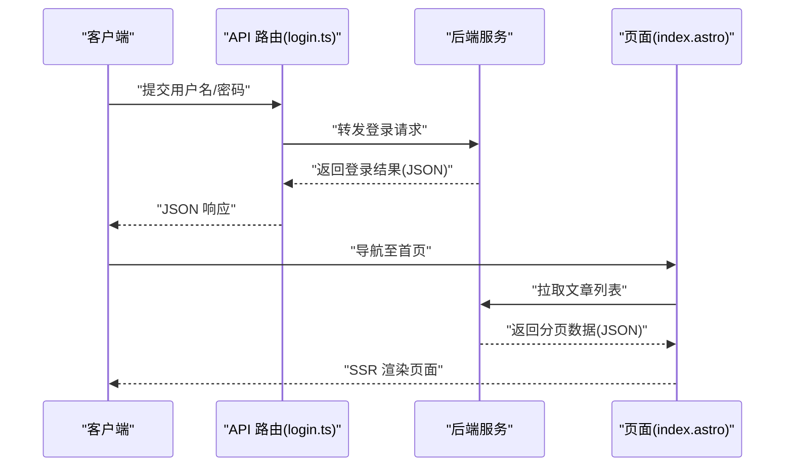
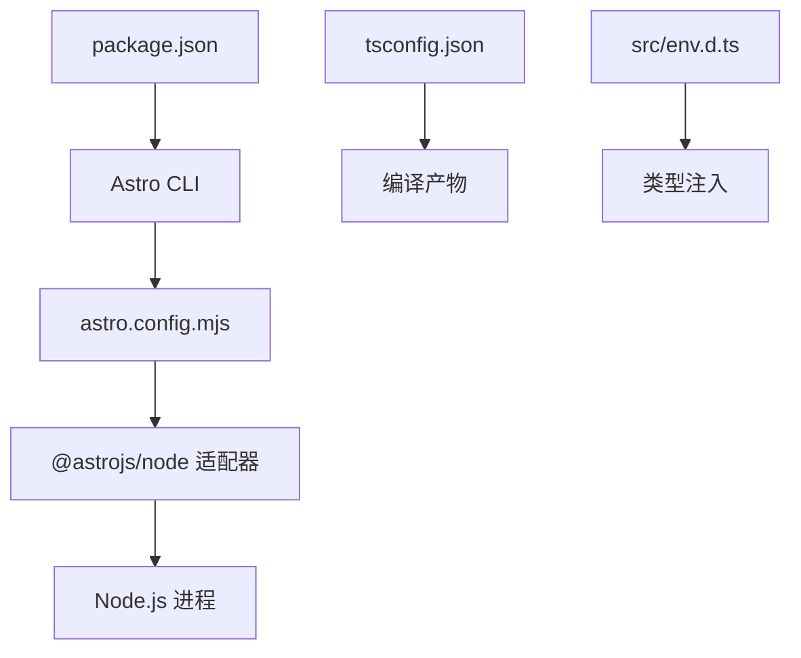

# 部署架构

<cite>
**本文引用的文件**
- [astro.config.mjs](file://astro.config.mjs)
- [package.json](file://package.json)
- [tsconfig.json](file://tsconfig.json)
- [src/env.d.ts](file://src/env.d.ts)
- [src/lib/api.ts](file://src/lib/api.ts)
- [src/lib/types.ts](file://src/lib/types.ts)
- [src/layouts/BaseLayout.astro](file://src/layouts/BaseLayout.astro)
- [src/pages/index.astro](file://src/pages/index.astro)
- [src/pages/api/login.ts](file://src/pages/api/login.ts)
- [src/pages/admin/index.astro](file://src/pages/admin/index.astro)
</cite>

## 目录
1. [简介](#简介)
2. [项目结构](#项目结构)
3. [核心组件](#核心组件)
4. [架构总览](#架构总览)
5. [详细组件分析](#详细组件分析)
6. [依赖关系分析](#依赖关系分析)
7. [性能考虑](#性能考虑)
8. [故障排查指南](#故障排查指南)
9. [结论](#结论)
10. [附录](#附录)

## 简介
本文件面向运维与开发团队，系统性说明该博客系统的部署架构与运行时配置，重点覆盖以下方面：
- Astro 的 server 输出模式与 Node.js 适配器（standalone 模式）的配置原理与优势
- 环境变量的设置、类型定义与运行时配置
- 部署流程与关键配置项（端口、主机绑定、服务器设置）
- 生产环境优化策略（构建优化、资源压缩、缓存）
- 容器化部署可能性与要点
- 不同部署场景的配置示例（传统服务器、云平台、容器化）
- 部署后的监控与维护（日志、性能监控、故障排查）

## 项目结构
该仓库采用 Astro 单体前端项目结构，核心目录与职责如下：
- src/pages：页面与 API 路由，包含静态首页、文章详情、管理后台、登录等
- src/lib：通用逻辑与类型定义，如 API 请求封装、数据类型
- src/layouts 与 src/components：布局与可复用组件
- 根目录配置：astro.config.mjs（构建与运行时服务器配置）、package.json（脚本与依赖）、tsconfig.json（TypeScript 编译配置）、src/env.d.ts（类型声明）

图表来源
- [astro.config.mjs:1-14](file://astro.config.mjs#L1-L14)
- [package.json:1-19](file://package.json#L1-L19)
- [tsconfig.json:1-11](file://tsconfig.json#L1-L11)
- [src/env.d.ts:1-3](file://src/env.d.ts#L1-L3)
- [src/lib/api.ts:1-91](file://src/lib/api.ts#L1-L91)
- [src/layouts/BaseLayout.astro:1-42](file://src/layouts/BaseLayout.astro#L1-L42)
- [src/pages/index.astro:1-50](file://src/pages/index.astro#L1-L50)
- [src/pages/api/login.ts:1-16](file://src/pages/api/login.ts#L1-L16)

章节来源
- [astro.config.mjs:1-14](file://astro.config.mjs#L1-L14)
- [package.json:1-19](file://package.json#L1-L19)
- [tsconfig.json:1-11](file://tsconfig.json#L1-L11)
- [src/env.d.ts:1-3](file://src/env.d.ts#L1-L3)

## 核心组件
- 构建与运行时配置
  - 输出模式为 server，并使用 Node.js 适配器，mode 为 standalone，便于独立打包与部署
  - 服务器监听端口与主机绑定在配置中显式设置
- 依赖与脚本
  - 使用 pnpm 管理依赖，提供 dev、build、preview 三类脚本
- 类型与环境
  - TypeScript 严格配置与路径别名；env.d.ts 注入 Astro 类型
  - 页面通过 import.meta.env 读取运行时环境变量（如 API 基础地址）

章节来源
- [astro.config.mjs:1-14](file://astro.config.mjs#L1-L14)
- [package.json:1-19](file://package.json#L1-L19)
- [tsconfig.json:1-11](file://tsconfig.json#L1-L11)
- [src/env.d.ts:1-3](file://src/env.d.ts#L1-L3)

## 架构总览
下图展示从浏览器到服务端渲染与 API 调用的总体流程，以及 Node.js 适配器在 standalone 模式下的运行形态。

图表来源
- [astro.config.mjs:1-14](file://astro.config.mjs#L1-L14)
- [src/pages/index.astro:1-50](file://src/pages/index.astro#L1-L50)
- [src/pages/api/login.ts:1-16](file://src/pages/api/login.ts#L1-L16)
- [src/lib/api.ts:1-91](file://src/lib/api.ts#L1-L91)
- [src/layouts/BaseLayout.astro:1-42](file://src/layouts/BaseLayout.astro#L1-L42)

## 详细组件分析

### Astro 服务器输出模式与 Node.js 适配器（standalone）
- 输出模式
  - 配置为 server 输出，意味着构建产物以服务端渲染为主，运行时由 Node.js 承载
- Node 适配器
  - 使用 @astrojs/node 适配器，mode 设为 standalone，具备以下优势：
    - 可独立打包为单一可执行程序，减少运行时依赖拆分
    - 更易在容器或裸机环境中直接启动
    - 便于与反向代理（Nginx/Traefik）配合部署
- 服务器设置
  - 端口与主机绑定在配置中明确，便于容器与云平台暴露端口

图表来源
- [astro.config.mjs:1-14](file://astro.config.mjs#L1-L14)

章节来源
- [astro.config.mjs:1-14](file://astro.config.mjs#L1-L14)

### 环境配置与类型定义
- 类型注入
  - env.d.ts 引入 Astro 与客户端类型，确保 import.meta.env 在 TS 下有类型提示
- 运行时变量
  - 页面与布局通过 import.meta.env 读取运行时变量（例如 PUBLIC_API_BASE_URL），用于注入全局 JS 变量
  - API 层通过 import.meta.env 读取 API 基础地址，支持在不同环境切换
- TypeScript 配置
  - 采用严格模式与路径别名，提升类型安全与工程组织性

图表来源
- [src/env.d.ts:1-3](file://src/env.d.ts#L1-L3)
- [src/layouts/BaseLayout.astro:1-42](file://src/layouts/BaseLayout.astro#L1-L42)
- [src/lib/api.ts:1-91](file://src/lib/api.ts#L1-L91)
- [tsconfig.json:1-11](file://tsconfig.json#L1-L11)

章节来源
- [src/env.d.ts:1-3](file://src/env.d.ts#L1-L3)
- [src/layouts/BaseLayout.astro:1-42](file://src/layouts/BaseLayout.astro#L1-L42)
- [src/lib/api.ts:1-91](file://src/lib/api.ts#L1-L91)
- [tsconfig.json:1-11](file://tsconfig.json#L1-L11)

### 部署流程与配置选项
- 开发与预览
  - dev/preview 均绑定 0.0.0.0 与 4321 端口，便于容器与局域网访问
- 构建与运行
  - build 生成 server 输出；运行时由 Node.js 启动，遵循配置中的端口与主机设置
- 关键配置项
  - 端口：可在配置中调整
  - 主机绑定：host 设置为 true，允许外网访问
  - 服务器设置：统一在 server 字段配置

图表来源
- [package.json:1-19](file://package.json#L1-L19)
- [astro.config.mjs:1-14](file://astro.config.mjs#L1-L14)

章节来源
- [package.json:1-19](file://package.json#L1-L19)
- [astro.config.mjs:1-14](file://astro.config.mjs#L1-L14)

### API 路由与 SSR 页面交互
- 登录 API 路由
  - 接收表单数据，调用后端登录接口，返回 JSON 响应
- 首页与布局
  - 首页通过 API 获取文章列表，布局负责注入公共变量与样式
- 类型与数据契约
  - 统一的 API 包装与分页类型，保证前后端数据一致性

图表来源
- [src/pages/api/login.ts:1-16](file://src/pages/api/login.ts#L1-L16)
- [src/pages/index.astro:1-50](file://src/pages/index.astro#L1-L50)
- [src/lib/api.ts:1-91](file://src/lib/api.ts#L1-L91)
- [src/lib/types.ts:1-54](file://src/lib/types.ts#L1-L54)

章节来源
- [src/pages/api/login.ts:1-16](file://src/pages/api/login.ts#L1-L16)
- [src/pages/index.astro:1-50](file://src/pages/index.astro#L1-L50)
- [src/lib/api.ts:1-91](file://src/lib/api.ts#L1-L91)
- [src/lib/types.ts:1-54](file://src/lib/types.ts#L1-L54)

### 管理后台与占位页面
- 管理后台入口页提供卡片式导航，指向后续迁移的发布、评论、消息等功能模块
- 当前为占位页面，保留迁移路径与交互结构

章节来源
- [src/pages/admin/index.astro:1-30](file://src/pages/admin/index.astro#L1-L30)

## 依赖关系分析
- 构建与运行链路
  - package.json 中的脚本驱动 Astro CLI，最终由 @astrojs/node 提供运行时
- 类型与环境
  - env.d.ts 与 tsconfig.json 共同保障类型安全与路径解析
- 运行时依赖
  - 依赖 astro 与 @astrojs/node；生产运行时由 Node.js 承载

图表来源
- [package.json:1-19](file://package.json#L1-L19)
- [astro.config.mjs:1-14](file://astro.config.mjs#L1-L14)
- [tsconfig.json:1-11](file://tsconfig.json#L1-L11)
- [src/env.d.ts:1-3](file://src/env.d.ts#L1-L3)

章节来源
- [package.json:1-19](file://package.json#L1-L19)
- [astro.config.mjs:1-14](file://astro.config.mjs#L1-L14)
- [tsconfig.json:1-11](file://tsconfig.json#L1-L11)
- [src/env.d.ts:1-3](file://src/env.d.ts#L1-L3)

## 性能考虑
- 构建优化
  - 使用 server 输出模式，结合 SSR 可降低首屏渲染时间，提升 SEO 与可访问性
  - 保持依赖精简，避免不必要的运行时模块
- 资源压缩
  - 在生产环境下启用压缩与缓存（建议在反向代理层配置 gzip/br 与静态资源缓存）
- 缓存策略
  - 对静态资源与 API 响应设置合理的缓存头，减少重复请求
- Node.js 与进程管理
  - 使用进程管理器（如 PM2）或容器编排（如 Docker + systemd）实现健康检查与自动重启

## 故障排查指南
- 端口占用与主机绑定
  - 若无法访问，请确认配置中的端口与主机绑定是否正确，以及防火墙/安全组放行
- 环境变量未生效
  - 检查运行时环境变量是否注入到 Node.js 进程；确认 PUBLIC_* 前缀变量在客户端可用
- API 请求失败
  - 查看网络连通性与后端服务状态；关注 API 层错误日志与返回码
- SSR 渲染异常
  - 检查页面与布局的 props 传递与数据流；确认 import.meta.env 的值在运行时正确

章节来源
- [astro.config.mjs:1-14](file://astro.config.mjs#L1-L14)
- [src/lib/api.ts:1-91](file://src/lib/api.ts#L1-L91)
- [src/layouts/BaseLayout.astro:1-42](file://src/layouts/BaseLayout.astro#L1-L42)

## 结论
该博客系统采用 Astro server 输出与 Node.js standalone 适配器，具备良好的可部署性与运行时可控性。通过明确的端口与主机配置、严格的类型体系与清晰的 API 分层，能够快速落地于传统服务器、云平台与容器化环境。建议在生产环境中结合反向代理与进程管理器，完善缓存与监控策略，确保稳定与高性能。

## 附录

### 部署场景与配置示例

- 传统服务器部署
  - 步骤
    - 在目标机器安装 Node.js 与 pnpm
    - 执行构建并运行预览命令，验证端口与主机绑定
    - 使用进程管理器（如 PM2）守护进程，配置开机自启与日志轮转
  - 关键点
    - 确保防火墙放行配置的端口
    - 将 API 基础地址通过环境变量注入

- 云平台部署（含容器编排）
  - 步骤
    - 使用容器镜像运行 Node.js 应用，暴露配置端口
    - 通过反向代理（Nginx/Traefik）做 TLS 终止与路由转发
    - 配置健康检查与自动扩缩容
  - 关键点
    - 容器内仅暴露必要端口，使用只读文件系统与非 root 用户
    - 利用环境变量区分不同环境（开发/测试/生产）

- 容器化部署要点
  - Dockerfile 建议
    - 基于官方 Node.js 镜像，设置工作目录与依赖安装顺序
    - 构建阶段与运行阶段分离，减小镜像体积
    - 设置环境变量与用户权限
  - 运行参数
    - 映射配置端口到宿主机
    - 挂载日志目录以便持久化

### 生产环境优化清单
- 构建
  - 启用最小化与 Tree-shaking
  - 分离第三方库与业务代码，利用 CDN 或私有仓库
- 运行
  - 反向代理开启压缩与缓存
  - 配置健康检查与超时重试
- 监控
  - 收集访问日志与错误日志
  - 配置性能指标（QPS、P95、错误率）与告警