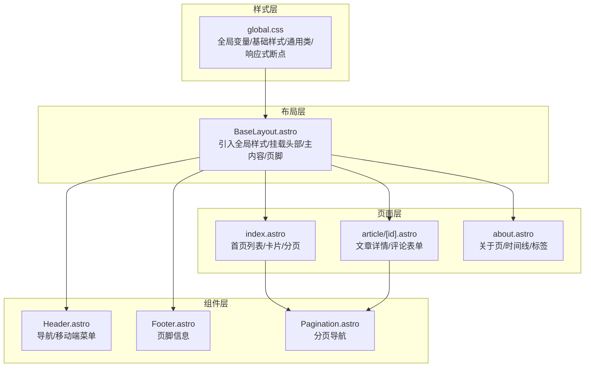
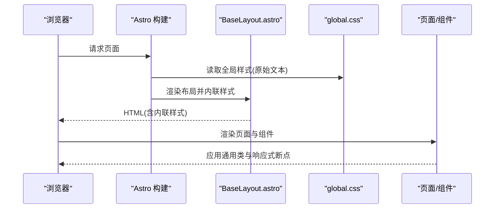
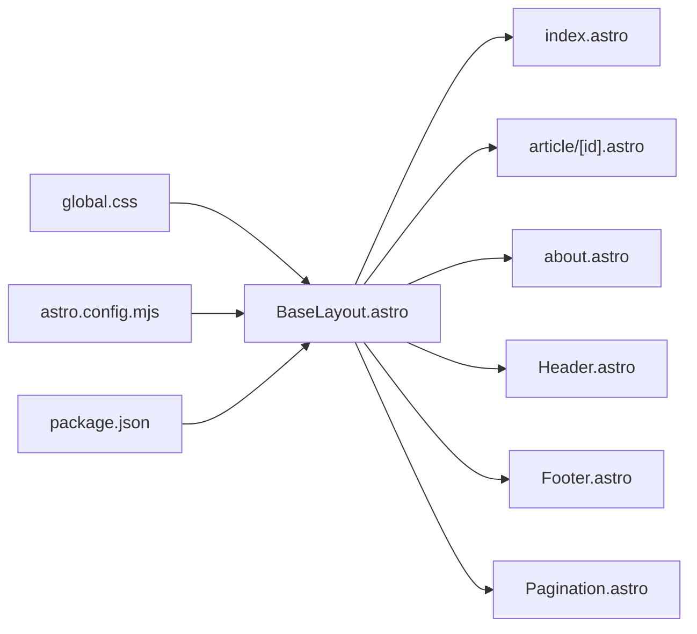

# 样式系统

<cite>
**本文引用的文件**
- [global.css](file://src/styles/global.css)
- [BaseLayout.astro](file://src/layouts/BaseLayout.astro)
- [Header.astro](file://src/components/Header.astro)
- [Footer.astro](file://src/components/Footer.astro)
- [index.astro](file://src/pages/index.astro)
- [article/[id].astro](file://src/pages/article/[id].astro)
- [Pagination.astro](file://src/components/Pagination.astro)
- [about.astro](file://src/pages/about.astro)
- [astro.config.mjs](file://astro.config.mjs)
- [package.json](file://package.json)
</cite>

## 目录
1. [简介](#简介)
2. [项目结构](#项目结构)
3. [核心组件](#核心组件)
4. [架构总览](#架构总览)
5. [详细组件分析](#详细组件分析)
6. [依赖分析](#依赖分析)
7. [性能考量](#性能考量)
8. [故障排查指南](#故障排查指南)
9. [结论](#结论)
10. [附录](#附录)

## 简介
本文件系统化梳理博客项目的样式体系，围绕全局样式组织、CSS 变量设计、主题定制、响应式布局、现代化 CSS 特性（Flexbox、Grid、自定义属性、媒体查询）、组件样式封装（隔离、命名、可维护性）、模块化最佳实践（复用、继承、性能）进行深入解析，并提供主题定制与调试建议，帮助开发者理解并扩展样式系统。

## 项目结构
样式系统采用“全局样式 + 组件样式”的分层组织方式：
- 全局样式集中于 src/styles/global.css，统一定义变量、基础排版、通用组件类与响应式断点。
- 布局层 BaseLayout.astro 引入全局样式并作为页面壳体，承载头部、主内容区与页脚。
- 页面与组件通过类名直接消费全局样式中的通用类，形成一致的视觉与交互体验。

图表来源
- [global.css](file://src/styles/global.css)
- [BaseLayout.astro](file://src/layouts/BaseLayout.astro)
- [Header.astro](file://src/components/Header.astro)
- [Footer.astro](file://src/components/Footer.astro)
- [index.astro](file://src/pages/index.astro)
- [article/[id].astro](file://src/pages/article/[id].astro)
- [Pagination.astro](file://src/components/Pagination.astro)
- [about.astro](file://src/pages/about.astro)

章节来源
- [BaseLayout.astro](file://src/layouts/BaseLayout.astro)
- [global.css](file://src/styles/global.css)

## 核心组件
- 全局样式与变量
  - 使用 CSS 自定义属性集中管理色彩、阴影、圆角、过渡、字体族等，便于主题切换与一致性维护。
  - 提供基础排版、链接、按钮、表单、卡片、分页、文章详情、评论、登录页、管理区等通用类。
- 布局壳体
  - BaseLayout.astro 将全局样式内联注入 HTML，确保首屏样式即时生效；同时挂载 Header、主内容区与 Footer。
- 头部与页脚
  - Header.astro 实现桌面端导航与移动端汉堡菜单的交互；Footer.astro 展示版权信息。
- 页面与组件
  - index.astro 使用文章卡片与分页组件；article/[id].astro 使用文章详情、评论列表与表单；about.astro 使用时间线与标签展示。

章节来源
- [global.css](file://src/styles/global.css)
- [BaseLayout.astro](file://src/layouts/BaseLayout.astro)
- [Header.astro](file://src/components/Header.astro)
- [Footer.astro](file://src/components/Footer.astro)
- [index.astro](file://src/pages/index.astro)
- [article/[id].astro](file://src/pages/article/[id].astro)
- [Pagination.astro](file://src/components/Pagination.astro)
- [about.astro](file://src/pages/about.astro)

## 架构总览
样式系统遵循“变量驱动 + 语义化类名 + 移动优先 + 响应式断点”的设计原则，通过 Astro 的内联样式能力在构建时将全局样式注入到 HTML 中，减少额外请求，提升首屏渲染性能。

图表来源
- [BaseLayout.astro](file://src/layouts/BaseLayout.astro)
- [global.css](file://src/styles/global.css)

## 详细组件分析

### 全局样式与变量设计
- 设计要点
  - 色彩系统：主色、次色、强调色、状态色（成功/危险/警告），以及背景、表面、边框、文本等层级变量，配合高亮与柔和色调用于 hover/active 状态。
  - 视觉层次：阴影、圆角、过渡时序与缓动曲线统一，保证交互一致性。
  - 字体系统：无衬线与衬线字体族变量，满足标题与正文的排版需求。
- 类型与复杂度
  - 变量集中声明，O(1) 访问成本；类选择器按需组合，避免深层嵌套带来的复杂度。
- 依赖链
  - 所有页面与组件类均依赖全局变量，形成强约束的一致性。
- 性能影响
  - 内联注入减少网络往返，变量替换在运行时开销极低。

章节来源
- [global.css](file://src/styles/global.css)

### 响应式布局与断点策略
- 断点与策略
  - 桌面端优先：默认容器宽度与间距适配宽屏；在中等屏进一步收紧容器与间距；在小屏隐藏页脚并调整导航显示。
  - 移动端优先：移动端汉堡菜单替代桌面导航，表单网格在窄屏变为单列。
- 关键断点
  - 1200px：容器宽度调整
  - 900px：容器进一步收紧、页脚隐藏、表单网格单列
  - 768px：隐藏桌面导航，显示汉堡菜单
  - 600px：容器进一步收紧、文章卡片标题缩小、评论列表改为纵向布局、登录按钮垂直排列

章节来源
- [global.css](file://src/styles/global.css)

### 组件样式封装与命名规范
- 封装原则
  - 语义化类名：如 .site-header、.article-card、.comment-item 等，直观表达用途。
  - 组合类：通过 class:list 动态组合 active、disabled 等状态类，保持单一职责。
  - 隔离与复用：通用类集中在 global.css，组件内部仅处理自身状态，避免跨组件污染。
- 命名规范
  - BEM 风格：块(.block)、元素(.block__element)、修饰符(.block--modifier)。
  - 状态类：.active、.disabled、.open 等明确状态。
- 可维护性
  - 变量驱动：颜色、尺寸、阴影、圆角、过渡统一由变量控制，修改一处即可全局生效。
  - 分层组织：基础样式、组件样式、页面样式分层清晰，降低耦合。

章节来源
- [Header.astro](file://src/components/Header.astro)
- [Pagination.astro](file://src/components/Pagination.astro)
- [index.astro](file://src/pages/index.astro)
- [article/[id].astro](file://src/pages/article/[id].astro)
- [about.astro](file://src/pages/about.astro)

### 主题定制指南
- 颜色系统
  - 修改 :root 中的主色、次色、强调色与文本/背景/边框等变量，即可完成主题切换。
  - 推荐在构建时通过环境变量或构建参数注入不同变量集，实现多主题打包。
- 字体排版
  - 通过 --font-sans 与 --font-serif 变量统一字体家族，确保标题与正文风格一致。
- 视觉设计规范
  - 圆角、阴影、过渡时序在变量中统一，避免局部破坏整体节奏。
  - 为按钮、卡片、表单等高频组件建立“变体”类（如 .btn-ghost、.link-btn--ghost），便于快速复用。

章节来源
- [global.css](file://src/styles/global.css)

### 现代化 CSS 特性应用
- Flexbox
  - 头部导航、页脚、文章卡片、评论项等广泛使用 Flexbox 进行对齐与分布。
- Grid
  - 表单网格、分页导航、管理区卡片等使用 CSS Grid 实现灵活布局。
- CSS 自定义属性
  - 全局变量集中管理，组件通过 var() 访问，便于主题切换与动态更新。
- 媒体查询
  - 在不同断点下调整容器宽度、导航显示、页脚可见性与布局密度，确保跨设备一致体验。

章节来源
- [global.css](file://src/styles/global.css)
- [Header.astro](file://src/components/Header.astro)
- [Pagination.astro](file://src/components/Pagination.astro)

### 页面与组件样式示例
- 首页列表
  - 使用 .article-list 与 .article-card 组合，卡片悬停提升与阴影变化增强交互反馈。
- 文章详情
  - 使用 .article-wrap、.post-header、.post-content、.comment-section 等类，配合标题层级与代码块样式，保证阅读体验。
- 关于页
  - 使用 .about-hero、.timeline、.timeline-item、.tech-tag 等类，构建时间线与技术栈展示。
- 登录页
  - 使用 .login-page、.login-card、.login-bg 等类，营造沉浸式背景与卡片布局。

章节来源
- [index.astro](file://src/pages/index.astro)
- [article/[id].astro](file://src/pages/article/[id].astro)
- [about.astro](file://src/pages/about.astro)
- [global.css](file://src/styles/global.css)

## 依赖分析
- 样式依赖
  - BaseLayout.astro 依赖 global.css 并将其内联注入 HTML。
  - 页面与组件通过类名依赖 global.css 中的通用类。
- 构建与运行
  - astro.config.mjs 配置输出为 server 并使用 Node 适配器，保证样式在服务端渲染时可用。
  - package.json 定义开发与构建脚本，确保本地开发与生产构建流程稳定。

图表来源
- [BaseLayout.astro](file://src/layouts/BaseLayout.astro)
- [global.css](file://src/styles/global.css)
- [astro.config.mjs](file://astro.config.mjs)
- [package.json](file://package.json)

章节来源
- [BaseLayout.astro](file://src/layouts/BaseLayout.astro)
- [global.css](file://src/styles/global.css)
- [astro.config.mjs](file://astro.config.mjs)
- [package.json](file://package.json)

## 性能考量
- 内联样式
  - BaseLayout.astro 将 global.css 以内联形式注入 HTML，减少额外请求，提升首屏渲染性能。
- 变量访问
  - CSS 自定义属性在运行时替换，开销极低；变量集中管理便于缓存与复用。
- 响应式断点
  - 合理的断点数量与最小化媒体查询规则，避免过度重排与回流。
- 图片与滚动条
  - 对图片与滚动条进行基础优化，减少不必要的绘制与滚动性能损耗。

章节来源
- [BaseLayout.astro](file://src/layouts/BaseLayout.astro)
- [global.css](file://src/styles/global.css)

## 故障排查指南
- 样式未生效
  - 检查 BaseLayout.astro 是否正确内联 global.css；确认构建配置输出为 server 并使用 Node 适配器。
- 响应式异常
  - 核对媒体查询断点是否覆盖目标设备；检查容器宽度与导航显示逻辑。
- 交互状态不一致
  - 确认 class:list 动态类组合是否正确；检查 active/disabled/open 等状态类是否被覆盖。
- 主题切换问题
  - 确认 :root 变量是否被正确注入；若使用外部主题文件，检查变量覆盖顺序与作用域。

章节来源
- [BaseLayout.astro](file://src/layouts/BaseLayout.astro)
- [global.css](file://src/styles/global.css)
- [astro.config.mjs](file://astro.config.mjs)

## 结论
该样式系统以全局变量为核心，结合语义化类名与移动优先的响应式策略，在 Astro 的内联样式支持下实现了高性能与一致性的视觉体验。通过模块化的通用类与清晰的命名规范，系统具备良好的可维护性与扩展性。建议在现有基础上继续完善主题切换机制与自动化测试，以进一步提升开发效率与质量保障。

## 附录
- 最佳实践清单
  - 使用 CSS 自定义属性统一管理设计令牌
  - 采用 BEM 风格命名，保持类名语义化
  - 移动优先策略，逐步增强桌面端体验
  - 合理使用 Flexbox 与 Grid，避免过度嵌套
  - 将通用样式集中于全局文件，组件内仅处理自身状态
  - 在构建阶段内联关键样式，减少网络往返
  - 为交互状态提供明确的类名与过渡效果
  - 为表单与按钮提供多种变体，提升复用性