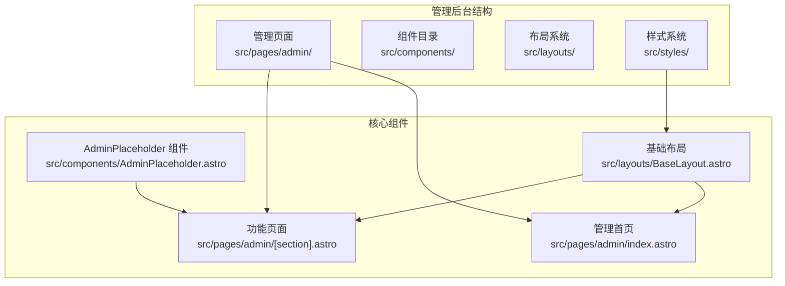
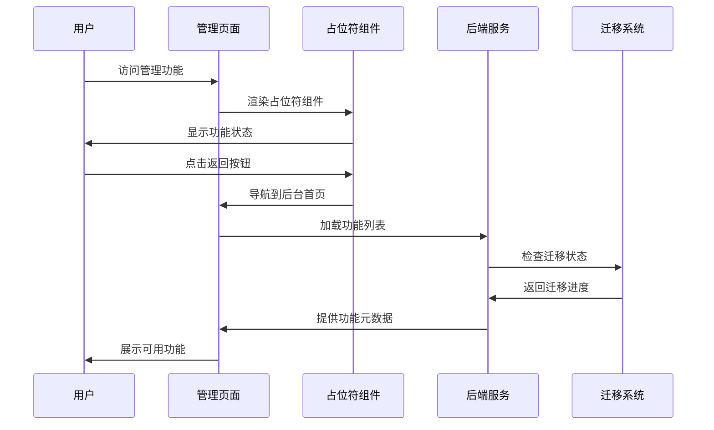
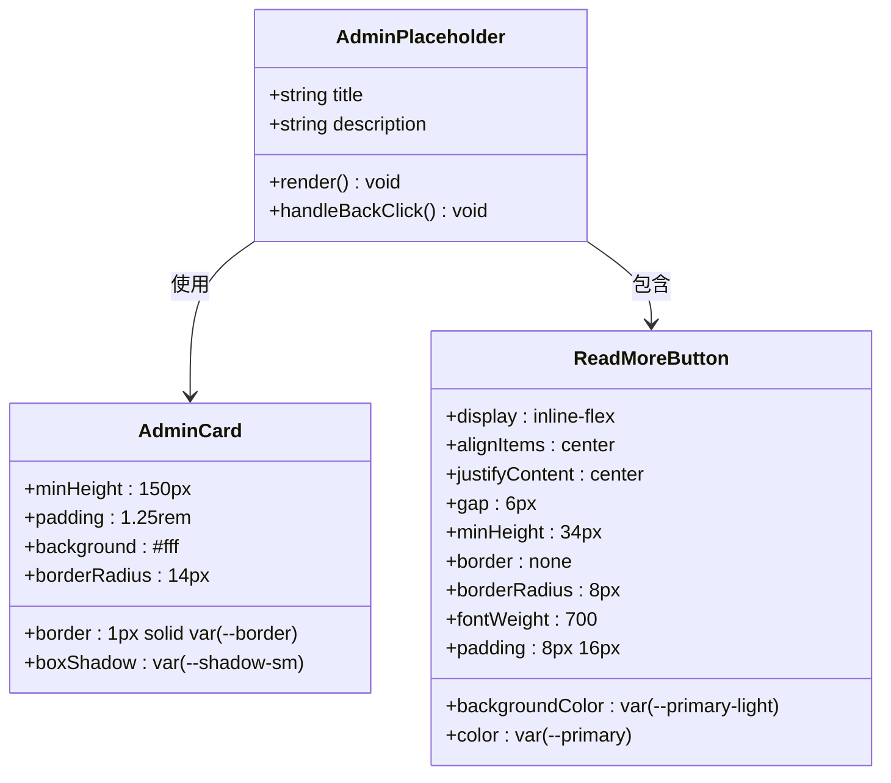
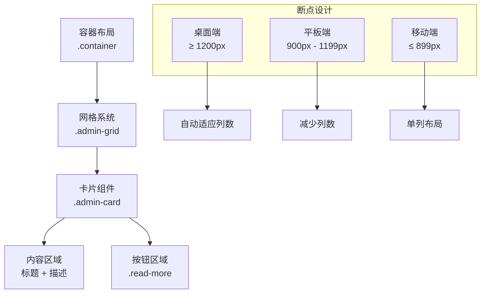
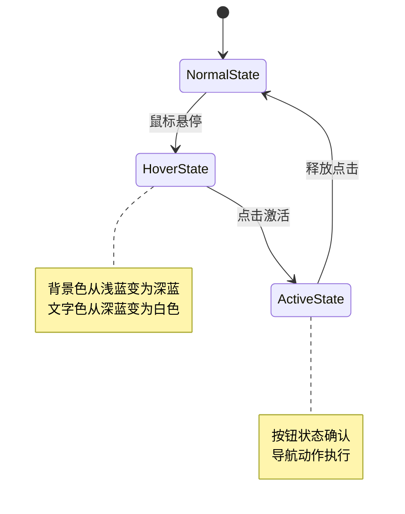
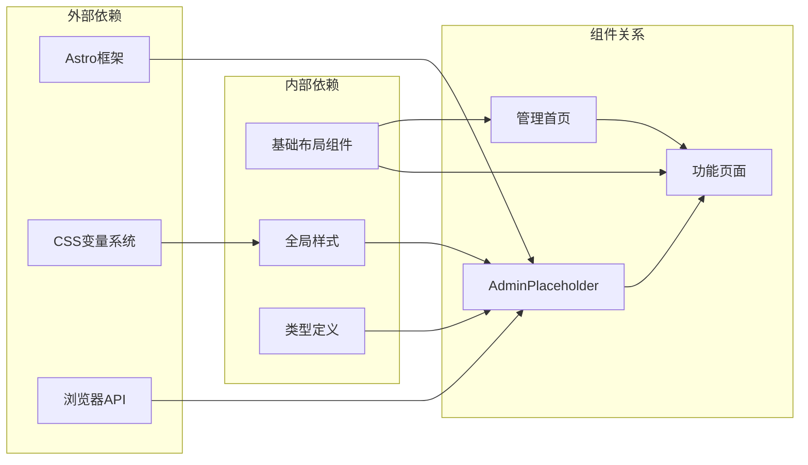

# AdminPlaceholder 管理占位符组件

<cite>
**本文档引用的文件**
- [AdminPlaceholder.astro](file://src/components/AdminPlaceholder.astro)
- [index.astro](file://src/pages/admin/index.astro)
- [section.astro](file://src/pages/admin/[section].astro)
- [BaseLayout.astro](file://src/layouts/BaseLayout.astro)
- [global.css](file://src/styles/global.css)
- [types.ts](file://src/lib/types.ts)
- [utils.ts](file://src/lib/utils.ts)
</cite>

## 目录
1. [简介](#简介)
2. [项目结构](#项目结构)
3. [核心组件](#核心组件)
4. [架构概览](#架构概览)
5. [详细组件分析](#详细组件分析)
6. [依赖关系分析](#依赖关系分析)
7. [性能考虑](#性能考虑)
8. [故障排除指南](#故障排除指南)
9. [最佳实践](#最佳实践)
10. [结论](#结论)

## 简介

AdminPlaceholder 是一个专门为管理后台开发设计的占位符组件，用于在功能开发过程中提供临时的界面展示和用户引导。该组件体现了渐进式开发的理念，允许开发者在功能完全实现之前就向用户提供清晰的进度反馈和导航指引。

该组件的核心价值在于：
- **开发效率提升**：支持并行开发多个功能模块，无需等待完整功能完成
- **用户体验优化**：为用户提供明确的功能状态说明和下一步操作指引
- **迁移路径支持**：为从传统SSR到现代静态站点生成的迁移提供过渡方案
- **可维护性增强**：通过标准化的占位符模式，降低代码复杂度和维护成本

## 项目结构

该项目采用基于功能的组织方式，管理后台相关组件位于 `src/pages/admin/` 和 `src/components/` 目录下。AdminPlaceholder 组件作为通用占位符，在管理后台的各个功能页面中发挥着重要作用。

**图表来源**
- [AdminPlaceholder.astro:1-13](file://src/components/AdminPlaceholder.astro#L1-L13)
- [index.astro:1-30](file://src/pages/admin/index.astro#L1-L30)
- [section.astro:1-25](file://src/pages/admin/[section].astro#L1-L25)

**章节来源**
- [AdminPlaceholder.astro:1-13](file://src/components/AdminPlaceholder.astro#L1-L13)
- [index.astro:1-30](file://src/pages/admin/index.astro#L1-L30)
- [section.astro:1-25](file://src/pages/admin/[section].astro#L1-L25)

## 核心组件

AdminPlaceholder 组件是一个轻量级的Astro组件，专门用于在功能开发过程中提供占位符界面。该组件的设计遵循最小化原则，仅包含必要的UI元素来传达功能状态和提供用户引导。

### 组件特性

- **响应式设计**：适配各种屏幕尺寸，确保在移动端和桌面端都有良好的显示效果
- **语义化标记**：使用标准HTML5语义标签，提升可访问性和SEO友好性
- **主题一致性**：与整体设计系统保持一致的颜色、字体和间距规范
- **可扩展性**：支持通过props传入自定义内容，满足不同场景的需求

### 视觉设计元素

组件采用卡片式设计，具有圆角边框、柔和阴影和清晰的层次感。颜色方案使用品牌主色调的浅色变体，营造专业而友好的视觉体验。

**章节来源**
- [AdminPlaceholder.astro:1-13](file://src/components/AdminPlaceholder.astro#L1-L13)
- [global.css:224-228](file://src/styles/global.css#L224-L228)

## 架构概览

AdminPlaceholder 在整个管理后台架构中扮演着桥梁的角色，连接了前端界面和后端功能开发。其工作流程体现了渐进式开发的最佳实践。

**图表来源**
- [section.astro:1-25](file://src/pages/admin/[section].astro#L1-L25)
- [index.astro:1-30](file://src/pages/admin/index.astro#L1-L30)
- [AdminPlaceholder.astro:1-13](file://src/components/AdminPlaceholder.astro#L1-L13)

### 数据流分析

组件的数据流相对简单直接，主要涉及以下步骤：
1. 接收父组件传递的标题和描述信息
2. 渲染卡片式界面布局
3. 提供返回导航功能
4. 支持用户交互反馈

**章节来源**
- [section.astro:1-25](file://src/pages/admin/[section].astro#L1-L25)
- [AdminPlaceholder.astro:1-13](file://src/components/AdminPlaceholder.astro#L1-L13)

## 详细组件分析

### 组件结构设计

AdminPlaceholder 采用了简洁而有效的结构设计，通过最少的DOM元素实现了完整的功能需求。

**图表来源**
- [AdminPlaceholder.astro:1-13](file://src/components/AdminPlaceholder.astro#L1-L13)
- [global.css:224-228](file://src/styles/global.css#L224-L228)

### 布局与样式实现

组件的布局设计充分考虑了响应式需求和用户体验，采用了现代化的CSS Grid和Flexbox技术。

#### 响应式网格系统

**图表来源**
- [global.css:224-228](file://src/styles/global.css#L224-L228)
- [global.css:229-233](file://src/styles/global.css#L229-L233)

### 交互设计分析

组件提供了直观的用户交互体验，主要体现在以下几个方面：

#### 导航反馈机制

**图表来源**
- [global.css:113-115](file://src/styles/global.css#L113-L115)

**章节来源**
- [AdminPlaceholder.astro:1-13](file://src/components/AdminPlaceholder.astro#L1-L13)
- [global.css:224-228](file://src/styles/global.css#L224-L228)

### 可定制性分析

AdminPlaceholder 提供了灵活的定制选项，以适应不同的使用场景和设计需求。

#### 主题定制选项

| 定制属性 | 默认值 | 可选值 | 说明 |
|---------|--------|--------|------|
| 颜色方案 | 品牌主色调 | 主色调系列 | 支持多种颜色变体 |
| 字体大小 | 15px | 12px-20px | 响应式字体调整 |
| 边框半径 | 14px | 8px-20px | 圆角程度调节 |
| 阴影效果 | 中等阴影 | 无/小/中/大 | 层次感控制 |

#### 内容定制能力

组件支持通过props传入自定义的标题和描述内容，实现内容的完全本地化。

**章节来源**
- [AdminPlaceholder.astro:1-13](file://src/components/AdminPlaceholder.astro#L1-L13)
- [section.astro:1-25](file://src/pages/admin/[section].astro#L1-L25)

## 依赖关系分析

AdminPlaceholder 组件的依赖关系相对简单，主要依赖于基础布局系统和样式资源。

**图表来源**
- [AdminPlaceholder.astro:1-13](file://src/components/AdminPlaceholder.astro#L1-L13)
- [BaseLayout.astro:1-42](file://src/layouts/BaseLayout.astro#L1-L42)
- [global.css:1-233](file://src/styles/global.css#L1-L233)

### 外部依赖分析

组件对外部依赖的使用非常谨慎，主要依赖于：
- **Astro框架**：提供组件渲染和生命周期管理
- **CSS变量系统**：确保主题一致性和可定制性
- **浏览器原生API**：处理基本的DOM操作和事件处理

### 内部依赖关系

组件与项目其他部分的集成关系清晰明确：
- 与基础布局系统的无缝集成
- 与全局样式的统一协调
- 与类型定义的强类型约束

**章节来源**
- [AdminPlaceholder.astro:1-13](file://src/components/AdminPlaceholder.astro#L1-L13)
- [BaseLayout.astro:1-42](file://src/layouts/BaseLayout.astro#L1-L42)
- [global.css:1-233](file://src/styles/global.css#L1-L233)

## 性能考虑

AdminPlaceholder 组件在设计时充分考虑了性能优化，采用了多种策略来确保最佳的用户体验。

### 渲染性能优化

- **轻量级DOM结构**：仅包含必要的HTML元素，减少DOM树深度
- **CSS原生动画**：使用硬件加速的CSS变换，避免JavaScript动画的性能开销
- **懒加载支持**：为图片和其他媒体资源提供懒加载机制

### 内存使用优化

- **无状态设计**：组件不维护内部状态，减少内存占用
- **事件委托**：通过事件冒泡机制处理用户交互，避免过多事件监听器
- **资源复用**：利用CSS变量和样式复用，减少重复计算

### 网络传输优化

- **内联样式**：关键样式内联，减少额外的HTTP请求
- **压缩资源**：CSS和JavaScript经过压缩处理
- **缓存策略**：合理利用浏览器缓存机制

## 故障排除指南

在使用 AdminPlaceholder 组件时，可能会遇到以下常见问题及解决方案：

### 样式显示异常

**问题症状**：组件样式错乱或颜色不正确
**可能原因**：
- 全局样式未正确加载
- CSS变量未定义
- 浏览器兼容性问题

**解决方法**：
1. 检查全局样式文件是否正确导入
2. 验证CSS变量定义是否完整
3. 确认目标浏览器支持相关CSS特性

### 内容显示问题

**问题症状**：标题或描述内容不显示
**可能原因**：
- props参数传递错误
- 数据类型不匹配
- 字符编码问题

**解决方法**：
1. 确保正确传递title和description参数
2. 验证数据类型为字符串
3. 检查特殊字符的编码处理

### 交互功能失效

**问题症状**：按钮点击无响应
**可能原因**：
- 事件绑定失败
- JavaScript执行错误
- 样式覆盖问题

**解决方法**：
1. 检查事件监听器的绑定情况
2. 查看浏览器控制台的错误信息
3. 确认CSS样式没有覆盖点击区域

**章节来源**
- [AdminPlaceholder.astro:1-13](file://src/components/AdminPlaceholder.astro#L1-L13)
- [global.css:1-233](file://src/styles/global.css#L1-L233)

## 最佳实践

基于对AdminPlaceholder组件的深入分析，以下是使用该组件的最佳实践建议：

### 设计原则

1. **保持简洁性**：遵循最小化设计原则，避免不必要的视觉元素
2. **确保可访问性**：提供足够的对比度和适当的焦点指示器
3. **响应式优先**：从移动设备开始设计，然后扩展到更大的屏幕
4. **一致性原则**：与整体设计系统保持一致的风格和行为

### 开发建议

1. **模块化设计**：将功能分解为独立的组件，便于测试和维护
2. **类型安全**：充分利用TypeScript的类型检查，确保数据完整性
3. **错误处理**：为可能出现的异常情况提供优雅的降级方案
4. **性能监控**：定期检查组件的性能表现，及时发现和解决问题

### 集成模式

1. **渐进式开发**：先实现占位符组件，再逐步完善功能实现
2. **A/B测试**：对不同的设计方案进行对比测试
3. **用户反馈**：收集用户意见，持续改进组件体验
4. **文档维护**：保持组件文档的实时更新，便于团队协作

### 维护策略

1. **版本管理**：建立清晰的版本发布流程
2. **回归测试**：为重要功能编写自动化测试用例
3. **性能基准**：建立性能指标监控体系
4. **知识分享**：定期组织技术分享会，提升团队技能

## 结论

AdminPlaceholder 组件虽然看似简单，但体现了现代前端开发中的几个重要理念：渐进式开发、用户体验优先和可维护性设计。该组件在管理后台开发中发挥着不可替代的作用，为功能的逐步完善提供了稳定的界面支撑。

通过本文档的详细分析，我们看到了组件在架构设计、视觉实现、交互体验和可定制性方面的优秀表现。同时，也明确了在实际使用中需要注意的关键点和最佳实践。

随着项目的不断发展，AdminPlaceholder 组件将继续演进，为管理后台的现代化建设贡献其独特价值。建议团队在后续开发中继续坚持本文档提出的设计原则和实践建议，确保组件的质量和用户体验。