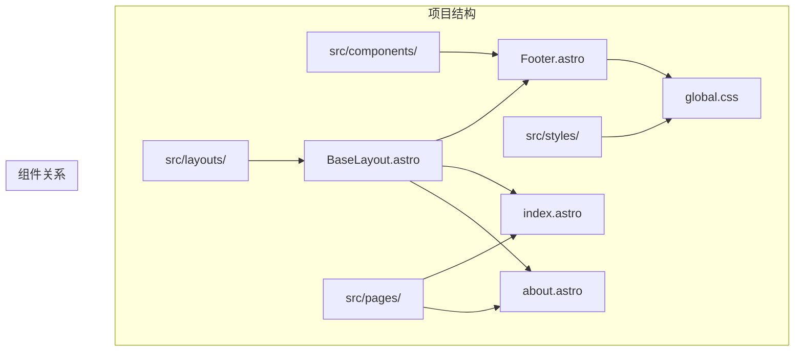
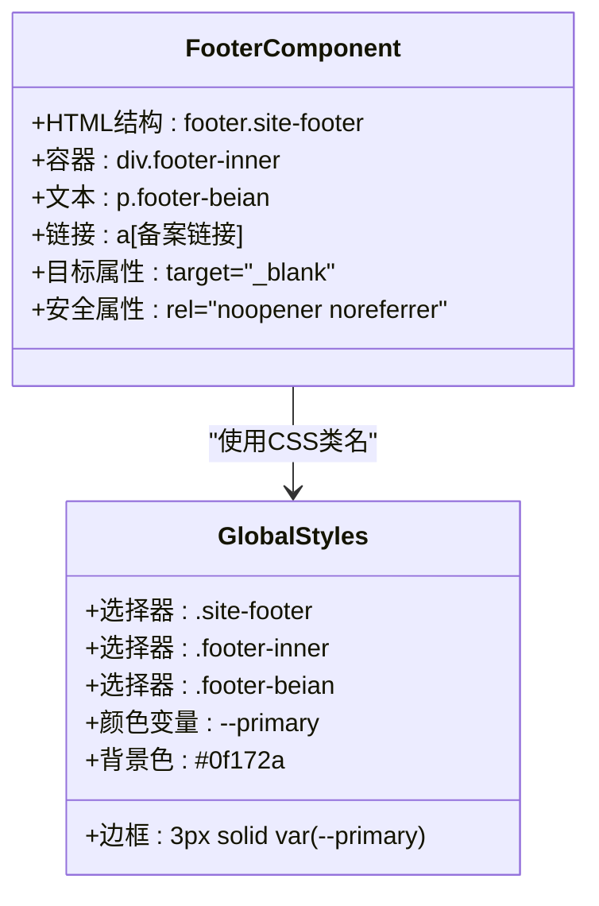
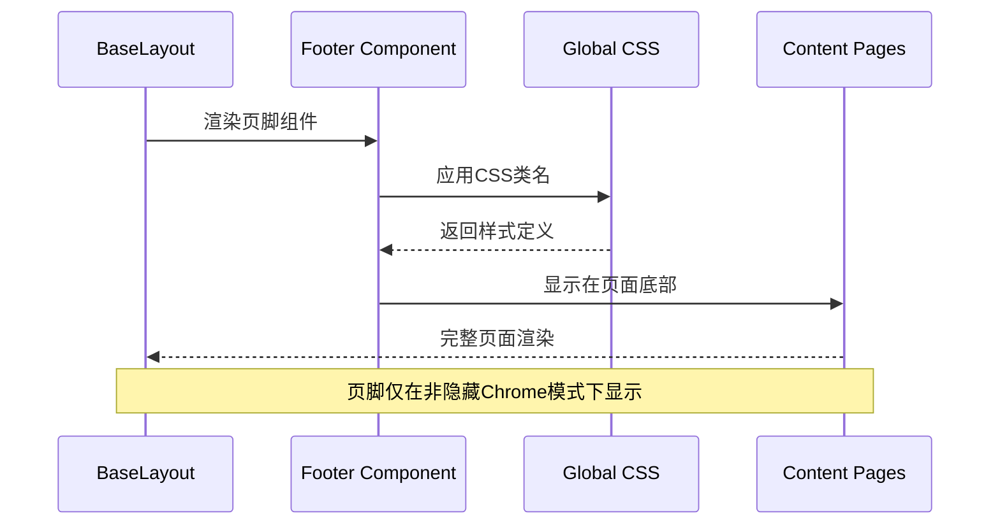
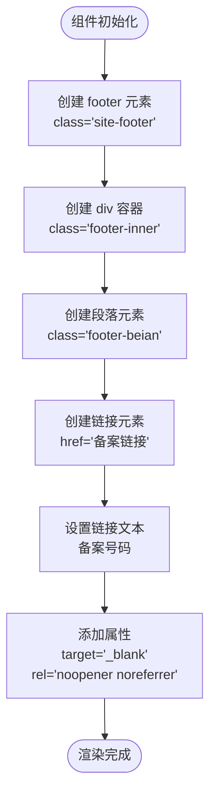
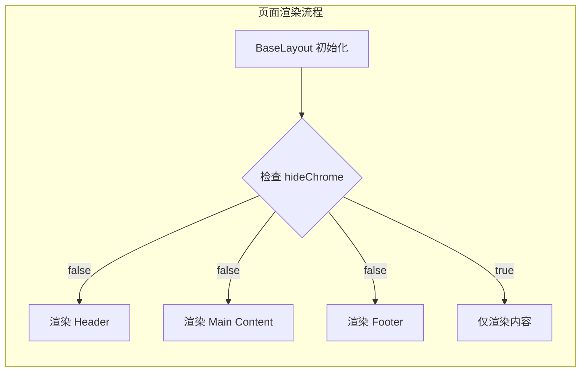
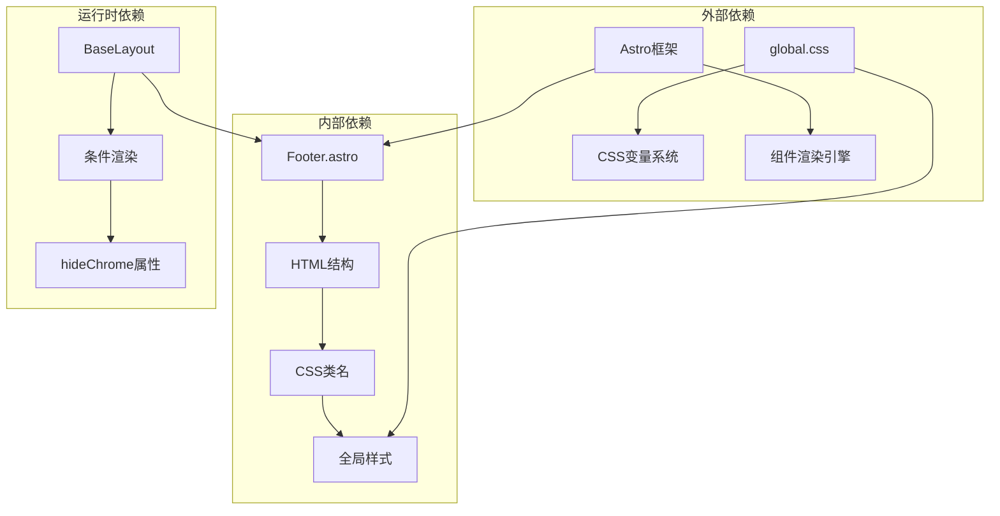

# Footer 页脚组件

<cite>
**本文档引用的文件**
- [Footer.astro](file://src/components/Footer.astro)
- [BaseLayout.astro](file://src/layouts/BaseLayout.astro)
- [global.css](file://src/styles/global.css)
- [Header.astro](file://src/components/Header.astro)
- [index.astro](file://src/pages/index.astro)
- [about.astro](file://src/pages/about.astro)
</cite>

## 目录
1. [简介](#简介)
2. [项目结构](#项目结构)
3. [核心组件](#核心组件)
4. [架构概览](#架构概览)
5. [详细组件分析](#详细组件分析)
6. [依赖关系分析](#依赖关系分析)
7. [性能考虑](#性能考虑)
8. [故障排除指南](#故障排除指南)
9. [结论](#结论)

## 简介

Footer 页脚组件是本博客项目中负责展示版权信息和备案信息的核心组件。该组件采用简洁的设计理念，专注于提供必要的法律合规信息，同时保持与整体设计系统的视觉一致性。组件通过 Astro 框架构建，使用现代化的 CSS 变量系统，确保在不同设备上的良好显示效果。

## 项目结构

Footer 组件位于项目的组件目录中，与 Header 组件形成完整的页面头部和尾部结构。该组件通过 BaseLayout 布局系统进行集成，实现了统一的页面框架。

**图表来源**
- [Footer.astro:1-8](file://src/components/Footer.astro#L1-L8)
- [BaseLayout.astro:1-42](file://src/layouts/BaseLayout.astro#L1-L42)
- [global.css:92-97](file://src/styles/global.css#L92-L97)

**章节来源**
- [Footer.astro:1-8](file://src/components/Footer.astro#L1-L8)
- [BaseLayout.astro:1-42](file://src/layouts/BaseLayout.astro#L1-L42)

## 核心组件

Footer 组件是一个轻量级的静态组件，主要功能是展示网站的版权信息和备案号码。组件结构简单明了，包含以下关键元素：

### 组件结构分析

**图表来源**
- [Footer.astro:1-7](file://src/components/Footer.astro#L1-L7)
- [global.css:92-97](file://src/styles/global.css#L92-L97)

### 功能特性

- **法律合规**: 展示中华人民共和国工业和信息化部备案信息
- **链接安全**: 使用 `target="_blank"` 和 `rel="noopener noreferrer"` 提升安全性
- **响应式设计**: 在小屏幕设备上自动隐藏，避免遮挡内容
- **品牌一致性**: 使用项目主题色系，保持视觉统一

**章节来源**
- [Footer.astro:1-7](file://src/components/Footer.astro#L1-L7)
- [global.css:92-97](file://src/styles/global.css#L92-L97)

## 架构概览

Footer 组件在整个应用架构中扮演着重要的角色，它与布局系统、样式系统和页面系统紧密协作。

**图表来源**
- [BaseLayout.astro:34-38](file://src/layouts/BaseLayout.astro#L34-L38)
- [Footer.astro:1-7](file://src/components/Footer.astro#L1-L7)

### 集成点分析

Footer 组件通过 BaseLayout 布局系统进行集成，实现了以下集成特性：

- **条件渲染**: 仅在 `hideChrome` 为 false 时显示
- **全局样式**: 自动继承项目全局样式定义
- **响应式行为**: 根据屏幕尺寸自动调整显示状态

**章节来源**
- [BaseLayout.astro:34-38](file://src/layouts/BaseLayout.astro#L34-L38)

## 详细组件分析

### HTML 结构分析

Footer 组件采用语义化的 HTML 结构，确保良好的可访问性和SEO表现：

**图表来源**
- [Footer.astro:1-7](file://src/components/Footer.astro#L1-L7)

### 样式设计分析

Footer 组件的样式设计体现了现代网页设计的最佳实践：

#### 颜色系统
- **主色调**: 使用项目主题色 `var(--primary)` 作为边框强调色
- **背景色**: 深色背景 `#0f172a` 提供对比度和专业感
- **文字颜色**: 使用 `var(--text-light)` 确保可读性

#### 布局特性
- **绝对定位**: 使用 `position: absolute` 确保页脚固定在页面底部
- **宽度控制**: `width: 100%` 占满整个页面宽度
- **内边距**: `padding: 14px 2rem` 提供适当的留白空间

#### 响应式策略
- **小屏幕隐藏**: 在 900px 以下自动隐藏，避免遮挡主要内容
- **居中对齐**: 使用 `justify-content: center` 实现水平居中
- **弹性布局**: 支持内容换行和弹性调整

**章节来源**
- [global.css:92-97](file://src/styles/global.css#L92-L97)
- [global.css:229-233](file://src/styles/global.css#L229-L233)

### 可定制性分析

虽然当前版本的 Footer 组件相对简单，但仍具备一定的可定制能力：

#### 当前可定制项
- **备案号码**: 可直接修改链接文本内容
- **链接地址**: 可修改备案链接的目标URL
- **样式覆盖**: 可通过自定义CSS覆盖默认样式

#### 扩展建议
基于现有架构，可以考虑以下扩展方向：
- 添加多个备案信息支持
- 集成社交媒体链接
- 支持多语言切换
- 添加版权年份动态更新

**章节来源**
- [Footer.astro:3-5](file://src/components/Footer.astro#L3-L5)

### 使用示例和集成方法

#### 基础使用
Footer 组件通过 BaseLayout 自动集成到所有页面中：

**图表来源**
- [BaseLayout.astro:34-38](file://src/layouts/BaseLayout.astro#L34-L38)

#### 在不同页面的应用
Footer 组件在所有页面中保持一致的显示效果，包括：
- **首页**: 展示在文章列表下方
- **详情页**: 展示在文章内容下方  
- **关于页面**: 展示在页面底部
- **管理页面**: 在启用Chrome时显示

**章节来源**
- [BaseLayout.astro:34-38](file://src/layouts/BaseLayout.astro#L34-L38)
- [index.astro:1-50](file://src/pages/index.astro#L1-L50)
- [about.astro:1-80](file://src/pages/about.astro#L1-L80)

## 依赖关系分析

Footer 组件的依赖关系相对简单，主要依赖于全局样式系统：

**图表来源**
- [Footer.astro:1-7](file://src/components/Footer.astro#L1-L7)
- [BaseLayout.astro:34-38](file://src/layouts/BaseLayout.astro#L34-L38)
- [global.css:1-29](file://src/styles/global.css#L1-L29)

### 依赖特性

- **零外部依赖**: 不依赖任何第三方库或框架
- **样式解耦**: 通过CSS类名与全局样式系统解耦
- **运行时条件**: 依赖 BaseLayout 的运行时属性判断

**章节来源**
- [Footer.astro:1-7](file://src/components/Footer.astro#L1-L7)
- [BaseLayout.astro:34-38](file://src/layouts/BaseLayout.astro#L34-L38)

## 性能考虑

Footer 组件由于其简单性，在性能方面表现出色：

### 渲染性能
- **轻量级结构**: 仅包含少量DOM元素，渲染开销极小
- **静态内容**: 备案信息为静态内容，无需动态计算
- **缓存友好**: CSS类名可被浏览器有效缓存

### 样式性能
- **CSS变量优化**: 使用CSS变量减少样式计算开销
- **简化解析**: 样式规则简单，浏览器解析速度快
- **响应式优化**: 媒体查询仅在断点处触发

### 内存占用
- **极低内存**: 组件结构简单，内存占用可忽略不计
- **无事件监听**: 不需要JavaScript事件处理

## 故障排除指南

### 常见问题及解决方案

#### 页脚不显示
**问题描述**: 页脚在某些页面不显示
**可能原因**: `hideChrome` 属性被设置为 true
**解决方法**: 检查 BaseLayout 的 `hideChrome` 参数设置

#### 样式异常
**问题描述**: 页脚样式不符合预期
**可能原因**: 全局CSS变量被覆盖或样式冲突
**解决方法**: 检查 `global.css` 中的相关样式定义

#### 链接安全问题
**问题描述**: 备案链接存在安全风险
**解决方法**: 确认 `rel="noopener noreferrer"` 属性正确设置

#### 移动端显示问题
**问题描述**: 小屏幕设备上页脚被内容遮挡
**解决方法**: 检查媒体查询断点设置和 `#app-shell` 的底部留白

**章节来源**
- [BaseLayout.astro:34-38](file://src/layouts/BaseLayout.astro#L34-L38)
- [global.css:229-233](file://src/styles/global.css#L229-L233)

## 结论

Footer 页脚组件虽然结构简单，但体现了现代Web开发的最佳实践。组件通过精简的设计实现了明确的功能定位：提供必要的法律合规信息，同时保持与整体设计系统的和谐统一。

### 设计优势
- **简洁高效**: 最小化复杂度，最大化实用性
- **响应式友好**: 自动适应不同设备和屏幕尺寸
- **可维护性强**: 代码结构清晰，易于理解和修改
- **性能优异**: 轻量级实现，不影响页面加载性能

### 改进建议
基于当前实现，建议在未来版本中考虑：
- 增加多语言支持
- 扩展为可配置的通用页脚组件
- 添加社交媒体链接集成
- 支持动态内容更新

Footer 组件作为博客项目的基础组件之一，为整个应用提供了稳定可靠的页脚功能，是项目架构中不可或缺的重要组成部分。