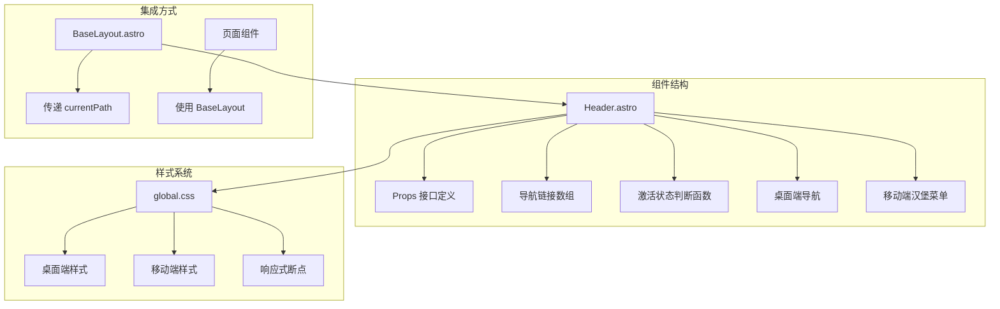
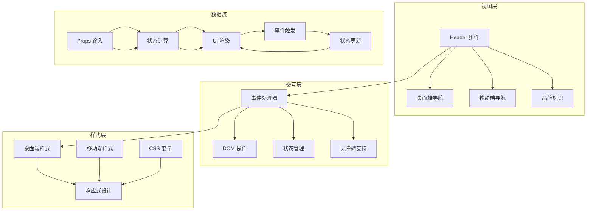
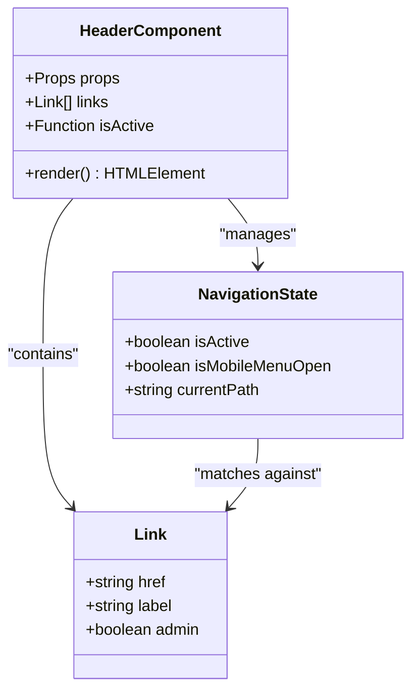
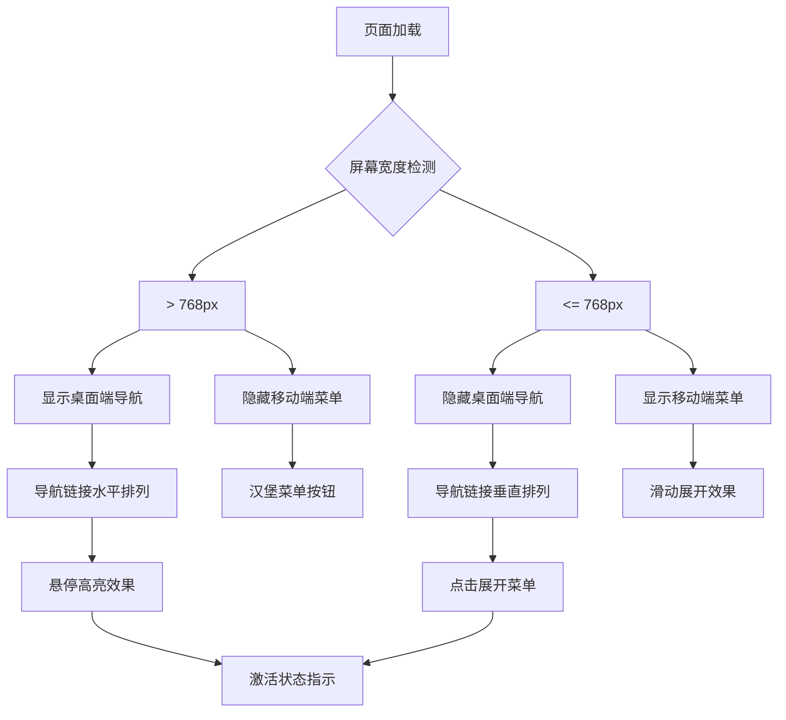
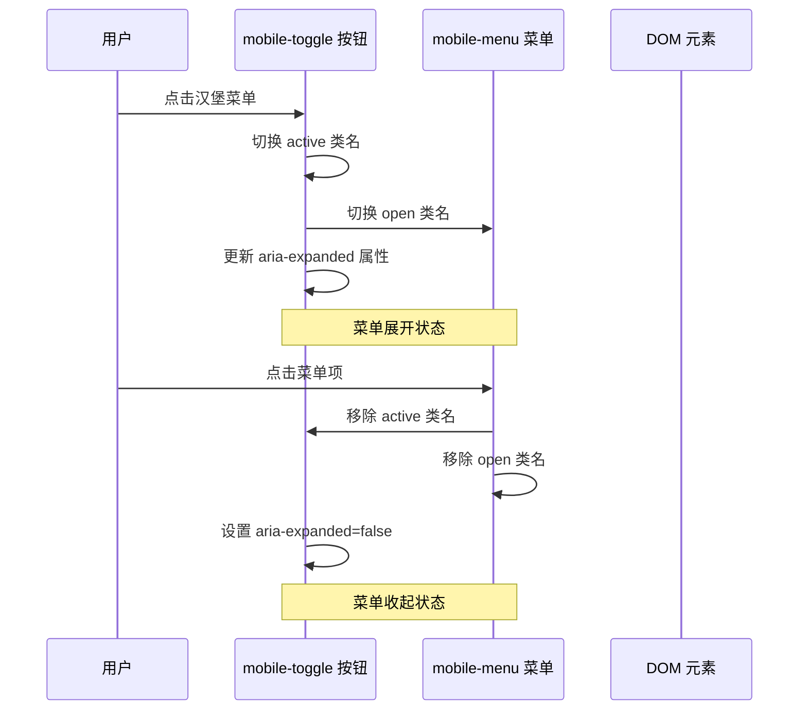
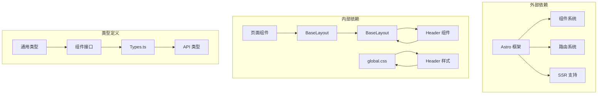

# Header 导航组件

<cite>
**本文档引用的文件**
- [Header.astro](file://src/components/Header.astro)
- [BaseLayout.astro](file://src/layouts/BaseLayout.astro)
- [global.css](file://src/styles/global.css)
- [types.ts](file://src/lib/types.ts)
- [package.json](file://package.json)
</cite>

## 目录
1. [简介](#简介)
2. [项目结构](#项目结构)
3. [核心组件](#核心组件)
4. [架构概览](#架构概览)
5. [详细组件分析](#详细组件分析)
6. [依赖关系分析](#依赖关系分析)
7. [性能考虑](#性能考虑)
8. [故障排除指南](#故障排除指南)
9. [结论](#结论)

## 简介

Header 组件是博客项目的导航栏组件，采用 Astro 框架构建，提供了响应式的桌面端和移动端导航体验。该组件实现了现代化的导航设计，包含品牌标识、主导航链接和移动汉堡菜单功能。组件通过简洁的 API 设计，支持灵活的导航配置和样式定制。

## 项目结构

Header 组件位于 `src/components/Header.astro` 文件中，采用 Astro 的单文件组件格式，结合了 TypeScript 接口定义、模板语法和内联样式。组件通过 Astro 的 props 系统接收外部传入的路径信息，并根据当前路径动态高亮激活状态。



**图表来源**
- [Header.astro:1-48](file://src/components/Header.astro#L1-L48)
- [BaseLayout.astro:34](file://src/layouts/BaseLayout.astro#L34)

**章节来源**
- [Header.astro:1-48](file://src/components/Header.astro#L1-L48)
- [BaseLayout.astro:1-42](file://src/layouts/BaseLayout.astro#L1-L42)

## 核心组件

### Props 接口定义

Header 组件的 Props 接口设计简洁明了，只包含一个可选参数 `currentPath`：

```typescript
interface Props {
  currentPath?: string;
}
```

**参数说明：**
- `currentPath`: 当前页面的路径字符串，默认值为 `'/'`
- 类型：`string`
- 默认行为：当未提供路径时，默认指向根路径

**实现细节：**
- 使用 Astro 的 props 解构语法进行默认值处理
- 支持从父组件传递动态路径信息
- 与 Astro 的路由系统无缝集成

### 导航链接数组结构

组件内部定义了固定的导航链接数组，每个链接对象包含两个必需字段：

```typescript
const links = [
  { href: '/', label: '连篇累牍' },
  { href: '/msg', label: '微言大义' },
  { href: '/about', label: '关于博客' }
];
```

**字段说明：**
- `href`: 链接的目标地址，用于导航跳转
- `label`: 显示文本，用于用户界面展示
- 支持国际化：当前使用中文标签，可根据需要扩展多语言支持

### 激活状态判断逻辑

isActive 函数实现了智能的路径匹配算法：

```typescript
const isActive = (href: string) => href === '/' ? currentPath === '/' : currentPath.startsWith(href);
```

**匹配规则：**
1. **根路径特殊处理**：当目标 href 为 `'/'` 时，只有当 `currentPath` 也等于 `'/'` 时才激活
2. **子路径匹配**：对于其他路径，使用 `startsWith` 方法检查当前路径是否以目标路径开头
3. **精确匹配**：根路径需要完全相等才能激活
4. **前缀匹配**：非根路径使用前缀匹配，支持嵌套路由的激活状态

**匹配示例：**
- 当前路径为 `/` 时，只有 `/` 路径激活
- 当前路径为 `/about/team` 时，`/about` 路径激活
- 当前路径为 `/admin/dashboard` 时，`/admin` 路径激活

**章节来源**
- [Header.astro:2-12](file://src/components/Header.astro#L2-L12)

## 架构概览

Header 组件采用了分层架构设计，将视图层、交互层和样式层分离：



**图表来源**
- [Header.astro:14-47](file://src/components/Header.astro#L14-L47)
- [global.css:62-90](file://src/styles/global.css#L62-L90)

## 详细组件分析

### 组件结构设计

Header 组件采用语义化的 HTML 结构，确保良好的可访问性和 SEO 表现：



**图表来源**
- [Header.astro:2-12](file://src/components/Header.astro#L2-L12)

### 响应式设计实现

组件实现了完整的响应式导航系统，针对不同屏幕尺寸提供优化的用户体验：



**图表来源**
- [global.css:231](file://src/styles/global.css#L231)

**断点配置：**
- **桌面端**：768px 以上，显示完整导航
- **移动端**：768px 及以下，显示汉堡菜单
- **额外断点**：600px 以下进一步优化移动端体验

### DOM 操作和事件处理

组件使用原生 JavaScript 实现移动端交互功能：



**图表来源**
- [Header.astro:34-46](file://src/components/Header.astro#L34-L46)

**事件处理机制：**
1. **点击事件监听**：为汉堡菜单按钮添加点击事件处理器
2. **状态切换**：通过类名切换控制菜单展开/收起
3. **无障碍支持**：动态更新 `aria-expanded` 属性
4. **事件冒泡处理**：菜单项点击时自动收起菜单

### 无障碍设计考虑

组件充分考虑了无障碍访问需求，提供了完整的辅助功能支持：

**ARIA 属性设计：**
- `aria-label="主导航"`：为导航容器提供描述性标签
- `aria-label="打开菜单"`：为汉堡菜单按钮提供操作提示
- `aria-expanded="false"`：动态反映菜单展开状态

**键盘导航支持：**
- 自动焦点管理
- 键盘可访问的交互元素
- 屏幕阅读器友好

### 样式系统分析

组件使用 CSS 变量和现代 CSS 技术实现灵活的样式定制：

```mermaid
graph LR
subgraph "CSS 变量系统"
A[--primary] --> B[主色调]
C[--primary-light] --> D[浅色主色调]
E[--text] --> F[文本颜色]
G[--bg] --> H[背景色]
end
subgraph "响应式断点"
I[@media 768px] --> J[移动端样式]
K[@media 600px] --> L[小屏优化]
end
subgraph "动画效果"
M[transition: 0.2s] --> N[平滑过渡]
O[max-height: 0.3s] --> P[菜单展开动画]
end
A --> I
E --> K
M --> O
```

**图表来源**
- [global.css:1-29](file://src/styles/global.css#L1-L29)
- [global.css:231](file://src/styles/global.css#L231)

**样式特性：**
- **现代模糊效果**：使用 `backdrop-filter: blur(16px)` 实现毛玻璃效果
- **粘性定位**：导航栏固定在页面顶部
- **渐变色彩**：品牌标识使用线性渐变
- **阴影系统**：统一的阴影层级管理

**章节来源**
- [Header.astro:14-47](file://src/components/Header.astro#L14-L47)
- [global.css:62-90](file://src/styles/global.css#L62-L90)

## 依赖关系分析

Header 组件的依赖关系相对简单，主要依赖于 Astro 框架和全局样式系统：



**图表来源**
- [BaseLayout.astro:3](file://src/layouts/BaseLayout.astro#L3)
- [Header.astro:1](file://src/components/Header.astro#L1)

**依赖特点：**
- **低耦合设计**：组件通过 props 接口与父组件通信
- **单一职责**：专注于导航功能，不依赖特定业务逻辑
- **可复用性**：可在多个页面和布局中重复使用

**章节来源**
- [BaseLayout.astro:1-42](file://src/layouts/BaseLayout.astro#L1-L42)
- [types.ts:1-54](file://src/lib/types.ts#L1-L54)

## 性能考虑

Header 组件在设计时充分考虑了性能优化：

### 渲染性能
- **静态链接数组**：避免运行时计算开销
- **条件渲染**：根据屏幕尺寸选择性渲染元素
- **CSS 动画**：使用 GPU 加速的变换属性

### 交互性能
- **事件委托**：减少事件监听器数量
- **防抖处理**：避免频繁的状态切换
- **内存管理**：及时清理事件监听器

### 加载性能
- **内联样式**：减少额外的 CSS 文件请求
- **响应式图片**：配合图片懒加载优化
- **最小化 DOM**：保持简洁的 DOM 结构

## 故障排除指南

### 常见问题及解决方案

**激活状态不正确**
- 检查 `currentPath` 参数是否正确传递
- 验证路径匹配逻辑是否符合预期
- 确认路由系统是否正常工作

**移动端菜单无法展开**
- 检查 DOM 查询是否成功
- 验证 CSS 类名是否正确
- 确认事件监听器是否绑定

**样式显示异常**
- 检查 CSS 变量是否定义
- 验证媒体查询断点设置
- 确认 z-index 层级关系

**无障碍功能失效**
- 检查 ARIA 属性是否正确更新
- 验证屏幕阅读器兼容性
- 确认键盘导航支持

**章节来源**
- [Header.astro:34-46](file://src/components/Header.astro#L34-L46)
- [global.css:231](file://src/styles/global.css#L231)

## 结论

Header 组件是一个设计精良的导航组件，具有以下突出特点：

### 设计优势
- **简洁的 API**：仅需一个 `currentPath` 参数即可实现完整的导航功能
- **智能激活状态**：支持精确和前缀匹配的路径判断逻辑
- **响应式设计**：完美适配桌面端和移动端设备
- **无障碍支持**：全面的辅助功能和键盘导航支持

### 技术特色
- **现代 CSS 技术**：使用 CSS 变量、Flexbox 和现代动画
- **原生 JavaScript**：轻量级的交互实现，无需额外框架依赖
- **语义化 HTML**：良好的可访问性和 SEO 表现
- **性能优化**：注重渲染性能和交互流畅度

### 扩展建议
- **国际化支持**：可以扩展多语言标签支持
- **动态链接**：支持从外部数据源动态加载导航链接
- **主题定制**：提供更多的样式定制选项
- **动画增强**：可以添加更丰富的过渡动画效果

该组件为整个博客项目提供了稳定可靠的导航基础设施，是 Astro 生态系统中优秀的组件实现范例。