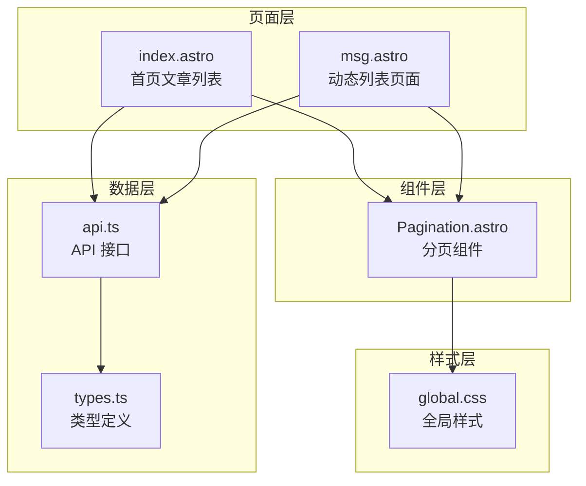
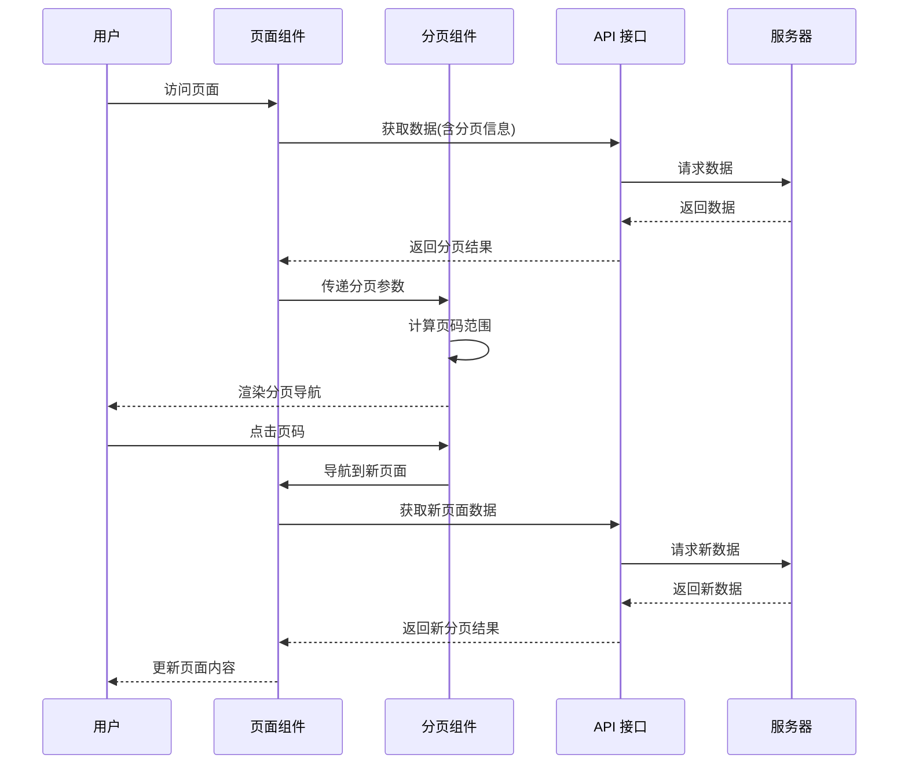
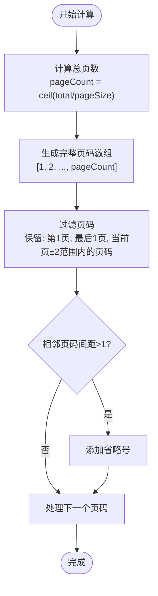
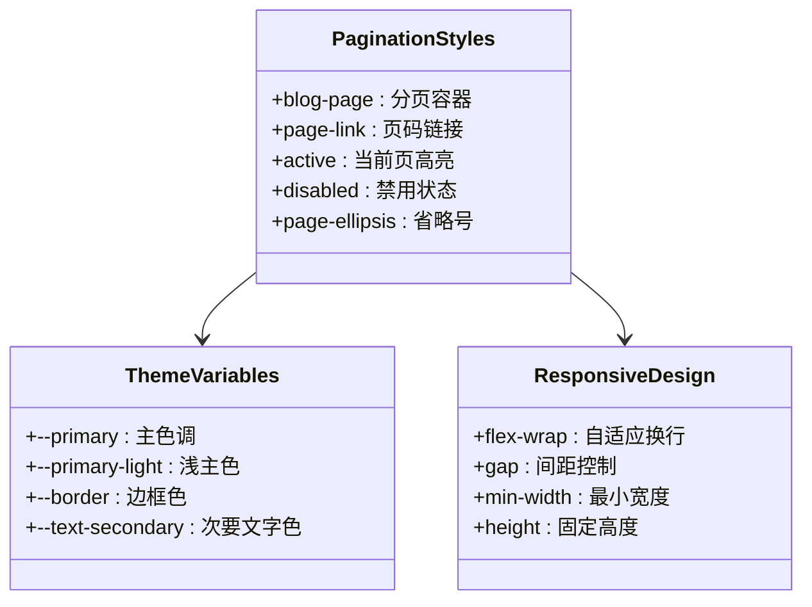
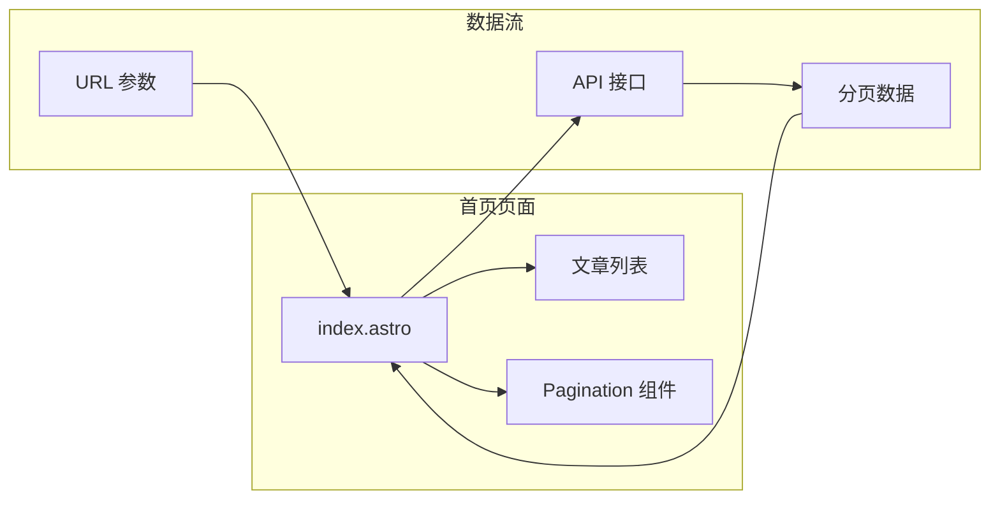
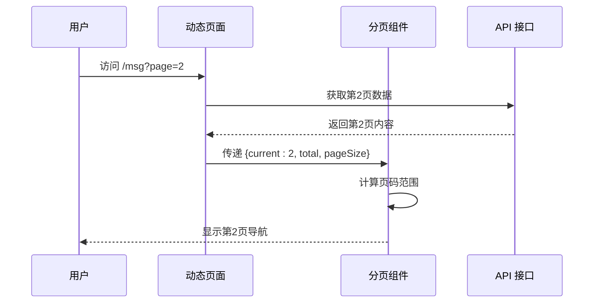
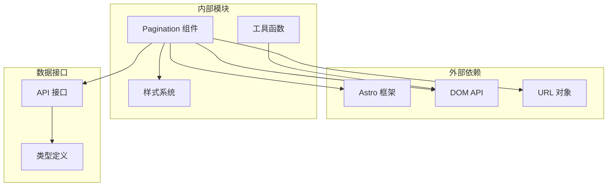

# Pagination 分页组件

<cite>
**本文档引用的文件**
- [Pagination.astro](file://src/components/Pagination.astro)
- [index.astro](file://src/pages/index.astro)
- [msg.astro](file://src/pages/msg.astro)
- [global.css](file://src/styles/global.css)
- [api.ts](file://src/lib/api.ts)
- [types.ts](file://src/lib/types.ts)
</cite>

## 目录
1. [简介](#简介)
2. [项目结构](#项目结构)
3. [核心组件](#核心组件)
4. [架构概览](#架构概览)
5. [详细组件分析](#详细组件分析)
6. [依赖关系分析](#依赖关系分析)
7. [性能考虑](#性能考虑)
8. [故障排除指南](#故障排除指南)
9. [结论](#结论)
10. [附录](#附录)

## 简介

Pagination 分页组件是一个基于 Astro 的轻量级分页导航组件，专为博客系统的文章列表和动态列表设计。该组件提供了简洁而高效的分页功能，支持页码计算、页面跳转和智能的边界处理。

组件采用纯前端实现，无需额外的 JavaScript 框架依赖，通过 Astro 的静态站点生成能力实现高性能的分页导航体验。

## 项目结构

Pagination 组件位于项目的组件目录中，与页面组件和样式文件协同工作：



**图表来源**
- [Pagination.astro:1-28](file://src/components/Pagination.astro#L1-L28)
- [index.astro:1-50](file://src/pages/index.astro#L1-L50)
- [msg.astro:1-135](file://src/pages/msg.astro#L1-L135)

**章节来源**
- [Pagination.astro:1-28](file://src/components/Pagination.astro#L1-L28)
- [index.astro:1-50](file://src/pages/index.astro#L1-L50)
- [msg.astro:1-135](file://src/pages/msg.astro#L1-L135)

## 核心组件

Pagination 组件是一个纯 Astro 组件，具有以下核心特性：

### Props 接口定义

组件接受以下属性：

| 属性名 | 类型 | 必需 | 默认值 | 描述 |
|--------|------|------|--------|------|
| current | number | 是 | - | 当前页码 |
| total | number | 是 | - | 总记录数 |
| pageSize | number | 是 | - | 每页显示数量 |
| basePath | string | 否 | '/' | 基础路径 |

### 核心功能实现

组件实现了以下核心功能：

1. **智能页码计算**：根据总记录数和每页数量自动计算总页数
2. **边界页码显示**：始终显示第一页和最后一页
3. **省略号处理**：在页码之间出现省略号以节省空间
4. **当前页高亮**：自动识别并高亮当前页码
5. **禁用状态管理**：在首页和末页时禁用相应导航按钮

**章节来源**
- [Pagination.astro:2-7](file://src/components/Pagination.astro#L2-L7)
- [Pagination.astro:9-14](file://src/components/Pagination.astro#L9-L14)

## 架构概览

Pagination 组件在整个应用架构中扮演着重要的角色，连接了页面层、数据层和样式层：



**图表来源**
- [index.astro:7-13](file://src/pages/index.astro#L7-L13)
- [msg.astro:7-13](file://src/pages/msg.astro#L7-L13)
- [Pagination.astro:16-27](file://src/components/Pagination.astro#L16-L27)

## 详细组件分析

### 组件实现细节

#### 页码计算算法

组件采用智能的页码过滤算法，确保用户始终能看到重要的页码：



**图表来源**
- [Pagination.astro:10-13](file://src/components/Pagination.astro#L10-L13)

#### URL 构建机制

组件使用简洁的 URL 构建策略：

- **首页特殊处理**：第1页使用基础路径（如 `/`）
- **其他页码**：使用查询参数形式（如 `/page=2`）

这种设计确保了 SEO 友好性和用户体验的一致性。

#### 样式系统

组件采用 CSS 自定义属性和响应式设计：



**图表来源**
- [global.css:117-121](file://src/styles/global.css#L117-L121)

**章节来源**
- [Pagination.astro:14](file://src/components/Pagination.astro#L14)
- [global.css:117-121](file://src/styles/global.css#L117-L121)

### 页面集成模式

#### 首页集成

在首页中，Pagination 组件与文章列表完美结合：



**图表来源**
- [index.astro:46](file://src/pages/index.astro#L46)

#### 动态页面集成

在动态页面中，组件同样发挥重要作用：



**图表来源**
- [msg.astro:85](file://src/pages/msg.astro#L85)

**章节来源**
- [index.astro:46](file://src/pages/index.astro#L46)
- [msg.astro:85](file://src/pages/msg.astro#L85)

## 依赖关系分析

### 组件间依赖



**图表来源**
- [Pagination.astro:1-28](file://src/components/Pagination.astro#L1-L28)
- [api.ts:1-91](file://src/lib/api.ts#L1-L91)

### 数据流依赖

组件的数据流遵循严格的单向数据流原则：

1. **页面层**：负责获取数据和传递参数
2. **组件层**：负责渲染和交互逻辑
3. **样式层**：负责视觉表现
4. **数据层**：负责业务逻辑

**章节来源**
- [Pagination.astro:9-14](file://src/components/Pagination.astro#L9-L14)
- [api.ts:58-60](file://src/lib/api.ts#L58-L60)

## 性能考虑

### 渲染性能优化

1. **静态生成**：组件完全在构建时生成，无需运行时计算
2. **最小化重渲染**：仅在页码变化时更新相关元素
3. **内存效率**：使用原生数组操作，避免复杂的对象创建

### 网络性能优化

1. **懒加载**：组件本身不引入额外的网络请求
2. **缓存友好**：URL 结构简单，利于浏览器缓存
3. **SEO 优化**：标准的分页 URL 结构有利于搜索引擎抓取

### 用户体验优化

1. **即时反馈**：点击后立即更新页面内容
2. **无障碍支持**：包含适当的 ARIA 标签
3. **响应式设计**：适配各种屏幕尺寸

## 故障排除指南

### 常见问题及解决方案

#### 问题：分页不显示
**可能原因**：
- `showPages` 条件判断为 false
- `total` 或 `pageSize` 为 0

**解决方法**：
检查页面中 `showPages` 的计算逻辑，确保正确传递分页参数。

#### 问题：页码计算错误
**可能原因**：
- `total` 或 `pageSize` 传入负数
- 浮点数精度问题

**解决方法**：
在调用组件前确保传入正整数参数。

#### 问题：样式显示异常
**可能原因**：
- CSS 变量未正确设置
- 样式冲突

**解决方法**：
检查全局样式文件中的 CSS 变量定义，确保样式正确加载。

**章节来源**
- [index.astro:10-13](file://src/pages/index.astro#L10-L13)
- [Pagination.astro:10-14](file://src/components/Pagination.astro#L10-L14)

## 结论

Pagination 分页组件是一个设计精良、实现简洁的分页解决方案。它成功地平衡了功能性、性能和可维护性，为博客系统提供了可靠的分页导航能力。

组件的主要优势包括：
- **简洁的 API 设计**：仅需传入必要的分页参数
- **智能的页码算法**：自动处理边界情况和省略号显示
- **优秀的性能表现**：基于 Astro 的静态生成，运行时开销极小
- **良好的可扩展性**：易于定制样式和行为

## 附录

### 使用示例

#### 在文章列表中使用
```astro
<!-- index.astro -->
{showPages && <Pagination current={currentPage} total={total} pageSize={pageSize} basePath="/" />}
```

#### 在动态列表中使用
```astro
<!-- msg.astro -->
{showPages && <Pagination current={currentPage} total={total} pageSize={pageSize} basePath="/msg" />}
```

### 扩展建议

1. **自定义样式**：通过修改 CSS 变量来自定义主题
2. **跳转行为**：可扩展为支持编程式导航
3. **键盘导航**：添加键盘快捷键支持
4. **加载状态**：添加加载指示器

### 维护注意事项

- 定期检查样式兼容性
- 关注 Astro 版本更新
- 考虑国际化支持
- 添加单元测试覆盖关键逻辑