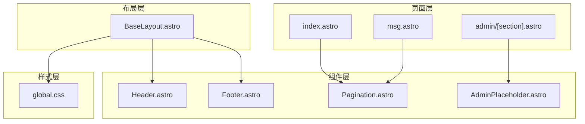
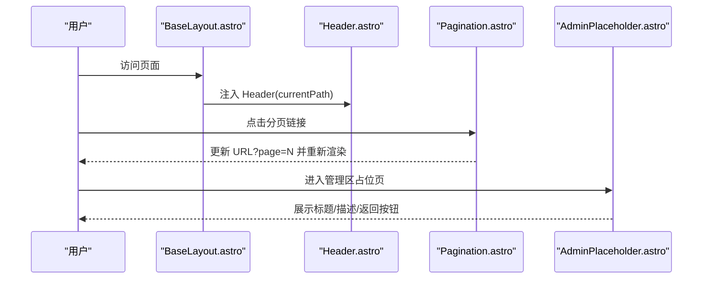
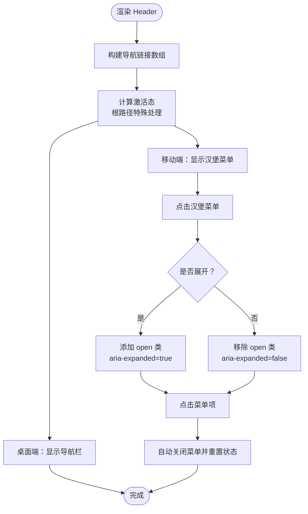
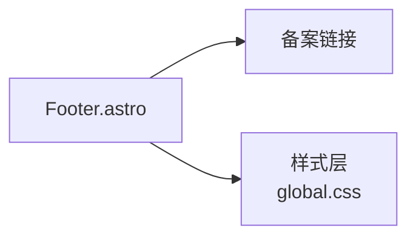
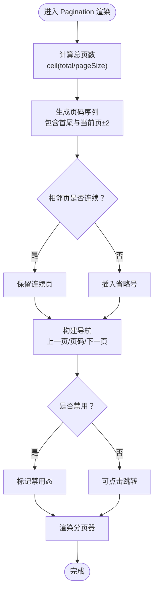
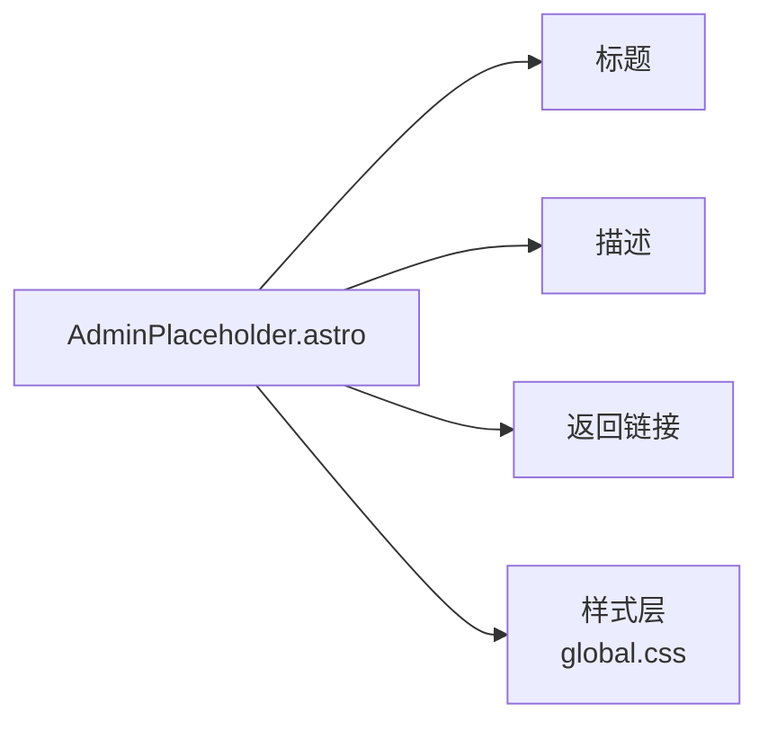
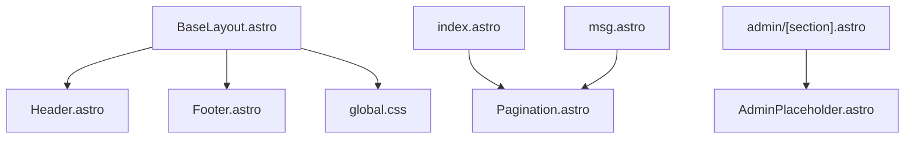

# 组件系统

<cite>
**本文引用的文件**
- [src/components/Header.astro](file://src/components/Header.astro)
- [src/components/Footer.astro](file://src/components/Footer.astro)
- [src/components/Pagination.astro](file://src/components/Pagination.astro)
- [src/components/AdminPlaceholder.astro](file://src/components/AdminPlaceholder.astro)
- [src/layouts/BaseLayout.astro](file://src/layouts/BaseLayout.astro)
- [src/styles/global.css](file://src/styles/global.css)
- [src/pages/index.astro](file://src/pages/index.astro)
- [src/pages/msg.astro](file://src/pages/msg.astro)
- [src/pages/admin/[section].astro](file://src/pages/admin/[section].astro)
- [package.json](file://package.json)
</cite>

## 目录
1. [简介](#简介)
2. [项目结构](#项目结构)
3. [核心组件](#核心组件)
4. [架构总览](#架构总览)
5. [详细组件分析](#详细组件分析)
6. [依赖关系分析](#依赖关系分析)
7. [性能考量](#性能考量)
8. [故障排查指南](#故障排查指南)
9. [结论](#结论)
10. [附录](#附录)

## 简介
本文件系统性梳理博客项目的可复用UI组件，聚焦以下组件的设计与实现：Header（头部导航）、Footer（页脚）、Pagination（分页器）、AdminPlaceholder（管理占位）。文档从组件职责、Props 接口、状态与交互、样式与响应式、到与其他组件的数据传递与组合模式进行深入解析，并提供使用示例、最佳实践与性能优化建议，帮助开发者快速理解与扩展组件体系。

## 项目结构
组件位于 src/components 下，采用 Astro 的 Astro 组件（.astro）形式；全局样式集中于 src/styles/global.css；页面通过 BaseLayout 统一引入 Header 与 Footer，并在需要的页面中使用 Pagination 或 AdminPlaceholder。

图表来源
- [src/layouts/BaseLayout.astro](file://src/layouts/BaseLayout.astro)
- [src/components/Header.astro](file://src/components/Header.astro)
- [src/components/Footer.astro](file://src/components/Footer.astro)
- [src/components/Pagination.astro](file://src/components/Pagination.astro)
- [src/components/AdminPlaceholder.astro](file://src/components/AdminPlaceholder.astro)
- [src/pages/index.astro](file://src/pages/index.astro)
- [src/pages/msg.astro](file://src/pages/msg.astro)
- [src/pages/admin/[section].astro](file://src/pages/admin/[section].astro)
- [src/styles/global.css](file://src/styles/global.css)

章节来源
- [src/layouts/BaseLayout.astro](file://src/layouts/BaseLayout.astro)
- [src/styles/global.css](file://src/styles/global.css)

## 核心组件
- Header：提供主导航、品牌区、移动端菜单切换与激活态高亮。
- Footer：展示备案信息与基础版权/标识区域。
- Pagination：根据总数与当前页生成页码序列，支持“上一页/下一页”与省略号分隔。
- AdminPlaceholder：在管理区页面提供标题、描述与返回入口的占位卡片。

章节来源
- [src/components/Header.astro](file://src/components/Header.astro)
- [src/components/Footer.astro](file://src/components/Footer.astro)
- [src/components/Pagination.astro](file://src/components/Pagination.astro)
- [src/components/AdminPlaceholder.astro](file://src/components/AdminPlaceholder.astro)

## 架构总览
组件与页面的关系如下：BaseLayout 在非隐藏 Chrome 模式下注入 Header 与 Footer；具体页面按需引入 Pagination 或 AdminPlaceholder 并传入相应参数。

图表来源
- [src/layouts/BaseLayout.astro](file://src/layouts/BaseLayout.astro)
- [src/components/Header.astro](file://src/components/Header.astro)
- [src/components/Pagination.astro](file://src/components/Pagination.astro)
- [src/components/AdminPlaceholder.astro](file://src/components/AdminPlaceholder.astro)

## 详细组件分析

### Header 组件
- 功能特性
  - 品牌区：包含图标与名称，指向登录入口，用于管理后台访问入口提示。
  - 主导航：固定三个静态链接，支持“当前路径激活态”高亮。
  - 移动端菜单：在窄屏下显示汉堡菜单，点击展开/收起，同时维护 ARIA 状态。
- Props 接口
  - currentPath?: string（默认根路径）
- 导航逻辑
  - 根路径特殊处理：仅当 currentPath 为根时激活；其他路径使用前缀匹配判断。
- 响应式设计
  - 大屏：显示桌面导航栏；小屏：隐藏桌面导航，显示汉堡菜单。
  - 菜单展开时，叠加 open 类与 ARIA expanded 状态，便于键盘与读屏支持。
- 事件处理机制
  - 点击汉堡菜单：切换 active 类与菜单 open 类，并同步 aria-expanded。
  - 点击移动端菜单项：自动收起菜单并重置 ARIA 状态。
- 样式定制
  - 通过 CSS 变量与类名控制颜色、阴影、圆角与过渡动画；支持悬停与激活态。
- 使用示例
  - 在 BaseLayout 中以 currentPath 传入当前路径，即可完成导航与激活态联动。
- 最佳实践
  - 静态导航建议在组件内集中维护，避免在页面重复配置。
  - 移动端交互需确保 ARIA 属性与键盘可达性。
- 性能优化
  - 事件监听仅在客户端脚本中绑定一次，避免重复绑定导致的内存泄漏。

图表来源
- [src/components/Header.astro](file://src/components/Header.astro)
- [src/styles/global.css](file://src/styles/global.css)

章节来源
- [src/components/Header.astro](file://src/components/Header.astro)
- [src/styles/global.css](file://src/styles/global.css)
- [src/layouts/BaseLayout.astro](file://src/layouts/BaseLayout.astro)

### Footer 组件
- 功能特性
  - 展示备案信息链接，指向工信部备案页面。
  - 采用深色背景与强调边框，保证在页面底部清晰可见。
- Props 接口
  - 无
- 链接管理与社交集成
  - 当前仅包含备案链接；如需社交集成，可在 Footer 内部扩展链接集合。
- 样式定制
  - 通过 CSS 变量统一配色与间距；在窄屏下可隐藏 Footer 以节省空间（见全局样式媒体查询）。
- 使用示例
  - 在 BaseLayout 中直接引入 Footer 即可。
- 最佳实践
  - 备案信息应与站点实际信息保持一致；如需多语言或多站点，可将链接改为动态配置。
- 性能优化
  - Footer 为纯静态展示，无 JS 逻辑，开销极低。

图表来源
- [src/components/Footer.astro](file://src/components/Footer.astro)
- [src/styles/global.css](file://src/styles/global.css)

章节来源
- [src/components/Footer.astro](file://src/components/Footer.astro)
- [src/styles/global.css](file://src/styles/global.css)
- [src/layouts/BaseLayout.astro](file://src/layouts/BaseLayout.astro)

### Pagination 组件
- 功能特性
  - 根据 total、pageSize 与 current 计算总页数与页码序列。
  - 仅渲染关键页码（首尾与当前页两侧邻近页），中间省略号分隔，提升可读性。
  - 提供“上一页/下一页”导航，禁用态不可点击。
- Props 接口
  - current: number（当前页，>=1）
  - total: number（总条目数）
  - pageSize: number（每页条数）
  - basePath?: string（默认根路径，用于拼接分页查询参数）
- 分页算法与页面跳转
  - 总页数：向上取整计算；若 total 为 0，则至少显示 1 页。
  - 页码序列：始终包含第 1 页与最后一页；当前页前后各最多 2 页；相邻页之间无省略号，跨页则插入省略号。
  - 跳转规则：第 1 页不带查询参数，其余页带 page=N 查询参数。
- 用户体验优化
  - 禁用态按钮不响应点击；省略号作为视觉分组，降低认知负担。
- 样式定制
  - 通过类名 page-link、active、disabled 控制外观；省略号使用独立类 page-ellipsis。
- 使用示例
  - 在文章列表与动态列表页面，根据后端返回的分页元数据传入 current、total、pageSize，并指定 basePath。
- 最佳实践
  - basePath 应与对应路由一致；若使用同构路由，注意查询参数拼接一致性。
  - 当 total 为 0 时，组件不会渲染分页器，避免空渲染。
- 性能优化
  - 页码序列在组件内部一次性计算并缓存，避免重复计算；仅在 props 变化时更新。

图表来源
- [src/components/Pagination.astro](file://src/components/Pagination.astro)
- [src/styles/global.css](file://src/styles/global.css)

章节来源
- [src/components/Pagination.astro](file://src/components/Pagination.astro)
- [src/styles/global.css](file://src/styles/global.css)
- [src/pages/index.astro](file://src/pages/index.astro)
- [src/pages/msg.astro](file://src/pages/msg.astro)

### AdminPlaceholder 组件
- 功能特性
  - 展示标题与描述，提供返回后台首页的链接，形成占位卡片。
- Props 接口
  - title: string（页面标题）
  - description: string（页面描述）
- 设计与用途
  - 用于管理区占位页面，提示后续迁移计划与当前状态。
- 样式定制
  - 采用卡片容器与标题/段落排版，配合全局卡片样式。
- 使用示例
  - 在管理区路由中根据路由参数选择标题与描述，传入组件并渲染。
- 最佳实践
  - 标题与描述应与路由语义一致，便于 SEO 与可访问性。
- 性能优化
  - 组件轻量，无副作用，无需额外优化。

图表来源
- [src/components/AdminPlaceholder.astro](file://src/components/AdminPlaceholder.astro)
- [src/styles/global.css](file://src/styles/global.css)
- [src/pages/admin/[section].astro](file://src/pages/admin/[section].astro)

章节来源
- [src/components/AdminPlaceholder.astro](file://src/components/AdminPlaceholder.astro)
- [src/styles/global.css](file://src/styles/global.css)
- [src/pages/admin/[section].astro](file://src/pages/admin/[section].astro)

## 依赖关系分析
- 组件间耦合
  - Header 与 Footer 作为通用布局组件，被 BaseLayout 引入，耦合度低。
  - Pagination 与 AdminPlaceholder 为页面级可选组件，按需引入，低耦合。
- 外部依赖
  - 全局样式通过 BaseLayout 注入，统一主题变量与响应式断点。
  - 页面通过 API 工具获取分页数据，再将数据传给 Pagination。
- 组合模式与数据传递
  - BaseLayout 作为壳层，向 Header 传递 currentPath；向 Footer 传递静态内容。
  - 页面向 Pagination 传递分页元数据；向 AdminPlaceholder 传递标题与描述。
  - 组件均通过类名与 CSS 变量实现样式解耦，利于主题扩展。

图表来源
- [src/layouts/BaseLayout.astro](file://src/layouts/BaseLayout.astro)
- [src/components/Header.astro](file://src/components/Header.astro)
- [src/components/Footer.astro](file://src/components/Footer.astro)
- [src/components/Pagination.astro](file://src/components/Pagination.astro)
- [src/components/AdminPlaceholder.astro](file://src/components/AdminPlaceholder.astro)
- [src/styles/global.css](file://src/styles/global.css)
- [src/pages/index.astro](file://src/pages/index.astro)
- [src/pages/msg.astro](file://src/pages/msg.astro)
- [src/pages/admin/[section].astro](file://src/pages/admin/[section].astro)

章节来源
- [src/layouts/BaseLayout.astro](file://src/layouts/BaseLayout.astro)
- [src/styles/global.css](file://src/styles/global.css)
- [src/pages/index.astro](file://src/pages/index.astro)
- [src/pages/msg.astro](file://src/pages/msg.astro)
- [src/pages/admin/[section].astro](file://src/pages/admin/[section].astro)

## 性能考量
- 渲染层面
  - Header 的移动端菜单切换仅在客户端执行，避免服务端渲染负担。
  - Pagination 的页码序列在组件内一次性计算，减少重复渲染成本。
- 样式层面
  - 使用 CSS 变量与原子化类名，避免重复样式定义，提升样式复用效率。
  - 响应式断点集中在全局样式，便于统一维护与调试。
- 数据层面
  - 页面通过 API 获取分页数据，组件仅负责展示与交互，职责清晰，利于缓存与懒加载策略扩展。

## 故障排查指南
- Header 激活态不生效
  - 检查传入的 currentPath 是否与导航 href 匹配；根路径与非根路径的匹配规则不同。
- 移动端菜单无法展开/收起
  - 确认客户端脚本已执行且未被 CSP 策略阻止；检查 ARIA 属性与类名切换逻辑。
- Pagination 不显示或跳转异常
  - 校验 total、pageSize、current 是否为有效数值；确认 basePath 与页面路由一致。
- AdminPlaceholder 内容为空
  - 检查传入的 title 与 description 是否正确；确认页面路由参数映射逻辑。

章节来源
- [src/components/Header.astro](file://src/components/Header.astro)
- [src/components/Pagination.astro](file://src/components/Pagination.astro)
- [src/components/AdminPlaceholder.astro](file://src/components/AdminPlaceholder.astro)

## 结论
本组件系统以 Astro 组件为核心，结合全局样式与页面层的数据传递，实现了简洁、可复用且具备良好可访问性的 UI 基础设施。Header 提供稳定的导航与响应式交互；Footer 承载基础版权信息；Pagination 以智能省略与禁用态优化用户体验；AdminPlaceholder 为管理区页面提供占位与引导。建议在后续迭代中：
- 将导航链接配置化，支持动态扩展；
- 在 Footer 增加社交链接与多站点支持；
- 对 Pagination 增加分页缓存与预取策略；
- 为 AdminPlaceholder 增加更多状态提示与操作入口。

## 附录
- 开发与运行
  - 使用包管理器安装依赖后，可通过开发命令启动本地服务。
- 版本与环境
  - 项目基于 Astro 与 Node.js 运行时，建议使用现代浏览器以获得最佳体验。

章节来源
- [package.json](file://package.json)