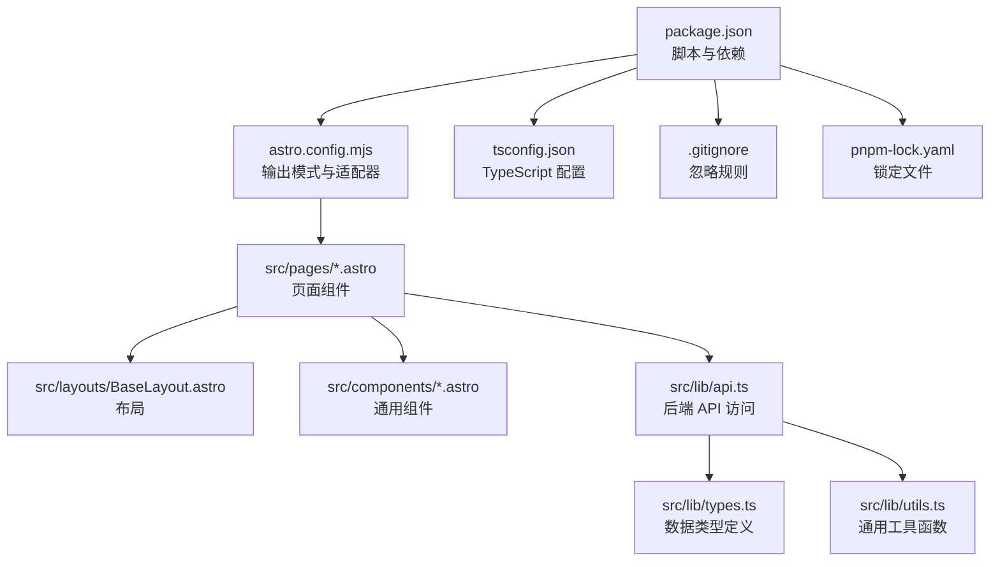
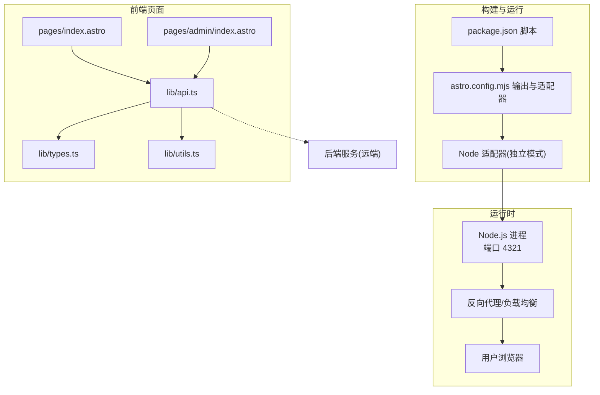
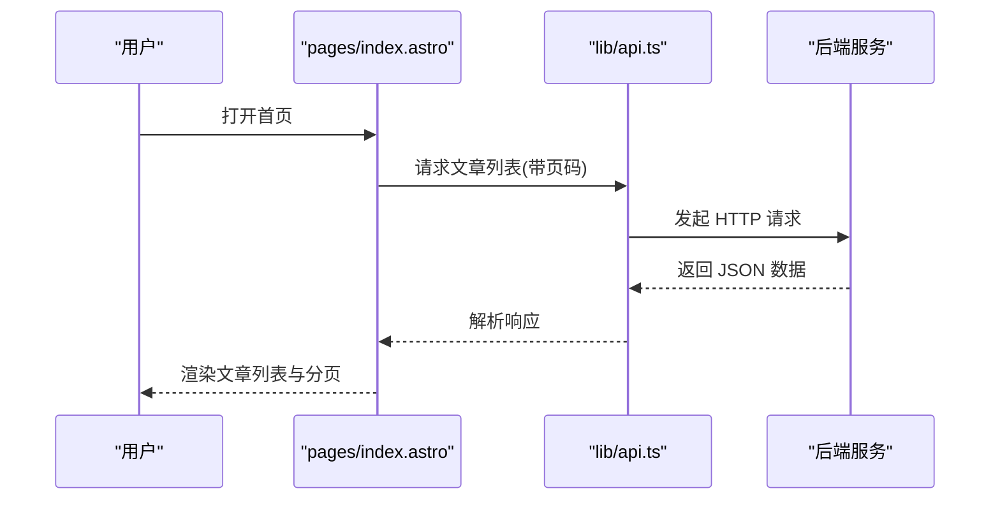
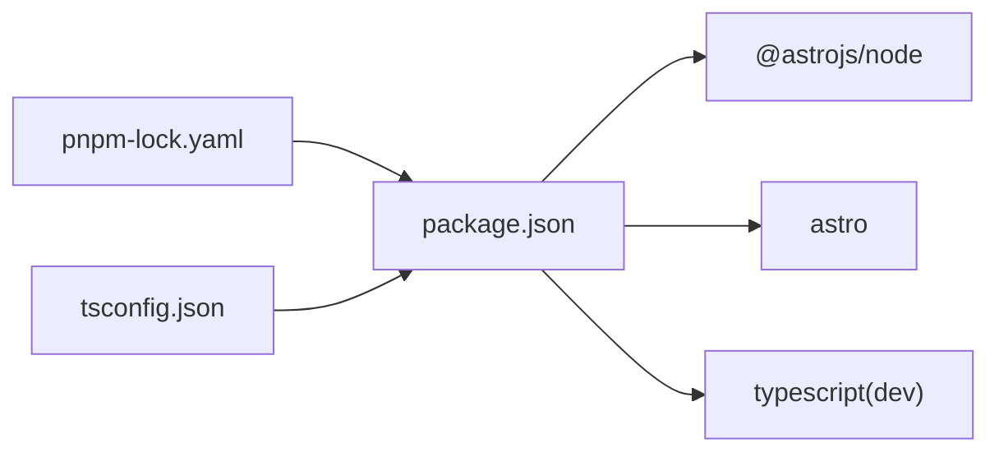

# 部署运维

<cite>
**本文引用的文件**
- [package.json](file://package.json)
- [astro.config.mjs](file://astro.config.mjs)
- [tsconfig.json](file://tsconfig.json)
- [.gitignore](file://.gitignore)
- [pnpm-lock.yaml](file://pnpm-lock.yaml)
- [src/env.d.ts](file://src/env.d.ts)
- [src/lib/api.ts](file://src/lib/api.ts)
- [src/lib/types.ts](file://src/lib/types.ts)
- [src/lib/utils.ts](file://src/lib/utils.ts)
- [src/pages/index.astro](file://src/pages/index.astro)
- [src/pages/admin/index.astro](file://src/pages/admin/index.astro)
</cite>

## 目录
1. [简介](#简介)
2. [项目结构](#项目结构)
3. [核心组件](#核心组件)
4. [架构总览](#架构总览)
5. [详细组件分析](#详细组件分析)
6. [依赖关系分析](#依赖关系分析)
7. [性能考量](#性能考量)
8. [故障排查指南](#故障排查指南)
9. [结论](#结论)
10. [附录](#附录)

## 简介
本部署运维文档面向博客项目的构建、部署与运维管理，覆盖以下主题：
- Astro 构建配置与输出模式优化（服务端渲染与独立模式）
- 生产环境部署方案（服务器、域名与 SSL）
- CI/CD 流水线（自动化测试、构建与部署）
- Docker 容器化部署（镜像构建、容器配置与编排）
- 监控与日志（性能监控、错误追踪、用户行为分析）
- 备份与恢复（数据与配置、灾难恢复）
- 故障排查（常见问题、性能瓶颈、安全修复）
- 运维自动化脚本与工具使用建议

## 项目结构
该项目为基于 Astro 的前端项目，采用服务端渲染（SSR）适配器输出到 Node.js 运行时，页面通过 Astro 组件与 API 模块交互，类型定义与工具函数位于 src/lib。

图表来源
- [package.json:1-19](file://package.json#L1-L19)
- [astro.config.mjs:1-14](file://astro.config.mjs#L1-L14)
- [tsconfig.json:1-11](file://tsconfig.json#L1-L11)
- [src/lib/api.ts:1-91](file://src/lib/api.ts#L1-L91)
- [src/lib/types.ts:1-54](file://src/lib/types.ts#L1-L54)
- [src/lib/utils.ts:1-219](file://src/lib/utils.ts#L1-L219)

章节来源
- [package.json:1-19](file://package.json#L1-L19)
- [astro.config.mjs:1-14](file://astro.config.mjs#L1-L14)
- [tsconfig.json:1-11](file://tsconfig.json#L1-L11)

## 核心组件
- 构建与运行脚本：开发、构建、预览命令由包管理脚本统一管理，便于本地与 CI 环境一致化。
- Astro 配置：输出模式为 server，使用 Node 适配器并启用独立模式；服务器监听 0.0.0.0，端口 4321。
- 类型系统：严格 TypeScript 配置，路径别名 @/* 指向 src，便于模块导入。
- 前端页面：首页与管理后台页面通过 API 获取数据，展示文章列表、分页与管理入口。
- API 访问层：统一封装请求与 URL 参数拼接，支持环境变量覆盖后端地址。
- 工具函数：时间格式化、网站规范化、富文本图片尺寸稳定化等。

章节来源
- [package.json:7-11](file://package.json#L7-L11)
- [astro.config.mjs:4-13](file://astro.config.mjs#L4-L13)
- [tsconfig.json:3-9](file://tsconfig.json#L3-L9)
- [src/pages/index.astro:1-50](file://src/pages/index.astro#L1-L50)
- [src/pages/admin/index.astro:1-30](file://src/pages/admin/index.astro#L1-L30)
- [src/lib/api.ts:9-15](file://src/lib/api.ts#L9-L15)
- [src/lib/utils.ts:1-31](file://src/lib/utils.ts#L1-L31)

## 架构总览
前端页面在构建阶段生成静态 HTML，运行时通过 SSR 适配器在 Node.js 上渲染；页面通过 API 模块访问远端后端服务，返回 JSON 数据并渲染至页面。类型系统确保前后端数据契约清晰。

图表来源
- [package.json:7-11](file://package.json#L7-L11)
- [astro.config.mjs:4-13](file://astro.config.mjs#L4-L13)
- [src/pages/index.astro:1-50](file://src/pages/index.astro#L1-L50)
- [src/pages/admin/index.astro:1-30](file://src/pages/admin/index.astro#L1-L30)
- [src/lib/api.ts:25-41](file://src/lib/api.ts#L25-L41)

## 详细组件分析

### 构建配置与优化策略
- 输出模式与适配器
  - 输出模式为 server，配合 Node 适配器，实现 SSR 渲染与静态资源打包。
  - 适配器模式选择独立模式，便于直接运行生成的可执行产物。
- 服务器配置
  - 监听 0.0.0.0，允许外部访问；端口固定为 4321，便于容器与反向代理映射。
- 性能优化建议
  - 启用静态资源压缩与缓存（结合 CDN 与反向代理）。
  - 对富文本中的图片进行尺寸稳定化，减少布局抖动。
  - 使用懒加载与异步解码提升首屏性能。
- TypeScript 严格性
  - 采用严格配置与路径别名，降低模块解析成本，提升开发体验与类型安全。

章节来源
- [astro.config.mjs:4-13](file://astro.config.mjs#L4-L13)
- [tsconfig.json:3-9](file://tsconfig.json#L3-L9)
- [src/lib/utils.ts:132-168](file://src/lib/utils.ts#L132-L168)

### 页面与数据流
- 首页
  - 从查询参数解析当前页码，调用文章列表 API，渲染卡片与分页组件。
- 管理后台
  - 展示管理入口卡片，作为后续迁移的占位页面。
- API 访问
  - 支持通过环境变量覆盖后端基础地址，便于多环境切换。
  - 统一请求封装，包含错误处理与日志记录。

图表来源
- [src/pages/index.astro:7-13](file://src/pages/index.astro#L7-L13)
- [src/lib/api.ts:58-60](file://src/lib/api.ts#L58-L60)

章节来源
- [src/pages/index.astro:1-50](file://src/pages/index.astro#L1-L50)
- [src/pages/admin/index.astro:1-30](file://src/pages/admin/index.astro#L1-L30)
- [src/lib/api.ts:25-41](file://src/lib/api.ts#L25-L41)

### 工具函数与富文本优化
- 图片尺寸稳定化
  - 通过请求前若干字节并解析图片头部信息，自动补全 width/height，避免布局抖动。
  - 对 img 标签添加 loading 与 decoding 属性，提升渲染性能。
- 时间格式化
  - 提供 Unix 时间戳与自定义格式化能力，统一展示风格。
- 网站链接规范化
  - 自动为缺失协议的链接补充 http://，提升兼容性。

章节来源
- [src/lib/utils.ts:132-168](file://src/lib/utils.ts#L132-L168)
- [src/lib/utils.ts:1-31](file://src/lib/utils.ts#L1-L31)
- [src/lib/utils.ts:33-37](file://src/lib/utils.ts#L33-L37)

## 依赖关系分析
- 包管理与版本锁定
  - 使用 pnpm 管理依赖，锁定文件确保构建一致性。
- 运行时要求
  - Astro 与 Node 适配器对 Node 版本有明确要求，需在 CI 与生产环境满足。
- TypeScript 配置
  - 严格配置与路径别名，提升类型检查效率与模块组织性。

图表来源
- [package.json:12-18](file://package.json#L12-L18)
- [pnpm-lock.yaml:10-20](file://pnpm-lock.yaml#L10-L20)
- [tsconfig.json:3-9](file://tsconfig.json#L3-L9)

章节来源
- [package.json:12-18](file://package.json#L12-L18)
- [pnpm-lock.yaml:10-20](file://pnpm-lock.yaml#L10-L20)
- [tsconfig.json:3-9](file://tsconfig.json#L3-L9)

## 性能考量
- 构建与打包
  - 使用 SSR 输出模式，结合独立适配器，有利于在 Node 环境中快速启动与扩展。
  - 建议在 CI 中开启构建缓存与并行任务，缩短构建时间。
- 运行时性能
  - 图片懒加载与尺寸稳定化可显著减少首屏重排。
  - 将静态资源托管于 CDN 并配置长缓存，降低后端压力。
- 端口与网络
  - 固定端口 4321 便于容器编排与反向代理映射；生产环境建议通过反向代理暴露 HTTPS。

## 故障排查指南
- 构建失败
  - 检查 Node 版本是否满足 Astro 与适配器要求；核对 pnpm 锁定文件与依赖安装一致性。
- 运行异常
  - 确认端口 4321 可用且防火墙放行；检查反向代理配置与健康检查。
- API 访问失败
  - 核对环境变量 API_BASE_URL/PUBLIC_API_BASE_URL 是否正确；查看浏览器网络面板与控制台错误。
- 富文本图片显示异常
  - 检查图片尺寸解析逻辑与跨域限制；确认 CDN 或存储服务可访问。
- TypeScript 类型报错
  - 使用严格配置时，确保类型导入与路径别名一致；必要时清理缓存后重新安装依赖。

章节来源
- [pnpm-lock.yaml:10-20](file://pnpm-lock.yaml#L10-L20)
- [src/lib/api.ts:9-15](file://src/lib/api.ts#L9-L15)
- [src/lib/utils.ts:132-168](file://src/lib/utils.ts#L132-L168)

## 结论
本项目以 Astro SSR 为核心，结合 Node 适配器与严格的 TypeScript 配置，形成可维护、可扩展的前端架构。通过合理的构建配置、富文本优化与运行时策略，可在生产环境中获得稳定的性能表现。建议在 CI/CD、容器化、监控与备份方面进一步完善，以支撑长期运维与高可用需求。

## 附录

### 生产环境部署方案（服务器、域名与 SSL）
- 服务器与端口
  - 运行时监听 0.0.0.0:4321；建议通过反向代理（如 Nginx/Caddy）对外暴露 HTTPS。
- 域名与证书
  - 通过反向代理配置域名与自动续期的 SSL 证书；确保 ACME 协议可用。
- 文件与权限
  - 构建产物与运行目录具备最小权限原则；日志目录可写，便于审计。

### CI/CD 流水线配置要点
- 触发条件
  - 主分支保护与 PR 校验；仅允许通过测试与构建的变更合并。
- 步骤建议
  - 安装依赖（pnpm）、类型检查、单元/集成测试、构建、预览验证、部署。
- 缓存与并发
  - 缓存 pnpm store 与构建产物；合理拆分任务并行执行。
- 安全
  - 机密变量（如 API 地址、证书）通过 CI 凭据管理；构建产物扫描漏洞。

### Docker 容器化部署指南
- 镜像构建
  - 使用多阶段构建：构建阶段安装依赖并执行构建，运行阶段仅复制产物与运行时依赖。
  - 指定非 root 用户与只读根文件系统，提升安全性。
- 容器配置
  - 暴露端口 4321；挂载日志卷；通过环境变量注入 API 地址。
- 编排策略
  - 使用反向代理统一入口与 SSL；按需水平扩展副本数；健康检查与重启策略。

### 监控与日志管理
- 性能监控
  - 前端：Core Web Vitals、页面加载时间；后端：响应时间、错误率、吞吐量。
- 错误追踪
  - 前端：浏览器错误上报；后端：结构化日志与错误链路追踪。
- 用户行为分析
  - 通过埋点与事件上报，统计页面访问、点击与转化路径。

### 备份与恢复策略
- 数据备份
  - 后端数据库与对象存储定期快照；版本化与异地容灾。
- 配置管理
  - 环境变量与密钥集中管理；变更审计与回滚预案。
- 灾难恢复
  - RTO/RPO 明确；演练恢复流程；文档化恢复步骤与联系人。

### 运维自动化脚本与工具
- 部署脚本
  - 一键构建、拉取镜像、停止旧容器、启动新容器、健康检查与回滚。
- 监控脚本
  - 健康检查、日志聚合、告警推送。
- 安全扫描
  - 依赖漏洞扫描、容器镜像安全扫描、配置基线检查。