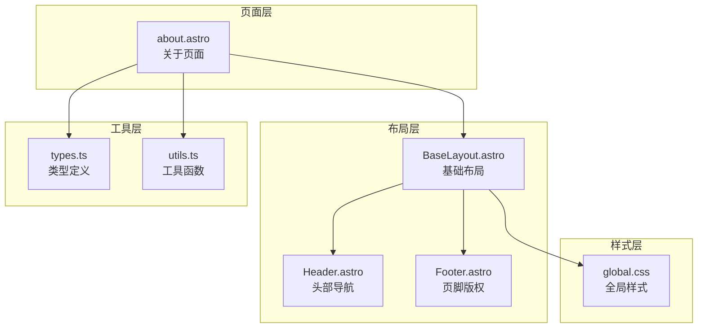
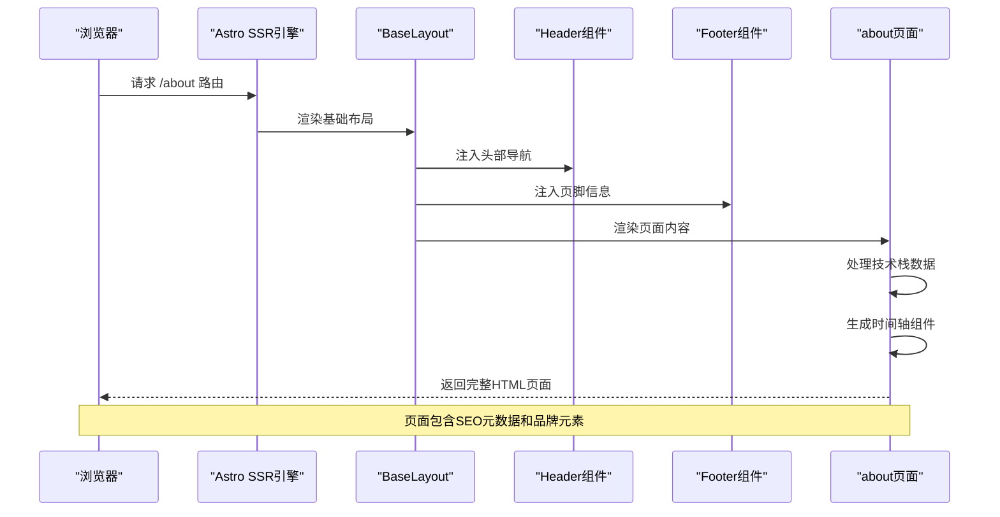
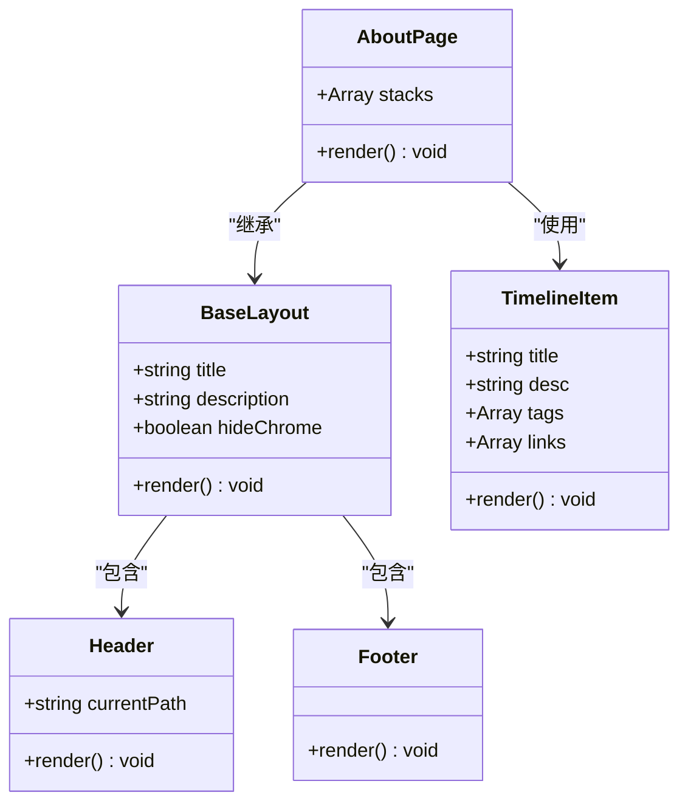
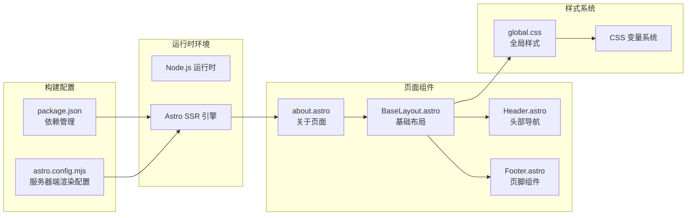
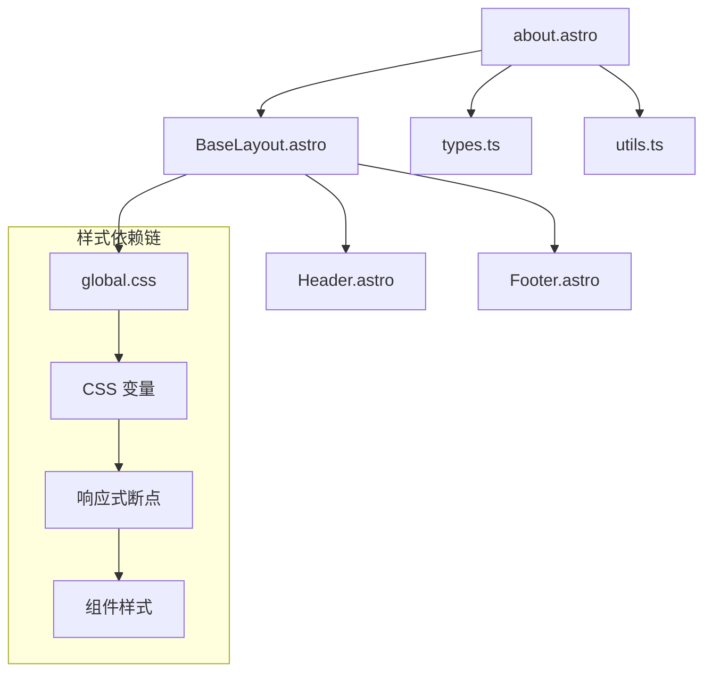

# 关于页面

<cite>
**本文档引用的文件**
- [about.astro](file://src/pages/about.astro)
- [BaseLayout.astro](file://src/layouts/BaseLayout.astro)
- [Header.astro](file://src/components/Header.astro)
- [Footer.astro](file://src/components/Footer.astro)
- [global.css](file://src/styles/global.css)
- [types.ts](file://src/lib/types.ts)
- [utils.ts](file://src/lib/utils.ts)
- [package.json](file://package.json)
- [astro.config.mjs](file://astro.config.mjs)
</cite>

## 目录
1. [简介](#简介)
2. [项目结构](#项目结构)
3. [核心组件](#核心组件)
4. [架构概览](#架构概览)
5. [详细组件分析](#详细组件分析)
6. [依赖关系分析](#依赖关系分析)
7. [性能考量](#性能考量)
8. [故障排除指南](#故障排除指南)
9. [结论](#结论)
10. [附录](#附录)

## 简介
本文件为博客项目中"关于页面"的详细技术文档。该页面采用 Astro SSR 技术构建，通过基础布局组件集成头部导航、页脚版权信息等通用元素，实现统一的品牌传达和用户体验。页面内容围绕技术栈演进历程展开，采用时间轴形式展示从早期技术到当前 Astro SSR 版本的发展轨迹，同时提供源码链接以便读者深入了解实现细节。

## 项目结构
关于页面位于 `src/pages/about.astro`，采用 Astro 组件化开发模式，结合全局样式系统和基础布局组件实现完整的页面结构。

**图表来源**
- [about.astro:1-80](file://src/pages/about.astro#L1-L80)
- [BaseLayout.astro:1-42](file://src/layouts/BaseLayout.astro#L1-L42)
- [Header.astro:1-48](file://src/components/Header.astro#L1-L48)
- [Footer.astro:1-8](file://src/components/Footer.astro#L1-L8)
- [global.css:1-233](file://src/styles/global.css#L1-L233)

**章节来源**
- [about.astro:1-80](file://src/pages/about.astro#L1-L80)
- [BaseLayout.astro:1-42](file://src/layouts/BaseLayout.astro#L1-L42)
- [global.css:1-233](file://src/styles/global.css#L1-L233)

## 核心组件
关于页面的核心实现包含以下关键要素：

### 数据结构设计
页面使用数组结构存储技术栈演进信息，每个条目包含：
- 标题信息（技术栈名称）
- 描述文本（技术特点说明）
- 技术标签（关键词标识）
- 外部链接（源码仓库地址）

### 布局组件集成
页面通过基础布局组件实现统一的头部导航、主体内容区域和页脚版权信息的组合，确保品牌一致性。

### 样式系统应用
采用 CSS 变量和响应式设计原则，实现跨设备适配和主题色彩统一。

**章节来源**
- [about.astro:4-37](file://src/pages/about.astro#L4-L37)
- [BaseLayout.astro:6-16](file://src/layouts/BaseLayout.astro#L6-L16)
- [global.css:1-29](file://src/styles/global.css#L1-L29)

## 架构概览
关于页面采用分层架构设计，实现关注点分离和代码复用。

**图表来源**
- [about.astro:39-79](file://src/pages/about.astro#L39-L79)
- [BaseLayout.astro:19-41](file://src/layouts/BaseLayout.astro#L19-L41)
- [Header.astro:7-12](file://src/components/Header.astro#L7-L12)

### 组件关系图

**图表来源**
- [BaseLayout.astro:6-16](file://src/layouts/BaseLayout.astro#L6-L16)
- [Header.astro:2-4](file://src/components/Header.astro#L2-L4)
- [Footer.astro:1-7](file://src/components/Footer.astro#L1-L7)
- [about.astro:4-37](file://src/pages/about.astro#L4-L37)

## 详细组件分析

### 关于页面主体结构
关于页面采用卡片式布局设计，主要包含三个核心区域：

#### 英雄区域（Hero Section）
- 头像展示区：180×135像素的程序员主题头像
- 信息展示区：博客介绍和功能说明
- 源码链接按钮：前端和后端源码访问入口

#### 技术栈演进时间轴
- 当前版本突出显示（"当前版本"徽章）
- 每个技术栈条目包含标题、描述、技术标签和可选链接
- 时间轴视觉效果体现技术发展脉络

#### 响应式设计实现
- 移动端适配：768px断点下切换为垂直布局
- 平板设备优化：900px断点下的容器宽度调整
- 触摸交互支持：移动端菜单切换功能

**章节来源**
- [about.astro:40-77](file://src/pages/about.astro#L40-L77)
- [global.css:184-206](file://src/styles/global.css#L184-L206)

### 基础布局组件
基础布局组件提供统一的页面框架，包含 SEO 元数据管理和全局样式注入。

#### SEO 元数据配置
- 动态标题设置：支持页面级别的标题定制
- 描述信息注入：为搜索引擎提供页面摘要
- 语言环境设定：zh-CN 语言配置

#### 全局样式管理
- CSS 变量系统：统一的颜色、字体、间距规范
- 响应式断点：针对不同设备尺寸的样式适配
- 性能优化：内联样式减少网络请求

**章节来源**
- [BaseLayout.astro:24-26](file://src/layouts/BaseLayout.astro#L24-L26)
- [BaseLayout.astro:27-30](file://src/layouts/BaseLayout.astro#L27-L30)
- [global.css:229-232](file://src/styles/global.css#L229-L232)

### 头部导航组件
头部导航提供站点主导航和品牌标识，支持移动端响应式菜单。

#### 导航链接结构
- 首页链接："连篇累牍"
- 留言板链接："微言大义"  
- 关于页面链接："关于博客"

#### 交互功能
- 活动状态检测：根据当前路径高亮对应导航项
- 移动端菜单：汉堡菜单切换显示隐藏
- 无障碍支持：ARIA 属性确保可访问性

**章节来源**
- [Header.astro:7-12](file://src/components/Header.astro#L7-L12)
- [Header.astro:34-47](file://src/components/Header.astro#L34-L47)

### 页脚版权组件
页脚组件提供简洁的版权信息展示，符合中国互联网备案要求。

#### 版权信息
- 备案号链接：指向工信部备案查询页面
- 设计风格：深色背景配色方案

**章节来源**
- [Footer.astro:3-5](file://src/components/Footer.astro#L3-L5)

### 样式系统架构
全局样式采用 CSS 变量和原子化设计原则，实现高度一致的视觉体验。

#### 设计系统
- 色彩体系：主色调、辅助色、强调色的完整配色
- 字体系统：无衬线字体作为默认字体族
- 圆角半径：多级圆角值支持不同组件层级
- 阴影效果：多层次阴影系统

#### 响应式断点
- 桌面端：≥1200px 宽度适配
- 平板端：768-1199px 设备优化
- 移动端：≤767px 触摸友好界面

**章节来源**
- [global.css:1-29](file://src/styles/global.css#L1-L29)
- [global.css:229-232](file://src/styles/global.css#L229-L232)

## 依赖关系分析

### 技术栈依赖
关于页面构建基于 Astro SSR 框架，采用 Node.js 服务器端渲染模式。

**图表来源**
- [astro.config.mjs:4-13](file://astro.config.mjs#L4-L13)
- [package.json:12-18](file://package.json#L12-L18)
- [about.astro:2](file://src/pages/about.astro#L2)

### 组件间依赖关系
页面组件之间遵循单向数据流和组合模式，避免循环依赖。

**图表来源**
- [about.astro:2](file://src/pages/about.astro#L2)
- [BaseLayout.astro:3](file://src/layouts/BaseLayout.astro#L3)
- [global.css:1-29](file://src/styles/global.css#L1-L29)

**章节来源**
- [astro.config.mjs:4-13](file://astro.config.mjs#L4-L13)
- [package.json:12-18](file://package.json#L12-L18)

## 性能考量

### 图片优化策略
关于页面在图片加载方面采用了多项优化措施：

#### 高优先级加载
- 使用 `fetchpriority="high"` 提升图片加载优先级
- 启用 `decoding="async"` 异步解码优化
- 设置合适的宽高属性避免布局抖动

#### 响应式图片处理
全局样式系统提供图片懒加载和尺寸稳定化功能，通过工具函数自动添加必要的 HTML 属性。

### 服务器端渲染优势
- 首屏内容直出：SSR 直接生成 HTML，提升首屏加载速度
- SEO 友好：搜索引擎可以直接抓取完整页面内容
- 缓存优化：支持服务器端缓存策略

### 样式性能优化
- 内联样式：减少额外的网络请求
- CSS 变量：避免重复定义，减少 CSS 文件大小
- 原子化类名：减少自定义样式的复杂度

**章节来源**
- [about.astro:43](file://src/pages/about.astro#L43)
- [utils.ts:132-202](file://src/lib/utils.ts#L132-L202)
- [BaseLayout.astro:27-30](file://src/layouts/BaseLayout.astro#L27-L30)

## 故障排除指南

### 常见问题诊断
1. **页面样式异常**
   - 检查全局 CSS 是否正确导入
   - 验证 CSS 变量是否定义完整
   - 确认响应式断点设置是否正确

2. **导航链接失效**
   - 验证 Header 组件中的链接配置
   - 检查活动状态判断逻辑
   - 确认移动端菜单切换功能

3. **图片加载问题**
   - 检查图片 URL 是否有效
   - 验证图片格式和尺寸
   - 确认跨域访问权限

### 调试建议
- 使用浏览器开发者工具检查网络请求
- 查看控制台错误信息
- 验证服务器端渲染输出
- 测试不同设备和浏览器兼容性

**章节来源**
- [Header.astro:34-47](file://src/components/Header.astro#L34-L47)
- [global.css:229-232](file://src/styles/global.css#L229-L232)

## 结论
关于页面通过 Astro SSR 技术实现了优秀的性能表现和用户体验。其采用的分层架构设计确保了代码的可维护性和扩展性，统一的样式系统保证了视觉一致性，完善的响应式设计覆盖了主流设备。页面内容组织清晰，技术栈演进的时间轴设计直观展现了项目发展历程，为读者提供了有价值的信息价值。

## 附录

### SEO 优化配置
- 动态标题设置：支持页面级别的标题定制
- 描述信息注入：为搜索引擎提供准确的页面摘要
- 语言环境配置：zh-CN 语言设置确保正确的国际化处理

### 维护建议
1. **内容更新流程**
   - 技术栈演进信息定期更新
   - 源码链接有效性检查
   - 图片资源维护和替换

2. **性能监控**
   - 首屏加载时间监控
   - 图片加载性能跟踪
   - 响应式断点测试

3. **兼容性测试**
   - 不同浏览器兼容性验证
   - 移动设备适配测试
   - 无障碍功能检查

**章节来源**
- [BaseLayout.astro:24-26](file://src/layouts/BaseLayout.astro#L24-L26)
- [about.astro:39](file://src/pages/about.astro#L39)