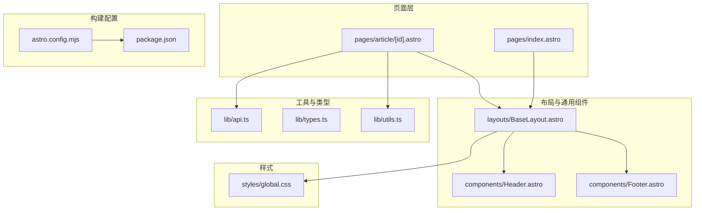
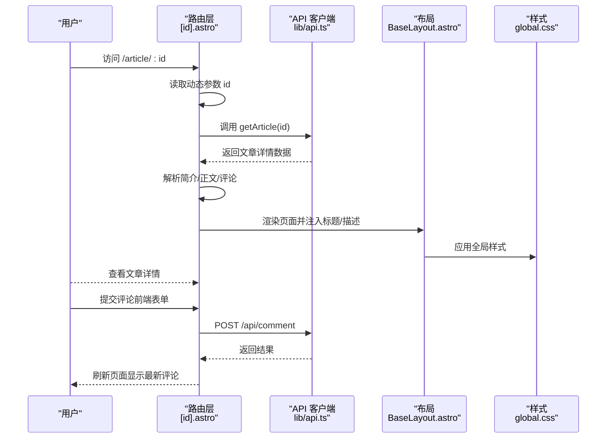
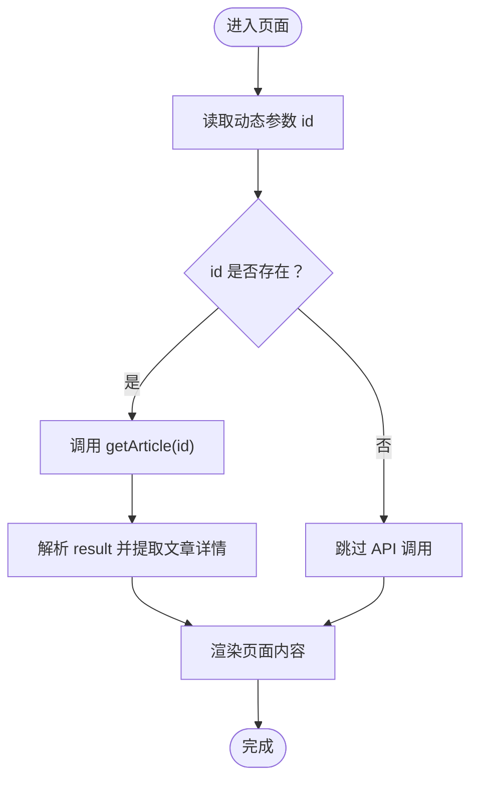
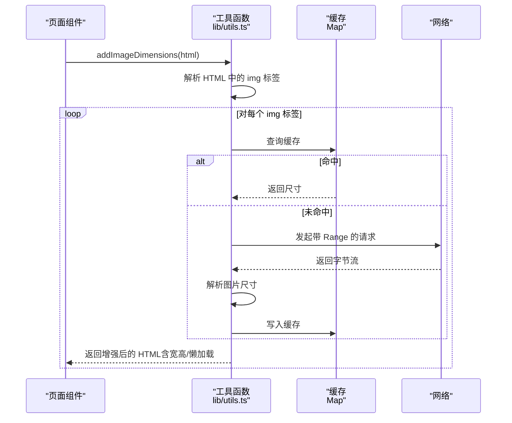
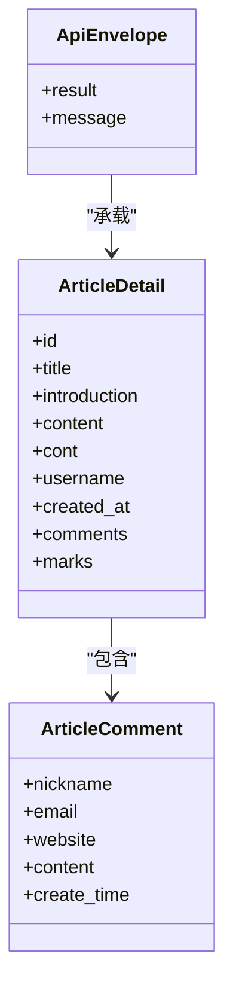
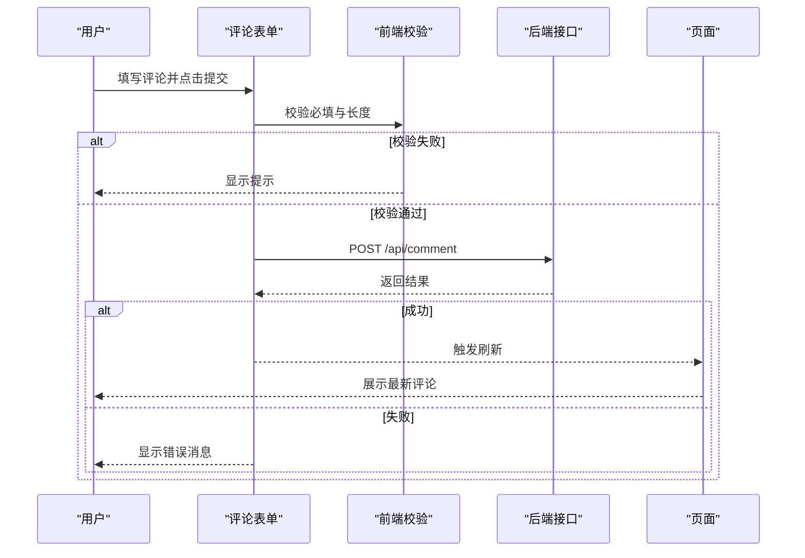
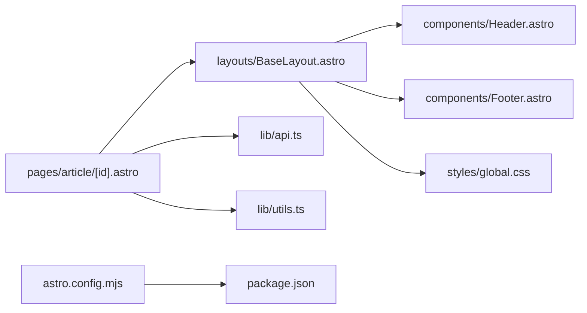

# 文章详情页面

<cite>
**本文引用的文件**
- [src/pages/article/[id].astro](file://src/pages/article/[id].astro)
- [src/lib/api.ts](file://src/lib/api.ts)
- [src/lib/types.ts](file://src/lib/types.ts)
- [src/lib/utils.ts](file://src/lib/utils.ts)
- [src/layouts/BaseLayout.astro](file://src/layouts/BaseLayout.astro)
- [src/components/Header.astro](file://src/components/Header.astro)
- [src/components/Footer.astro](file://src/components/Footer.astro)
- [src/styles/global.css](file://src/styles/global.css)
- [src/pages/index.astro](file://src/pages/index.astro)
- [astro.config.mjs](file://astro.config.mjs)
- [package.json](file://package.json)
</cite>

## 目录
1. [简介](#简介)
2. [项目结构](#项目结构)
3. [核心组件](#核心组件)
4. [架构总览](#架构总览)
5. [详细组件分析](#详细组件分析)
6. [依赖关系分析](#依赖关系分析)
7. [性能考量](#性能考量)
8. [故障排查指南](#故障排查指南)
9. [结论](#结论)
10. [附录](#附录)

## 简介
本文件面向“文章详情页面”（路径：Article/[id]）的实现进行系统性文档化，覆盖以下主题：
- 动态路由参数的获取与校验（ID 参数解析与错误处理）
- 文章详情数据的获取流程（API 调用、数据结构、缓存与加载状态）
- 内容渲染策略（富文本处理、图片尺寸稳定、代码高亮与媒体资源加载）
- SEO 优化（标题、描述、结构化数据与社交分享）
- 实现最佳实践（动态路由配置、数据获取与内容渲染）
- 性能优化、错误边界与用户体验提升建议

## 项目结构
该博客采用 Astro 静态站点生成框架，前端页面以 Astro 组件为主，配合通用布局与工具函数。文章详情页位于 pages/article/[id].astro，通过动态路由参数 id 获取对应文章内容，并在 BaseLayout 中注入 SEO 元信息与全局样式。

图表来源
- [src/pages/index.astro](file://src/pages/index.astro)
- [src/pages/article/[id].astro](file://src/pages/article/[id].astro)
- [src/layouts/BaseLayout.astro](file://src/layouts/BaseLayout.astro)
- [src/lib/api.ts](file://src/lib/api.ts)
- [src/lib/utils.ts](file://src/lib/utils.ts)
- [src/styles/global.css](file://src/styles/global.css)
- [astro.config.mjs](file://astro.config.mjs)
- [package.json](file://package.json)

章节来源
- [src/pages/article/[id].astro](file://src/pages/article/[id].astro)
- [src/layouts/BaseLayout.astro](file://src/layouts/BaseLayout.astro)
- [src/lib/api.ts](file://src/lib/api.ts)
- [src/lib/utils.ts](file://src/lib/utils.ts)
- [src/styles/global.css](file://src/styles/global.css)
- [astro.config.mjs](file://astro.config.mjs)
- [package.json](file://package.json)

## 核心组件
- 动态路由页面：Article/[id].astro
  - 获取动态参数 id
  - 调用 API 获取文章详情
  - 渲染标题、作者、时间、简介、正文与评论区
  - 前端表单提交评论（调用 /api/comment）

- 布局与 SEO：BaseLayout.astro
  - 注入 meta 标题与描述
  - 提供全局样式与运行时变量

- 工具函数：lib/utils.ts
  - 图片尺寸探测与懒加载属性增强
  - 时间格式化
  - 富文本标签规范化

- API 客户端：lib/api.ts
  - 统一请求封装、环境变量基地址
  - 文章详情接口调用

- 类型定义：lib/types.ts
  - 文章详情、分页结果、评论等接口定义

章节来源
- [src/pages/article/[id].astro](file://src/pages/article/[id].astro)
- [src/layouts/BaseLayout.astro](file://src/layouts/BaseLayout.astro)
- [src/lib/utils.ts](file://src/lib/utils.ts)
- [src/lib/api.ts](file://src/lib/api.ts)
- [src/lib/types.ts](file://src/lib/types.ts)

## 架构总览
下图展示了从用户访问到页面渲染的关键交互链路，包括动态路由、数据获取、内容渲染与评论提交。

图表来源
- [src/pages/article/[id].astro](file://src/pages/article/[id].astro)
- [src/lib/api.ts](file://src/lib/api.ts)
- [src/layouts/BaseLayout.astro](file://src/layouts/BaseLayout.astro)
- [src/styles/global.css](file://src/styles/global.css)

## 详细组件分析

### 动态路由与参数解析
- 动态路由参数来源：Astro.params.id
- 参数使用方式：仅当 id 存在时发起 API 请求；否则跳过数据获取
- 错误处理策略：
  - 当响应为空或 result 不存在时，页面仍可渲染占位标题与默认作者
  - 未提供 id 时，不触发 API 调用，避免无效请求

图表来源
- [src/pages/article/[id].astro](file://src/pages/article/[id].astro)

章节来源
- [src/pages/article/[id].astro](file://src/pages/article/[id].astro)

### 数据获取与缓存
- API 基础地址优先级：环境变量 -> PUBLIC_API_BASE_URL -> 默认值
- 统一请求封装：makeUrl、request
- 文章详情接口：getArticle(id)
- 缓存策略：
  - 图片尺寸探测使用内存缓存（Map），键为图片 URL
  - fetchImageSize 使用超时控制与 Range 请求限制首段下载
  - 缓存命中直接返回，避免重复网络请求

图表来源
- [src/lib/utils.ts](file://src/lib/utils.ts)

章节来源
- [src/lib/api.ts](file://src/lib/api.ts)
- [src/lib/utils.ts](file://src/lib/utils.ts)

### 内容渲染策略
- 标题与元信息：BaseLayout 注入 title/description
- 正文与简介：支持 set:html 渲染富文本
- 图片处理：自动添加 width/height/loading/decoding 属性，提升布局稳定性与性能
- 评论区：支持网站链接、时间格式化、Markdown 区域渲染
- 评论表单：前端校验必填项与长度，提交至 /api/comment，成功后刷新页面

图表来源
- [src/lib/types.ts](file://src/lib/types.ts)

章节来源
- [src/pages/article/[id].astro](file://src/pages/article/[id].astro)
- [src/lib/types.ts](file://src/lib/types.ts)
- [src/lib/utils.ts](file://src/lib/utils.ts)
- [src/layouts/BaseLayout.astro](file://src/layouts/BaseLayout.astro)

### SEO 优化
- 页面标题与描述：BaseLayout 接收 title/description 并注入到 <head>
- 结构化数据：当前实现未显式输出 JSON-LD 或 OpenGraph 标签
- 社交分享：未见专门的社交 meta 标签或分享按钮
- 建议补充：
  - 在 BaseLayout 中增加 JSON-LD（Article Schema）
  - 添加 OpenGraph 与 Twitter Card 相关 meta
  - 为文章详情页提供预览图与摘要

章节来源
- [src/layouts/BaseLayout.astro](file://src/layouts/BaseLayout.astro)

### 评论提交流程
- 表单字段：content、nickname、email、website、articleId（隐藏）
- 前端校验：必填、长度限制
- 提交目标：/api/comment（POST）
- 成功后刷新页面，重新拉取最新评论

图表来源
- [src/pages/article/[id].astro](file://src/pages/article/[id].astro)

章节来源
- [src/pages/article/[id].astro](file://src/pages/article/[id].astro)

## 依赖关系分析
- 页面依赖
  - [id].astro 依赖 BaseLayout、API 客户端与工具函数
  - BaseLayout 依赖 Header/Footer 与全局样式
- 运行时依赖
  - 构建输出模式为 server adapter（node）
  - 开发服务器端口与主机配置

图表来源
- [src/pages/article/[id].astro](file://src/pages/article/[id].astro)
- [src/layouts/BaseLayout.astro](file://src/layouts/BaseLayout.astro)
- [src/lib/api.ts](file://src/lib/api.ts)
- [src/lib/utils.ts](file://src/lib/utils.ts)
- [src/components/Header.astro](file://src/components/Header.astro)
- [src/components/Footer.astro](file://src/components/Footer.astro)
- [src/styles/global.css](file://src/styles/global.css)
- [astro.config.mjs](file://astro.config.mjs)
- [package.json](file://package.json)

章节来源
- [src/pages/article/[id].astro](file://src/pages/article/[id].astro)
- [src/layouts/BaseLayout.astro](file://src/layouts/BaseLayout.astro)
- [astro.config.mjs](file://astro.config.mjs)
- [package.json](file://package.json)

## 性能考量
- 图片加载优化
  - 自动为 img 标签添加 width/height/loading/decoding，减少布局抖动与重排
  - 使用 Range 请求与缓存，降低首屏渲染时的网络开销
- 请求与缓存
  - API 请求统一封装，异常捕获与返回空值，避免页面崩溃
  - 图片尺寸探测设置超时，防止长时间阻塞渲染
- 样式与布局
  - 全局样式集中管理，避免重复样式导致的体积膨胀
  - 使用 CSS 变量与响应式断点，适配多端体验

章节来源
- [src/lib/utils.ts](file://src/lib/utils.ts)
- [src/lib/api.ts](file://src/lib/api.ts)
- [src/styles/global.css](file://src/styles/global.css)

## 故障排查指南
- 动态路由参数为空
  - 现象：页面不发起 API 请求，标题/作者使用默认值
  - 处理：确认路由是否正确传递 id；检查服务端路由规则
- API 请求失败
  - 现象：返回 null，页面继续渲染但内容为空
  - 处理：检查 API 基地址配置、网络连通性与跨域设置
- 图片尺寸探测失败
  - 现象：图片未填充宽高，可能出现布局抖动
  - 处理：确认图片 URL 可访问、协议为 http/https；检查缓存命中情况
- 评论提交失败
  - 现象：表单提示错误消息
  - 处理：检查必填字段与长度限制；确认 /api/comment 接口可用

章节来源
- [src/pages/article/[id].astro](file://src/pages/article/[id].astro)
- [src/lib/api.ts](file://src/lib/api.ts)
- [src/lib/utils.ts](file://src/lib/utils.ts)

## 结论
文章详情页面通过 Astro 的动态路由与服务端渲染能力，结合统一的 API 客户端与工具函数，实现了从参数解析、数据获取、内容渲染到评论提交的完整闭环。在性能方面，图片尺寸探测与懒加载策略有效提升了首屏体验；在 SEO 方面，建议补充结构化数据与社交分享相关的 meta 标签，以进一步提升搜索引擎与社交平台的展示质量。

## 附录

### 最佳实践清单
- 动态路由
  - 明确 id 类型与范围约束，必要时在页面入口处进行校验
  - 对于非法 id，返回 404 或重定向至首页
- 数据获取
  - 使用统一的请求封装，集中处理错误与回退逻辑
  - 对关键数据（如文章详情）实现本地缓存与失效策略
- 内容渲染
  - 富文本渲染前进行白名单过滤与安全处理
  - 图片懒加载与尺寸稳定，避免布局抖动
- SEO
  - 注入标准 meta 标签与结构化数据
  - 为文章详情页提供 OpenGraph 与 Twitter Card
- 用户体验
  - 表单提交前进行前端校验，及时反馈错误
  - 加载状态与骨架屏，提升感知性能

### 参考实现路径
- 动态路由与数据获取：[src/pages/article/[id].astro](file://src/pages/article/[id].astro)
- API 客户端与请求封装：[src/lib/api.ts](file://src/lib/api.ts)
- 工具函数（图片尺寸与富文本处理）：[src/lib/utils.ts](file://src/lib/utils.ts)
- 布局与 SEO 注入：[src/layouts/BaseLayout.astro](file://src/layouts/BaseLayout.astro)
- 全局样式与响应式设计：[src/styles/global.css](file://src/styles/global.css)
- 构建与运行配置：[astro.config.mjs](file://astro.config.mjs)、[package.json](file://package.json)