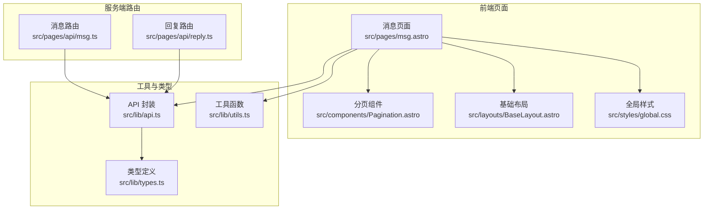
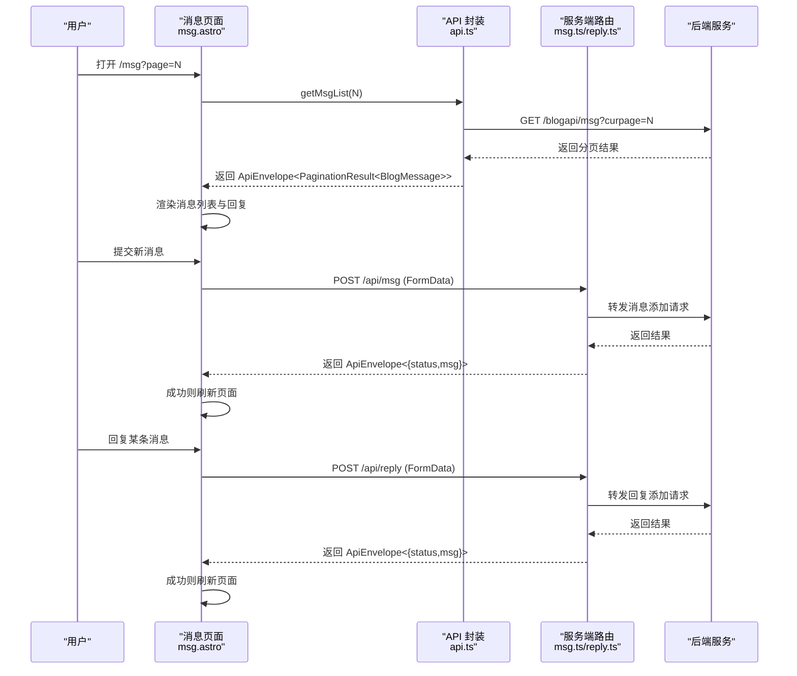
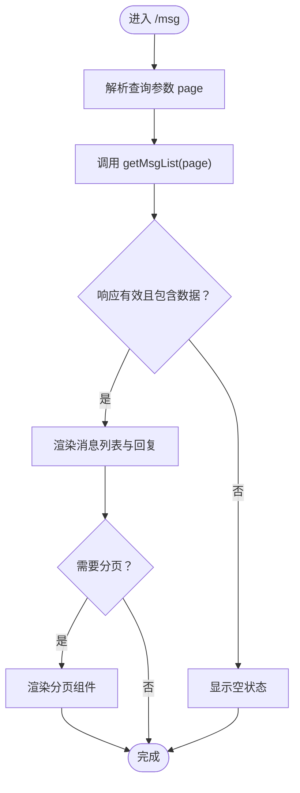
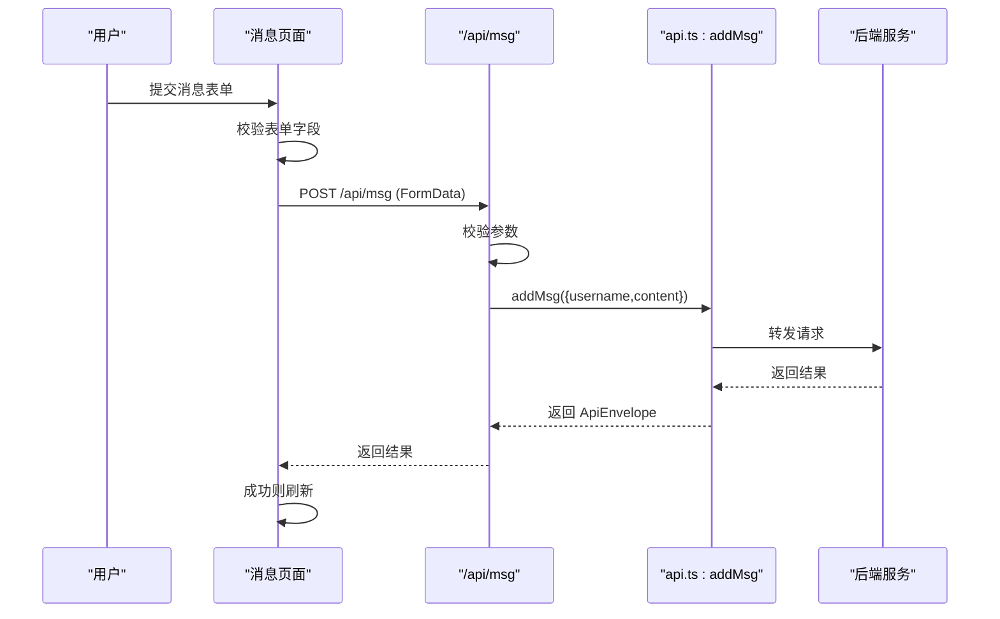
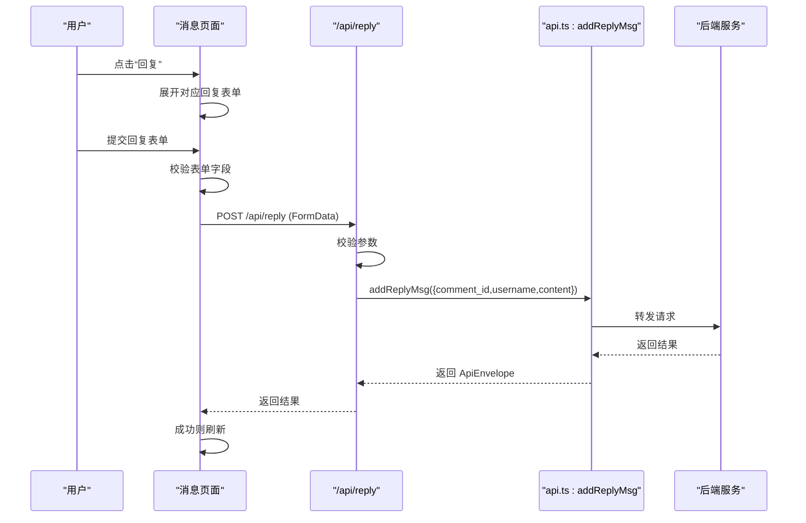
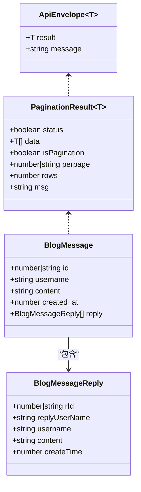
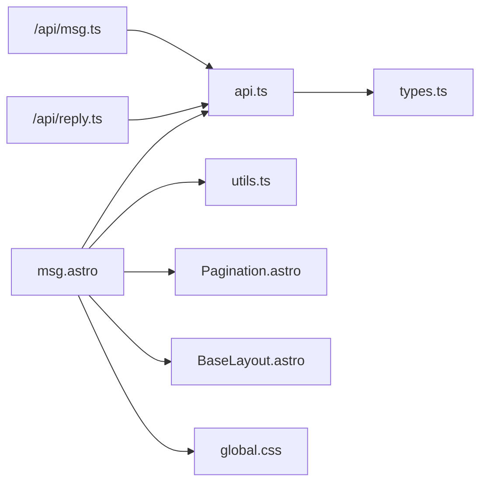

# 消息页面

<cite>
**本文引用的文件**
- [src/pages/msg.astro](file://src/pages/msg.astro)
- [src/lib/api.ts](file://src/lib/api.ts)
- [src/lib/types.ts](file://src/lib/types.ts)
- [src/lib/utils.ts](file://src/lib/utils.ts)
- [src/pages/api/msg.ts](file://src/pages/api/msg.ts)
- [src/pages/api/reply.ts](file://src/pages/api/reply.ts)
- [src/components/Pagination.astro](file://src/components/Pagination.astro)
- [src/layouts/BaseLayout.astro](file://src/layouts/BaseLayout.astro)
- [src/styles/global.css](file://src/styles/global.css)
- [package.json](file://package.json)
</cite>

## 目录
1. [简介](#简介)
2. [项目结构](#项目结构)
3. [核心组件](#核心组件)
4. [架构总览](#架构总览)
5. [详细组件分析](#详细组件分析)
6. [依赖关系分析](#依赖关系分析)
7. [性能考虑](#性能考虑)
8. [故障排查指南](#故障排查指南)
9. [结论](#结论)
10. [附录](#附录)

## 简介
本文件围绕“消息页面”（Msg 页面）进行系统化文档化，重点覆盖以下方面：
- 社交互动功能：消息列表获取与渲染、消息提交、回复系统（含嵌套回复与层级展示）、分页导航。
- 消息管理机制：数据加载、状态管理、用户反馈与错误提示。
- API 集成：GET 获取列表、POST 提交消息、POST 提交回复。
- 完整流程示例：从消息发布到回复处理的端到端流程。
- 性能优化策略、并发处理与用户体验改进建议。

## 项目结构
消息页面位于 Astro 前端工程中，采用页面级组件与服务端 API 路由相结合的方式组织：
- 页面层：消息页面负责渲染与交互逻辑（表单、回复切换、分页）。
- 工具层：统一的 API 封装、类型定义与通用工具函数。
- 服务端路由：消息与回复的后端接口，接收前端表单数据并返回标准响应体。
- 组件层：分页组件复用，基础布局提供全局样式与 SEO 元信息。

图表来源
- [src/pages/msg.astro:1-135](file://src/pages/msg.astro#L1-L135)
- [src/lib/api.ts:1-91](file://src/lib/api.ts#L1-L91)
- [src/lib/types.ts:1-54](file://src/lib/types.ts#L1-L54)
- [src/lib/utils.ts:1-219](file://src/lib/utils.ts#L1-L219)
- [src/pages/api/msg.ts:1-16](file://src/pages/api/msg.ts#L1-L16)
- [src/pages/api/reply.ts:1-17](file://src/pages/api/reply.ts#L1-L17)
- [src/components/Pagination.astro:1-28](file://src/components/Pagination.astro#L1-L28)
- [src/layouts/BaseLayout.astro:1-42](file://src/layouts/BaseLayout.astro#L1-L42)
- [src/styles/global.css:1-233](file://src/styles/global.css#L1-L233)

章节来源
- [src/pages/msg.astro:1-135](file://src/pages/msg.astro#L1-L135)
- [src/lib/api.ts:1-91](file://src/lib/api.ts#L1-L91)
- [src/lib/types.ts:1-54](file://src/lib/types.ts#L1-L54)
- [src/lib/utils.ts:1-219](file://src/lib/utils.ts#L1-L219)
- [src/pages/api/msg.ts:1-16](file://src/pages/api/msg.ts#L1-L16)
- [src/pages/api/reply.ts:1-17](file://src/pages/api/reply.ts#L1-L17)
- [src/components/Pagination.astro:1-28](file://src/components/Pagination.astro#L1-L28)
- [src/layouts/BaseLayout.astro:1-42](file://src/layouts/BaseLayout.astro#L1-L42)
- [src/styles/global.css:1-233](file://src/styles/global.css#L1-L233)

## 核心组件
- 消息页面（msg.astro）
  - 负责：获取消息列表、渲染消息与回复、处理消息提交与回复提交、分页展示、用户反馈提示。
  - 关键流程：页面初始化时读取查询参数 page，调用 API 获取列表；渲染消息卡片与回复区；绑定表单事件处理提交。
- API 封装（api.ts）
  - 负责：构造 API 基础 URL、封装 GET 请求与表单 POST 请求、导出 getMsgList、addMsg、addReplyMsg 等方法。
- 类型定义（types.ts）
  - 负责：定义 ApiEnvelope、PaginationResult、BlogMessage、BlogMessageReply 等数据模型。
- 工具函数（utils.ts）
  - 负责：时间格式化（formatUnixTime）等通用工具。
- 服务端路由（msg.ts、reply.ts）
  - 负责：接收前端表单数据，做基本校验，调用后端 API 并返回标准响应体。
- 分页组件（Pagination.astro）
  - 负责：根据当前页、总数与每页条数生成页码链接，支持上一页/下一页与省略号。
- 基础布局（BaseLayout.astro）
  - 负责：注入全局样式、SEO 元信息、API 基础地址脚本变量。

章节来源
- [src/pages/msg.astro:1-135](file://src/pages/msg.astro#L1-L135)
- [src/lib/api.ts:1-91](file://src/lib/api.ts#L1-L91)
- [src/lib/types.ts:1-54](file://src/lib/types.ts#L1-L54)
- [src/lib/utils.ts:1-219](file://src/lib/utils.ts#L1-L219)
- [src/pages/api/msg.ts:1-16](file://src/pages/api/msg.ts#L1-L16)
- [src/pages/api/reply.ts:1-17](file://src/pages/api/reply.ts#L1-L17)
- [src/components/Pagination.astro:1-28](file://src/components/Pagination.astro#L1-L28)
- [src/layouts/BaseLayout.astro:1-42](file://src/layouts/BaseLayout.astro#L1-L42)

## 架构总览
消息页面采用“页面渲染 + 服务端路由 + 工具层 API 封装”的三层协作模式：
- 页面层：负责 UI 渲染与用户交互（表单、回复展开、分页）。
- 服务端路由：负责数据校验与转发至后端，返回统一结构的响应体。
- 工具层：负责网络请求封装、URL 构造、类型约束与通用工具。

图表来源
- [src/pages/msg.astro:1-135](file://src/pages/msg.astro#L1-L135)
- [src/lib/api.ts:1-91](file://src/lib/api.ts#L1-L91)
- [src/pages/api/msg.ts:1-16](file://src/pages/api/msg.ts#L1-L16)
- [src/pages/api/reply.ts:1-17](file://src/pages/api/reply.ts#L1-L17)

## 详细组件分析

### 消息列表获取与渲染
- 数据加载
  - 页面解析查询参数 page，默认为 1；调用 getMsgList(curpage) 获取分页数据。
  - 解析返回的 ApiEnvelope，提取 PaginationResult 的 data 数组作为消息列表。
- 列表渲染
  - 使用 map 渲染每个消息项，包含用户名、时间、正文、回复按钮与回复表单。
  - 若存在回复数组，则渲染子级回复列表，显示回复用户名与时间、正文。
- 分页展示
  - 当 isPagination 为真时，传入 current、total、pageSize、basePath 渲染分页组件。
- 用户反馈
  - 列表为空时显示空状态提示。
  - 表单提交前进行本地校验（长度限制），提交中显示“提交中…”提示，失败时显示后端返回的错误信息。

图表来源
- [src/pages/msg.astro:7-13](file://src/pages/msg.astro#L7-L13)
- [src/lib/api.ts:66-68](file://src/lib/api.ts#L66-L68)
- [src/components/Pagination.astro:9-14](file://src/components/Pagination.astro#L9-L14)

章节来源
- [src/pages/msg.astro:7-13](file://src/pages/msg.astro#L7-L13)
- [src/lib/api.ts:66-68](file://src/lib/api.ts#L66-L68)
- [src/components/Pagination.astro:9-14](file://src/components/Pagination.astro#L9-L14)

### 消息提交功能
- 表单处理
  - 收集 FormData，校验 content 长度与 username 是否为空（为空则设置默认值）。
  - 显示“提交中…”提示，通过 fetch 发送 POST 到 /api/msg。
- 后端校验与转发
  - 服务端路由读取表单字段，做长度与格式校验，调用 addMsg 并返回统一响应体。
- 实时更新
  - 成功后刷新页面以展示最新消息列表。

图表来源
- [src/pages/msg.astro:90-107](file://src/pages/msg.astro#L90-L107)
- [src/pages/api/msg.ts:4-15](file://src/pages/api/msg.ts#L4-L15)
- [src/lib/api.ts:80-82](file://src/lib/api.ts#L80-L82)

章节来源
- [src/pages/msg.astro:90-107](file://src/pages/msg.astro#L90-L107)
- [src/pages/api/msg.ts:4-15](file://src/pages/api/msg.ts#L4-L15)
- [src/lib/api.ts:80-82](file://src/lib/api.ts#L80-L82)

### 回复系统架构设计
- 嵌套回复与层级展示
  - 每个消息项内嵌一个隐藏的回复表单，点击“回复”按钮切换其可见性。
  - 子回复列表直接渲染在消息项下方，形成清晰的层级关系。
- 交互体验
  - 回复按钮仅在消息存在时显示；当有回复数量时显示计数。
  - 回复表单同样进行本地校验与用户反馈提示。
- 后端转发
  - 服务端路由读取 comment_id、username、content，调用 addReplyMsg 并返回统一响应体。

图表来源
- [src/pages/msg.astro:109-133](file://src/pages/msg.astro#L109-L133)
- [src/pages/api/reply.ts:4-16](file://src/pages/api/reply.ts#L4-L16)
- [src/lib/api.ts:84-86](file://src/lib/api.ts#L84-L86)

章节来源
- [src/pages/msg.astro:109-133](file://src/pages/msg.astro#L109-L133)
- [src/pages/api/reply.ts:4-16](file://src/pages/api/reply.ts#L4-L16)
- [src/lib/api.ts:84-86](file://src/lib/api.ts#L84-L86)

### 数据模型与类型约束
- ApiEnvelope：统一响应包装，包含 result 与 message 字段。
- PaginationResult：分页结果，包含 status、data、isPagination、perpage、rows 等。
- BlogMessage：消息实体，包含 id、username、content、created_at、reply。
- BlogMessageReply：回复实体，包含 rId、replyUserName、username、content、createTime。

图表来源
- [src/lib/types.ts:1-54](file://src/lib/types.ts#L1-L54)

章节来源
- [src/lib/types.ts:1-54](file://src/lib/types.ts#L1-L54)

### 时间格式化与 UI 样式
- 时间格式化
  - 使用 formatUnixTime 将 Unix 时间戳转换为可读字符串，支持多种格式。
- UI 样式
  - 全局样式定义了主题色、阴影、圆角、栅格表单、消息卡片与回复列表的排版与交互态。

章节来源
- [src/lib/utils.ts:28-31](file://src/lib/utils.ts#L28-L31)
- [src/styles/global.css:1-233](file://src/styles/global.css#L1-L233)

## 依赖关系分析
- 页面依赖
  - msg.astro 依赖 api.ts（getMsgList）、utils.ts（formatUnixTime）、Pagination.astro、BaseLayout.astro、global.css。
- API 封装依赖
  - api.ts 依赖 types.ts（类型定义），提供 getMsgList、addMsg、addReplyMsg 等方法。
- 服务端路由依赖
  - msg.ts 与 reply.ts 依赖 api.ts 中的 addMsg 与 addReplyMsg 方法，实现表单校验与转发。
- 组件与布局
  - Pagination.astro 为纯 Astro 组件，BaseLayout.astro 注入全局样式与脚本变量。

图表来源
- [src/pages/msg.astro:1-135](file://src/pages/msg.astro#L1-L135)
- [src/lib/api.ts:1-91](file://src/lib/api.ts#L1-L91)
- [src/lib/types.ts:1-54](file://src/lib/types.ts#L1-L54)
- [src/lib/utils.ts:1-219](file://src/lib/utils.ts#L1-L219)
- [src/pages/api/msg.ts:1-16](file://src/pages/api/msg.ts#L1-L16)
- [src/pages/api/reply.ts:1-17](file://src/pages/api/reply.ts#L1-L17)
- [src/components/Pagination.astro:1-28](file://src/components/Pagination.astro#L1-L28)
- [src/layouts/BaseLayout.astro:1-42](file://src/layouts/BaseLayout.astro#L1-L42)
- [src/styles/global.css:1-233](file://src/styles/global.css#L1-L233)

章节来源
- [src/pages/msg.astro:1-135](file://src/pages/msg.astro#L1-L135)
- [src/lib/api.ts:1-91](file://src/lib/api.ts#L1-L91)
- [src/lib/types.ts:1-54](file://src/lib/types.ts#L1-L54)
- [src/lib/utils.ts:1-219](file://src/lib/utils.ts#L1-L219)
- [src/pages/api/msg.ts:1-16](file://src/pages/api/msg.ts#L1-L16)
- [src/pages/api/reply.ts:1-17](file://src/pages/api/reply.ts#L1-L17)
- [src/components/Pagination.astro:1-28](file://src/components/Pagination.astro#L1-L28)
- [src/layouts/BaseLayout.astro:1-42](file://src/layouts/BaseLayout.astro#L1-L42)
- [src/styles/global.css:1-233](file://src/styles/global.css#L1-L233)

## 性能考虑
- 列表渲染
  - 使用 map 渲染消息列表，避免不必要的重绘；分页减少一次性渲染的数据量。
- 网络请求
  - 统一的 request 封装集中处理响应状态与错误日志，减少重复代码。
- 本地校验
  - 在前端进行输入长度与必填字段校验，降低无效请求次数。
- 样式与交互
  - 使用 CSS Grid 与 Flex 布局提升渲染效率；按钮与表单交互态使用过渡动画，避免阻塞主线程。
- 可选优化建议
  - 对于高频提交场景，可在前端引入防抖与节流，减少重复提交。
  - 对分页链接生成可做缓存，避免重复计算页码集合。
  - 对时间格式化可做本地缓存，减少重复格式化开销。

[本节为通用性能建议，不直接分析具体文件]

## 故障排查指南
- 常见问题与定位
  - 列表为空：检查 getMsgList 返回的 result.status 与 data；确认 isPagination、perpage、rows 字段是否正确。
  - 提交失败：查看前端提示文本与后端返回的 result.msg；确认 /api/msg 或 /api/reply 的校验规则。
  - 回复无法显示：确认消息项的 reply 数组是否存在且非空；检查回复表单的展开逻辑。
- 错误处理要点
  - 前端 fetch 失败或 JSON 解析异常时，应捕获并提示用户网络或服务异常。
  - 后端路由对必填字段与长度进行严格校验，返回明确的错误信息。
- 日志与调试
  - 在 request 函数中已记录失败的 URL 与错误堆栈，便于定位问题。

章节来源
- [src/pages/msg.astro:90-107](file://src/pages/msg.astro#L90-L107)
- [src/pages/api/msg.ts:9-11](file://src/pages/api/msg.ts#L9-L11)
- [src/pages/api/reply.ts:10-12](file://src/pages/api/reply.ts#L10-L12)
- [src/lib/api.ts:25-41](file://src/lib/api.ts#L25-L41)

## 结论
消息页面通过清晰的页面层、工具层与服务端路由协作，实现了完整的社交互动与消息管理能力：
- 列表获取与渲染：支持分页、空状态与时间格式化。
- 消息提交：本地校验、统一错误提示、成功后刷新。
- 回复系统：嵌套层级展示、交互式展开与提交。
- API 集成：统一响应体、前后端一致的校验与错误处理。
配合合理的性能优化与用户体验改进，可进一步提升系统的稳定性与可用性。

[本节为总结性内容，不直接分析具体文件]

## 附录
- 开发与运行
  - 使用 Astro 开发服务器启动项目，支持热更新与预览。
- API 基础地址
  - 基础布局注入窗口变量 __BLOG_API_BASE__，用于前端 API 基础 URL 的配置。

章节来源
- [package.json:7-10](file://package.json#L7-L10)
- [src/layouts/BaseLayout.astro:17-29](file://src/layouts/BaseLayout.astro#L17-L29)