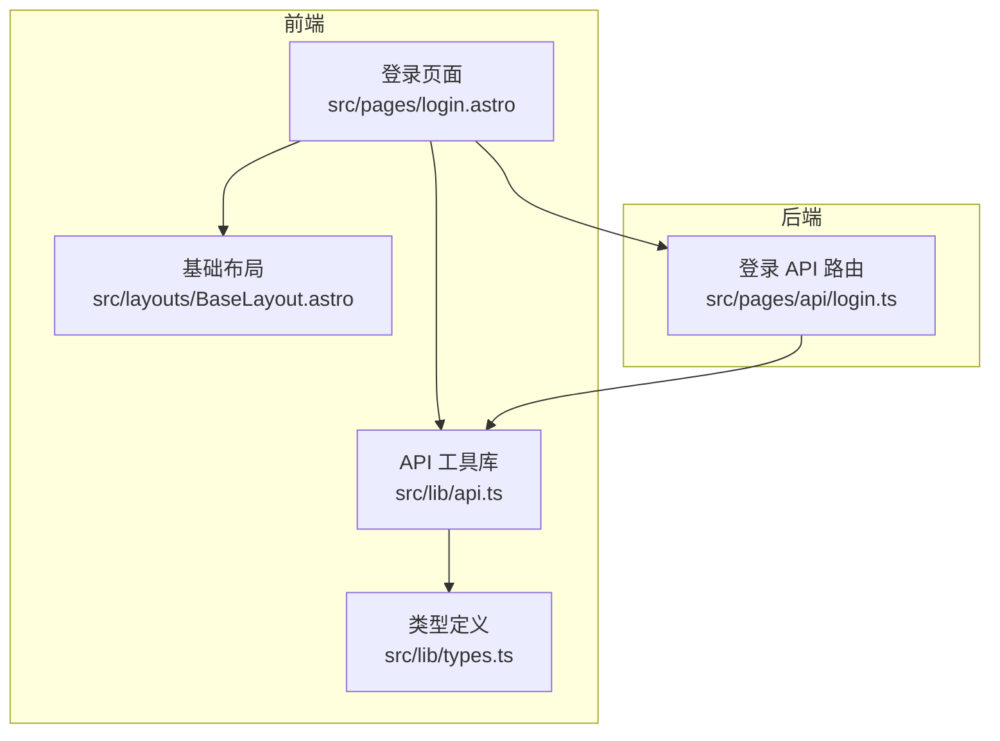
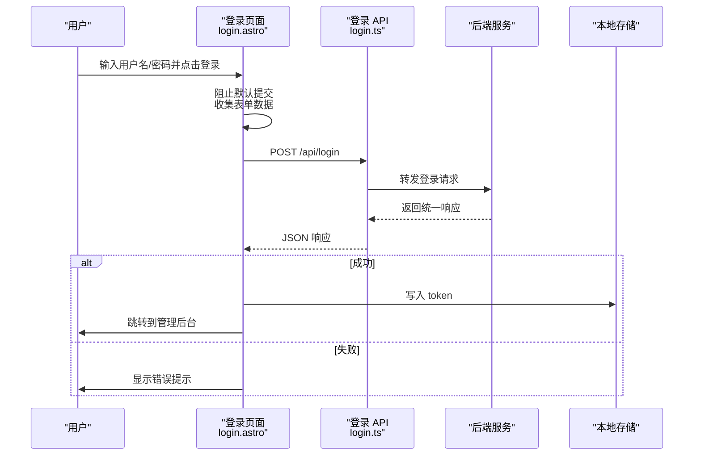
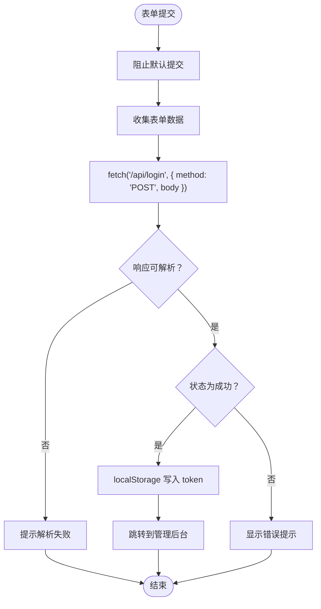
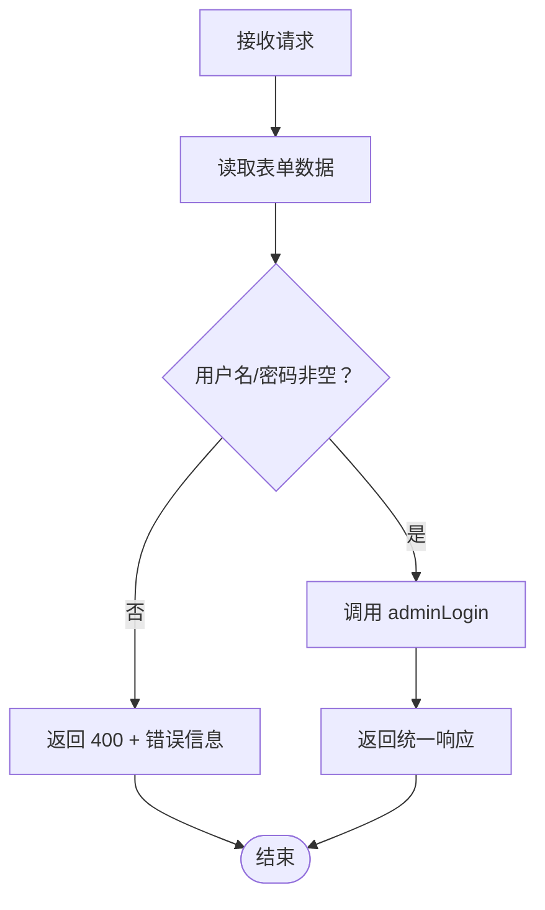
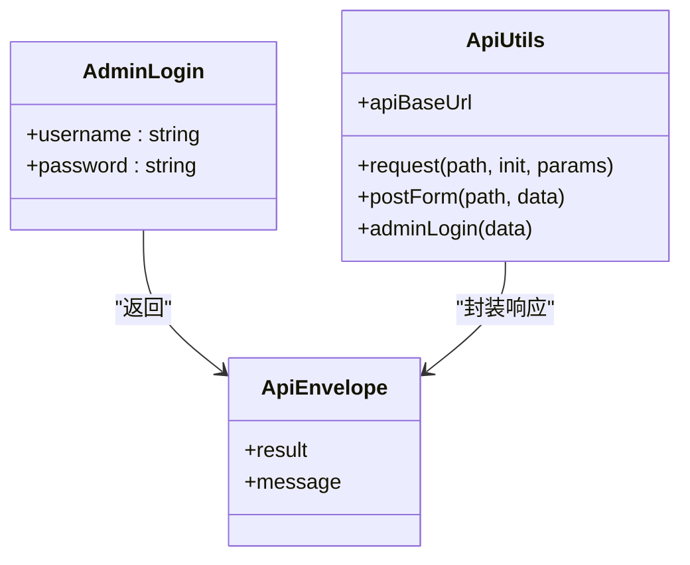
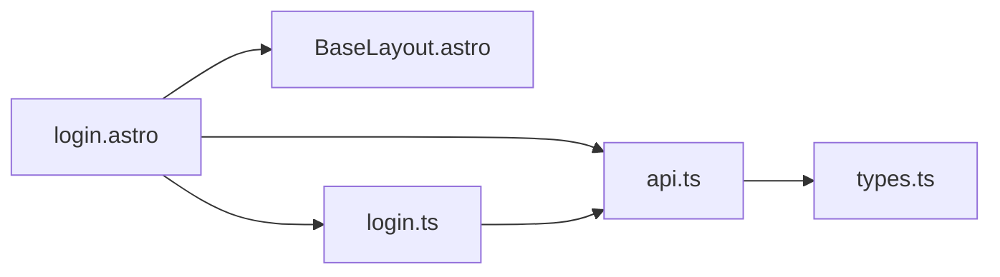

# 登录页面

<cite>
**本文引用的文件**
- [login.astro](file://src/pages/login.astro)
- [login.ts](file://src/pages/api/login.ts)
- [api.ts](file://src/lib/api.ts)
- [types.ts](file://src/lib/types.ts)
- [BaseLayout.astro](file://src/layouts/BaseLayout.astro)
- [index.astro](file://src/pages/admin/index.astro)
- [package.json](file://package.json)
- [astro.config.mjs](file://astro.config.mjs)
</cite>

## 目录
1. [简介](#简介)
2. [项目结构](#项目结构)
3. [核心组件](#核心组件)
4. [架构总览](#架构总览)
5. [详细组件分析](#详细组件分析)
6. [依赖关系分析](#依赖关系分析)
7. [性能考量](#性能考量)
8. [故障排查指南](#故障排查指南)
9. [结论](#结论)
10. [附录](#附录)

## 简介
本文件面向前端与全栈开发者，系统性梳理登录页面的身份验证流程与安全机制，覆盖表单设计与输入校验、前后端集成、状态管理与权限控制、以及安全防护（CSRF、XSS、密码安全）等主题，并提供从表单提交到权限验证的完整流程示例、错误处理策略与优化建议。

## 项目结构
登录功能由前端页面与后端 API 共同组成：
- 前端页面：负责表单渲染、用户交互、本地状态存储与跳转
- 后端 API：接收表单数据、执行业务校验并返回统一响应
- 工具库：封装通用 API 请求与类型定义，便于复用与扩展

图表来源
- [login.astro:1-55](file://src/pages/login.astro#L1-L55)
- [login.ts:1-16](file://src/pages/api/login.ts#L1-L16)
- [api.ts:1-91](file://src/lib/api.ts#L1-L91)
- [types.ts:1-54](file://src/lib/types.ts#L1-L54)
- [BaseLayout.astro:1-42](file://src/layouts/BaseLayout.astro#L1-L42)

章节来源
- [login.astro:1-55](file://src/pages/login.astro#L1-L55)
- [login.ts:1-16](file://src/pages/api/login.ts#L1-L16)
- [api.ts:1-91](file://src/lib/api.ts#L1-L91)
- [types.ts:1-54](file://src/lib/types.ts#L1-L54)
- [BaseLayout.astro:1-42](file://src/layouts/BaseLayout.astro#L1-L42)

## 核心组件
- 登录页面（前端）
  - 表单字段：用户名、密码
  - 行为：阻止默认提交、收集表单数据、调用后端登录接口、根据响应更新 UI 并持久化令牌
  - 状态：使用浏览器本地存储保存令牌，用于后续受保护资源访问
- 登录 API（后端）
  - 接收表单数据，进行基本必填校验，转发至工具库执行登录逻辑
  - 返回统一响应结构，包含状态码与消息
- API 工具库
  - 统一封装请求构造、URL 拼接、表单提交、JSON 解析与错误处理
  - 提供 adminLogin 方法，指向后端登录接口
- 类型定义
  - 定义统一响应包装体与分页结果等类型，确保前后端契约一致

章节来源
- [login.astro:14-53](file://src/pages/login.astro#L14-L53)
- [login.ts:4-15](file://src/pages/api/login.ts#L4-L15)
- [api.ts:43-90](file://src/lib/api.ts#L43-L90)
- [types.ts:1-13](file://src/lib/types.ts#L1-L13)

## 架构总览
下图展示登录从用户输入到后端处理、再到前端状态更新与页面跳转的端到端流程。

图表来源
- [login.astro:37-53](file://src/pages/login.astro#L37-L53)
- [login.ts:4-15](file://src/pages/api/login.ts#L4-L15)
- [api.ts:88-90](file://src/lib/api.ts#L88-L90)

## 详细组件分析

### 登录页面（前端）
- 表单设计与输入验证
  - 字段：用户名、密码；均标记为必填
  - 长度限制：用户名最大长度、密码最大长度
  - 用户体验：提交时显示“登录中…”提示，失败时高亮错误并显示具体消息
- 事件处理与请求发送
  - 使用 FormData 收集表单数据
  - 通过 fetch 发送 POST 请求到 /api/login
  - 对响应进行 JSON 解析，捕获解析异常避免崩溃
- 状态管理与权限控制
  - 成功登录后，将 token 写入 localStorage
  - 页面跳转到管理后台入口
  - 当前代码未在其他页面读取 token 或进行权限拦截，需在后续完善

图表来源
- [login.astro:37-53](file://src/pages/login.astro#L37-L53)

章节来源
- [login.astro:14-53](file://src/pages/login.astro#L14-L53)

### 登录 API（后端）
- 数据接收与校验
  - 从请求中提取表单数据，判断用户名与密码是否为空
  - 若为空，返回 400 与错误信息
- 业务调用与响应
  - 调用工具库中的 adminLogin 方法执行登录
  - 将后端返回的统一响应体原样返回给前端
- 错误处理
  - 对空参数进行显式校验，避免空值传播
  - 未对 CSRF、XSS 等进行额外处理，需在后续增强

图表来源
- [login.ts:4-15](file://src/pages/api/login.ts#L4-L15)

章节来源
- [login.ts:1-16](file://src/pages/api/login.ts#L1-L16)

### API 工具库与类型定义
- 统一请求封装
  - 自动拼接 base URL 与查询参数
  - 统一处理响应状态与 JSON 解析
  - 对非 OK 响应返回空值，避免抛错影响调用方
- 表单提交
  - 将键值对编码为 application/x-www-form-urlencoded
  - 适用于登录等表单场景
- 登录方法
  - adminLogin 将用户名与密码作为表单数据提交到后端登录接口
- 类型定义
  - ApiEnvelope 包裹 result 与 message，保证前后端契约一致
  - 分页结果等类型支撑后续管理功能

图表来源
- [api.ts:1-91](file://src/lib/api.ts#L1-L91)
- [types.ts:1-13](file://src/lib/types.ts#L1-L13)

章节来源
- [api.ts:17-90](file://src/lib/api.ts#L17-L90)
- [types.ts:1-13](file://src/lib/types.ts#L1-L13)

### 权限控制与会话管理
- 当前实现
  - 登录成功后将 token 写入 localStorage
  - 管理后台入口页面未做权限拦截，所有链接均可访问
- 建议改进
  - 在管理后台入口与受保护页面增加权限校验
  - 读取 localStorage 中的 token，若缺失则重定向至登录页
  - 结合后端会话/令牌机制，实现更严格的访问控制

章节来源
- [login.astro:46-48](file://src/pages/login.astro#L46-L48)
- [index.astro:1-30](file://src/pages/admin/index.astro#L1-L30)

## 依赖关系分析
- 前端页面依赖
  - 基础布局：提供全局样式与脚本注入
  - API 工具库：封装请求与登录方法
  - 类型定义：约束统一响应格式
- 后端 API 依赖
  - 工具库：adminLogin 方法
  - 类型定义：统一响应结构

图表来源
- [login.astro:1-55](file://src/pages/login.astro#L1-L55)
- [BaseLayout.astro:1-42](file://src/layouts/BaseLayout.astro#L1-L42)
- [api.ts:1-91](file://src/lib/api.ts#L1-L91)
- [types.ts:1-54](file://src/lib/types.ts#L1-L54)
- [login.ts:1-16](file://src/pages/api/login.ts#L1-L16)

章节来源
- [login.astro:1-55](file://src/pages/login.astro#L1-L55)
- [login.ts:1-16](file://src/pages/api/login.ts#L1-L16)
- [api.ts:1-91](file://src/lib/api.ts#L1-L91)
- [types.ts:1-54](file://src/lib/types.ts#L1-L54)
- [BaseLayout.astro:1-42](file://src/layouts/BaseLayout.astro#L1-L42)

## 性能考量
- 请求开销
  - 登录请求为轻量级表单提交，建议在 UI 上提供加载态与防重复提交
- 响应解析
  - 前端对 JSON 解析做了容错处理，避免异常导致页面崩溃
- 资源加载
  - 基础布局注入全局样式与变量，减少重复请求

章节来源
- [login.astro:44-45](file://src/pages/login.astro#L44-L45)
- [api.ts:25-41](file://src/lib/api.ts#L25-L41)

## 故障排查指南
- 常见问题与定位
  - 登录无响应：检查 /api/login 是否可达、网络面板是否有错误
  - 提交后无反馈：确认前端是否正确阻止默认提交并显示提示
  - 登录失败提示：核对后端返回的错误信息字段
- 错误处理策略
  - 前端：对响应解析异常进行兜底，避免页面崩溃
  - 后端：对空参数进行显式校验并返回明确错误
- 安全加固建议
  - CSRF：在表单中加入一次性令牌并在后端校验
  - XSS：对输入进行白名单过滤与输出转义
  - 密码安全：后端应使用强哈希与盐值，传输层使用 HTTPS

章节来源
- [login.astro:37-53](file://src/pages/login.astro#L37-L53)
- [login.ts:9-11](file://src/pages/api/login.ts#L9-L11)

## 结论
当前登录页面实现了基础的表单提交、后端校验与令牌持久化，但尚未实现跨页面的权限拦截与安全强化。建议在后续迭代中补充：
- 前端权限守卫与路由拦截
- CSRF/XSS/密码安全等安全措施
- 更完善的错误提示与用户体验优化

## 附录

### 登录流程示例（从表单提交到权限验证）
- 步骤
  - 用户在登录页填写用户名与密码并提交
  - 前端阻止默认提交，收集表单数据并通过 fetch 发送到 /api/login
  - 后端校验参数并调用登录逻辑，返回统一响应
  - 前端根据响应写入 token 并跳转到管理后台
  - 后续页面访问可通过读取 token 实现权限控制（建议在后续完善）

章节来源
- [login.astro:37-53](file://src/pages/login.astro#L37-L53)
- [login.ts:4-15](file://src/pages/api/login.ts#L4-L15)
- [api.ts:88-90](file://src/lib/api.ts#L88-L90)

### 安全最佳实践清单
- CSRF
  - 生成一次性令牌并随表单提交
  - 后端严格校验来源与令牌有效性
- XSS
  - 输入白名单过滤与输出 HTML 转义
  - 限制富文本与链接属性
- 密码安全
  - 后端使用强哈希算法与随机盐
  - 传输层强制 HTTPS
- 会话管理
  - 令牌过期与刷新策略
  - 退出登录时清理本地存储

章节来源
- [login.astro:17-21](file://src/pages/login.astro#L17-L21)
- [login.ts:9-11](file://src/pages/api/login.ts#L9-L11)
- [api.ts:25-41](file://src/lib/api.ts#L25-L41)