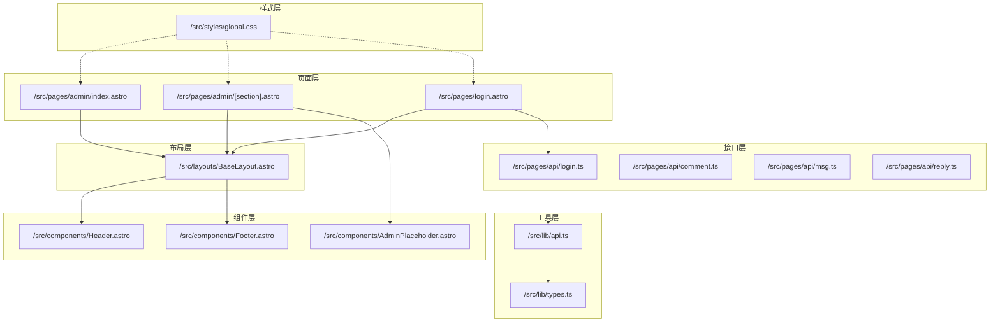
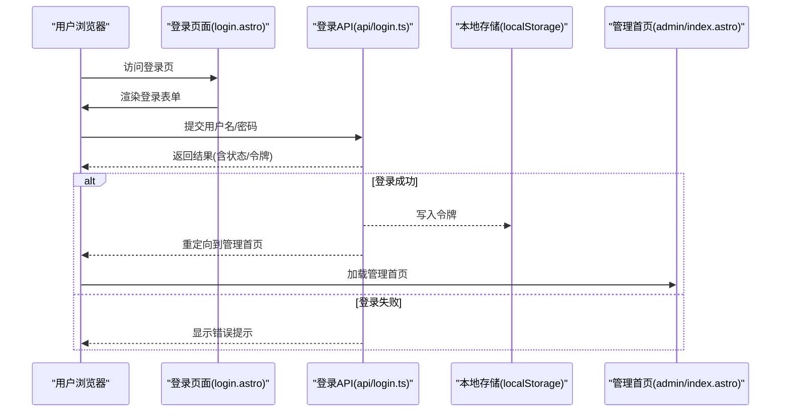
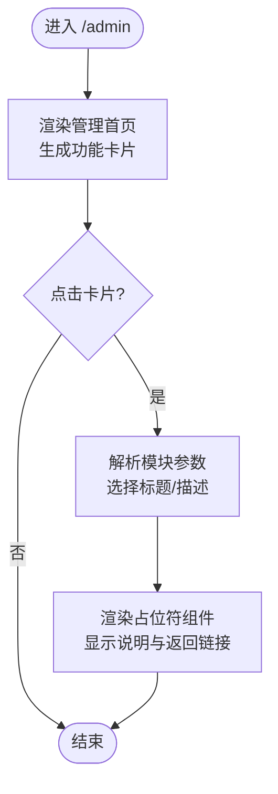
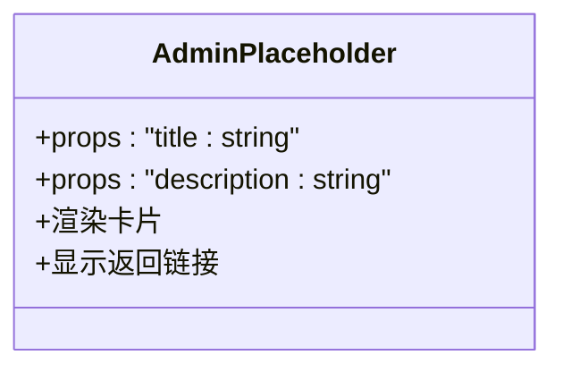
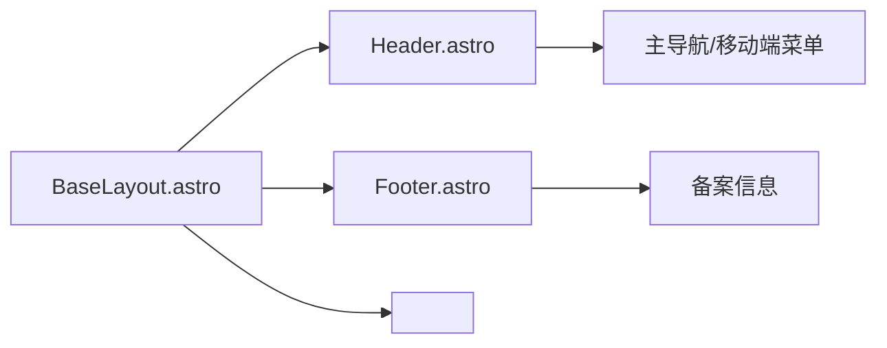
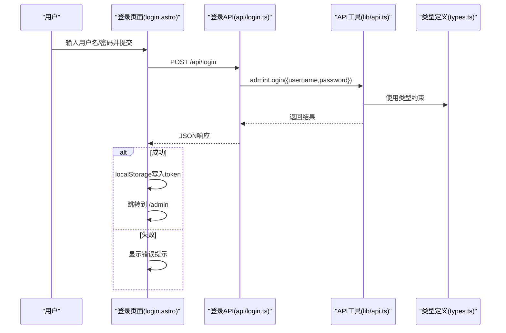
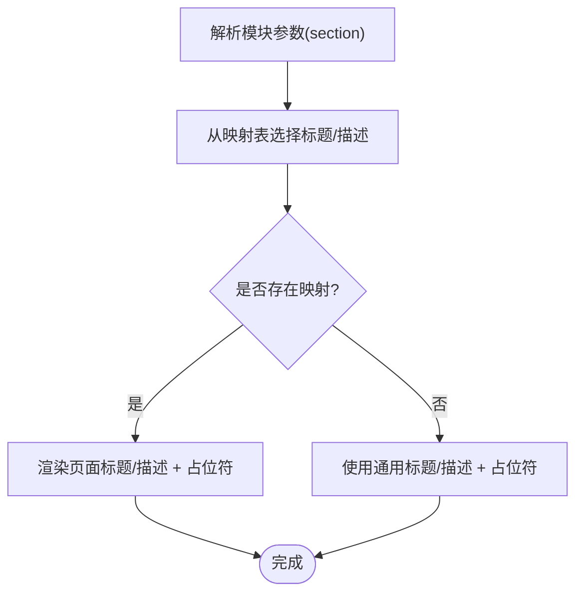
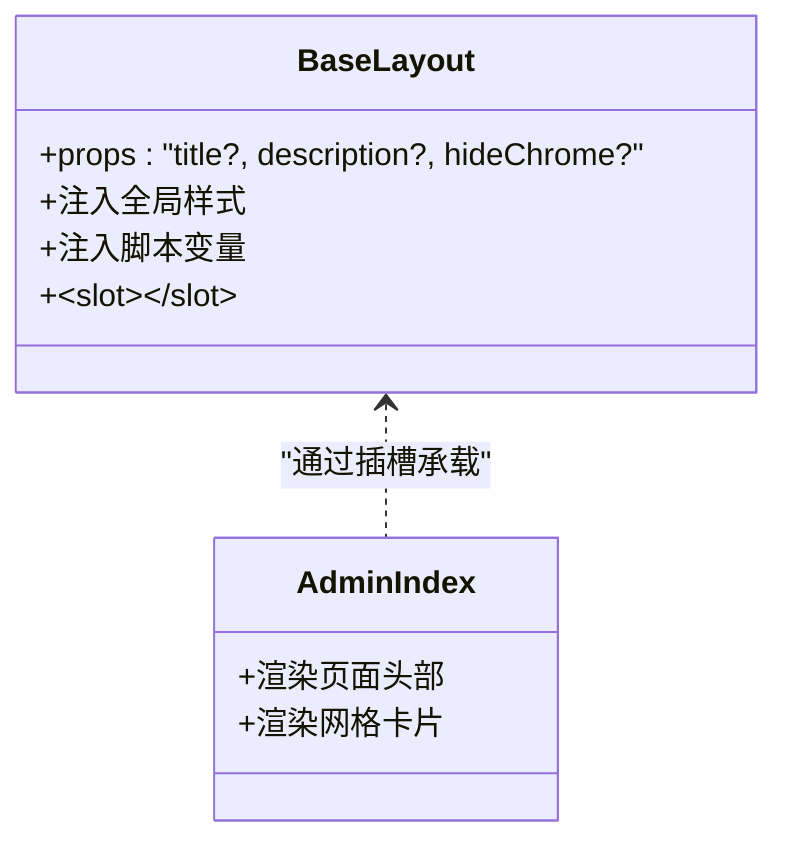
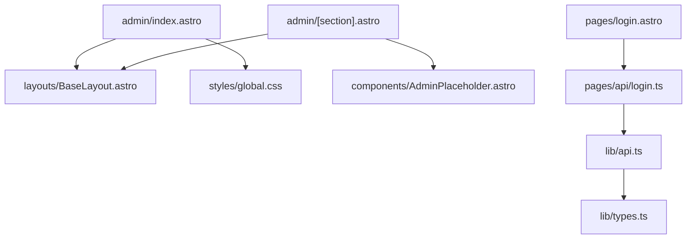

# 管理后台页面

<cite>
**本文引用的文件**
- [src/pages/admin/index.astro](file://src/pages/admin/index.astro)
- [src/pages/admin/[section].astro](file://src/pages/admin/[section].astro)
- [src/components/AdminPlaceholder.astro](file://src/components/AdminPlaceholder.astro)
- [src/layouts/BaseLayout.astro](file://src/layouts/BaseLayout.astro)
- [src/components/Header.astro](file://src/components/Header.astro)
- [src/components/Footer.astro](file://src/components/Footer.astro)
- [src/styles/global.css](file://src/styles/global.css)
- [src/lib/types.ts](file://src/lib/types.ts)
- [src/lib/api.ts](file://src/lib/api.ts)
- [src/pages/api/login.ts](file://src/pages/api/login.ts)
- [src/pages/login.astro](file://src/pages/login.astro)
- [src/pages/api/comment.ts](file://src/pages/api/comment.ts)
- [src/pages/api/msg.ts](file://src/pages/api/msg.ts)
- [src/pages/api/reply.ts](file://src/pages/api/reply.ts)
- [package.json](file://package.json)
</cite>

## 目录
1. [简介](#简介)
2. [项目结构](#项目结构)
3. [核心组件](#核心组件)
4. [架构总览](#架构总览)
5. [详细组件分析](#详细组件分析)
6. [依赖关系分析](#依赖关系分析)
7. [性能考量](#性能考量)
8. [故障排查指南](#故障排查指南)
9. [结论](#结论)
10. [附录：开发指南](#附录开发指南)

## 简介
本文件面向管理后台页面的架构与实现，聚焦于 Admin 区域的权限控制、导航结构、功能模块设计与布局组件集成。当前代码库处于从旧项目向 Astro SSR 迁移阶段，管理后台采用“保留路由 + 占位符”的渐进式策略：首页提供功能入口卡片，按需加载对应功能模块；占位符组件用于统一展示未完成模块的说明与返回链接。同时，登录流程通过服务端 API 完成鉴权，前端在登录成功后写入本地令牌并跳转至管理首页。

## 项目结构
管理后台相关文件主要分布在以下位置：
- 页面层：管理首页与按模块路由
- 组件层：占位符组件与通用布局
- 布局层：基础布局与通用头部/底部
- 样式层：全局样式与管理后台专用样式
- 接口层：服务端 API（登录、评论、消息、回复）
- 工具层：类型定义与 API 请求封装



图表来源
- [src/pages/admin/index.astro:1-30](file://src/pages/admin/index.astro#L1-L30)
- [src/pages/admin/[section].astro:1-25](file://src/pages/admin/[section].astro#L1-L25)
- [src/components/AdminPlaceholder.astro:1-13](file://src/components/AdminPlaceholder.astro#L1-L13)
- [src/layouts/BaseLayout.astro:1-42](file://src/layouts/BaseLayout.astro#L1-L42)
- [src/components/Header.astro:1-48](file://src/components/Header.astro#L1-L48)
- [src/components/Footer.astro:1-8](file://src/components/Footer.astro#L1-L8)
- [src/styles/global.css:1-233](file://src/styles/global.css#L1-L233)
- [src/pages/api/login.ts:1-16](file://src/pages/api/login.ts#L1-L16)
- [src/pages/api/comment.ts:1-19](file://src/pages/api/comment.ts#L1-L19)
- [src/pages/api/msg.ts:1-16](file://src/pages/api/msg.ts#L1-L16)
- [src/pages/api/reply.ts:1-17](file://src/pages/api/reply.ts#L1-L17)
- [src/lib/types.ts:1-54](file://src/lib/types.ts#L1-L54)
- [src/lib/api.ts:1-91](file://src/lib/api.ts#L1-L91)

章节来源
- [src/pages/admin/index.astro:1-30](file://src/pages/admin/index.astro#L1-L30)
- [src/pages/admin/[section].astro:1-25](file://src/pages/admin/[section].astro#L1-L25)
- [src/components/AdminPlaceholder.astro:1-13](file://src/components/AdminPlaceholder.astro#L1-L13)
- [src/layouts/BaseLayout.astro:1-42](file://src/layouts/BaseLayout.astro#L1-L42)
- [src/components/Header.astro:1-48](file://src/components/Header.astro#L1-L48)
- [src/components/Footer.astro:1-8](file://src/components/Footer.astro#L1-L8)
- [src/styles/global.css:224-228](file://src/styles/global.css#L224-L228)

## 核心组件
- 管理首页卡片入口：提供“发布文章”“文章管理”“评论管理”“动态管理”“个人信息”“系统设置”等入口，作为迁移阶段的功能聚合页。
- 按模块路由：根据参数渲染对应模块标题与描述，并注入占位符组件，统一展示未完成模块的说明与返回链接。
- 占位符组件：接收标题与描述属性，输出一致风格的卡片与返回链接，便于快速迭代与扩展。
- 基础布局：注入全局样式与脚本变量，提供站点主体与插槽承载各页面内容。
- 登录页面与登录 API：提供用户名/密码校验、令牌下发与前端存储，作为管理后台访问的前置条件。

章节来源
- [src/pages/admin/index.astro:4-11](file://src/pages/admin/index.astro#L4-L11)
- [src/pages/admin/[section].astro:6-14](file://src/pages/admin/[section].astro#L6-L14)
- [src/components/AdminPlaceholder.astro:2-6](file://src/components/AdminPlaceholder.astro#L2-L6)
- [src/layouts/BaseLayout.astro:12-17](file://src/layouts/BaseLayout.astro#L12-L17)
- [src/pages/api/login.ts:4-15](file://src/pages/api/login.ts#L4-L15)
- [src/pages/login.astro:14-27](file://src/pages/login.astro#L14-L27)

## 架构总览
管理后台采用“页面路由 + 组件占位 + 布局封装 + API 接口”的分层设计。页面路由负责入口与模块化导航，组件层负责复用与一致性，布局层负责全局样式与脚本注入，接口层负责与后端交互与数据模型。



图表来源
- [src/pages/login.astro:34-54](file://src/pages/login.astro#L34-L54)
- [src/pages/api/login.ts:4-15](file://src/pages/api/login.ts#L4-L15)
- [src/pages/admin/index.astro:13-29](file://src/pages/admin/index.astro#L13-L29)

## 详细组件分析

### 管理首页与按模块路由
- 管理首页：以卡片网格形式列出所有功能入口，点击进入对应模块路由。
- 模块路由：根据参数选择模块标题与描述，若无匹配则回退为通用说明；随后注入占位符组件，保持界面一致性。



图表来源
- [src/pages/admin/index.astro:19-27](file://src/pages/admin/index.astro#L19-L27)
- [src/pages/admin/[section].astro:5-14](file://src/pages/admin/[section].astro#L5-L14)
- [src/components/AdminPlaceholder.astro:8-12](file://src/components/AdminPlaceholder.astro#L8-L12)

章节来源
- [src/pages/admin/index.astro:1-30](file://src/pages/admin/index.astro#L1-L30)
- [src/pages/admin/[section].astro:1-25](file://src/pages/admin/[section].astro#L1-L25)
- [src/components/AdminPlaceholder.astro:1-13](file://src/components/AdminPlaceholder.astro#L1-L13)

### 占位符组件
- 作用：在模块尚未完成时，提供统一的说明文案与返回链接，保证管理后台视觉与交互的一致性。
- 扩展机制：通过属性传入标题与描述，便于在不同模块间复用；如需增强交互，可在组件内部增加按钮或链接。



图表来源
- [src/components/AdminPlaceholder.astro:2-6](file://src/components/AdminPlaceholder.astro#L2-L6)

章节来源
- [src/components/AdminPlaceholder.astro:1-13](file://src/components/AdminPlaceholder.astro#L1-L13)

### 基础布局与通用组件
- 基础布局：注入全局样式与公共脚本变量，支持是否隐藏头部/底部的开关；通过插槽承载页面内容。
- 头部组件：提供主导航与移动端菜单切换逻辑；包含进入管理后台的入口链接。
- 底部组件：提供版权信息容器。



图表来源
- [src/layouts/BaseLayout.astro:12-17](file://src/layouts/BaseLayout.astro#L12-L17)
- [src/components/Header.astro:7-12](file://src/components/Header.astro#L7-L12)
- [src/components/Footer.astro:1-8](file://src/components/Footer.astro#L1-L8)

章节来源
- [src/layouts/BaseLayout.astro:1-42](file://src/layouts/BaseLayout.astro#L1-L42)
- [src/components/Header.astro:1-48](file://src/components/Header.astro#L1-L48)
- [src/components/Footer.astro:1-8](file://src/components/Footer.astro#L1-L8)

### 权限控制与登录流程
- 登录页面：提供用户名/密码输入与提交事件处理，调用登录 API 并在成功后写入令牌与跳转。
- 登录 API：接收表单数据，进行基本校验后调用工具层封装的请求方法，返回结果。
- 工具层封装：统一构造 URL 与请求头，屏蔽底层细节；提供文章、消息、评论等接口的封装函数。



图表来源
- [src/pages/login.astro:34-54](file://src/pages/login.astro#L34-L54)
- [src/pages/api/login.ts:4-15](file://src/pages/api/login.ts#L4-L15)
- [src/lib/api.ts:88-90](file://src/lib/api.ts#L88-L90)
- [src/lib/types.ts:1-54](file://src/lib/types.ts#L1-L54)

章节来源
- [src/pages/login.astro:1-55](file://src/pages/login.astro#L1-L55)
- [src/pages/api/login.ts:1-16](file://src/pages/api/login.ts#L1-L16)
- [src/lib/api.ts:1-91](file://src/lib/api.ts#L1-L91)
- [src/lib/types.ts:1-54](file://src/lib/types.ts#L1-L54)

### 功能模块设计（按模块路由）
- 模块清单：发布文章、文章管理、评论管理、动态管理、个人信息、系统设置。
- 设计原则：每个模块通过参数路由定位，标题与描述来自映射表；未完成模块统一使用占位符组件展示说明。
- 迁移策略：当前模块均为占位，后续逐步替换为真实页面组件与服务端表单。



图表来源
- [src/pages/admin/[section].astro:5-14](file://src/pages/admin/[section].astro#L5-L14)

章节来源
- [src/pages/admin/[section].astro:1-25](file://src/pages/admin/[section].astro#L1-L25)

### 布局设计与组件集成
- 管理首页网格：采用自适应网格布局，卡片具备统一的阴影、圆角与间距，提升可读性与一致性。
- 页面头部：标题与描述居中展示，配合全局样式统一字体与色彩体系。
- 插槽承载：通过基础布局的插槽，将页面内容无缝接入统一的头部/底部框架。



图表来源
- [src/layouts/BaseLayout.astro:12-17](file://src/layouts/BaseLayout.astro#L12-L17)
- [src/pages/admin/index.astro:13-29](file://src/pages/admin/index.astro#L13-L29)

章节来源
- [src/styles/global.css:224-228](file://src/styles/global.css#L224-L228)
- [src/pages/admin/index.astro:13-29](file://src/pages/admin/index.astro#L13-L29)
- [src/layouts/BaseLayout.astro:19-41](file://src/layouts/BaseLayout.astro#L19-L41)

### 数据模型与接口
- 类型定义：涵盖文章摘要/详情、评论、消息与回复等核心数据结构，统一返回体与分页结构。
- 接口封装：提供文章列表、文章详情、消息列表、新增评论、新增消息、新增回复与管理员登录等方法，统一处理 URL 构造与错误处理。

```mermaid
erDiagram
ARTICLE_SUMMARY {
number|string id
string title
string introduction
number created_at
}
ARTICLE_DETAIL {
number|string id
string title
string introduction
number created_at
string username
string content
string cont
}
ARTICLE_COMMENT {
number|string id
string nickname
string email
string website
string content
string create_time
}
BLOG_MESSAGE {
number|string id
string username
string content
number created_at
}
BLOG_MESSAGE_REPLY {
number|string rId
string replyUserName
string username
string content
number createTime
}
ARTICLE_DETAIL ||--o{ ARTICLE_COMMENT : "包含"
BLOG_MESSAGE ||--o{ BLOG_MESSAGE_REPLY : "包含"
```

图表来源
- [src/lib/types.ts:15-53](file://src/lib/types.ts#L15-L53)

章节来源
- [src/lib/types.ts:1-54](file://src/lib/types.ts#L1-L54)
- [src/lib/api.ts:58-90](file://src/lib/api.ts#L58-L90)

## 依赖关系分析
- 页面依赖布局与通用组件：管理首页与模块路由均依赖基础布局与头部/底部组件。
- 组件依赖样式：管理网格与卡片样式由全局样式提供。
- 登录流程依赖 API 与工具层：登录页面通过 API 路由调用工具层封装的登录方法。
- 工具层依赖类型定义：API 封装使用类型定义确保数据结构一致性。



图表来源
- [src/pages/admin/index.astro:2-2](file://src/pages/admin/index.astro#L2-L2)
- [src/pages/admin/[section].astro:2-3](file://src/pages/admin/[section].astro#L2-L3)
- [src/components/AdminPlaceholder.astro:1-1](file://src/components/AdminPlaceholder.astro#L1-L1)
- [src/layouts/BaseLayout.astro:2-4](file://src/layouts/BaseLayout.astro#L2-L4)
- [src/styles/global.css:1-233](file://src/styles/global.css#L1-L233)
- [src/pages/login.astro:2](file://src/pages/login.astro#L2-L2)
- [src/pages/api/login.ts:2](file://src/pages/api/login.ts#L2-L2)
- [src/lib/api.ts:1-7](file://src/lib/api.ts#L1-L7)
- [src/lib/types.ts:1-7](file://src/lib/types.ts#L1-L7)

章节来源
- [src/pages/admin/index.astro:1-30](file://src/pages/admin/index.astro#L1-L30)
- [src/pages/admin/[section].astro:1-25](file://src/pages/admin/[section].astro#L1-L25)
- [src/components/AdminPlaceholder.astro:1-13](file://src/components/AdminPlaceholder.astro#L1-L13)
- [src/layouts/BaseLayout.astro:1-42](file://src/layouts/BaseLayout.astro#L1-L42)
- [src/styles/global.css:1-233](file://src/styles/global.css#L1-L233)
- [src/pages/login.astro:1-55](file://src/pages/login.astro#L1-L55)
- [src/pages/api/login.ts:1-16](file://src/pages/api/login.ts#L1-L16)
- [src/lib/api.ts:1-91](file://src/lib/api.ts#L1-L91)
- [src/lib/types.ts:1-54](file://src/lib/types.ts#L1-L54)

## 性能考量
- 首屏渲染：管理首页采用卡片网格，建议在模块路由中按需加载真实页面组件，避免一次性加载过多资源。
- 样式体积：全局样式集中管理，建议按需引入与裁剪，减少不必要的样式计算。
- 请求优化：工具层统一处理请求头与错误，建议在 API 层增加缓存策略与超时控制，提升稳定性。
- 移动端体验：全局样式包含移动端适配规则，建议在模块页面中遵循统一的断点与交互设计。

## 故障排查指南
- 登录失败
  - 现象：登录提示错误或无法跳转。
  - 排查：检查登录 API 的表单字段与后端返回；确认前端是否正确写入令牌与跳转。
  - 参考
    - [src/pages/login.astro:34-54](file://src/pages/login.astro#L34-L54)
    - [src/pages/api/login.ts:4-15](file://src/pages/api/login.ts#L4-L15)
- 模块占位未更新
  - 现象：模块仍显示占位符说明。
  - 排查：确认模块参数是否正确传递；检查映射表是否存在对应条目；确认占位符组件是否被正确渲染。
  - 参考
    - [src/pages/admin/[section].astro:5-14](file://src/pages/admin/[section].astro#L5-L14)
    - [src/components/AdminPlaceholder.astro:8-12](file://src/components/AdminPlaceholder.astro#L8-L12)
- 样式异常
  - 现象：管理网格或卡片样式错乱。
  - 排查：检查全局样式是否正确注入；确认断点与媒体查询是否生效。
  - 参考
    - [src/styles/global.css:224-228](file://src/styles/global.css#L224-L228)
    - [src/layouts/BaseLayout.astro:27-29](file://src/layouts/BaseLayout.astro#L27-L29)

章节来源
- [src/pages/login.astro:34-54](file://src/pages/login.astro#L34-L54)
- [src/pages/api/login.ts:4-15](file://src/pages/api/login.ts#L4-L15)
- [src/pages/admin/[section].astro:5-14](file://src/pages/admin/[section].astro#L5-L14)
- [src/components/AdminPlaceholder.astro:8-12](file://src/components/AdminPlaceholder.astro#L8-L12)
- [src/styles/global.css:224-228](file://src/styles/global.css#L224-L228)
- [src/layouts/BaseLayout.astro:27-29](file://src/layouts/BaseLayout.astro#L27-L29)

## 结论
管理后台当前以“入口卡片 + 按模块路由 + 占位符组件”的方式实现模块化与渐进式迁移。登录流程通过服务端 API 完成鉴权，前端负责令牌存储与页面跳转。整体架构清晰、职责分离明确，便于后续逐步完善各功能模块与增强权限控制。

## 附录：开发指南
- 新增功能模块
  - 步骤
    - 在模块路由中新增参数映射条目，定义标题与描述。
    - 创建占位符组件或真实页面组件，确保与现有样式一致。
    - 在管理首页卡片中补充入口链接，保持导航一致性。
  - 参考
    - [src/pages/admin/[section].astro:6-14](file://src/pages/admin/[section].astro#L6-L14)
    - [src/components/AdminPlaceholder.astro:2-6](file://src/components/AdminPlaceholder.astro#L2-L6)
    - [src/pages/admin/index.astro:4-11](file://src/pages/admin/index.astro#L4-L11)
- 修改现有功能
  - 登录流程：如需调整鉴权策略，优先在登录 API 中扩展校验逻辑，并同步更新前端提示与跳转行为。
  - 数据接口：如需新增或变更接口，先在工具层封装方法，再在页面中调用，确保类型一致与错误处理规范。
  - 参考
    - [src/pages/api/login.ts:4-15](file://src/pages/api/login.ts#L4-L15)
    - [src/lib/api.ts:25-56](file://src/lib/api.ts#L25-L56)
- 安全考虑
  - 令牌存储：当前使用本地存储，建议结合 HttpOnly Cookie 或更安全的令牌管理方案，并启用 SameSite/Secure 等安全属性。
  - 输入校验：在 API 层对必填字段与长度范围进行严格校验，避免注入与越界。
  - 参考
    - [src/pages/api/login.ts:9-11](file://src/pages/api/login.ts#L9-L11)
    - [src/pages/api/msg.ts:9-11](file://src/pages/api/msg.ts#L9-L11)
    - [src/pages/api/reply.ts:10-12](file://src/pages/api/reply.ts#L10-L12)
- 用户体验优化
  - 导航一致性：保持模块标题/描述与占位符组件风格一致，减少认知负担。
  - 响应式设计：遵循全局样式的断点与交互，确保移动端可用性。
  - 参考
    - [src/styles/global.css:229-232](file://src/styles/global.css#L229-L232)
    - [src/components/Header.astro:25-47](file://src/components/Header.astro#L25-L47)