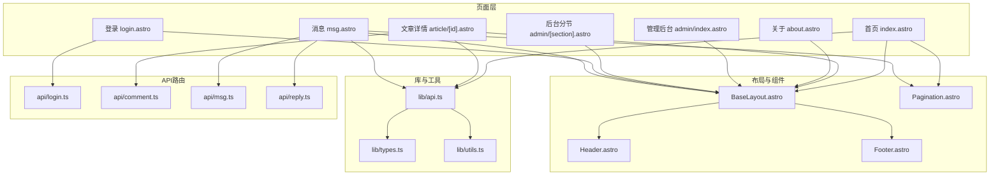
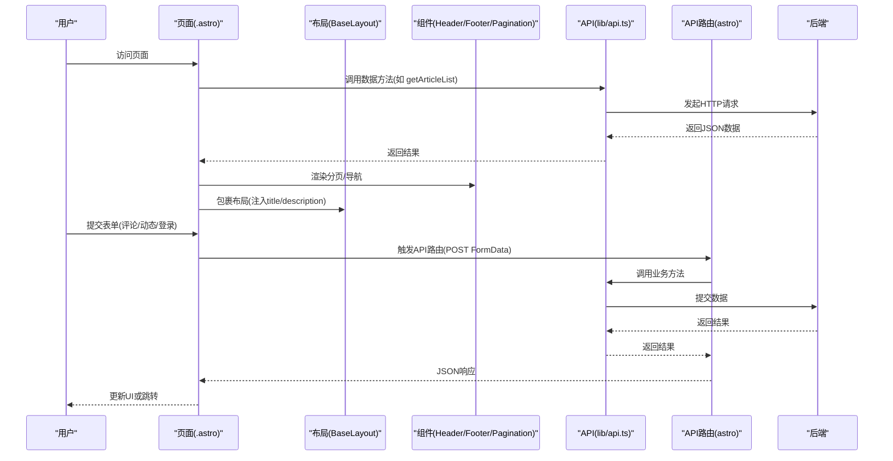
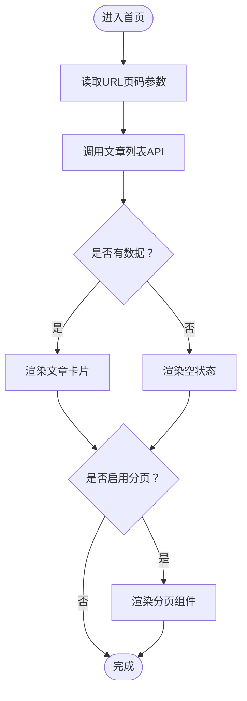
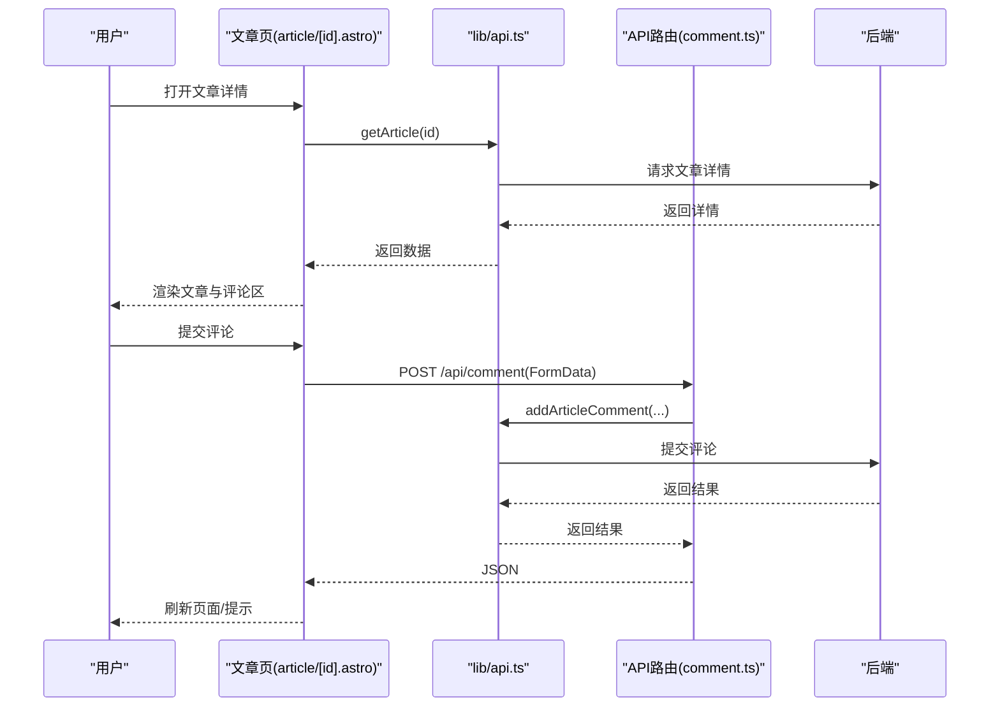
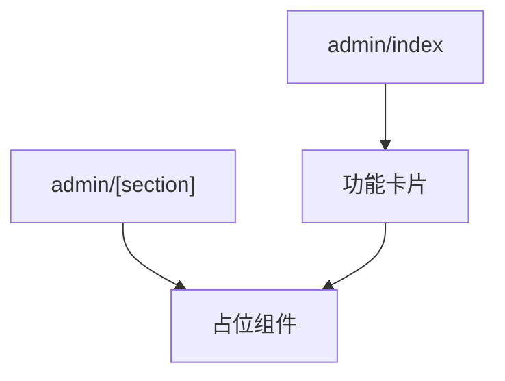
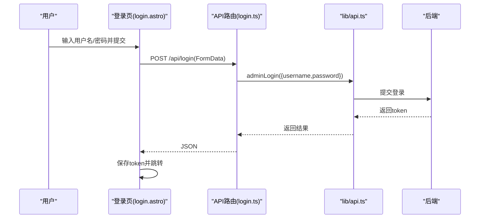
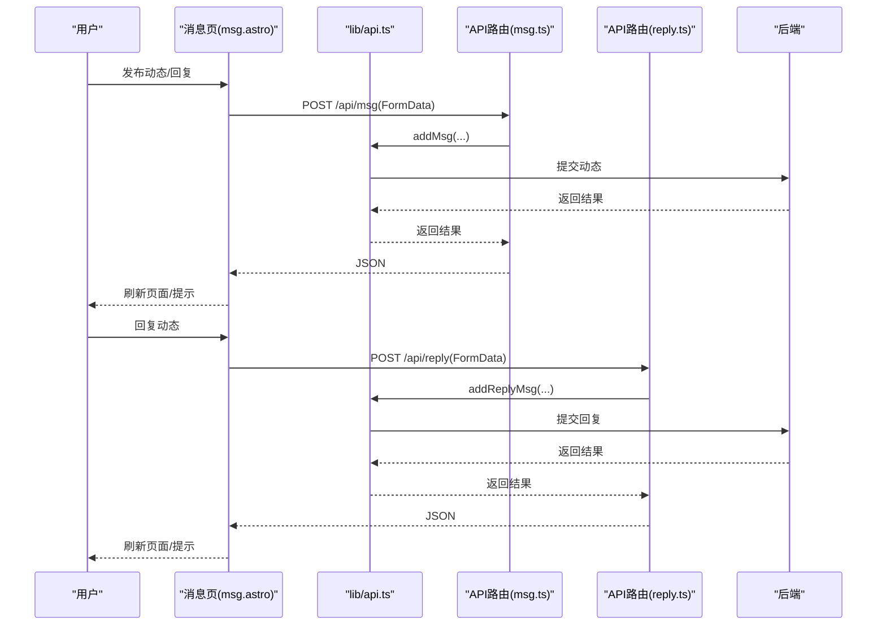
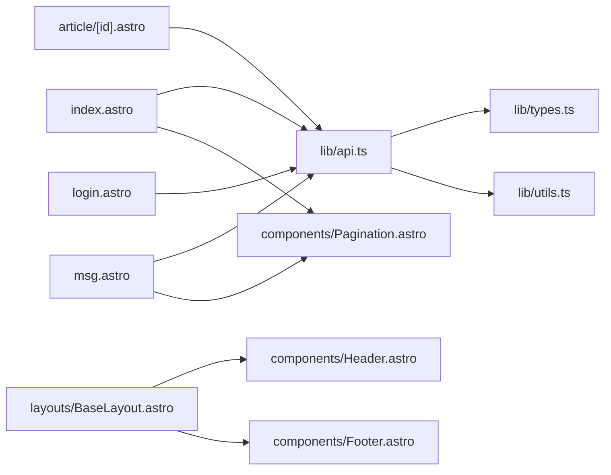

# 页面组件

<cite>
**本文引用的文件**
- [src/pages/index.astro](file://src/pages/index.astro)
- [src/pages/article/[id].astro](file://src/pages/article/[id].astro)
- [src/pages/about.astro](file://src/pages/about.astro)
- [src/pages/admin/index.astro](file://src/pages/admin/index.astro)
- [src/pages/admin/[section].astro](file://src/pages/admin/[section].astro)
- [src/pages/login.astro](file://src/pages/login.astro)
- [src/pages/msg.astro](file://src/pages/msg.astro)
- [src/layouts/BaseLayout.astro](file://src/layouts/BaseLayout.astro)
- [src/components/Header.astro](file://src/components/Header.astro)
- [src/components/Footer.astro](file://src/components/Footer.astro)
- [src/components/Pagination.astro](file://src/components/Pagination.astro)
- [src/lib/api.ts](file://src/lib/api.ts)
- [src/lib/types.ts](file://src/lib/types.ts)
- [src/lib/utils.ts](file://src/lib/utils.ts)
- [src/pages/api/login.ts](file://src/pages/api/login.ts)
- [src/pages/api/comment.ts](file://src/pages/api/comment.ts)
- [src/pages/api/msg.ts](file://src/pages/api/msg.ts)
- [src/pages/api/reply.ts](file://src/pages/api/reply.ts)
</cite>

## 目录
1. [引言](#引言)
2. [项目结构](#项目结构)
3. [核心组件](#核心组件)
4. [架构总览](#架构总览)
5. [详细组件分析](#详细组件分析)
6. [依赖分析](#依赖分析)
7. [性能考虑](#性能考虑)
8. [故障排查指南](#故障排查指南)
9. [结论](#结论)
10. [附录](#附录)

## 引言
本文件面向博客项目的页面组件，系统性梳理首页、文章详情、关于、管理后台、登录、消息等页面的功能实现、设计思路与交互细节。重点覆盖：
- 首页的布局设计、文章列表渲染与分页策略
- 文章详情的动态路由、内容渲染与SEO优化
- 关于页面的品牌传达与技术栈演进展示
- 管理后台的入口组织与占位页面的迁移规划
- 登录页面的身份验证流程与安全要点
- 消息页面的互动与社交元素
- 各页面的生命周期、数据获取策略与错误处理
- 页面间导航关系、路由配置与状态管理
- 页面组件与布局组件的集成方式与数据传递模式

## 项目结构
项目采用 Astro 页面级 SSR 架构，页面位于 src/pages 下，通用布局与组件位于 src/layouts 与 src/components，业务数据通过 src/lib 下的 API 与工具函数对接后端。

图表来源
- [src/pages/index.astro:1-50](file://src/pages/index.astro#L1-L50)
- [src/pages/article/[id].astro](file://src/pages/article/[id].astro#L1-L109)
- [src/pages/about.astro:1-80](file://src/pages/about.astro#L1-L80)
- [src/pages/admin/index.astro:1-30](file://src/pages/admin/index.astro#L1-L30)
- [src/pages/admin/[section].astro](file://src/pages/admin/[section].astro#L1-L25)
- [src/pages/login.astro:1-55](file://src/pages/login.astro#L1-L55)
- [src/pages/msg.astro:1-135](file://src/pages/msg.astro#L1-L135)
- [src/layouts/BaseLayout.astro:1-42](file://src/layouts/BaseLayout.astro#L1-L42)
- [src/components/Header.astro:1-48](file://src/components/Header.astro#L1-L48)
- [src/components/Footer.astro:1-8](file://src/components/Footer.astro#L1-L8)
- [src/components/Pagination.astro:1-28](file://src/components/Pagination.astro#L1-L28)
- [src/lib/api.ts:1-91](file://src/lib/api.ts#L1-L91)
- [src/lib/types.ts:1-54](file://src/lib/types.ts#L1-L54)
- [src/lib/utils.ts:1-219](file://src/lib/utils.ts#L1-L219)
- [src/pages/api/login.ts:1-16](file://src/pages/api/login.ts#L1-L16)
- [src/pages/api/comment.ts:1-19](file://src/pages/api/comment.ts#L1-L19)
- [src/pages/api/msg.ts:1-16](file://src/pages/api/msg.ts#L1-L16)
- [src/pages/api/reply.ts:1-17](file://src/pages/api/reply.ts#L1-L17)

章节来源
- [src/pages/index.astro:1-50](file://src/pages/index.astro#L1-L50)
- [src/pages/article/[id].astro:1-109](file://src/pages/article/[id].astro#L1-L109)
- [src/pages/about.astro:1-80](file://src/pages/about.astro#L1-L80)
- [src/pages/admin/index.astro:1-30](file://src/pages/admin/index.astro#L1-L30)
- [src/pages/admin/[section].astro:1-25](file://src/pages/admin/[section].astro#L1-L25)
- [src/pages/login.astro:1-55](file://src/pages/login.astro#L1-L55)
- [src/pages/msg.astro:1-135](file://src/pages/msg.astro#L1-L135)
- [src/layouts/BaseLayout.astro:1-42](file://src/layouts/BaseLayout.astro#L1-L42)
- [src/components/Header.astro:1-48](file://src/components/Header.astro#L1-L48)
- [src/components/Footer.astro:1-8](file://src/components/Footer.astro#L1-L8)
- [src/components/Pagination.astro:1-28](file://src/components/Pagination.astro#L1-L28)
- [src/lib/api.ts:1-91](file://src/lib/api.ts#L1-L91)
- [src/lib/types.ts:1-54](file://src/lib/types.ts#L1-L54)
- [src/lib/utils.ts:1-219](file://src/lib/utils.ts#L1-L219)
- [src/pages/api/login.ts:1-16](file://src/pages/api/login.ts#L1-L16)
- [src/pages/api/comment.ts:1-19](file://src/pages/api/comment.ts#L1-L19)
- [src/pages/api/msg.ts:1-16](file://src/pages/api/msg.ts#L1-L16)
- [src/pages/api/reply.ts:1-17](file://src/pages/api/reply.ts#L1-L17)

## 核心组件
- 布局与壳体
  - BaseLayout：统一注入全局样式、站点标题与描述、头部与底部插槽、API 基础地址变量，支持隐藏 Chrome（用于登录页）。
  - Header：主导航与移动端菜单切换，基于当前路径高亮活动链接。
  - Footer：版权与备案信息。
- 分页组件
  - Pagination：根据总数与每页条数生成页码序列，支持上一页/下一页与省略号。
- 工具与类型
  - utils：时间格式化、富文本图片尺寸稳定化（懒加载、解码异步、宽高注入）、HTML 标签属性处理。
  - types：API 包装体、分页结果、文章摘要/详情、评论、动态消息等类型定义。
  - api：封装请求构造、URL 参数拼接、GET/POST 表单提交、各业务 API 方法。

章节来源
- [src/layouts/BaseLayout.astro:1-42](file://src/layouts/BaseLayout.astro#L1-L42)
- [src/components/Header.astro:1-48](file://src/components/Header.astro#L1-L48)
- [src/components/Footer.astro:1-8](file://src/components/Footer.astro#L1-L8)
- [src/components/Pagination.astro:1-28](file://src/components/Pagination.astro#L1-L28)
- [src/lib/utils.ts:1-219](file://src/lib/utils.ts#L1-L219)
- [src/lib/types.ts:1-54](file://src/lib/types.ts#L1-L54)
- [src/lib/api.ts:1-91](file://src/lib/api.ts#L1-L91)

## 架构总览
页面组件通过 Astro 的页面级 SSR 在构建时或运行时拉取数据，结合 BaseLayout 统一输出 HTML 结构；前端交互脚本通过 Astro 的内联脚本与 API 路由进行表单提交与状态更新；工具函数负责内容增强与数据格式化。

图表来源
- [src/pages/index.astro:1-50](file://src/pages/index.astro#L1-L50)
- [src/pages/article/[id].astro:1-L109](file://src/pages/article/[id].astro#L1-L109)
- [src/pages/msg.astro:1-135](file://src/pages/msg.astro#L1-L135)
- [src/pages/login.astro:1-55](file://src/pages/login.astro#L1-L55)
- [src/lib/api.ts:1-91](file://src/lib/api.ts#L1-L91)
- [src/pages/api/login.ts:1-16](file://src/pages/api/login.ts#L1-L16)
- [src/pages/api/comment.ts:1-19](file://src/pages/api/comment.ts#L1-L19)
- [src/pages/api/msg.ts:1-16](file://src/pages/api/msg.ts#L1-L16)
- [src/pages/api/reply.ts:1-17](file://src/pages/api/reply.ts#L1-L17)
- [src/layouts/BaseLayout.astro:1-42](file://src/layouts/BaseLayout.astro#L1-L42)

## 详细组件分析

### 首页 Index
- 设计与布局
  - 使用 BaseLayout 注入站点标题与描述，容器内包含页面标题、副标题与文章卡片列表。
  - 文章卡片包含日期、标题、摘要与“阅读全文”链接，空状态提示。
- 数据获取与分页
  - 从 URL 查询参数读取页码，调用文章列表 API 获取分页数据，计算是否显示分页器。
  - 通过 Pagination 组件渲染页码导航，basePath 固定为根路径。
- 性能优化策略
  - 图片内容在详情页使用尺寸稳定化工具；首页列表避免大图渲染，减少首屏压力。
  - 分页按需渲染页码，避免一次性渲染过多节点。
- 生命周期与错误处理
  - 页面级 SSR 获取数据，若无数据则显示空状态；分页器仅在存在分页信息时渲染。

图表来源
- [src/pages/index.astro:1-50](file://src/pages/index.astro#L1-L50)
- [src/components/Pagination.astro:1-28](file://src/components/Pagination.astro#L1-L28)
- [src/lib/api.ts:58-60](file://src/lib/api.ts#L58-L60)

章节来源
- [src/pages/index.astro:1-50](file://src/pages/index.astro#L1-L50)
- [src/lib/api.ts:58-60](file://src/lib/api.ts#L58-L60)
- [src/components/Pagination.astro:1-28](file://src/components/Pagination.astro#L1-L28)

### 文章详情 Article/[id]
- 动态路由与数据获取
  - 通过 Astro.params 获取 id，调用文章详情 API；兼容返回结构差异，提取正文、简介、评论等字段。
  - 内容与简介通过图片尺寸稳定化工具处理，确保图片加载性能与布局稳定。
- 内容渲染与SEO
  - BaseLayout 动态设置标题与描述，提升 SEO 友好度。
  - 文章头部包含返回列表链接、作者与发布时间；正文区域渲染富文本。
- 评论系统
  - 展示评论列表与表单，表单校验必填项与长度限制，提交至 /api/comment，成功后刷新页面。
- 生命周期与错误处理
  - SSR 阶段解析参数与数据；前端脚本负责表单提交与反馈提示；未找到文章时显示默认标题与提示。

图表来源
- [src/pages/article/[id].astro:1-L109](file://src/pages/article/[id].astro#L1-L109)
- [src/lib/api.ts:62-64](file://src/lib/api.ts#L62-L64)
- [src/pages/api/comment.ts:1-19](file://src/pages/api/comment.ts#L1-L19)

章节来源
- [src/pages/article/[id].astro:1-L109](file://src/pages/article/[id].astro#L1-L109)
- [src/lib/api.ts:62-64](file://src/lib/api.ts#L62-L64)
- [src/pages/api/comment.ts:1-19](file://src/pages/api/comment.ts#L1-L19)
- [src/lib/utils.ts:208-219](file://src/lib/utils.ts#L208-L219)

### 关于 About
- 信息展示设计
  - 头部展示头像、站点介绍与源码链接；技术栈演进采用时间线卡片形式，突出当前版本与标签。
- 品牌传达
  - 通过“关于博客”的页面标题与描述强化品牌认知；时间线卡片直观呈现技术迭代历程。
- 无障碍与SEO
  - BaseLayout 注入标题与描述；图片具备加载优先级与解码策略。

章节来源
- [src/pages/about.astro:1-80](file://src/pages/about.astro#L1-L80)
- [src/layouts/BaseLayout.astro:1-42](file://src/layouts/BaseLayout.astro#L1-L42)

### 管理后台 Admin
- 入口组织
  - admin/index 提供功能卡片入口，标注后续迁移计划。
- 动态分节
  - admin/[section] 保留路由，根据 section 参数映射标题与描述，使用 AdminPlaceholder 组件占位，体现迁移进度。
- 权限控制与用户体验
  - 当前页面未实现鉴权逻辑；建议在 API 路由与页面层增加令牌校验与重定向策略。

图表来源
- [src/pages/admin/index.astro:1-30](file://src/pages/admin/index.astro#L1-L30)
- [src/pages/admin/[section].astro:1-L25](file://src/pages/admin/[section].astro#L1-L25)

章节来源
- [src/pages/admin/index.astro:1-30](file://src/pages/admin/index.astro#L1-L30)
- [src/pages/admin/[section].astro:1-L25](file://src/pages/admin/[section].astro#L1-L25)

### 登录 Login
- 身份验证流程
  - 表单收集用户名与密码，提交至 /api/login；成功后将 token 存入 localStorage 并跳转到管理后台。
- 安全机制
  - 前端仅做基本必填校验；登录成功后的权限控制应在后端与 API 路由侧完善，页面层可增加令牌检查与自动跳转。

图表来源
- [src/pages/login.astro:1-55](file://src/pages/login.astro#L1-L55)
- [src/pages/api/login.ts:1-16](file://src/pages/api/login.ts#L1-L16)
- [src/lib/api.ts:88-91](file://src/lib/api.ts#L88-L91)

章节来源
- [src/pages/login.astro:1-55](file://src/pages/login.astro#L1-L55)
- [src/pages/api/login.ts:1-16](file://src/pages/api/login.ts#L1-L16)
- [src/lib/api.ts:88-91](file://src/lib/api.ts#L88-L91)

### 消息 Msg
- 互动功能与社交元素
  - 支持发布动态与回复动态；动态列表包含用户名、时间、正文与回复按钮；回复采用展开/收起交互。
- 数据获取与分页
  - 通过 getMsgList 获取分页数据，使用 Pagination 组件渲染分页导航，basePath 为 “/msg”。
- 错误处理与提示
  - 表单提交前进行长度与必填校验；提交后根据返回状态刷新页面或显示错误提示。

图表来源
- [src/pages/msg.astro:1-135](file://src/pages/msg.astro#L1-L135)
- [src/lib/api.ts:80-86](file://src/lib/api.ts#L80-L86)
- [src/pages/api/msg.ts:1-16](file://src/pages/api/msg.ts#L1-L16)
- [src/pages/api/reply.ts:1-17](file://src/pages/api/reply.ts#L1-L17)

章节来源
- [src/pages/msg.astro:1-135](file://src/pages/msg.astro#L1-L135)
- [src/lib/api.ts:66-68](file://src/lib/api.ts#L66-L68)
- [src/lib/api.ts:80-86](file://src/lib/api.ts#L80-L86)
- [src/pages/api/msg.ts:1-16](file://src/pages/api/msg.ts#L1-L16)
- [src/pages/api/reply.ts:1-17](file://src/pages/api/reply.ts#L1-L17)

### 页面间导航与路由配置
- 导航关系
  - Header 提供首页、消息、关于的静态导航；登录入口位于头部徽标处，便于后台访问。
- 路由约定
  - 静态页面：index、about、msg、login、admin/index。
  - 动态路由：article/[id]、admin/[section]。
- 状态管理
  - 登录成功后通过 localStorage 存储 token，建议在页面层或布局层增加鉴权守卫与状态同步。

章节来源
- [src/components/Header.astro:1-48](file://src/components/Header.astro#L1-L48)
- [src/pages/admin/[section].astro:1-L25](file://src/pages/admin/[section].astro#L1-L25)
- [src/pages/article/[id].astro:1-L109](file://src/pages/article/[id].astro#L1-L109)
- [src/pages/login.astro:1-55](file://src/pages/login.astro#L1-L55)

### 页面与布局的集成与数据传递
- 集成方式
  - 各页面均包裹 BaseLayout，通过 Astro props 注入 title/description/隐藏 Chrome 等参数。
  - Header/Footer 作为布局子组件被复用，保持一致的导航与页脚体验。
- 数据传递
  - 页面通过 lib/api.ts 的方法获取数据；utils.ts 提供内容增强；类型定义保证数据结构一致性。

章节来源
- [src/layouts/BaseLayout.astro:1-42](file://src/layouts/BaseLayout.astro#L1-L42)
- [src/components/Header.astro:1-48](file://src/components/Header.astro#L1-L48)
- [src/components/Footer.astro:1-8](file://src/components/Footer.astro#L1-L8)
- [src/lib/api.ts:1-91](file://src/lib/api.ts#L1-L91)
- [src/lib/utils.ts:1-219](file://src/lib/utils.ts#L1-L219)
- [src/lib/types.ts:1-54](file://src/lib/types.ts#L1-L54)

## 依赖分析
- 组件耦合
  - 页面与布局/组件松耦合，通过 props 与 slot 通信；分页组件独立可复用。
- 外部依赖
  - API 基础地址来自环境变量，支持运行时注入；工具函数对第三方资源进行缓存与超时控制。
- 接口契约
  - API 路由与 lib/api.ts 方法一一对应，返回统一的包装体结构，便于前端统一处理。

图表来源
- [src/pages/index.astro:1-50](file://src/pages/index.astro#L1-L50)
- [src/pages/article/[id].astro:1-L109](file://src/pages/article/[id].astro#L1-L109)
- [src/pages/msg.astro:1-135](file://src/pages/msg.astro#L1-L135)
- [src/pages/login.astro:1-55](file://src/pages/login.astro#L1-L55)
- [src/lib/api.ts:1-91](file://src/lib/api.ts#L1-L91)
- [src/lib/types.ts:1-54](file://src/lib/types.ts#L1-L54)
- [src/lib/utils.ts:1-219](file://src/lib/utils.ts#L1-L219)
- [src/components/Pagination.astro:1-28](file://src/components/Pagination.astro#L1-L28)
- [src/layouts/BaseLayout.astro:1-42](file://src/layouts/BaseLayout.astro#L1-L42)
- [src/components/Header.astro:1-48](file://src/components/Header.astro#L1-L48)
- [src/components/Footer.astro:1-8](file://src/components/Footer.astro#L1-L8)

章节来源
- [src/lib/api.ts:1-91](file://src/lib/api.ts#L1-L91)
- [src/lib/types.ts:1-54](file://src/lib/types.ts#L1-L54)
- [src/lib/utils.ts:1-219](file://src/lib/utils.ts#L1-L219)
- [src/components/Pagination.astro:1-28](file://src/components/Pagination.astro#L1-L28)
- [src/layouts/BaseLayout.astro:1-42](file://src/layouts/BaseLayout.astro#L1-L42)
- [src/components/Header.astro:1-48](file://src/components/Header.astro#L1-L48)
- [src/components/Footer.astro:1-8](file://src/components/Footer.astro#L1-L8)

## 性能考虑
- 首屏与SEO
  - 页面级 SSR 输出 HTML，提升首屏内容直出与 SEO 表现；BaseLayout 注入标题与描述。
- 图片优化
  - utils 中的图片尺寸稳定化在详情页应用，避免布局抖动；建议在列表页也采用懒加载与解码异步策略。
- 请求与缓存
  - API 基础地址可配置；utils 对图片尺寸解析进行缓存与超时控制，降低重复请求成本。
- 分页与渲染
  - Pagination 仅渲染关键页码，减少 DOM 节点数量；列表为空时快速反馈，避免无效渲染。

## 故障排查指南
- 登录失败
  - 检查 /api/login 的必填校验与返回消息；确认 localStorage 是否写入 token；必要时清理浏览器缓存。
- 评论/动态提交失败
  - 核对表单字段长度与必填项；查看 API 路由返回的状态与消息；确认网络请求是否被拦截。
- 文章/消息为空
  - 检查 getArticle/getMsgList 的分页参数与后端接口可用性；确认 BaseLayout 的描述与标题是否正确注入。
- 图片加载异常
  - 检查 utils 的图片尺寸解析与缓存逻辑；确认图片 URL 协议与可访问性。

章节来源
- [src/pages/api/login.ts:1-16](file://src/pages/api/login.ts#L1-L16)
- [src/pages/api/comment.ts:1-19](file://src/pages/api/comment.ts#L1-L19)
- [src/pages/api/msg.ts:1-16](file://src/pages/api/msg.ts#L1-L16)
- [src/pages/api/reply.ts:1-17](file://src/pages/api/reply.ts#L1-L17)
- [src/lib/utils.ts:132-168](file://src/lib/utils.ts#L132-L168)

## 结论
本项目页面组件围绕 Astro 页面级 SSR 架构，实现了良好的首屏表现与可维护性。首页与消息页通过分页与列表渲染优化用户体验；文章详情页在 SEO 与内容渲染方面具备良好基础；管理后台与登录页为后续权限与功能迁移预留空间。建议在登录后端增加鉴权校验与令牌刷新策略，完善后台页面的数据迁移与交互设计。

## 附录
- API 基础地址可在环境变量中配置，运行时注入至全局脚本。
- 类型定义统一了数据结构，便于前后端协作与错误预防。
- 工具函数提供了内容增强与图片优化能力，建议在更多场景中复用。