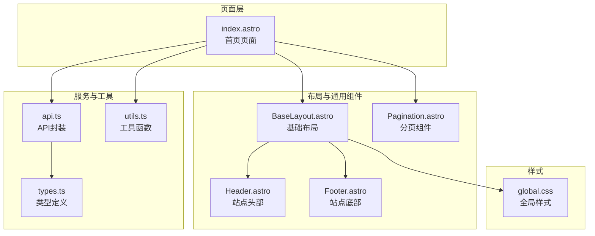
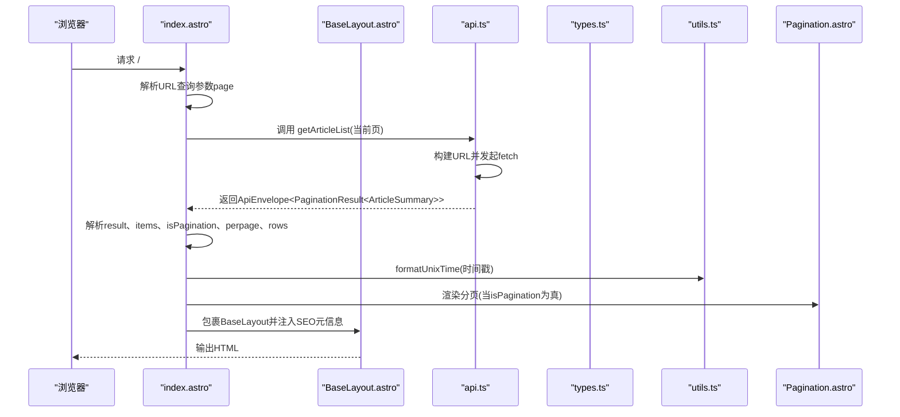
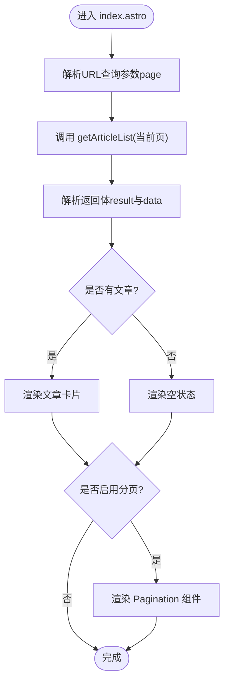
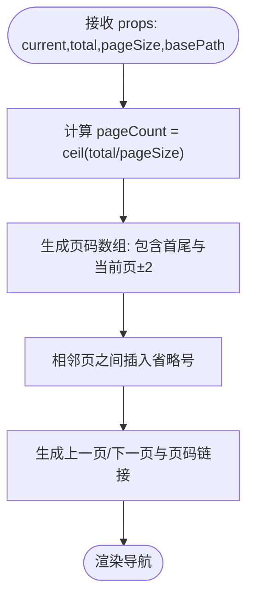
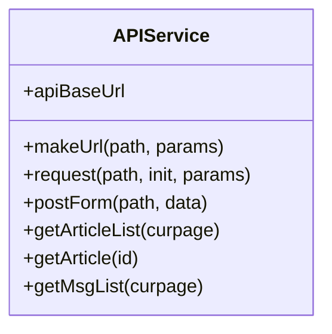
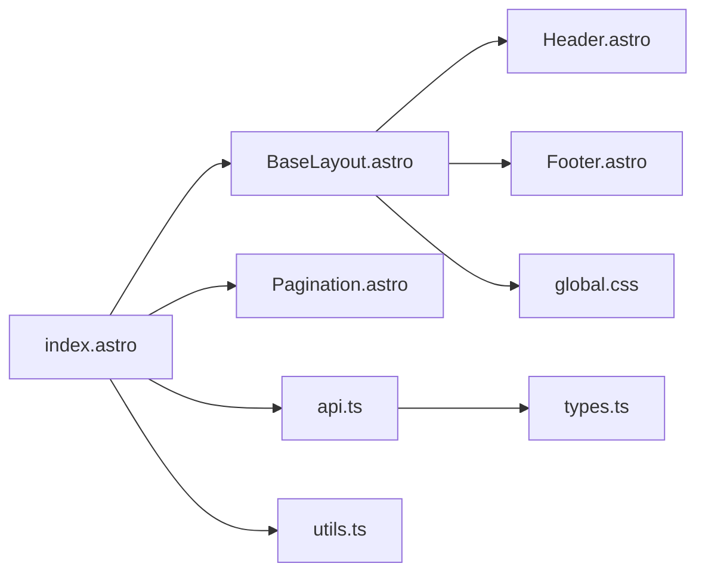

# 首页页面

<cite>
**本文引用的文件**
- [src/pages/index.astro](file://src/pages/index.astro)
- [src/lib/api.ts](file://src/lib/api.ts)
- [src/lib/utils.ts](file://src/lib/utils.ts)
- [src/lib/types.ts](file://src/lib/types.ts)
- [src/components/Pagination.astro](file://src/components/Pagination.astro)
- [src/components/Header.astro](file://src/components/Header.astro)
- [src/components/Footer.astro](file://src/components/Footer.astro)
- [src/layouts/BaseLayout.astro](file://src/layouts/BaseLayout.astro)
- [src/styles/global.css](file://src/styles/global.css)
- [package.json](file://package.json)
</cite>

## 目录
1. [简介](#简介)
2. [项目结构](#项目结构)
3. [核心组件](#核心组件)
4. [架构总览](#架构总览)
5. [详细组件分析](#详细组件分析)
6. [依赖关系分析](#依赖关系分析)
7. [性能考虑](#性能考虑)
8. [故障排查指南](#故障排查指南)
9. [结论](#结论)
10. [附录](#附录)

## 简介
本文件聚焦于首页（Index）页面的实现架构与功能特性，系统性解析以下方面：
- 文章列表渲染机制：数据获取流程、分页逻辑与性能优化策略
- 页面布局设计：头部信息展示、文章卡片组件与空状态处理
- 动态分页组件的集成方式与用户交互体验
- 时间格式化工具的使用与SEO优化策略
- 错误处理机制、加载状态管理与用户体验优化建议
- 提供可直接参考的代码示例路径，帮助快速定位实现细节

## 项目结构
首页页面采用 Astro 组件化架构，通过页面组件组合布局、头部、分页与样式资源，形成完整的静态生成与客户端渲染体验。

图表来源
- [src/pages/index.astro:1-50](file://src/pages/index.astro#L1-L50)
- [src/layouts/BaseLayout.astro:1-42](file://src/layouts/BaseLayout.astro#L1-L42)
- [src/components/Header.astro:1-48](file://src/components/Header.astro#L1-L48)
- [src/components/Footer.astro:1-8](file://src/components/Footer.astro#L1-L8)
- [src/components/Pagination.astro:1-28](file://src/components/Pagination.astro#L1-L28)
- [src/lib/api.ts:1-91](file://src/lib/api.ts#L1-L91)
- [src/lib/utils.ts:1-219](file://src/lib/utils.ts#L1-L219)
- [src/lib/types.ts:1-54](file://src/lib/types.ts#L1-L54)
- [src/styles/global.css:1-233](file://src/styles/global.css#L1-L233)

章节来源
- [src/pages/index.astro:1-50](file://src/pages/index.astro#L1-L50)
- [src/layouts/BaseLayout.astro:1-42](file://src/layouts/BaseLayout.astro#L1-L42)
- [src/lib/api.ts:1-91](file://src/lib/api.ts#L1-L91)
- [src/lib/utils.ts:1-219](file://src/lib/utils.ts#L1-L219)
- [src/lib/types.ts:1-54](file://src/lib/types.ts#L1-L54)
- [src/styles/global.css:1-233](file://src/styles/global.css#L1-L233)

## 核心组件
- 首页页面组件：负责从后端获取文章列表、解析分页参数、渲染文章卡片与空状态，并在需要时渲染分页导航。
- 基础布局组件：注入 SEO 元信息、注入运行时变量、挂载头部与底部。
- 分页组件：根据当前页、总数与每页条数计算页码集合，生成“上一页/下一页”与页码链接。
- API 封装：统一请求构建、环境变量读取、错误处理与响应解析。
- 工具函数：时间格式化、富文本图片尺寸稳定化等。
- 类型定义：对 API 返回体与文章摘要/详情进行强类型约束。

章节来源
- [src/pages/index.astro:1-50](file://src/pages/index.astro#L1-L50)
- [src/layouts/BaseLayout.astro:1-42](file://src/layouts/BaseLayout.astro#L1-L42)
- [src/components/Pagination.astro:1-28](file://src/components/Pagination.astro#L1-L28)
- [src/lib/api.ts:1-91](file://src/lib/api.ts#L1-L91)
- [src/lib/utils.ts:1-219](file://src/lib/utils.ts#L1-L219)
- [src/lib/types.ts:1-54](file://src/lib/types.ts#L1-L54)

## 架构总览
首页页面的数据流与渲染流程如下：

图表来源
- [src/pages/index.astro:7-14](file://src/pages/index.astro#L7-L14)
- [src/lib/api.ts:58-60](file://src/lib/api.ts#L58-L60)
- [src/lib/utils.ts:28-31](file://src/lib/utils.ts#L28-L31)
- [src/components/Pagination.astro:9-14](file://src/components/Pagination.astro#L9-L14)
- [src/layouts/BaseLayout.astro:12-27](file://src/layouts/BaseLayout.astro#L12-L27)

## 详细组件分析

### 首页页面（index.astro）
- 数据获取与分页参数解析
  - 从 URL 查询参数中读取页码，确保最小值为 1。
  - 调用 API 获取文章列表，解析返回体中的分页字段以决定是否显示分页组件。
  - 计算每页条数与总条目数，用于分页组件渲染。
- 文章列表渲染
  - 使用 map 遍历文章数组，渲染每个文章卡片。
  - 卡片包含发布时间、标题、摘要与“阅读全文”链接。
  - 发布时间通过工具函数进行格式化。
- 空状态处理
  - 当文章列表为空且接口可用时，渲染空状态提示。
- 分页组件集成
  - 当后端返回存在分页标记时，渲染分页组件并传入当前页、总数与每页条数。
  - 分页组件会根据当前页生成页码集合，并生成上一页/下一页与页码链接。

图表来源
- [src/pages/index.astro:7-14](file://src/pages/index.astro#L7-L14)
- [src/pages/index.astro:22-38](file://src/pages/index.astro#L22-L38)
- [src/pages/index.astro:40-46](file://src/pages/index.astro#L40-L46)

章节来源
- [src/pages/index.astro:1-50](file://src/pages/index.astro#L1-L50)

### 基础布局（BaseLayout.astro）
- SEO 与元信息
  - 注入页面标题与描述，便于搜索引擎抓取。
  - 注入运行时变量，供前端脚本使用。
- 结构组织
  - 条件渲染头部与底部，支持隐藏 Chrome 的场景。
- 样式注入
  - 内联全局样式，减少额外请求。

章节来源
- [src/layouts/BaseLayout.astro:1-42](file://src/layouts/BaseLayout.astro#L1-L42)

### 头部组件（Header.astro）
- 导航链接与激活态
  - 定义主导航项，基于当前路径判断激活态。
- 移动端交互
  - 提供移动端菜单开关与点击关闭逻辑，提升移动端可用性。

章节来源
- [src/components/Header.astro:1-48](file://src/components/Header.astro#L1-L48)

### 底部组件（Footer.astro）
- 站点底部信息与备案链接。

章节来源
- [src/components/Footer.astro:1-8](file://src/components/Footer.astro#L1-L8)

### 分页组件（Pagination.astro）
- 页码计算
  - 根据总数与每页条数计算总页数。
  - 仅渲染当前页前后一定范围内的页码，并插入省略号以控制可视范围。
- 链接生成
  - 首页不带查询参数，其余页码以查询参数形式附加。
- 可访问性
  - 提供分页导航的 ARIA 标签与禁用态样式。

图表来源
- [src/components/Pagination.astro:9-14](file://src/components/Pagination.astro#L9-L14)
- [src/components/Pagination.astro:16-27](file://src/components/Pagination.astro#L16-L27)

章节来源
- [src/components/Pagination.astro:1-28](file://src/components/Pagination.astro#L1-L28)

### API 封装（api.ts）
- 环境变量与基础 URL
  - 支持优先级：环境变量、公共环境变量、默认地址；末尾斜杠去除。
- URL 构建与参数拼接
  - 使用 URL 对象与 searchParams 拼接查询参数。
- 请求与错误处理
  - 统一设置 Accept 头，非 OK 状态返回空值并记录错误。
- 文章列表与详情
  - 提供获取文章列表与详情的函数，参数为页码与 ID。

图表来源
- [src/lib/api.ts:9-15](file://src/lib/api.ts#L9-L15)
- [src/lib/api.ts:17-23](file://src/lib/api.ts#L17-L23)
- [src/lib/api.ts:25-41](file://src/lib/api.ts#L25-L41)
- [src/lib/api.ts:58-60](file://src/lib/api.ts#L58-L60)
- [src/lib/api.ts:62-64](file://src/lib/api.ts#L62-L64)

章节来源
- [src/lib/api.ts:1-91](file://src/lib/api.ts#L1-L91)

### 工具函数（utils.ts）
- 时间格式化
  - 支持 Unix 时间戳与自定义格式字符串，输出本地化日期字符串。
- 图片尺寸与懒加载
  - 通过 Range 请求与解析图片头信息，自动补全宽高并添加懒加载属性，提升渲染性能与防抖动。

章节来源
- [src/lib/utils.ts:28-31](file://src/lib/utils.ts#L28-L31)
- [src/lib/utils.ts:132-168](file://src/lib/utils.ts#L132-L168)

### 类型定义（types.ts）
- API 包装体与分页结果
  - 对 API 返回体进行统一封装，包含结果对象与消息字段。
- 文章摘要与详情
  - 定义文章列表项与详情项的字段，保证数据一致性与可读性。

章节来源
- [src/lib/types.ts:1-13](file://src/lib/types.ts#L1-L13)
- [src/lib/types.ts:15-28](file://src/lib/types.ts#L15-L28)

## 依赖关系分析
首页页面与各模块之间的依赖关系如下：

图表来源
- [src/pages/index.astro:1-50](file://src/pages/index.astro#L1-L50)
- [src/layouts/BaseLayout.astro:1-42](file://src/layouts/BaseLayout.astro#L1-L42)
- [src/components/Pagination.astro:1-28](file://src/components/Pagination.astro#L1-L28)
- [src/lib/api.ts:1-91](file://src/lib/api.ts#L1-L91)
- [src/lib/utils.ts:1-219](file://src/lib/utils.ts#L1-L219)
- [src/lib/types.ts:1-54](file://src/lib/types.ts#L1-L54)
- [src/styles/global.css:1-233](file://src/styles/global.css#L1-L233)

章节来源
- [src/pages/index.astro:1-50](file://src/pages/index.astro#L1-L50)
- [src/layouts/BaseLayout.astro:1-42](file://src/layouts/BaseLayout.astro#L1-L42)
- [src/lib/api.ts:1-91](file://src/lib/api.ts#L1-L91)
- [src/lib/utils.ts:1-219](file://src/lib/utils.ts#L1-L219)
- [src/lib/types.ts:1-54](file://src/lib/types.ts#L1-L54)
- [src/styles/global.css:1-233](file://src/styles/global.css#L1-L233)

## 性能考虑
- 分页与渲染
  - 仅在后端返回分页标记时渲染分页组件，避免不必要的 DOM。
  - 列表渲染使用 map，保持单向数据流，便于后续虚拟滚动扩展。
- 时间格式化
  - 在客户端进行格式化，避免服务端重复处理。
- 图片优化
  - 工具函数自动补全图片宽高并添加懒加载，减少布局抖动与首屏阻塞。
- 样式内联
  - 基础布局内联全局样式，减少额外网络请求。
- 环境变量与缓存
  - API 基础 URL 通过环境变量注入，便于部署时切换。

章节来源
- [src/pages/index.astro:40-46](file://src/pages/index.astro#L40-L46)
- [src/lib/utils.ts:132-168](file://src/lib/utils.ts#L132-L168)
- [src/layouts/BaseLayout.astro:27-30](file://src/layouts/BaseLayout.astro#L27-L30)
- [src/lib/api.ts:9-15](file://src/lib/api.ts#L9-L15)

## 故障排查指南
- 文章列表为空
  - 检查后端返回的分页标记与数据字段，确认 isPagination、data、rows 是否正确。
  - 确认 URL 查询参数 page 是否被正确解析。
- 分页不显示
  - 确认后端返回的 isPagination 字段为真，且 total、perpage 正确。
- 时间显示异常
  - 确认传入的时间戳为 Unix 秒级，工具函数内部会转换为毫秒。
- API 请求失败
  - 查看网络面板与控制台错误，确认基础 URL 与环境变量配置。
  - 检查后端返回状态码与 JSON 结构是否符合预期。

章节来源
- [src/pages/index.astro:7-14](file://src/pages/index.astro#L7-L14)
- [src/lib/api.ts:25-41](file://src/lib/api.ts#L25-L41)
- [src/lib/utils.ts:28-31](file://src/lib/utils.ts#L28-L31)

## 结论
首页页面通过清晰的组件拆分与强类型约束，实现了稳定的数据获取、高效的分页渲染与良好的用户体验。配合时间格式化与图片懒加载等性能优化手段，能够在不同设备与网络环境下提供一致的浏览体验。未来可进一步引入虚拟滚动、骨架屏与预取策略以进一步提升长列表性能。

## 附录

### 代码示例路径（按功能分组）
- 获取文章列表
  - [调用 getArticleList 并解析返回体:7-14](file://src/pages/index.astro#L7-L14)
  - [API 封装与请求实现:58-60](file://src/lib/api.ts#L58-L60)
- 处理分页参数
  - [解析 URL 查询参数 page](file://src/pages/index.astro#L7)
  - [计算每页条数与总数:12-13](file://src/pages/index.astro#L12-L13)
- 渲染文章卡片
  - [遍历 items 并渲染卡片结构:22-38](file://src/pages/index.astro#L22-L38)
  - [时间格式化与卡片内容](file://src/pages/index.astro#L27)
- 空状态处理
  - [空状态渲染逻辑:40-46](file://src/pages/index.astro#L40-L46)
- 分页组件集成
  - [条件渲染分页组件](file://src/pages/index.astro#L46)
  - [分页组件参数传递:9-14](file://src/components/Pagination.astro#L9-L14)
- SEO 优化
  - [注入页面标题与描述:24-26](file://src/layouts/BaseLayout.astro#L24-L26)
  - [注入运行时变量:28-30](file://src/layouts/BaseLayout.astro#L28-L30)
- 错误处理与加载状态
  - [API 请求错误处理与返回空值:25-41](file://src/lib/api.ts#L25-L41)
  - [空状态占位与分页禁用态样式:18-25](file://src/components/Pagination.astro#L18-L25)

### 用户体验优化建议
- 预加载与骨架屏
  - 在列表加载时显示骨架屏，减少感知延迟。
- 防抖与节流
  - 对滚动事件与分页跳转进行节流，避免频繁请求。
- 缓存策略
  - 对分页结果进行内存缓存，提升二次访问速度。
- 可访问性
  - 为分页链接与按钮添加 ARIA 属性，增强屏幕阅读器支持。