# 项目概述

<cite>
**本文档引用的文件**
- [package.json](file://package.json)
- [astro.config.mjs](file://astro.config.mjs)
- [src/lib/types.ts](file://src/lib/types.ts)
- [src/lib/utils.ts](file://src/lib/utils.ts)
- [src/lib/api.ts](file://src/lib/api.ts)
- [src/layouts/BaseLayout.astro](file://src/layouts/BaseLayout.astro)
- [src/components/Header.astro](file://src/components/Header.astro)
- [src/components/Footer.astro](file://src/components/Footer.astro)
- [src/pages/index.astro](file://src/pages/index.astro)
- [src/pages/about.astro](file://src/pages/about.astro)
- [src/pages/api/comment.ts](file://src/pages/api/comment.ts)
- [src/pages/api/login.ts](file://src/pages/api/login.ts)
- [src/pages/admin/index.astro](file://src/pages/admin/index.astro)
- [src/styles/global.css](file://src/styles/global.css)
</cite>

## 目录
1. [项目简介](#项目简介)
2. [技术架构](#技术架构)
3. [核心组件](#核心组件)
4. [架构概览](#架构概览)
5. [详细组件分析](#详细组件分析)
6. [数据流分析](#数据流分析)
7. [性能考量](#性能考量)
8. [开发指南](#开发指南)
9. [总结](#总结)

## 项目简介

这是一个基于 Astro 框架构建的现代化博客系统，采用服务端渲染（SSR）和静态站点生成（SSG）相结合的技术方案。项目旨在提供高性能、SEO 友好的博客平台，支持文章展示、评论系统、留言互动等核心功能。

### 核心目标

- **高性能渲染**：利用 Astro 的 SSR 能力，提升首屏加载速度和 SEO 表现
- **现代化技术栈**：采用最新的前端技术和最佳实践
- **灵活的主题定制**：提供可扩展的样式系统和组件架构
- **响应式设计**：确保在各种设备上的良好用户体验

### 技术选型优势

Astro 作为选择框架的核心原因：
- **SSR 与 SSG 混合模式**：结合两者优势，既保证 SEO 又保持静态站点的性能
- **零 JavaScript 默认策略**：只有在需要时才加载 JavaScript，提升加载速度
- **组件化架构**：支持 Astro 组件的模块化开发
- **TypeScript 支持**：提供完整的类型安全和开发体验

## 技术架构

### 整体架构设计

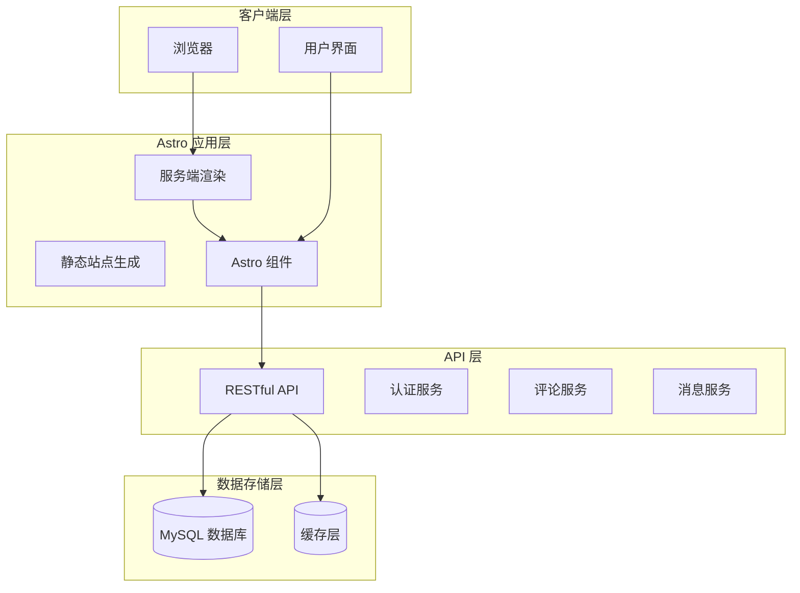

**架构图来源**
- [astro.config.mjs:1-14](file://astro.config.mjs#L1-L14)
- [src/lib/api.ts:1-91](file://src/lib/api.ts#L1-L91)

### 技术栈组成

| 层级 | 技术 | 版本 | 用途 |
|------|------|------|------|
| 前端框架 | Astro | latest | 主要框架 |
| 服务器适配器 | @astrojs/node | latest | SSR 支持 |
| 构建工具 | PNPM | 10.30.3 | 包管理 |
| 类型系统 | TypeScript | latest | 类型安全 |
| 样式系统 | CSS 变量 | - | 主题定制 |

**章节来源**
- [package.json:12-18](file://package.json#L12-L18)
- [astro.config.mjs:1-14](file://astro.config.mjs#L1-L14)

## 核心组件

### 组件化架构

项目采用模块化的组件化架构，主要分为以下层次：

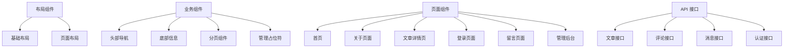

**架构图来源**
- [src/layouts/BaseLayout.astro:1-42](file://src/layouts/BaseLayout.astro#L1-L42)
- [src/components/Header.astro:1-48](file://src/components/Header.astro#L1-L48)
- [src/lib/api.ts:58-91](file://src/lib/api.ts#L58-L91)

### 数据模型设计

项目定义了完整的数据模型体系，支持博客系统的核心功能：

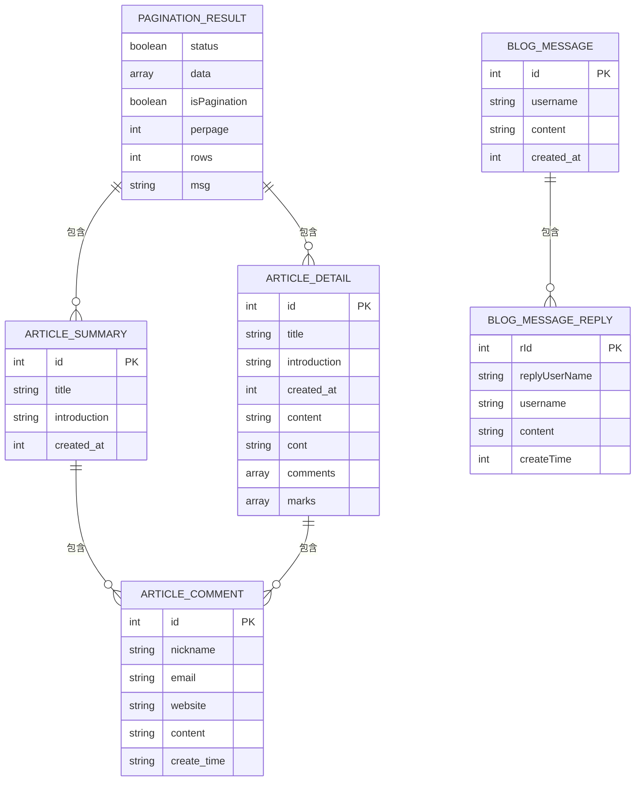

**数据模型图来源**
- [src/lib/types.ts:15-53](file://src/lib/types.ts#L15-L53)

**章节来源**
- [src/lib/types.ts:1-54](file://src/lib/types.ts#L1-L54)

## 架构概览

### SSR 配置架构

项目采用 Astro 的 SSR 配置，通过 Node 适配器实现服务端渲染：

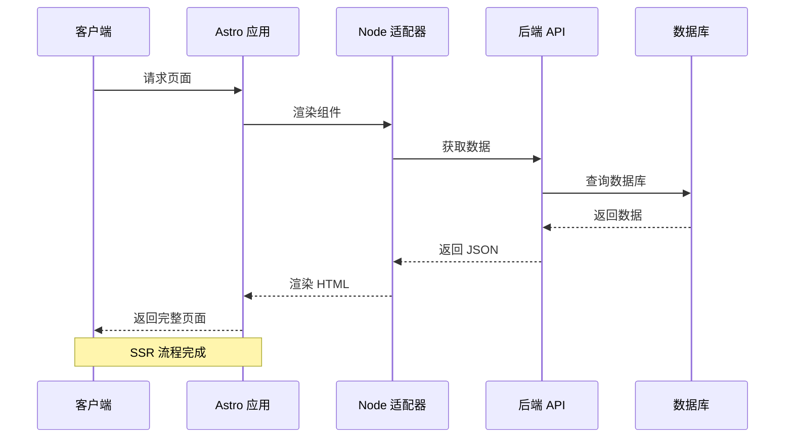

**序列图来源**
- [astro.config.mjs:4-13](file://astro.config.mjs#L4-L13)
- [src/lib/api.ts:25-41](file://src/lib/api.ts#L25-L41)

### API 调用流程

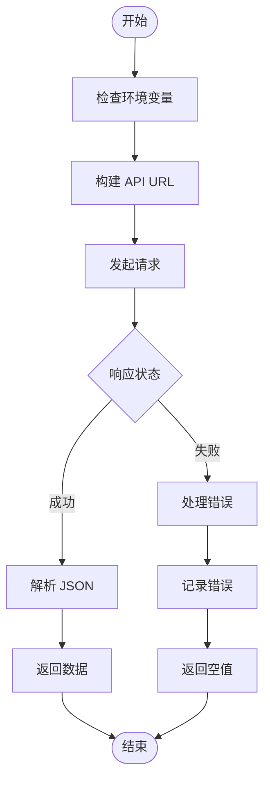

**流程图来源**
- [src/lib/api.ts:17-41](file://src/lib/api.ts#L17-L41)

**章节来源**
- [astro.config.mjs:1-14](file://astro.config.mjs#L1-L14)
- [src/lib/api.ts:1-91](file://src/lib/api.ts#L1-L91)

## 详细组件分析

### 基础布局组件

BaseLayout 是整个应用的基础布局组件，负责全局的页面结构和样式管理：

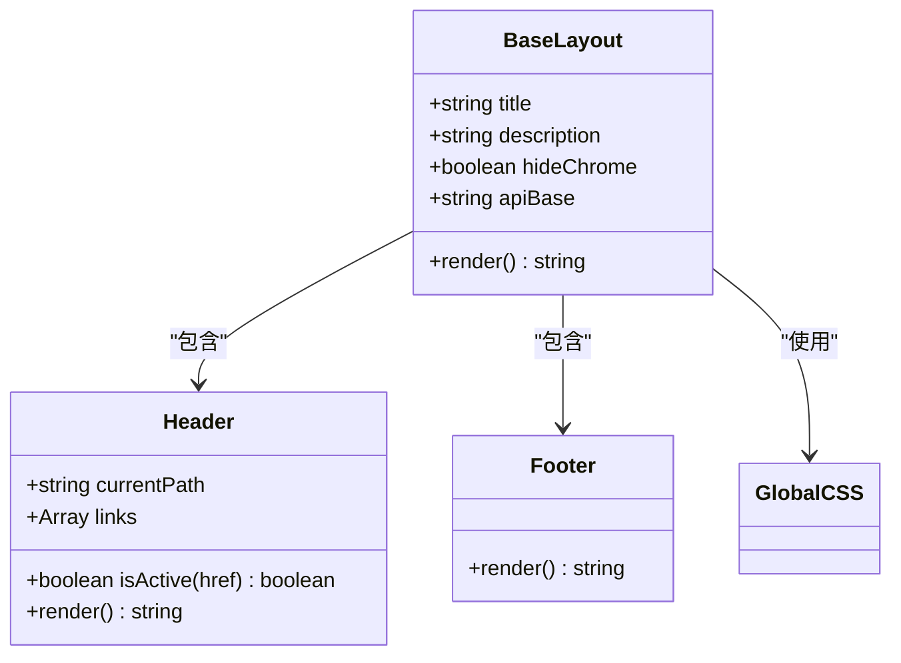

**类图来源**
- [src/layouts/BaseLayout.astro:6-16](file://src/layouts/BaseLayout.astro#L6-L16)
- [src/components/Header.astro:2-6](file://src/components/Header.astro#L2-L6)

### 头部导航组件

Header 组件实现了响应式的导航栏，支持桌面端和移动端的不同显示效果：

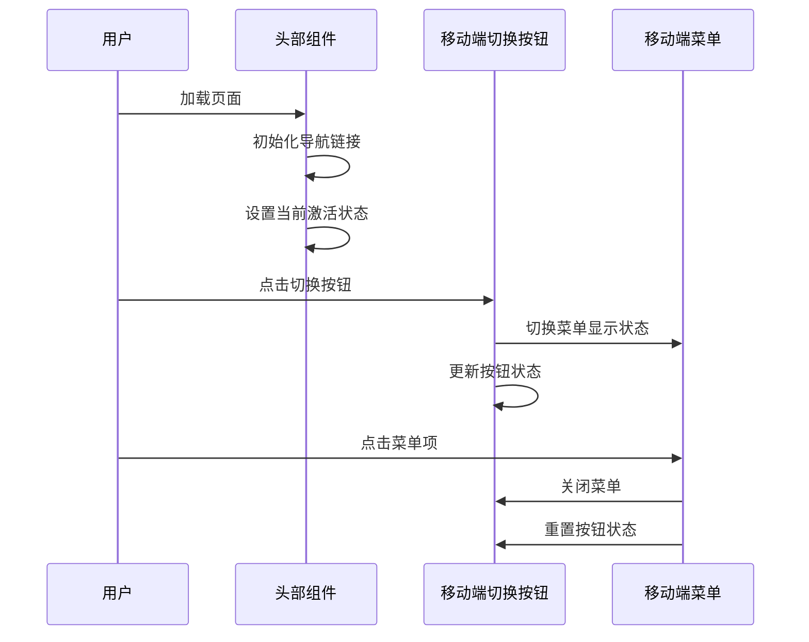

**序列图来源**
- [src/components/Header.astro:34-47](file://src/components/Header.astro#L34-L47)

### 工具函数库

utils.ts 提供了丰富的工具函数，支持时间格式化、图片尺寸处理等功能：

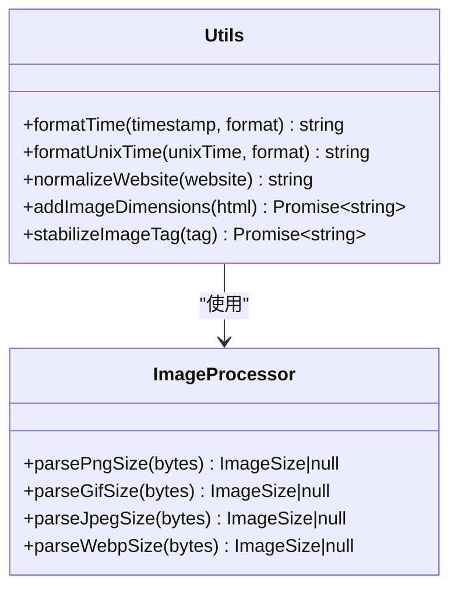

**类图来源**
- [src/lib/utils.ts:1-26](file://src/lib/utils.ts#L1-L26)
- [src/lib/utils.ts:128-130](file://src/lib/utils.ts#L128-L130)

**章节来源**
- [src/layouts/BaseLayout.astro:1-42](file://src/layouts/BaseLayout.astro#L1-L42)
- [src/components/Header.astro:1-48](file://src/components/Header.astro#L1-L48)
- [src/lib/utils.ts:1-219](file://src/lib/utils.ts#L1-L219)

### API 接口层

API 层提供了统一的接口调用方法，支持文章、评论、消息等核心功能：

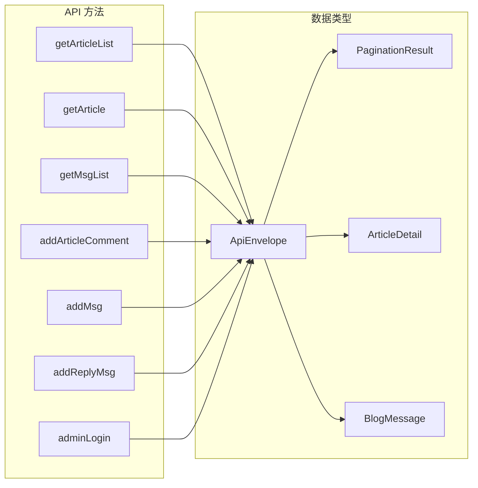

**图表来源**
- [src/lib/api.ts:58-91](file://src/lib/api.ts#L58-L91)
- [src/lib/types.ts:1-54](file://src/lib/types.ts#L1-L54)

**章节来源**
- [src/lib/api.ts:1-91](file://src/lib/api.ts#L1-L91)

## 数据流分析

### 文章列表数据流

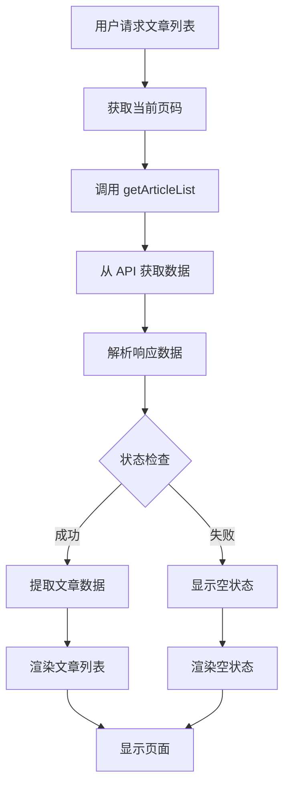

**流程图来源**
- [src/pages/index.astro:7-13](file://src/pages/index.astro#L7-L13)
- [src/lib/api.ts:58-60](file://src/lib/api.ts#L58-L60)

### 评论系统数据流

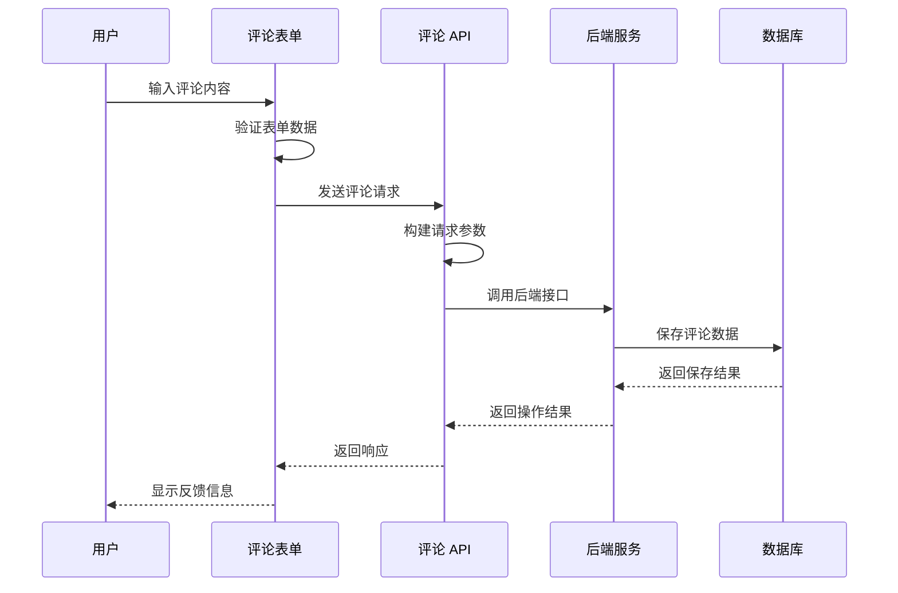

**序列图来源**
- [src/pages/api/comment.ts:4-18](file://src/pages/api/comment.ts#L4-L18)
- [src/lib/api.ts:70-78](file://src/lib/api.ts#L70-L78)

**章节来源**
- [src/pages/index.astro:1-50](file://src/pages/index.astro#L1-L50)
- [src/pages/api/comment.ts:1-19](file://src/pages/api/comment.ts#L1-L19)

## 性能考量

### SSR 性能优化

项目通过以下方式优化 SSR 性能：

1. **懒加载策略**：图片采用懒加载和异步解码
2. **缓存机制**：实现图片尺寸缓存，避免重复计算
3. **按需渲染**：只在需要时加载 JavaScript
4. **资源优化**：CSS 变量减少重复定义

### 图片处理优化

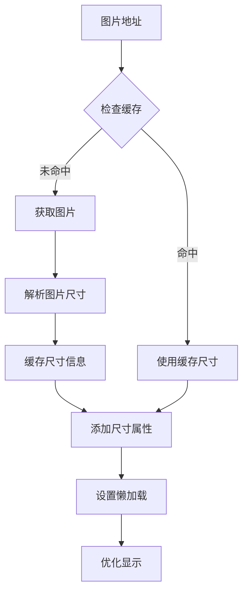

**流程图来源**
- [src/lib/utils.ts:132-168](file://src/lib/utils.ts#L132-L168)

### 响应式设计优化

项目采用渐进增强的响应式设计：

- **移动端优先**：移动端样式优先，桌面端增强
- **弹性布局**：使用 CSS Grid 和 Flexbox 实现自适应
- **媒体查询**：针对不同屏幕尺寸优化布局
- **触摸友好的交互**：按钮大小和间距适合触摸操作

## 开发指南

### 项目结构说明

```mermaid
graph TD
Src[src/] --> Components[components/]
Src --> Layouts[layouts/]
Src --> Lib[lib/]
Src --> Pages[pages/]
Src --> Styles[styles/]
Src --> Env[env.d.ts]
Components --> AdminPlaceholder[AdminPlaceholder.astro]
Components --> Footer[Footer.astro]
Components --> Header[Header.astro]
Components --> Pagination[Pagination.astro]
Layouts --> BaseLayout[BaseLayout.astro]
Lib --> Types[types.ts]
Lib --> Utils[utils.ts]
Lib --> Api[api.ts]
Pages --> Admin[admin/]
Pages --> ApiRoutes[api/]
Pages --> Article[article/]
Pages --> OtherPages[index.astro, about.astro, login.astro, msg.astro]
Admin --> Section[[section].astro]
Admin --> AdminIndex[index.astro]
ApiRoutes --> Comment[comment.ts]
ApiRoutes --> Login[login.ts]
ApiRoutes --> Msg[msg.ts]
ApiRoutes --> Reply[reply.ts]
Article --> ArticleId[[id].astro]
```

**图表来源**
- [src/lib/types.ts:1-54](file://src/lib/types.ts#L1-L54)
- [src/lib/utils.ts:1-219](file://src/lib/utils.ts#L1-L219)
- [src/lib/api.ts:1-91](file://src/lib/api.ts#L1-L91)

### 开发环境配置

1. **安装依赖**：使用 PNPM 管理包依赖
2. **开发模式**：运行 `npm run dev` 启动开发服务器
3. **构建生产**：运行 `npm run build` 生成静态站点
4. **预览部署**：运行 `npm run preview` 预览生产环境

### API 开发规范

- 使用 TypeScript 定义接口类型
- 实现统一的错误处理机制
- 支持环境变量配置
- 提供完整的数据验证

**章节来源**
- [package.json:7-10](file://package.json#L7-L10)
- [src/lib/types.ts:1-54](file://src/lib/types.ts#L1-L54)

## 总结

这个基于 Astro 的博客项目展现了现代化 Web 开发的最佳实践。通过采用 SSR 与 SSG 相结合的架构，项目在性能、SEO 和用户体验之间取得了平衡。

### 核心优势

1. **高性能渲染**：利用 Astro 的 SSR 能力，显著提升首屏加载速度
2. **现代化技术栈**：采用最新的前端技术和开发工具链
3. **组件化架构**：清晰的模块划分和可复用的组件设计
4. **响应式设计**：完善的移动端适配和用户体验优化
5. **灵活的主题定制**：基于 CSS 变量的主题系统，易于扩展

### 技术特色

- **API 驱动的数据模型**：清晰的接口设计和数据类型定义
- **智能的图片处理**：自动尺寸检测和性能优化
- **完整的管理后台**：支持文章、评论、消息的管理功能
- **SEO 友好的结构**：语义化的 HTML 结构和元数据管理

### 发展方向

项目目前处于 Astro SSR 迁移阶段，未来的发展重点包括：

1. **功能完善**：逐步迁移更多博客功能到 Astro 平台
2. **性能优化**：持续改进渲染性能和加载速度
3. **主题扩展**：提供更多样化的主题选择
4. **国际化支持**：扩展多语言支持能力
5. **插件生态**：构建开放的插件和扩展机制

这个博客项目不仅是一个技术演示，更是现代 Web 开发理念的实践案例，为开发者提供了可参考的架构模式和最佳实践。